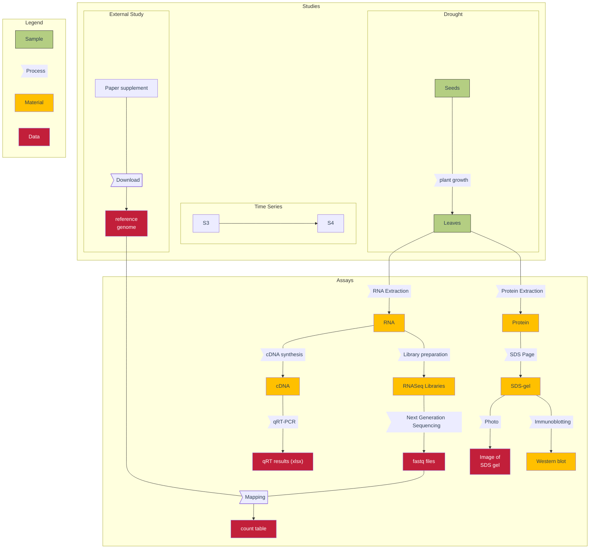

<!-- http://127.0.0.1:8080/docs/guides/ARC-practical-entry.html -->

## About this guide

In this guide we collect recommendations and considerations on creating an ARC based on your current project and datasets

<a href="./index.html">
  UserAdvanced
  ModeTutorial
</a>

 
 

## Before we can start

This guide assumes you know

- :ballot_box_with_check: the concept of the [ARC](./../implementation/AnnotatedResearchContext.html)
- :ballot_box_with_check: the different [ISA file types](./isa_FileTypes.html)
- :ballot_box_with_check: which tools to use (e.g. [ARC Commander](./../ArcCommanderManual/index.html), [ARCitect](./../ARCitect-Manual/index.html), [DataHUB](./../DataHUB-Manual/index.html)) and how.

 

## Goal: structure your current project folder into an ARC

Sketch / screenshots unstructured - ARCed

## Sketch your laboratory workflows

:bulb: Conceptually, the same applies to computational workflows.

## Work with identifiers

The ARC and the ISA metadata model offer determined places to 

- `Input` and `Output` fields such as Source Name, Sample Name, Data File Names
- `Protocol REF`

### Every file (name) is an identifier