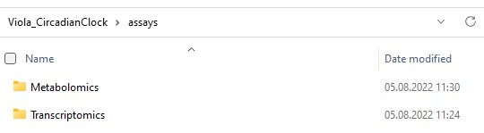
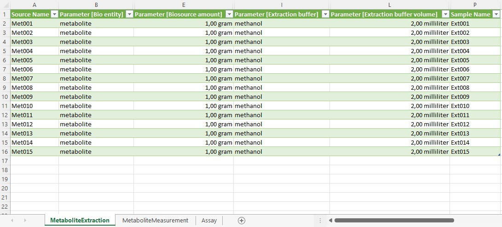
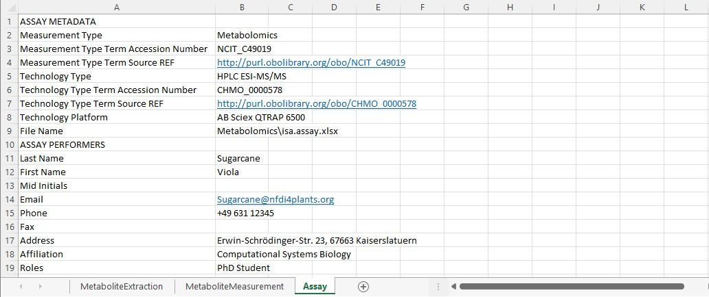

## About this guide

In this guide we focus on explaining the ARC structure and its different components.

<a href="./index.html">
    UserNewbie
    ModeRead
</a>
 
 

## Viola's ARC

Let's imagine a scenario where your project partner suggests at a conference to use this cool new Annotated Research Context (ARC) for your collaboration. Convinced by the versioning system and the single point of entry logic, you are motivated to set up your first own ARC after returning to the lab and fill it with your latest project results. Back home, however, you only remember the basic ARC structure and something about some isa.xlsx files. So how do you transfer your project into the empty ARC your project partner shared with you?

To answer this question, we will first take a look back at Viola's [metadata][kb-Metadata] example:

> Viola investigates the effect of the plant circadian clock on sugar metabolism in *W. mirabilis*. For her PhD project, which is part of an EU-funded consortium in Prof. Beetroot's lab, she acquires seeds from a South-African Botanical Society. Viola grows the plants under different light regimes, harvests leaves from a two-day time series experiment, extracts polar metabolites as well as RNA and submits the samples to nearby core facilities for metabolomics and transcriptomics measurements, respectively. After a few weeks of iterative consultation with the facilities' heads as well as technicians and computational biologists involved, Viola receives back a wealth of raw and processed data. From the data she produces figures and wraps everything up to publish the results in the *Journal of Wonderful Plant Sciences*.

The entire information given in this example can be stored within an ARC. To illustrate the [ARC specifications][kb-ArcSpecs], we will highlight and explain every (sub)directory and ISA-file of the ARC with references to Viola's example.

## isa.investigation.xlsx

The ISA investigation workbook allows you to record administrative metadata of your project. In Viola's example, the title of the project, the contact persons, and related publications correspond to such metadata. Besides that, the workbook can also contain a short description of your project, but also lists included studies with respective design types, assays, protocols, etc.. Although we recommend to use the [ARC Commander][kb-ArcCommander] for adding these metadata, you can of course fill the workbook (and also the [isa.study.xlsx](#isastudyxlsx) and [isa.assay.xlsx](#isaassayxlsx)) manually.

## Studies

In the `studies` (sub)folders you can collect material and resources used within your studies. Corresponding information in Viola's project include the source of her seeds (South-African Botanical Society), how she grew the plants, and the design of the experiment (two-day time series, etc.). 

In case your investigation contains more than one study, each of these studies is placed in an individual subdirectory. The "resources" directory allows you to store material samples or external data as virtual sample files. You can use the protocol subdirectory to store free-text protocols that describe how the samples or materials were created.

### isa.study.xlsx

Every study contains one `isa.study.xlsx` file to specify the characteristics of all material and resources. Resources described in a study file can be the input for one or multiple assays or workflows. The workbook contains (at least) two worksheets:

- "CircadianClock_Light regimes": One or more worksheets, depending on the number of used protocols, to annotate the properties of your source material following the ISA model. The sheet name is not obligatory to be the exact same as the "Study Identifier". While this can be done manually, we recommend using our ontology supported annotation tool [Swate](swate_QuickStart.html).
- "Study": Viola collected the administrative metadata of her study in this worksheet. This information can later be transferred into the `isa.investigation.xlsx` using the [ARC Commander][kb-ArcCommander].

## Assays

The `assays` folder allows you to store data and metadata from experimental processes or analytical measurements. Each assay is a collection of files stored in a single directory, including corresponding metadata files in form of an `isa.assay.xlsx`. Viola needs two subdirectories, one for her metabolomics and one for her transcriptomics dataset, respectively. Assay data files and free-text protocols are placed in individual subdirectories. Data files produced by an assay can be the input for one or multiple [workflows](#workflows).

### isa.assay.xlsx

Viola can annotate her experimental workflows of the metabolomics and transcriptomics assays with process parameters in the `isa.assay.xlsx` file, which needs to be present for every assay. The workbook contains two or more worksheets, depending on the number of used protocols:

- "MetaboliteExtraction": A worksheet to annotate the experimental workflow, in this case for extraction of metabolites. While this can be done manually, we recommend using our ontology supported annotation tool [Swate][kb-swate_QuickStart].
> Note: Using the name of the protocol for the name of the worksheet can provide clarity. 
- "MetaboliteMeasurement": A worksheet that describes the quantification of polar metabolites using gas-chromatography mass-spectrometry.
- "Assay": Viola collected the administrative metadata of her assay in this worksheet. This information can later be transferred into the `isa.investigation.xlsx` using the ARC Commander.

## Workflows

In an ARC `workflows` represent the processing steps used in computational analyses and other transformations of data originating from studies and assays. Typical examples include data cleaning and preprocessing, computational analysis, or visualization. The outcomes of these workflows ("run results") are stored in [runs](#runs).

Viola received for her transcriptome and metabolome assays various processed data files, which she now can use to generate some nice plots. Additionally, the computational biologists sent her the code used for data processing, including an executable Common Workflow Language (CWL) file, which contains a standardized tool or workflow description. She stores these files in individual subdirectories for each workflow.

<!-- Picture runs + workflow -->

## Runs

After Viola generated her plots, she placed them in individual subdirectories, specific to the run they were generated with. In general, you can use the runs folder to store plots, tables, or similar result files that derive from computations on study, assay, external data or other runs.

## Cheat sheet

We hope that these examples nicely illustrated the ARC structure and that you are now ready to produce your own ARCs. Use the figure below as a cheat sheet to remember where to store which files. Or follow the [ARC Commander QuickStart][kb-arcCommander_QuickStart] to try it out yourself.

<!--  Links -->
[kb-Metadata]: ../fundamentals/Metadata.html "Metadata"
[kb-ArcCommander]: ../implementation/ArcCommander.html "DataPLANT ARC Commander"
[kb-swate_QuickStart]: ../tutorials/swate_QuickStart.html "Quickstart Swate"
[kb-arcCommander_QuickStart]: ../tutorials/arcCommander_QuickStart.html "QuickStart ARC Commander"
[kb-ArcSpecs]: ./../implementation/ARC-specification.html "ARC specification"
