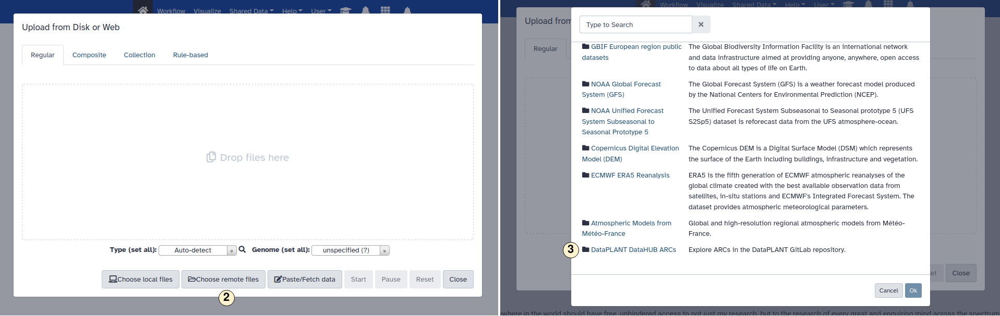

## Access ARCs from Galaxy

To access the data of an ARC, you must first provide a GitLab access token in Galaxy, which is used to authenticate Galaxy to GitLab. To create a new token and add it to [Galaxy](https://usegalaxy.eu/), you can proceed as described below.

### Create an access token in GitLab

1. Open the dropdown menu for your personal settings.
2. Open the "Preferences" menu.
3. Change to tab "Acess Tokens".
4. Choose a name for the new token.
5. Set a expiration date.
6. Select the authorization scope. 

**Note:** Only the scopes "api" (for write access) and "read_api" (for read access) are relevant for ARCfs.  
**Important:** After you crated the token, you can copy and view it. After you leave the
site, you will **not** be able to do so again.

### Add the token to Galaxy

1. Visit [usegalaxy.eu](https://usegalaxy.eu/) and log in or create an account. It is possible to log in using your DataPlant account.
2. Open the "User" drop down menu and
3. select "Preferences".
4. In the user preference settings, select "Manage Information".
5. Copy your token into the "API read access token" field. This filed is located at the bottom of the "User preferences" menu. Klick "Save" to adopt your changes.

**Note:** Despite the name "API **read** access token", tokens with write access rights (like those with the scope "api") will also work or, respectively, are requiered.

### Data import

With the token available to Galaxy, you are now able to import data. You can do this as described below.

1. Klick on the "Upload Data".
2. Pick "Choose remote files".
3. Scroll down and select "DataPLANT DataHub ARRCs".
4. Explore ARCs or
5. search for a specific one.
6. Inside an ARC, choose the file you want to import to Galaxy. Confirm with "Ok".
7. Click start to begin the import process to Galaxy. This may take some time, depending
   on the workload on the Galaxy server and the size of your file.

### Data export

It is also possible to export datasets back to an ARC. You can do this as described below.

1. On the left sidebar, open the menu "Send Data".
2. Select "Export datasets" to remote files source.
3. In the opening menu, select "DataPLANT DataHUB ARCs".
4. Select or
5. search for an ARC.
6. Choss a directory insdine an ARC where your dataset should be stored.
7. Choose the dataset you want to export,
8. Clock on "Run Tool" to start the export process. This may take some time, depending
   on the workload on the Galaxy server and the size of your file.
