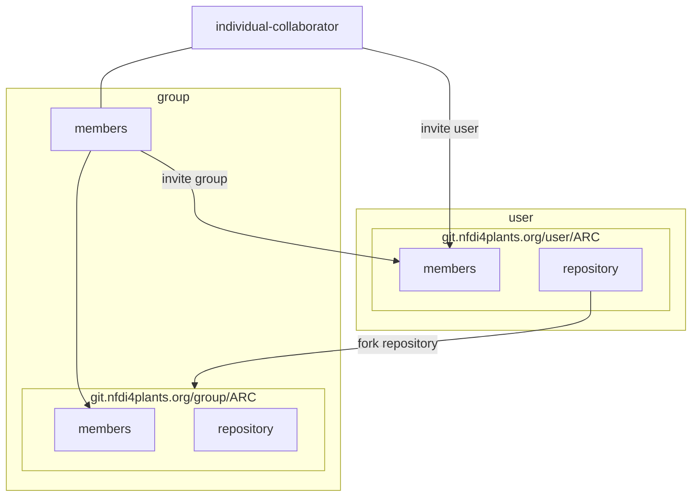

## Concepts

1. Visibility levels
2. Namespaces
   1. Users vs. groups
3. Permissions
   1. Invite a member
   2. Invite a group
4. Forks
5. Branches
6. gitignore

## Step-by-step for demo video

1. Create a new ARC
2. Upload the ARC to "own user" or own group
3. Invite "other-user" to shared-group
4. Fork ARC shared-group
5. Work on original ARC (main branch)
   1. add README
   2. add metadata
6. Merge request original/main to shared-group/main
7. Show from "other-user" perspective
   1. Can see merged data
8. "own user": work on ARC (branch "not sharing")
   1. add secrets
9. Show from "other-user" perspective
   1.  cannot see secret

## 5 shades of sharing

