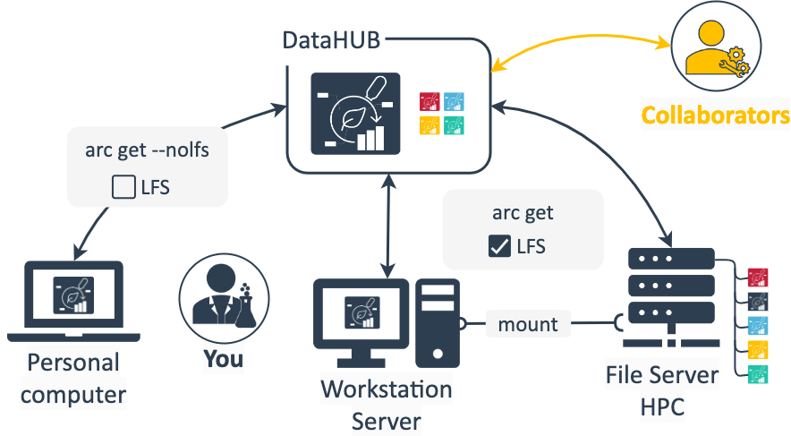

## About this guide

This guide presents recommendations on managing one ARC on different devices and locations

    <a href="./index.html">
        UserNewbie
        ModeRead
    </a>

## Before we can start

:ballot_box_with_check: You have a [DataPLANT](https://register.nfdi4plants.org) account

## Where do I store my ARC?

As with projects and data shared via cloud services or other platforms, ARCs do not exist in just one location. Depending on your preferences and current use-case you can choose one of various starting points: you can create your ARC in different locations (e.g. personal computer, shared server or directly in the DataHUB) and to do so you can use different tools (e.g. ARC Commander, ARCitect, by hand).

A typical scenario could look like this: You create your ARC on you personal computer, add structure with studies and assays as you see fit and upload the ARC to the DataHUB to have a save copy and be able to share it with collaboration partners. You acquire some large dataset, e.g. from an OMICS assay, which you do not want to store or analyze on your computer. Instead you keep this on a larger workstation in the lab or a server or high performance computing (HPC) cluster, where you would also run data analysis workflows. With the DataHUB as the meeting point, you can keep your ARC in sync across these locations. Simply download the ARC from the DataHUB to your server, add the dataset from there and synchronize it back to the DataHUB. You could consider your ARC stored in the DataHUB as the "ground truth" &ndash; even if you delete the ARCs on your local computer or the server, it will still be available in the DataHUB including the change history from those source locations.

## Keep your ARC in sync

A few things are important when maintaining ARCs in multiple locations:

1. Try to keep your ARC in sync via the DataHUB
2. Make sure to sync large files properly

As with any cloud service, when a single file is edited from multiple locations, you can run into merge conflicts. To avoid these, make sure to regularly [sync your ARC with the DataHUB](./arc_SyncingRecommendation.html) and from there sync with your (other) locations before adding or editing data.  
In order to have the large files only where you need them and not where you do not (e.g. your personal computer), the ARC and DataHUB implement the LFS (Large file storage) system. The ARCitect and ARC commander provide options to properly handle [LFS-tagged files](./arc_WorkingWithLargeDataFiles.html).

<!-- 
TODO
notes on working with branches
-->

