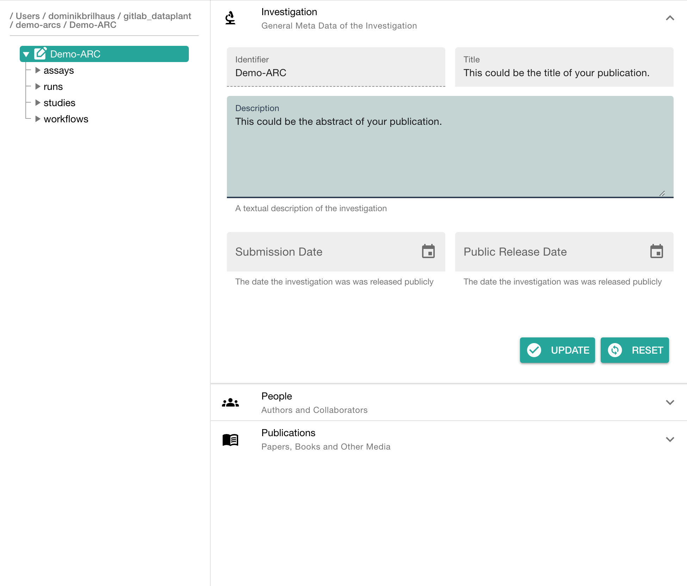
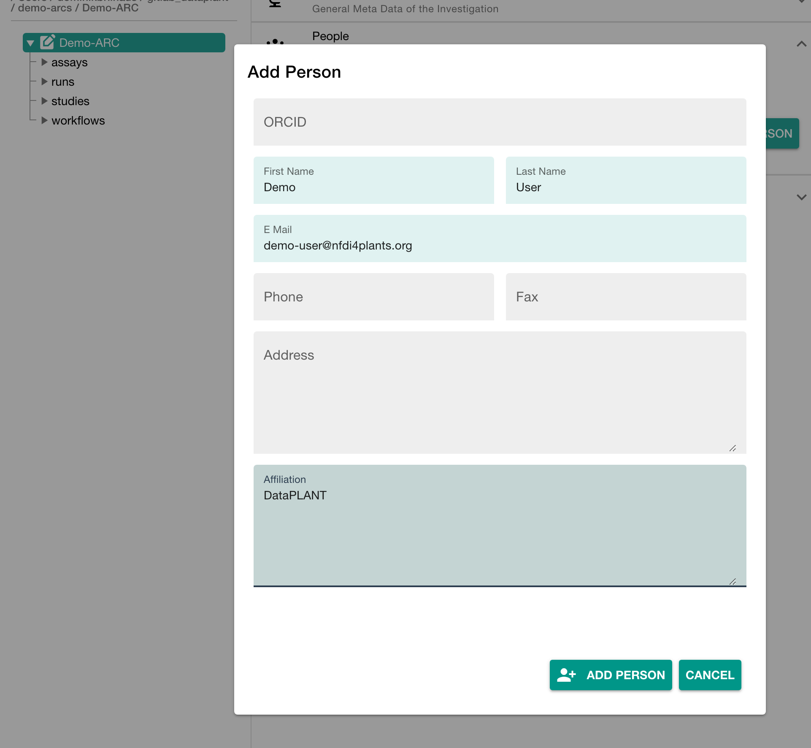

## About this guide

In this guide we focus on how to use the [ARCitect](./../ARCitect-Manual/index.html) to create your ARC and structure, store and share your data.

<a href="./index.html">
    UserAdvanced
    ModeTutorial
</a>

 
 

## Before we can start

Please make sure

:ballot_box_with_check: The latest version of the [ARCitect](./../ARCitect-Manual/index.html) is installed on your computer  
:ballot_box_with_check: You have a [DataPLANT](https://register.nfdi4plants.org) account  
:bulb: Consider reading about the [ARC](./../implementation/AnnotatedResearchContext.html)  

## Initiate the ARC folder structure

  

  1. Start the ARCitect
  2. Create a **New ARC** (2)
  3. Select a location and name for your ARC

  

  

    
  

## Your ARC's name

  

  💡 By default, your ARC's name will be used:

   1. for the ARC folder on your machine
   2. to create your ARC in the DataHUB at `https://git.nfdi4plants.org/<YourUserName>/<YourARC>` (see next steps)
   3. as the identifier for your investigation

  💡 Make sure that no ARC exists at  `https://git.nfdi4plants.org/<YourUserName>/<YourARC>`. Otherwise you will sync to that ARC.

  💡 Avoid spaces in your ARC's name

  

  

    
  

## Add details about your investigation

Click on your ARC's name to add details, such as

- a title
- a description

## Add contributors

In the section "People" click "ADD PERSON" to add at least one contributor

## Add a study to your ARC

  

  Cick "Add Study" in the sidebar and enter an identifier

  

  

    
  

## Add details about your study

Click on your ARC's name to add details, such as

- general metadata,
- people, and
- publications
- data process information

## Add an assay

by clicking "Add Assay" and entering an identifier for your assay

Add two assays with **rnaseq** and **metabolomics** as an identifier

## Link your assay to a study

You can either
- link your new assay to an existing study in your ARC or
- create a new one
  
Link your assays to your **talinum_drought** study

## Add information about your assay

In the assay panel you can

1. link or unlink the assay to studies, and
2. define the assay's
   - measurement type
   - technology type, and
   - technology platform.
3. add data process information

## Add protocols

You can either
- directly write a **new protocol** within the ARCitect or
- import an existing one from your computer

## Add protocols and datasets

In the file tree you can
  - **add a dataset** and 
  - **protocols** associated to that dataset.

:bulb: **Add Dataset** allows to import data from any location on your computer into the ARC.

:warning: Depending on the file size, this may take a while. Test this with a small batch of files first.

<!-- Demo dataset cannot be added via add dataset. Only individual files can be added, not multiple folders -->

## Sort Demo Data to your ARC

💡 protocols can directly imported via ARCitect

💡 to add multiple datasets folders, they have to be added manually via file browser 

## Login to the DataHUB

Click **Login** (1) in the sidebar to login to the DataHUB.

:bulb: This automatically opens your browser at the DataHUB (https://git.nfdi4plants.org) and asks you to login, if you are not already logged in. 

## Upload your local ARC to the DataHUB

  

  
  From the sidebar, navigate to **Versions** (6)
  
  

  

    
  

## Versions

  

  The versions panel allows you to

  - store the local changes to your ARC in form of "commits",
  - sync the changes to the DataHUB, and
  - check the history of your ARC

  

  

    
  

## Connection to the DataHUB

If you are logged in, the versions panel shows
- your DataHUB's *Full Name* and *eMail*
- the URL of the current ARC in the DataHUB `https://git.nfdi4plants.org/<YourUserName>/<YourARC>`

## Check if your ARC is successfully uploaded

1. [sign in](https://auth.nfdi4plants.org/realms/dataplant/login-actions/registration?client_id=account&tab_id=4bQkU161waI) to the DataHUB 
2. Check your projects

## Preparation

Before you fill your ARC, try to categorize your data.

- What is my **investigation**?
- What is my **study**?
- Which **assay** did I perform?
  - What is my (raw) **dataset**?
  - What **protocol**s did I use?

:bulb: It might help to have this info ready in a text file. In particular, try to think about useful names (identifiers) for investigation, study and assay.

## Adding sub-folders for your data

add studies and assays according to your needs

## Start adding your data to the ARC

Try to place your resources, datasets and protocols for each study and assay in the respective folders.

> :bulb: This part will likely require some iteration. 🗣️ Talk to us.
>
> - You might need to add new studies and assays or revise your overall structure during the process
> - Sometimes you might not immediately find a suitable position for your data
>
