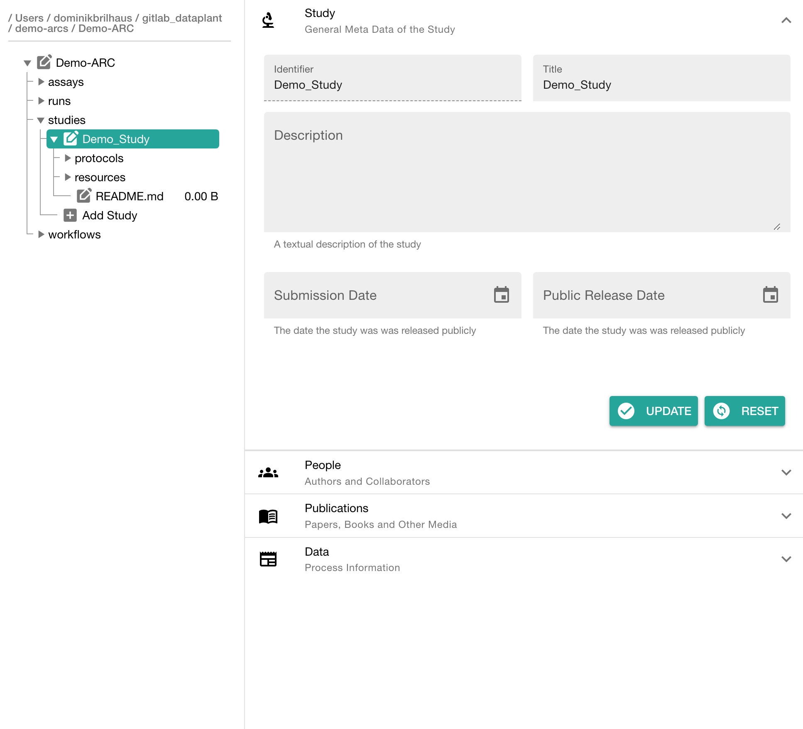
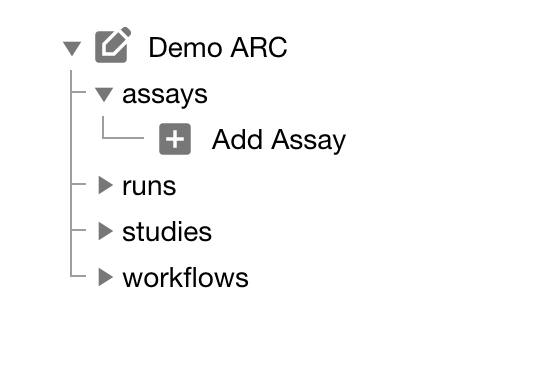
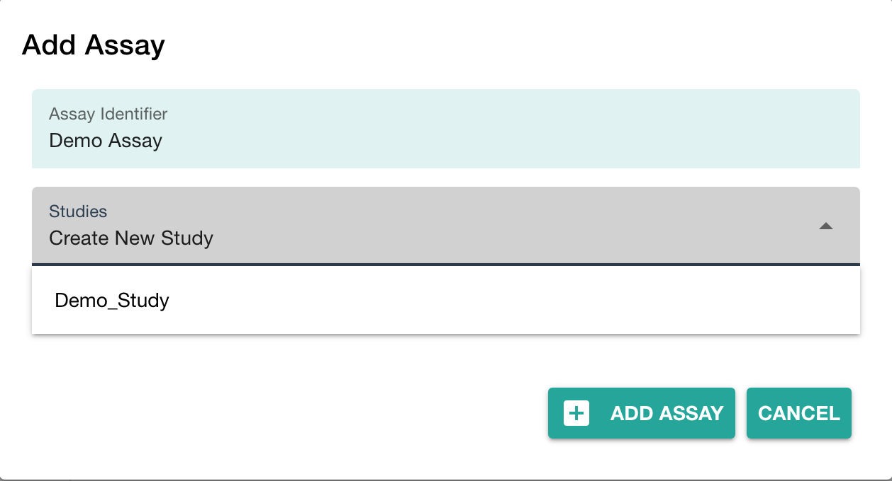

---

## About this guide

In this guide we focus on how to use the [ARCitect](./../ARCitect-Manual/index.html) to create your ARC and structure, store and share your data.

<a href="./index.html">
    UserAdvanced
    ModeTutorial
</a>

 
 

---

## Before we can start

Please make sure

:ballot_box_with_check: The latest version of the [ARCitect](./../ARCitect-Manual/index.html) is installed on your computer  
:ballot_box_with_check: You have a [DataPLANT](https://register.nfdi4plants.org) account  
:bulb: Consider reading about the [ARC](./../implementation/AnnotatedResearchContext.html)  

---

## Preparation

Before creating your own ARC, invest some time to think about the following questions. 

- What is my **investigation**?
- What is my **study**?
- Which **assay** did I perform?
  - What is my (raw) **dataset**?
  - What **protocols** did I use?

:bulb: It might help to have this info ready in a text file. In particular, try to think about useful names (identifiers) for investigation, study and assay.

---

## Initiate the ARC folder structure

  

  1. Start the ARCitect
  2. Create a **New ARC** (2)
  3. Select a location and name for your ARC

  

  

    
  

---

### Your ARC's name

  

  💡 By default, your ARC's name will be used:

   1. for the ARC folder on your machine
   2. to create your ARC in the DataHUB at `https://git.nfdi4plants.org/<YourUserName>/<YourARC>` (see next steps)
   3. as the identifier for your investigation

  💡 Make sure that no ARC exists at  `https://git.nfdi4plants.org/<YourUserName>/<YourARC>`. Otherwise you will sync to that ARC.

  💡 Avoid spaces in your ARC's name

  

  

    
  

---

### Add details about your investigation

Click on your ARC's name to add details, such as

- a title
- a description

---

### Add contributors

In the section "People" click "ADD PERSON" to add at least one contributor

---

## Add a study to your ARC

  

  Click "Add Study" in the sidebar and enter an identifier

  

  

    
  

---

### Add details about your study

Click on your study's name to add details, such as

- general metadata,
- people, 
- publications and
- data process information

---

### Add a protocol to your study

  

  Click "Add Protocol" in the sidebar to add a protocol to your study

  

  

    
  

---

### Adding protocols

You can either
- directly write a **new protocol** within the ARCitect or
- **import** an existing one from your computer

---

## Add an assay to your ARC

  

  Click "Add Assay" in the sidebar and enter an identifier

  

  

    
  

---

### Link your assay to a study

  

  You can either
  - link your new assay to an existing study in your ARC or
  - create a new one (with the same name as the assay)

  

  

    
  

---

### Add information about your assay

In the assay panel you can

1. link or unlink the assay to studies, and
2. define the assay's
   - measurement type,
   - technology type and
   - technology platform.
3. add data process information

---

### Add protocols and datasets to your assay

  

  In the file tree you can
  
  - **add a dataset** and
  - **protocols** associated to that dataset.
  
  :bulb: **Add Dataset** allows to import data from any location on your computer into the ARC.  
  
  :warning: Depending on the file size, this may take a while. Test this with a small batch of files first.

  

  

    
  

---

## Share your ARC

  

  Click **Login** (1) in the sidebar to login to the DataHUB.

  :bulb: This automatically opens your browser at the DataHUB (https://git.nfdi4plants.org) and asks you to login, if you are not already logged in.

  

  

    
  

---

### Versions: Connection to the DataHUB

  

  
  To communicate with the DataHUB, navigate to **Versions** (6)
  
  

  

    
  

---

### Connection to the DataHUB

If you are logged in, the versions panel shows

- your DataHUB's *Full Name* and *eMail*
- the URL of the current ARC in the DataHUB  
  `https://git.nfdi4plants.org/<YourUserName>/<YourARC>`

---

### Upload your ARC to the DataHUB

The versions panel allows you to

- store the local changes to your ARC in form of "commits",
- sync the changes to the DataHUB, and
- check the history of your ARC

To upload your ARC:

  1. Enter a "commit message" to shortly describe the changes to your ARC
  2. Click COMMIT to save your changes locally
  3. Click UPLOAD to upload your ARC to the DataHUB

### Check if your ARC is successfully uploaded

1. [sign in](https://git.nfdi4plants.org) to the DataHUB
2. Check your projects

---

<!-- 
## Adding sub-folders for your data

add studies and assays according to your needs

---

## Start adding your data to the ARC

Try to place your resources, datasets and protocols for each study and assay in the respective folders.

> :bulb: This part will likely require some iteration. 🗣️ Talk to us.
>
> - You might need to add new studies and assays or revise your overall structure during the process
> - Sometimes you might not immediately find a suitable position for your data
> -->
