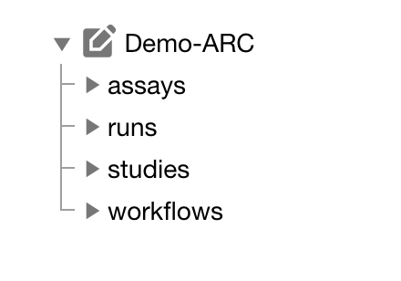

<style>

.container {
  display: flex;
  align-items: center;
  justify-content: center
}

</style>


## About this guide

In this guide we focus on how to use the [ARCitect](./../ARCitect-Manual/index.html) to create your ARC and structure, store and share your data.

<a href="./index.html">
    <span class="badge-category">User</span><span class="badge-selected" id="badge-advanced">Advanced</span>
    <span class="badge-category">Mode</span><span class="badge-selected" id="badge-tutorial">Tutorial</span>
</a>

<br>
<br>

## Before we can start

Please make sure

:ballot_box_with_check: The latest version of the [ARCitect](./../ARCitect-Manual/index.html) is installed on your computer
:ballot_box_with_check: You have a [DataPLANT](https://register.nfdi4plants.org) account

## Five minutes to your ARC

<div class="container">
  <div class="text">
    1. Start the ARCitect
    2. Create a **New ARC** (2)
    3. Select a location and name for your ARC
  </div>
  <div class="img">
    
  </div>
</div>


---

## Your ARC's name

<div class="container">
  <div class="img">
    
  </div>
  <div class="text">
  💡 By default, your ARC's name will be used
   - for the ARC folder on your machine
   - to create your ARC in the DataHUB at `https://git.nfdi4plants.org/<YourUserName>/<YourARC>` (see next steps)
   - as the identifier for your investigation

  💡 Make sure that no ARC exists at  `https://git.nfdi4plants.org/<YourUserName>/<YourARC>`. Otherwise you will sync to that ARC.

  💡 Use no spaces in your ARC's name
  </div>
</div>


---
## Upload your local ARC to the DataHUB

From the sidebar, navigate to **Versions** (6)


---

## Versions

The versions panel allows you to
- store the local changes to your ARC in form of "commits",
- sync the changes to the DataHUB, and
- check the history of your ARC


---

## Successful ARC synchronization


Check if the upload was successful by visiting your ARC at the respective URL in your browser.


---


## Preparation

Before you can fill your ARC, let's revise your data. 

- What is my **investigation**?
- What is my **study**?
- Which **assay** did I perform?
  - What is my (raw) **dataset**?
  - What **protocol**s did I use?

> :bulb: It might help to have this info ready in a text file.   In particular, try to think about useful identifiers for investigation, study and assay.

---

## Adding subfolders for your data

add studies and assays according to your needs


---

<!--  TODO Das sollte an anderer Stelle nochmal erwähnt werden: 

## ISA investigation

The ISA investigation (`-i`) workbook allows you to record administrative metadata of your project. Add the isa.investigation.xlsx workbook including an identifier to your ARC with

```bash
arc investigation create --identifier <YourInvestigationID>
```
:bulb: Avoid using spaces in the identifier. Use underscores and capital letters instead.

-->


## Start adding your data to the ARC

Try to place your resources, datasets and protocols for each study and assay in the respective folders.

> :bulb: This part will likely require some iteration. 🗣️ Talk to us.
>
> - You might need to add new studies and assays or revise your overall structure during the process
> - Sometimes you might not immediately find a suitable position for your data
> 

