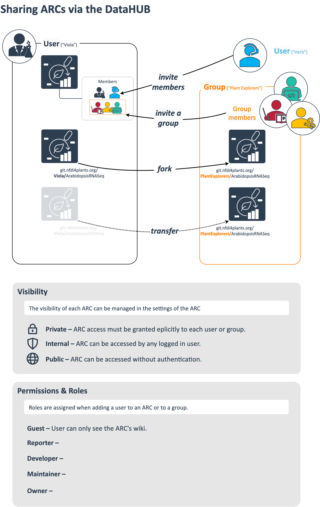
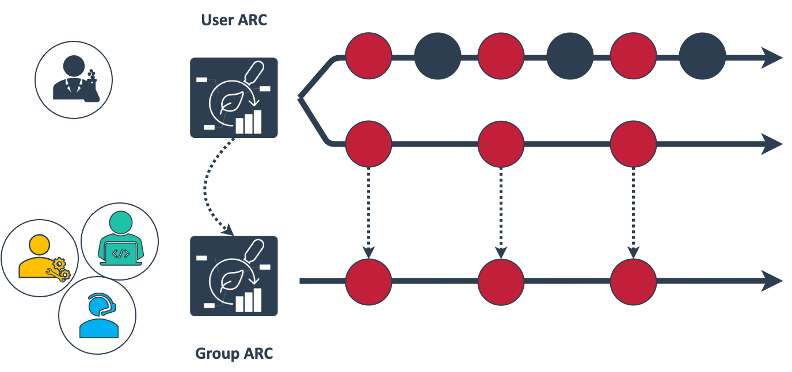

<!-- Check site locally at http://127.0.0.1:8080/docs/guides/arc-sharing.html -->

## About this guide

In this guide we explain the different ways offered by the DataHUB to share an ARC with collaborators.

    <a href="./index.html">
        UserNewbie
        ModeRead
    </a>

## Before we can start

:ballot_box_with_check: You have a [DataPLANT](https://register.nfdi4plants.org) account  
:bulb: [DataHUB manual](./../DataHUB-Manual/index.html)

## Multiple ways to share an ARC via the DataHUB

## Privately work on a group-shared ARC

## DataHUB people ~ ARC contributors

:bulb: Members, groups, and roles set via the DataHUB can easily be confused with contributors added as ISA metadata to an ARC, e.g. collaborators in an investiagtion or study or assay performers.

<!-- 

## Concepts

1. Visibility levels
2. Namespaces
   1. Users vs. groups
3. Permissions
   1. Invite a member
   2. Invite a group
4. Forks
5. Branches
6. gitignore

## Step-by-step for demo video

1. Create a new ARC
2. Upload the ARC to "own user" or own group
3. Invite "other-user" to shared-group
4. Fork ARC shared-group
5. Work on original ARC (main branch)
   1. add README
   2. add metadata
6. Merge request original/main to shared-group/main
7. Show from "other-user" perspective
   1. Can see merged data
8. "own user": work on ARC (branch "not sharing")
   1. add secrets
9. Show from "other-user" perspective
   1.  cannot see secret
 -->
