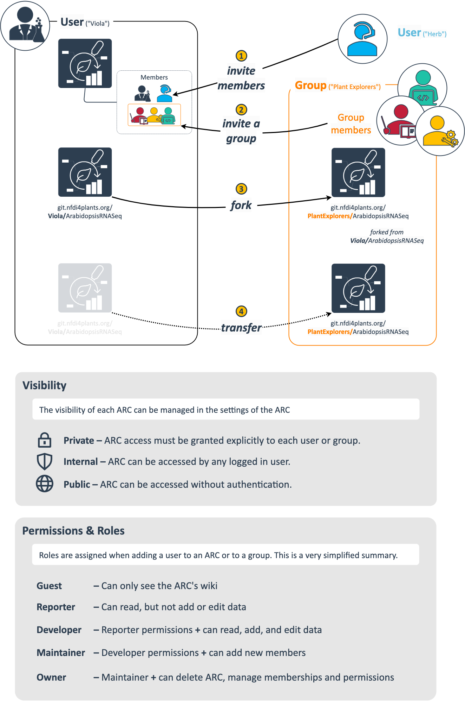

<!-- Check site locally at http://127.0.0.1:8080/docs/guides/datahub-arc-sharing.html -->

## About this guide

In this guide we explain the different ways offered by the DataHUB to share an ARC with collaborators.

    <a href="./index.html">
        UserNewbie
        ModeRead
    </a>

## Before we can start

:ballot_box_with_check: You have a [DataPLANT](https://register.nfdi4plants.org) account  
:bulb: See the [DataHUB manual](./../DataHUB-Manual/index.html) for tutorials

## DataHUB concepts and terminology

Before jumping into the details of data sharing, we need to introduce a few DataHUB concepts, settings and terms that tend to be confusing for new users.

### "Projects" and "Groups" are not the same

#### Project = ARC

- In the DataHUB, ARCs are called "projects"; they are the same.
- An ARC can be shared with individual users (invited as "members") or a group.

#### DataHUB Groups

- A "Group" is a group of users (then "members" of that group) with specific [permissions](#roles-and-permissions).
- A group (e.g. your lab or consortium) can share ARCs.
- Groups help you communicate with all group members and manage permissions for the ARCs shared in that group.
- Depending on their assigned roles, members of the group can view, edit, delete, and / or maintain the ARCs of that group.
- If someone has access to a group, they get access to all the ARC in the group.
- The group Owner(s) can adjust group settings and manage group memberships.
- Groups can have subgroups (with a subset of members). Subgroups have the same features as groups.  

### Namespaces

- In the DataHUB, namespaces help organize related projects.
- Every user has a personal namespace, where they can upload or create new ARCs.
- Every [group and subgroup](#datahub-groups) has an own namespace, respectively.

You can check the namespace by looking at the URL. For example:

Type | URL | Namespace
--- | --- | ---
A **personal** ARC | https://git.nfdi4plants.org/brilator/Facultative-CAM-in-Talinum | `brilator` 
An **group**-shared ARC | https://git.nfdi4plants.org/hhu-plant-biochemistry/Samuilov-2018-BOU-PSP | `hhu-plant-biochemistry`

:bulb: "Personal" is not the same as "private", see [visibility](#visibility).

### Visibility

The visibility of ARCs and groups is managed for each ARC (see [ARC settings](./../DataHUB-Manual/datahub-ARCSettings.html)) or group see ([Creating a Group](./../DataHUB-Manual/datahub-CreateGroup.html)) individually.

- Private – Access must be granted explicitly to each user or a group.
- Internal – Can be accessed by any logged in user.
- Public – Can be accessed without authentication.  

:bulb: By default every ARC and every group is set to **private**.

### Roles and permissions

If you create or upload an ARC to the DataHUB, you are the *Owner* by default.
When inviting new members to an ARC or group, you can choose between different levels.

- Guest: Have the least rights. They will not be able to see the content of an ARC (only the wiki page).
- Reporter: Have **read access** to your ARC. This is recommended for people you ask for consultancy.
- Developer: The choice for most people you want to invite to your ARC. Developers have **read and write access**, but cannot maintain the project on the DataHUB, e.g. invite new members.
- Maintainer: Gives the person the same rights as you have (except of removing you from your own project). This is recommended for inviting PIs or group leaders allowing them to add their group members for data upload or analysis to the project as well.
- Owner: An owner has basically all rights to the ARC. They can delete or transfer the ARC and manage user memberships.

:bulb: A detailed list of all permissions for the individual roles can be found [here](https://docs.gitlab.com/ee/user/permissions.html)

### ARC members in the DataHUB vs. ARC contacts in ISA metadata

The data in an ARC is ideally annotated with proper metadata, including the contributors or creators of individual datasets or samples. The ISA metadata model used in the ARC contains 

- assay performers
- investigation contacts

as the common ground for metadata forms 

This does not mean that every contact added to an ARC receives an email. 

Creating an ARC with contributors and uploading it to the DataHUB is conceptually, the same as creating a manuscript with authors for publication and sharing it via any cloud service. You can invite members to your DataHUB-shared ARC just as you can invite collaborators to your cloud-shared manuscript and these may not be the same legal people as added to your investigation contacts (ARC) or author list (manuscript).

:bulb: Members, groups, and roles set via the DataHUB can easily be confused with contributors added as ISA metadata to an ARC, e.g. collaborators in an investiagtion or study or assay performers.

## Multiple ways to share an ARC via the DataHUB

To suit a wide range of collaborative scenarios, the DataHUB offers multiple, flexible ways of sharing an ARC.
This flexibility can be confusing at first. Generally, ARCs can be uploaded to the DataHUB and (a) associated to a user account (the default) or (b) associated with a group of users.

<!-- namespace / URL -->

The figure below is supposed to give a quick overview. Once an ARC exists in the DataHUB, you can choose between these options to share the ARC with collaborators. 

You can invite individual users (1). This is helpful to share an ARC with selected colleagues. To share an ARC with a group of users (e.g. a lab or consortium), you can invite a group (2). In both cases (1 and 2), the ARC "stays" associated with  the original owner only (visible by the namespace and URL address). Furthermore the [roles and permissions](#roles-and-permissions) can be set for individual users and groups.

Alternatively, you can create a *fork* of your ARC (3). This generates a copy linked to the original ARC, but now associated with the group. This can be used to share an ARC at a certain stage, without sharing the full progress after that stage. However, since the two ARCs (the original and the fork) can now be developed independently, this can easily lead to divergence and requires a bit more technical expertise to keep both ARCs in sync (if desired).

Finally, you can transfer your ARC to a group (4). This moves the ARC to a new namespace (that of the group). 
In both cases 3 and 4, you must have at least [maintainer access](#roles-and-permissions) to the group.

:bulb: You can also directly 

## Privately work on a group-shared ARC

<!-- 

## Concepts

1. Visibility levels
2. Namespaces
   1. Users vs. groups
3. Permissions
   1. Invite a member
   2. Invite a group
4. Forks
5. Branches
6. gitignore

## Step-by-step for demo video

1. Create a new ARC
2. Upload the ARC to "own user" or own group
3. Invite "other-user" to shared-group
4. Fork ARC shared-group
5. Work on original ARC (main branch)
   1. add README
   2. add metadata
6. Merge request original/main to shared-group/main
7. Show from "other-user" perspective
   1. Can see merged data
8. "own user": work on ARC (branch "not sharing")
   1. add secrets
9. Show from "other-user" perspective
   1.  cannot see secret
 -->
