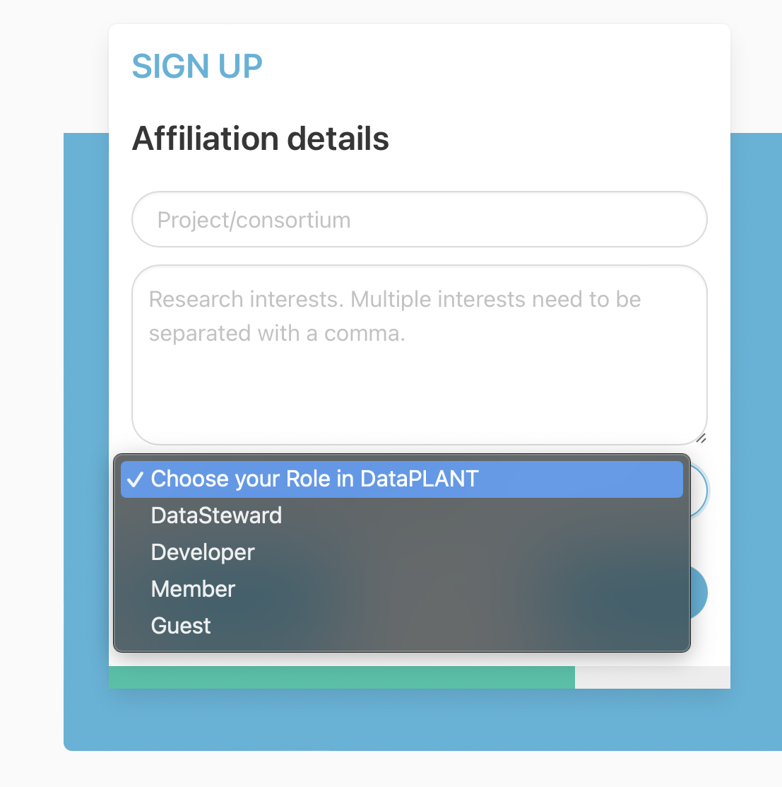

## About this guide

In this guide we show you how to register at the [DataHUB](https://git.nfdi4plants.org/) to be able to share your ARC for collaboration. 

    <a href="./index.html">
    UserNewbie
    ModeTutorial
    </a>

## Registration

If you do not have a DataPLANT account, please register [here](<https://register.nfdi4plants.org>).

<!-- Source to slide(s) -->
<!-- ../../bricks/datahub_registration.md -->

## DataPLANT Roles

During the registration you can "Choose your role in DataPLANT"

- DataSteward
  - Member of / associated to DataPLANT
  - Teaches DataPLANT tools and services to community members
- Developer
  - Member of / associated to DataPLANT
  - Develops DataPLANT tools and services
- Member
  - Other member of DataPLANT
- Guest
  - Guest users who want to use the DataPLANT tools and services

<!-- Source to slide(s) -->
<!-- ../../bricks/datahub_registration_role.md -->
