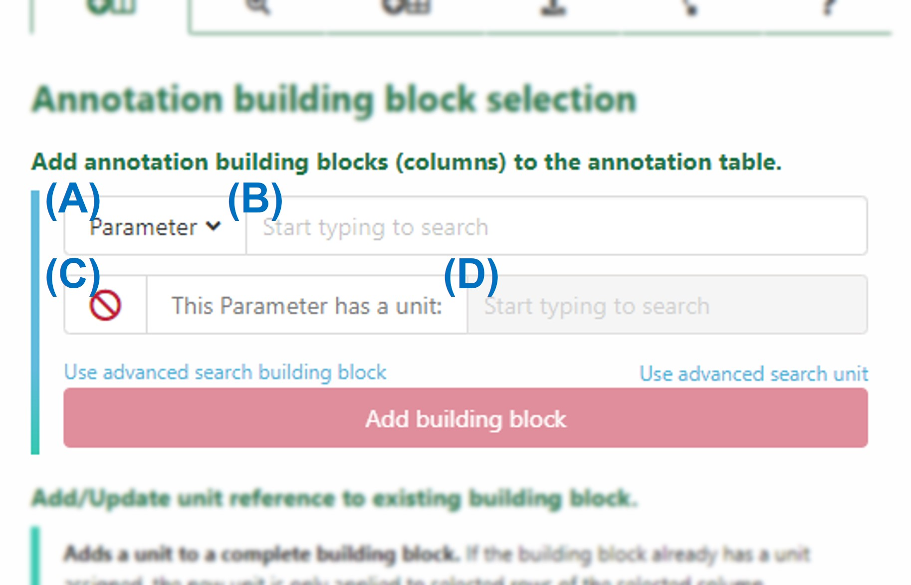
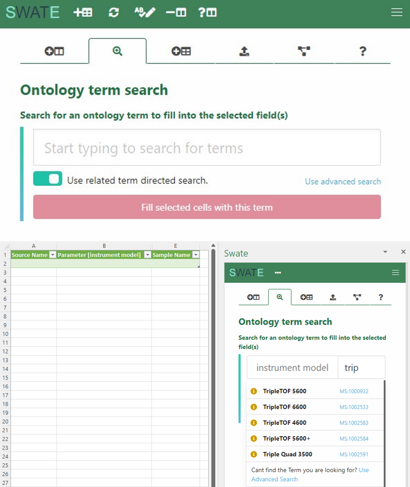

## About this guide

DataPLANT provides the Excel Add-In Swate to support you in data annotation. In this guide we focus on adding metadata to your studies and assays with our excel tool [Swate](./../implementation/Swate.html). Use the isa.study.xlsx to describe the characteristics of your samples, e.g. how you grew your plant, and isa.assay.xlsx to annotate the experimental analyses.

<a href="./index.html">
  UserNewbie
  ModeTutorial
</a>

 
 

## Before we can start

:ballot_box_with_check: Please [install Swate](./../SwateManual/Docs01-Installing-Swate.html)
 
:bulb: Consider reading about [Swate](./../implementation/Swate.html)
 
:bulb: We assume that you already created an ARC that contains one or more isa.study.xlsx and isa.assay.xlsx file(s), respectively.

## Swate

- Use the *create annotation table* button in the yellow pop-up box (this only appears if you start Swate on an Excel worksheet without an existing annotation table). An annotation table with the building blocks *Source Name* and *Sample Name* will be generated.  

- Annotate your table with help of the [annotation principles](https://nfdi4plants.github.io/AnnotationPrinciples/).  
Briefly:
  - *Characteristics* are used for study descriptions and describe inherent properties of the source material (e.g. a certain strain).  
  - *Parameters* describe steps in your experimental workflow (e.g. an instrument model or a growth chamber), and  
  - *Factors* describe independent variables that result in a specific output (e.g. the light intensity).

- The combination of ISA (Characteristics, Parameter, Factor) and a biological or technological ontology (e.g. temperature, strain, instrument model) gives the flexibility to display an ontology term, e.g. temperature, as a regular process parameter or as the factor your study is based on (Parameter \[temperature\] or Factor \[temperature\]).

## Customize your table by adding building blocks

1. Choose the type of building block you want to add (A).

2. If you chose a descriptive building block type (building blocks besides Sample Name, Source Name, and Data File Name), use search field (B) to search for an Ontology Term. Swate accesses the SwateDB with a list of established external ontologies designated suitable for use in plant science. In addition, we feature our own ontology DPBO to extend the DB with missing, but necessary terms.

3. If you want to add a building block with a unit, check box (C) and use search field (D) to look for a fitting unit term, e.g. degree Celsius as unit for Parameter \[temperature\].

4. If you could not find a fitting term, you can use the Advanced Term Search with the blue links above the *Add building block* button. If you still could not find a fitting term, use free text input.  

5. For more information on customizing your annotation table click [here](./SwateManual/Docs03-Building-Blocks.html).

## Use templates

Alternatively, you can also use one of DataPLANT’s [Swate templates](./SwateManual/Docs05-Templates.html). You can find them under the *Protocol Insert* tab in Swate.  

## Annotate your samples and data

Fill the cells beneath each building block with ontology terms to note the respective *Characteristics, Parameter,* and *Factor* values of your experiment. Using the ontology term search function, you can fill multiple cells at once.

1. When *Use related term directed search* (A) is enabled, Swate
  will suggest a selection of suitable terms within the ontology
  for the column header, e.g. *TripleTOF* *5600* for *instrument
  model.*

2. When term directed search (A) is disabled, Swate will still
  suggest ontology terms, but without relation to the column
  header.

3. If you could not find a fitting term, use free text input.

> Note: More information on how to use Swate can be found [here][kb-SwateManual].

<!-- Links to DataPLANT knowledge base (kb-) -->

<!-- kb-Fundamentals -->

[kb-DataManagementPlan]: ../fundamentals/DataManagementPlan.html "Data Management Plan"
[kb-DataPublications]: ../fundamentals/DataPublications.html "Data Publication"
[kb-DataSharing]: ../fundamentals/DataSharing.html "Data Sharing"
[kb-FairDataPrinciples]: ../fundamentals/FairDataPrinciples.html "FAIR Data principles"
[kb-Metadata]: ../fundamentals/Metadata.html "Metadata"
[kb-PersistentIdentifiers]: ../fundamentals/PersistentIdentifiers.html "Persistent Identifiers"
[kb-PublicDataRepositories]: ../fundamentals/PublicDataRepositories.html "Repositories"
[kb-ResearchDataManagement]: ../fundamentals/ResearchDataManagement.html "Research Data Management"
[kb-VersionControlGit]: ../fundamentals/VersionControlGit.html "Version Control and Git"
[kb-SwateManual]: ../SwateManual/index.html "Swate Manual"

<!-- kb-Implementation -->
[kb-AnnotatedResearchContext]: ../implementation/AnnotatedResearchContext.html "Annotated Research Context"
[kb-DataHub]: ../implementation/DataHub.html "DataPLANT DataHUB"
[kb-ArcCommander]: ../implementation/ArcCommander.html "ARC Commander"

<!-- kb-Tutorials -->
[kb-QuickStart_arc]: ../tutorials/arcCommander_QuickStart.html "ARC User Journey"
[kb-swate_QuickStart]: ../tutorials/swate_QuickStart.html "Swate QuickStart"

<!-- Links to DataPLANT Homepage (hp-) -->

[hp-Registration]: <https://register.nfdi4plants.org/> "DataPLANT Registration"
[hp-DataHUB]: <https://git.nfdi4plants.org> "DataPLANT DataHUB"
[hp-HelpDesk]: <https://helpdesk.nfdi4plants.org> "DataPLANT Help Desk"

<!-- Links to DataPLANT GitHub (gh-) -->

[gh-DataPlant]: <https://github.com/nfdi4plants/> "GitHub DataPLANT"
[kb-ArcSpecs]: ./../implementation/ARC-specification.html "ARC specification"
[gh-ArcCommander]: <https://github.com/nfdi4plants/arcCommander/> "ArcCommander"
[kb-ArcCommander-Manual]: ../ArcCommanderManual/index.html "ARC Commander Manual"
[gh-Swate]: <https://github.com/nfdi4plants/Swate/> "GitHub Swate"

<!-- Links to external (ext-) sources -->
