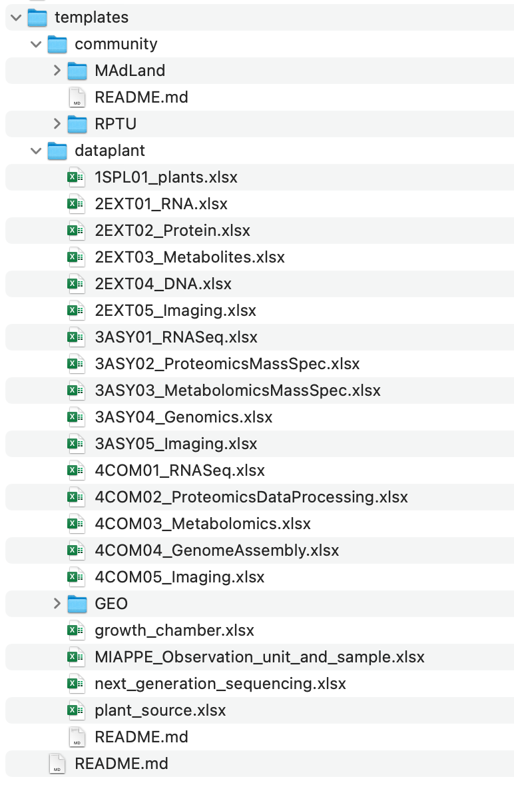
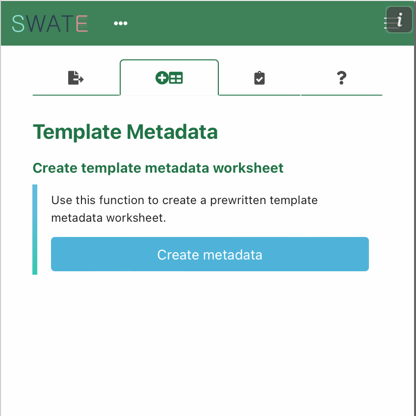
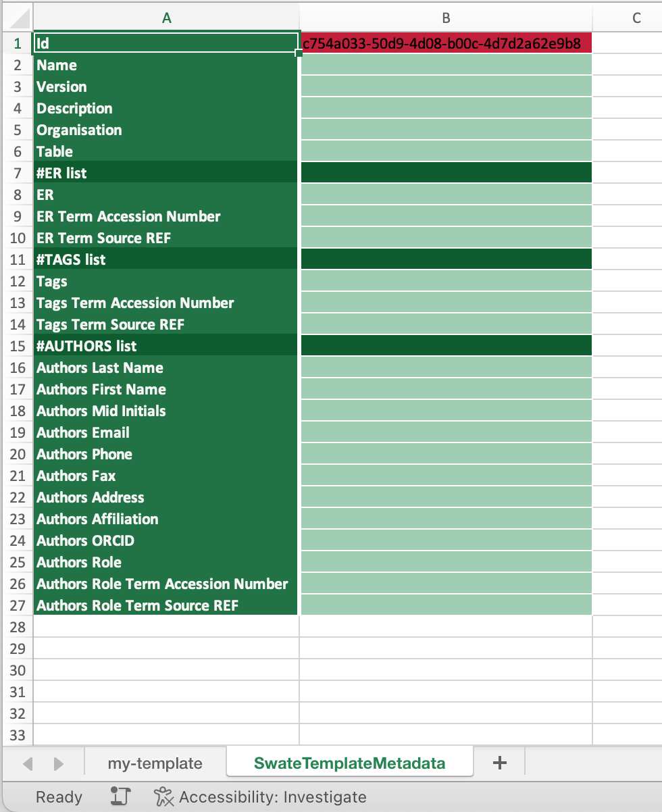
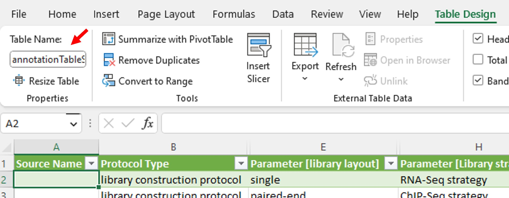
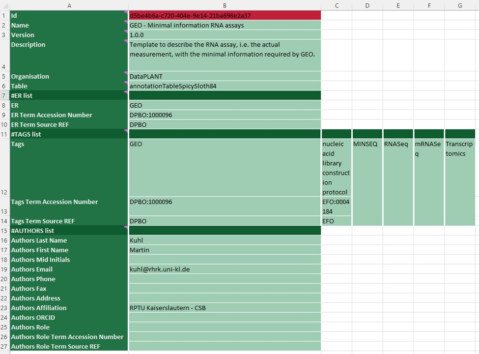
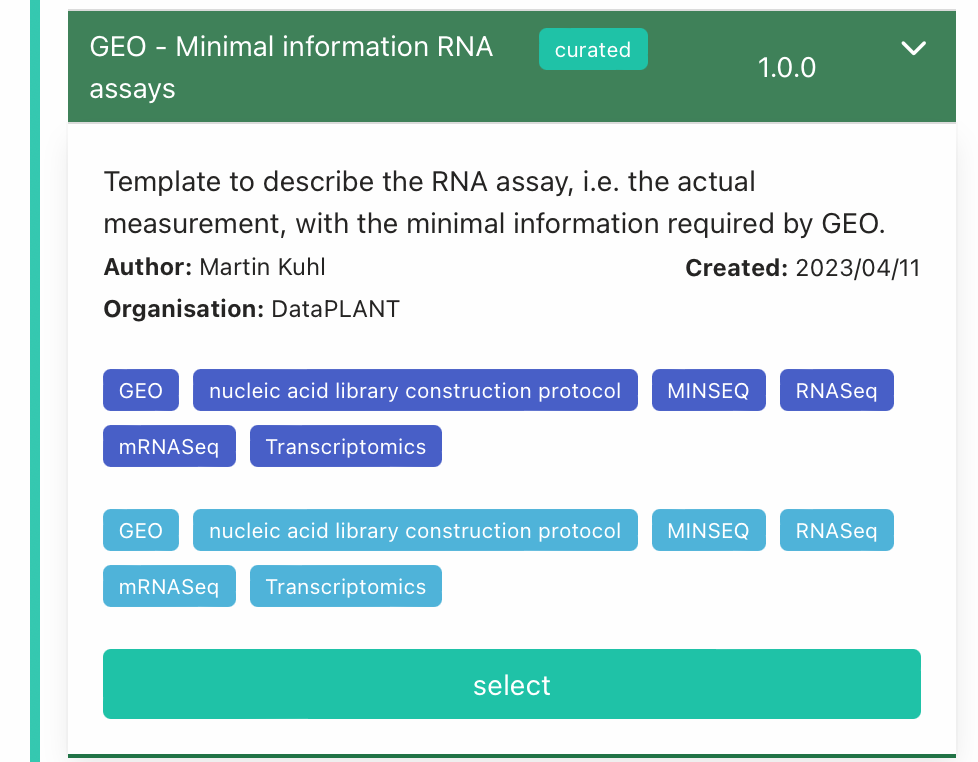

## About this guide

This tutorial guides you how to create and share Swate metadata templates.

<a href="./index.html">
  UserData Steward
  ModeTutorial
</a>
 
 

## Before we can start

Before contributing Swate templates you ideally have

- :ballot_box_with_check: Access to an up-to-date [installation](./../SwateManual/Docs01-Installing-Swate.html) of **Swate Core** and **Swate Experts**  
- :ballot_box_with_check: Some routine with Swate (e.g. from the Swate manual and quickstarts)
  - you know how to create an [Annotation Table](./../SwateManual/Docs02-Annotation-Table.html)
  - you know how to [add building blocks](./../SwateManual/Docs03-Building-Blocks.html) to your annotation table
  - you know the annotation principles
- :ballot_box_with_check: A [GitHub](https://github.com) account and some routine with GitHub
- :bulb: Feel free to contact us for Data Steward support, if you are not familiar to GitHub or Swate, but would like to contribute a Swate template for your community

## Git Workflow to add or edit templates

1. (Recommended) [Create an issue](https://github.com/nfdi4plants/Swate-templates/issues/new/choose) with background information about the template you want to add. This also serves as a place for discussion.
2. [Fork](https://docs.github.com/en/get-started/quickstart/fork-a-repo) the [Swate-templates repository](https://github.com/nfdi4plants/Swate-templates).
3. (Recommended) Create a feature branch (e.g. "template-xy") on your fork.
4. [Clone](https://docs.github.com/en/repositories/creating-and-managing-repositories/cloning-a-repository) your fork-branch
5. Add/update **ONE** template ([see steps below](#creating-a-new-swate-template))
6. Commit, push and [sync your branch](https://docs.github.com/en/pull-requests/collaborating-with-pull-requests/working-with-forks/syncing-a-fork).
7. Open a [pull request](https://docs.github.com/en/pull-requests/collaborating-with-pull-requests/proposing-changes-to-your-work-with-pull-requests/about-pull-requests)
   > 👀 You can **reference your issue** typing `#` in the pull request's commenting dialog

## Creating a new Swate template

### Create a new Annotation Table in a fresh Excel workbook

- Open a new Excel workbook `<template>.xlsx`
- Create an [Annotation Table](./Docs02-Annotation-Table.html)
- Save the Excel file in a suitable folder within your local clone of the Swate templates repository
  - :bulb: check the subfolder README.md`s  
  - :construction: naming convention for files and directories is work in progress

- [Add building blocks](./Docs03-Building-Blocks.html) to your template's Annotation Table

<figure>
  
  <figcaption>Local clone of Swate templates repository (April 19, 2023)</figcaption>
</figure>

### Recommendations for template design

- Keep the template as concise as possible
- Finding suitable building blocks is not always straight-forward
- 👀 If you miss a term or ontology, please follow the [DPBO contribution guide](https://github.com/nfdi4plants/nfdi4plants_ontology) to let us know
- If you add a template to address a missing method, try to add building blocks that cover experimental procedures (as Parameters) and features of the sample (as Characteristics) that the experimenter would do when working on an experiment of that type
- If you add a template with a specific endpoint repository (ER) in mind, you may want to add building blocks that match the required fields of this ER
- Avoid using the building block type `Factor` in templates. Any given characteristic or parameter in one study or assay can become a factor in another study or assay depending on the experimental context or scientific question. E.g. in one study all samples originate from the same `species` (-> Characteristic) whereas in another study multiple `species` where assayed (-> Factor). 

### Add Template Metadata

- Open the "Template Metadata" tab in **Swate Experts** 
- Click "Create Metadata"
- A new worksheet will open called "SwateMetadataSheet"

> :warning: Make sure to never change any of the fields in the first column. These "key" fields must exist to create a functional template. Always only change the "value" fields (second and following columns).

### Template Metadata Explanation

Key | Definition | Tip :bulb:
------- | ------- | -------
**Id** |   | Do not change this field. It maps your template to a database entry :warning:
**Name** |  This is the first info Swate users see about your template  |  Try using a short, descriptive and human readable name. (Think YouTube video title)
**Version** |  The version of the template following the [SemVer](https://semver.org/) convention.  |  For a new template use `1.0.0`. Raise the version number when updating an existing template
**Description** |  Here you can describe your template |  Users interested in your template can read this in Swate, but not search by it
**Organisation** |  The name of an organisation or community you create this template for. This facilitates searching for relevant templates in a specific organisation or community. |  Templates with the organisation "DataPLANT" are listed as `curated` in the Swate template database. All other templates are listed as `community`.
**Table** |  This value **must match** the name of the annotation table you want to use as a template |  To find the name click on any field in your annotation table, then open the `Table Design` (on macOS: `Table`) tab. Copy the name to the "Table" value field 
**ER list** |  You can add any number of endpoint repositories to which your template complies here | You may want to add them as ontology terms with unique identifier and source
**TAGS list** |  You can add any number of tags here. These tags are the basis to search for your template | You may want to add them as ontology terms with unique identifier and source
**AUTHORS list** |  Add your name/alias here with as much information as you like.

### Template Metadata Example

Here is an example for filled out template metadata and how it helps in Swate's template search.

### Your template is ready for upload :tada:

- Well done! You created a new template.
- You can now submit your template via the git workflow described above.
- Once your pull request is merged, you will receive an Email from "Swobup Commit Report"

## Recommended best practices

- Try to think about in which order the experimenter in the lab will do their work. Try to match this chronological order from left to right. The normal order of the columns is: **Source Name** -> (all the Parameters and Characteristics in between in chronological order) -> **Sample Name** -or- **Raw Data File** -or- **Derived Data File**. This step is optional and only meant to increase readability.
- Below the header you can add exemplary terms as in this example:  
  
These examples help as additional information for other Data Stewards and are not transferred into the Swate template database.
- Use ontology terms for **ER list** and **TAGS list**.
- Add protocol type and any [minimal information standards](https://en.wikipedia.org/wiki/Minimum_information_standard) your template complies with to the **TAGS list**.

## Known pitfalls with Swate Templates

- Opening and saving a Swate template .xlsx file with a program other than Microsoft Excel (e.g. LibreOffice, python script, R script) often destroys the template (backend). Please, avoid to upload this file into the GitHub repository, even if the annotation table itself looks intact and can be worked on with the Swate plugin
