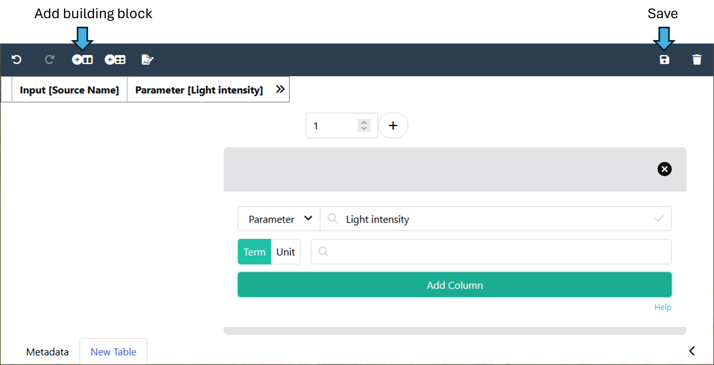

## About this guide

This tutorial guides you how to create Swate metadata templates with [Swate-alpha](https://swate-alpha.nfdi4plants.org/).

<a href="./index.html">
  UserData Steward
  ModeTutorial
</a>
 
 

## Before we can start

Before contributing Swate templates you ideally have

- :ballot_box_with_check: Access to [Swate-alpha](https://swate-alpha.nfdi4plants.org/)
- :ballot_box_with_check: Some routine with Swate (e.g. from the Swate manual and quickstarts)
  - you know how to create an [Annotation Table](./../SwateManual/Docs02-Annotation-Table.html)
  - you know how to [add building blocks](./../SwateManual/Docs03-Building-Blocks.html) to your annotation table
  - you know the annotation principles
- :ballot_box_with_check: A [GitHub](https://github.com) account and some routine with GitHub
- :bulb: Feel free to contact us for Data Steward support, if you are not familiar to GitHub or Swate, but would like to contribute a Swate template for your community

## Git Workflow to add or edit templates

1. (Recommended) [Create an issue](https://github.com/nfdi4plants/Swate-templates/issues/new/choose) with background information about the template you want to add. This also serves as a place for discussion.
2. [Fork](https://docs.github.com/en/get-started/quickstart/fork-a-repo) the [Swate-templates repository](https://github.com/nfdi4plants/Swate-templates).
3. (Recommended) Create a feature branch (e.g. "template-xy") on your fork.
4. [Clone](https://docs.github.com/en/repositories/creating-and-managing-repositories/cloning-a-repository) your fork-branch
5. Add/update **ONE** template ([see steps below](#creating-a-new-swate-template))
6. Commit, push and [sync your branch](https://docs.github.com/en/pull-requests/collaborating-with-pull-requests/working-with-forks/syncing-a-fork).
7. Open a [pull request](https://docs.github.com/en/pull-requests/collaborating-with-pull-requests/proposing-changes-to-your-work-with-pull-requests/about-pull-requests)
   > 👀 You can **reference your issue** typing `#` in the pull request's commenting dialog

## Creating a new Swate template

### Create or open a Swate template

Open [Swate-alpha](https://swate-alpha.nfdi4plants.org/). To create a new template click "New File" and select "Template". If you want to edit an existing template, click "Import" and select the respective file. 

### Add Template Metadata

Once you open a new template, you will see a "Metadata" sheet. Here you will enter a name for the template as well as further information describing the template. You can find explanations of the necessary information in the table below. 

#### Template Metadata Explanation

Key | Definition | Tip :bulb:
------- | ------- | -------
**Identifier** |   | Do not change this field. It maps your template to a database entry :warning:
**Name** |  This is the first info Swate users see about your template  |  Try using a short, descriptive and human readable name. Capitalize the first letter of the first word.
**Description** |  Here you can describe your template. |  Users interested in your template can read this in Swate, but not search by it.
**Organisation** |  The name of an organisation or community you create this template for. This facilitates searching for relevant templates in a specific organisation or community. |  Templates with the organisation "DataPLANT" are listed as `curated` in the Swate template database. All other templates are listed as `community`.
**Version** |  The version of the template following the [SemVer](https://semver.org/) convention.  |  For a new template use `1.0.0`. Raise the version number when updating an existing template.
**Tags** |  You can add any number of tags here. These tags are the basis to search for your template. | If possible add them as ontology terms with source ontology (TSR) and unique identifier (TAN). If similar tags already exist, consider reusing the existing ones.
**Endpoint Repositories** |  If your template complies with the requirements of an endpoint repository, you can add the respective repository here. | You may want to add them as ontology terms with source (TSR) and identifier (TAN).
**Authors** |  Add your name/alias here with as much information as you like.

#### Template Metadata Example

Here is an example for filled out template metadata and how it helps in Swate's template search.
 

### Add building blocks

To add the building blocks of your actual template, you need to switch from the "Metadata" sheet to the "New Table" sheet on the bottom left. Using the "Add Building Block" button, you can add your desired building blocks with or without a unit.
 

#### Recommendations for template design

- Keep the template as concise as possible
- 👀 If you miss a term or ontology, please follow the [DPBO contribution guide](https://github.com/nfdi4plants/nfdi4plants_ontology) to let us know
- If you add a template to address a missing method, try to add building blocks that cover experimental procedures (as Parameters) and features of the sample (as Characteristics) that the experimenter would use when working on an experiment of that type
- Try to think about in which order the experimenter in the lab will do their work. Try to match this chronological order from left to right. The normal order of the columns is: **Input** -> (all the Parameters and Characteristics in between in chronological order) -> **Output** -or- **Raw Data File** -or- **Derived Data File**. This step is optional and only meant to increase readability.
- If you would like to save any background information on your template, that would help others reconstruct the creation of the template, you can save it in the [Swate-templates GitHub repository](https://github.com/nfdi4plants/Swate-templates). For this, please create a folder with the name of your template in the "Background information" folder. 
- Avoid using the building block type `Factor` in templates. Any given characteristic or parameter in one study or assay can become a factor in another study or assay depending on the experimental context or scientific question. E.g. in one study all samples originate from the same `species` (-> Characteristic) whereas in another study multiple `species` where assayed (-> Factor). 

#### Recommendations for adding endpoint repository templates
- When creating a template to comply with repository requirements, please follow the following naming pattern: "Repository" - "Assay", e.g. MetaboLights - MS measurement
- The endpoint repository tag should be added ONLY in the "Endpoint repository" category in the metadata sheet
- By default repository templates should contain only mandatory information. In this case, please add "mandatory" as a tag.
- Optional or recommended information can be added with an extension template that contains ONLY the optional/recommended information. In this case, please add "-extension" to the template name. 
- If applicable, templates should be split into different assays.
- Templates should be checked for validity of requirements every ~ 6 months.

### Save your template

Save your template by clicking on the disc symbol in the top right corner. This will download an xlsx-file. Please adjust the name of the file to correspond to the name of the template, but use underscores instead of spaces.
Save the Excel file in a suitable folder within your local clone of the Swate templates repository.

### Your template is ready for upload :tada:

- Well done! You created a new template.
- You can now submit your template via the git workflow described above.
- Once your pull request is merged, you will receive an Email from "Swobup Commit Report"

## Known pitfalls with Swate Templates

- Opening and saving a Swate template .xlsx file with a program other than Microsoft Excel (e.g. LibreOffice, python script, R script) often destroys the template (backend). Please, avoid to upload this file into the GitHub repository.
