:bulb: Scroll table to right for more information.

Thumbnail |  Image URL | Source  / Citation | License
------- | ------- | ------- | -------
  |  <a href="./_logos/ARCCommander/arcCommander_Logo1.svg" target="_blank">https://nfdi4plants.org/nfdi4plants.knowledgebase/docs/img/_logos/ARCCommander/arcCommander_Logo1.svg</a>  | TA3-[DataPLANT](nfdi4plants.org)
  |  <a href="./_logos/CEPLAS/CEPLAS_Icon.jpeg" target="_blank">https://nfdi4plants.org/nfdi4plants.knowledgebase/docs/img/_logos/CEPLAS/CEPLAS_Icon.jpeg</a>  | https://ceplas.eu
  |  <a href="./_logos/CEPLAS/CEPLAS_Logo_Claim_2019.png" target="_blank">https://nfdi4plants.org/nfdi4plants.knowledgebase/docs/img/_logos/CEPLAS/CEPLAS_Logo_Claim_2019.png</a>  | https://ceplas.eu
  |  <a href="./_logos/CreativeCommons/by-nc-nd.eu.svg" target="_blank">https://nfdi4plants.org/nfdi4plants.knowledgebase/docs/img/_logos/CreativeCommons/by-nc-nd.eu.svg</a>  | https://creativecommons.org/
  |  <a href="./_logos/CreativeCommons/by-nc-nd.svg" target="_blank">https://nfdi4plants.org/nfdi4plants.knowledgebase/docs/img/_logos/CreativeCommons/by-nc-nd.svg</a>  | https://creativecommons.org/
  |  <a href="./_logos/CreativeCommons/by-nc-sa.eu.svg" target="_blank">https://nfdi4plants.org/nfdi4plants.knowledgebase/docs/img/_logos/CreativeCommons/by-nc-sa.eu.svg</a>  | https://creativecommons.org/
  |  <a href="./_logos/CreativeCommons/by-nc-sa.svg" target="_blank">https://nfdi4plants.org/nfdi4plants.knowledgebase/docs/img/_logos/CreativeCommons/by-nc-sa.svg</a>  | https://creativecommons.org/
  |  <a href="./_logos/CreativeCommons/by-nc.eu.svg" target="_blank">https://nfdi4plants.org/nfdi4plants.knowledgebase/docs/img/_logos/CreativeCommons/by-nc.eu.svg</a>  | https://creativecommons.org/
  |  <a href="./_logos/CreativeCommons/by-nc.svg" target="_blank">https://nfdi4plants.org/nfdi4plants.knowledgebase/docs/img/_logos/CreativeCommons/by-nc.svg</a>  | https://creativecommons.org/
  |  <a href="./_logos/CreativeCommons/by-nd.svg" target="_blank">https://nfdi4plants.org/nfdi4plants.knowledgebase/docs/img/_logos/CreativeCommons/by-nd.svg</a>  | https://creativecommons.org/
  |  <a href="./_logos/CreativeCommons/by-sa.svg" target="_blank">https://nfdi4plants.org/nfdi4plants.knowledgebase/docs/img/_logos/CreativeCommons/by-sa.svg</a>  | https://creativecommons.org/
  |  <a href="./_logos/CreativeCommons/by.svg" target="_blank">https://nfdi4plants.org/nfdi4plants.knowledgebase/docs/img/_logos/CreativeCommons/by.svg</a>  | https://creativecommons.org/
  |  <a href="./_logos/CreativeCommons/cc-zero.svg" target="_blank">https://nfdi4plants.org/nfdi4plants.knowledgebase/docs/img/_logos/CreativeCommons/cc-zero.svg</a>  | https://creativecommons.org/
  |  <a href="./_logos/DataPLANT/DataPLANT_logo_bg_black.svg" target="_blank">https://nfdi4plants.org/nfdi4plants.knowledgebase/docs/img/_logos/DataPLANT/DataPLANT_logo_bg_black.svg</a>  | TA3-[DataPLANT](nfdi4plants.org)
  |  <a href="./_logos/DataPLANT/DataPLANT_logo_bg_darkblue.svg" target="_blank">https://nfdi4plants.org/nfdi4plants.knowledgebase/docs/img/_logos/DataPLANT/DataPLANT_logo_bg_darkblue.svg</a>  | TA3-[DataPLANT](nfdi4plants.org)
  |  <a href="./_logos/DataPLANT/DataPLANT_logo_bg_lightblue.svg" target="_blank">https://nfdi4plants.org/nfdi4plants.knowledgebase/docs/img/_logos/DataPLANT/DataPLANT_logo_bg_lightblue.svg</a>  | TA3-[DataPLANT](nfdi4plants.org)
  |  <a href="./_logos/DataPLANT/DataPLANT_logo_bg_transparent.svg" target="_blank">https://nfdi4plants.org/nfdi4plants.knowledgebase/docs/img/_logos/DataPLANT/DataPLANT_logo_bg_transparent.svg</a>  | TA3-[DataPLANT](nfdi4plants.org)
  |  <a href="./_logos/DataPLANT/DataPLANT_logo_minimal_rounded_bg_black.svg" target="_blank">https://nfdi4plants.org/nfdi4plants.knowledgebase/docs/img/_logos/DataPLANT/DataPLANT_logo_minimal_rounded_bg_black.svg</a>  | TA3-[DataPLANT](nfdi4plants.org)
  |  <a href="./_logos/DataPLANT/DataPLANT_logo_minimal_rounded_bg_darkblue.svg" target="_blank">https://nfdi4plants.org/nfdi4plants.knowledgebase/docs/img/_logos/DataPLANT/DataPLANT_logo_minimal_rounded_bg_darkblue.svg</a>  | TA3-[DataPLANT](nfdi4plants.org)
  |  <a href="./_logos/DataPLANT/DataPLANT_logo_minimal_rounded_bg_lightblue.svg" target="_blank">https://nfdi4plants.org/nfdi4plants.knowledgebase/docs/img/_logos/DataPLANT/DataPLANT_logo_minimal_rounded_bg_lightblue.svg</a>  | TA3-[DataPLANT](nfdi4plants.org)
  |  <a href="./_logos/DataPLANT/DataPLANT_logo_minimal_rounded_bg_transparent.svg" target="_blank">https://nfdi4plants.org/nfdi4plants.knowledgebase/docs/img/_logos/DataPLANT/DataPLANT_logo_minimal_rounded_bg_transparent.svg</a>  | TA3-[DataPLANT](nfdi4plants.org)
  |  <a href="./_logos/DataPLANT/DataPLANT_logo_minimal_square_bg_black.svg" target="_blank">https://nfdi4plants.org/nfdi4plants.knowledgebase/docs/img/_logos/DataPLANT/DataPLANT_logo_minimal_square_bg_black.svg</a>  | TA3-[DataPLANT](nfdi4plants.org)
  |  <a href="./_logos/DataPLANT/DataPLANT_logo_minimal_square_bg_darkblue.svg" target="_blank">https://nfdi4plants.org/nfdi4plants.knowledgebase/docs/img/_logos/DataPLANT/DataPLANT_logo_minimal_square_bg_darkblue.svg</a>  | TA3-[DataPLANT](nfdi4plants.org)
  |  <a href="./_logos/DataPLANT/DataPLANT_logo_minimal_square_bg_lightblue.svg" target="_blank">https://nfdi4plants.org/nfdi4plants.knowledgebase/docs/img/_logos/DataPLANT/DataPLANT_logo_minimal_square_bg_lightblue.svg</a>  | TA3-[DataPLANT](nfdi4plants.org)
  |  <a href="./_logos/DataPLANT/DataPLANT_logo_minimal_square_bg_transparent.svg" target="_blank">https://nfdi4plants.org/nfdi4plants.knowledgebase/docs/img/_logos/DataPLANT/DataPLANT_logo_minimal_square_bg_transparent.svg</a>  | TA3-[DataPLANT](nfdi4plants.org)
  |  <a href="./_logos/DataPLANT/DataPLANT_logo_square_bg_black.svg" target="_blank">https://nfdi4plants.org/nfdi4plants.knowledgebase/docs/img/_logos/DataPLANT/DataPLANT_logo_square_bg_black.svg</a>  | TA3-[DataPLANT](nfdi4plants.org)
  |  <a href="./_logos/DataPLANT/DataPLANT_logo_square_bg_darkblue.svg" target="_blank">https://nfdi4plants.org/nfdi4plants.knowledgebase/docs/img/_logos/DataPLANT/DataPLANT_logo_square_bg_darkblue.svg</a>  | TA3-[DataPLANT](nfdi4plants.org)
  |  <a href="./_logos/DataPLANT/DataPLANT_logo_square_bg_lightblue.svg" target="_blank">https://nfdi4plants.org/nfdi4plants.knowledgebase/docs/img/_logos/DataPLANT/DataPLANT_logo_square_bg_lightblue.svg</a>  | TA3-[DataPLANT](nfdi4plants.org)
  |  <a href="./_logos/DataPLANT/DataPLANT_logo_square_bg_transparent.svg" target="_blank">https://nfdi4plants.org/nfdi4plants.knowledgebase/docs/img/_logos/DataPLANT/DataPLANT_logo_square_bg_transparent.svg</a>  | TA3-[DataPLANT](nfdi4plants.org)
  |  <a href="./_logos/DOI_logo.svg" target="_blank">https://nfdi4plants.org/nfdi4plants.knowledgebase/docs/img/_logos/DOI_logo.svg</a>  | https://doi.org
  |  <a href="./_logos/ORCID_iD.svg" target="_blank">https://nfdi4plants.org/nfdi4plants.knowledgebase/docs/img/_logos/ORCID_iD.svg</a>  | https://orcid.org
  |  <a href="./_logos/ORCID_logo.svg" target="_blank">https://nfdi4plants.org/nfdi4plants.knowledgebase/docs/img/_logos/ORCID_logo.svg</a>  | https://orcid.org
  |  <a href="./_logos/Swate/Swate_logo_bg_black.svg" target="_blank">https://nfdi4plants.org/nfdi4plants.knowledgebase/docs/img/_logos/Swate/Swate_logo_bg_black.svg</a>  | TA3-[DataPLANT](nfdi4plants.org)
  |  <a href="./_logos/Swate/Swate_logo_bg_darkblue.svg" target="_blank">https://nfdi4plants.org/nfdi4plants.knowledgebase/docs/img/_logos/Swate/Swate_logo_bg_darkblue.svg</a>  | TA3-[DataPLANT](nfdi4plants.org)
  |  <a href="./_logos/Swate/Swate_logo_bg_lightblue.svg" target="_blank">https://nfdi4plants.org/nfdi4plants.knowledgebase/docs/img/_logos/Swate/Swate_logo_bg_lightblue.svg</a>  | TA3-[DataPLANT](nfdi4plants.org)
  |  <a href="./_logos/Swate/Swate_logo_bg_transparent.svg" target="_blank">https://nfdi4plants.org/nfdi4plants.knowledgebase/docs/img/_logos/Swate/Swate_logo_bg_transparent.svg</a>  | TA3-[DataPLANT](nfdi4plants.org)
  |  <a href="./_logos/Swate/Swate_logo_bg_white.svg" target="_blank">https://nfdi4plants.org/nfdi4plants.knowledgebase/docs/img/_logos/Swate/Swate_logo_bg_white.svg</a>  | TA3-[DataPLANT](nfdi4plants.org)
  |  <a href="./_logos/Swate/Swate_logo_for_excel_e.svg" target="_blank">https://nfdi4plants.org/nfdi4plants.knowledgebase/docs/img/_logos/Swate/Swate_logo_for_excel_e.svg</a>  | TA3-[DataPLANT](nfdi4plants.org)
  |  <a href="./_logos/Swate/Swate_logo_for_excel.svg" target="_blank">https://nfdi4plants.org/nfdi4plants.knowledgebase/docs/img/_logos/Swate/Swate_logo_for_excel.svg</a>  | TA3-[DataPLANT](nfdi4plants.org)
  |  <a href="./_logos/Swobup/logo-text/logo-blue-text-bm_grad-dark-small.png" target="_blank">https://nfdi4plants.org/nfdi4plants.knowledgebase/docs/img/_logos/Swobup/logo-text/logo-blue-text-bm_grad-dark-small.png</a>  | DataPLANT
  |  <a href="./_logos/Swobup/logo-text/logo-blue-text-bm_grad-dark.png" target="_blank">https://nfdi4plants.org/nfdi4plants.knowledgebase/docs/img/_logos/Swobup/logo-text/logo-blue-text-bm_grad-dark.png</a>  | DataPLANT
  |  <a href="./_logos/Swobup/logo-text/logo-blue-text-bm_grad-dark.svg" target="_blank">https://nfdi4plants.org/nfdi4plants.knowledgebase/docs/img/_logos/Swobup/logo-text/logo-blue-text-bm_grad-dark.svg</a>  | DataPLANT
  |  <a href="./_logos/Swobup/logo-text/logo-blue-text-bm_grad.svg" target="_blank">https://nfdi4plants.org/nfdi4plants.knowledgebase/docs/img/_logos/Swobup/logo-text/logo-blue-text-bm_grad.svg</a>  | DataPLANT
  |  <a href="./_logos/Swobup/logo-text/logo-blue-text.png" target="_blank">https://nfdi4plants.org/nfdi4plants.knowledgebase/docs/img/_logos/Swobup/logo-text/logo-blue-text.png</a>  | DataPLANT
  |  <a href="./_logos/Swobup/logo-text/logo-blue-text.svg-path961-2-3-5-1-700.png" target="_blank">https://nfdi4plants.org/nfdi4plants.knowledgebase/docs/img/_logos/Swobup/logo-text/logo-blue-text.svg-path961-2-3-5-1-700.png</a>  | DataPLANT
  |  <a href="./_logos/Swobup/logo-text/logo-green-text-bm_grad.svg" target="_blank">https://nfdi4plants.org/nfdi4plants.knowledgebase/docs/img/_logos/Swobup/logo-text/logo-green-text-bm_grad.svg</a>  | DataPLANT
  |  <a href="./_logos/Swobup/logo-text/logo-green-text.png" target="_blank">https://nfdi4plants.org/nfdi4plants.knowledgebase/docs/img/_logos/Swobup/logo-text/logo-green-text.png</a>  | DataPLANT
  |  <a href="./_logos/Swobup/logo-text/logo-green-text.svg-path961-2-1-611.png" target="_blank">https://nfdi4plants.org/nfdi4plants.knowledgebase/docs/img/_logos/Swobup/logo-text/logo-green-text.svg-path961-2-1-611.png</a>  | DataPLANT
  |  <a href="./_logos/Swobup/logo-text/logo-green-text.svg" target="_blank">https://nfdi4plants.org/nfdi4plants.knowledgebase/docs/img/_logos/Swobup/logo-text/logo-green-text.svg</a>  | DataPLANT
  |  <a href="./_logos/Swobup/logo-text/logo-yellow-text-bm_grad.svg" target="_blank">https://nfdi4plants.org/nfdi4plants.knowledgebase/docs/img/_logos/Swobup/logo-text/logo-yellow-text-bm_grad.svg</a>  | DataPLANT
  |  <a href="./_logos/Swobup/logo-text/logo-yellow-text.png" target="_blank">https://nfdi4plants.org/nfdi4plants.knowledgebase/docs/img/_logos/Swobup/logo-text/logo-yellow-text.png</a>  | DataPLANT
  |  <a href="./_logos/Swobup/logo-text/logo-yellow-text.svg-path961-2-3-7-111.png" target="_blank">https://nfdi4plants.org/nfdi4plants.knowledgebase/docs/img/_logos/Swobup/logo-text/logo-yellow-text.svg-path961-2-3-7-111.png</a>  | DataPLANT
  |  <a href="./_logos/Swobup/logo/logo-blue-bm_grad.svg" target="_blank">https://nfdi4plants.org/nfdi4plants.knowledgebase/docs/img/_logos/Swobup/logo/logo-blue-bm_grad.svg</a>  | DataPLANT
  |  <a href="./_logos/Swobup/logo/logo-blue.png" target="_blank">https://nfdi4plants.org/nfdi4plants.knowledgebase/docs/img/_logos/Swobup/logo/logo-blue.png</a>  | DataPLANT
  |  <a href="./_logos/Swobup/logo/logo-blue.svg-path961-2-3-5-171.png" target="_blank">https://nfdi4plants.org/nfdi4plants.knowledgebase/docs/img/_logos/Swobup/logo/logo-blue.svg-path961-2-3-5-171.png</a>  | DataPLANT
  |  <a href="./_logos/Swobup/logo/logo-green-bm_grad.svg" target="_blank">https://nfdi4plants.org/nfdi4plants.knowledgebase/docs/img/_logos/Swobup/logo/logo-green-bm_grad.svg</a>  | DataPLANT
  |  <a href="./_logos/Swobup/logo/logo-green.png" target="_blank">https://nfdi4plants.org/nfdi4plants.knowledgebase/docs/img/_logos/Swobup/logo/logo-green.png</a>  | DataPLANT
  |  <a href="./_logos/Swobup/logo/logo-green.svg-path961-2-226.png" target="_blank">https://nfdi4plants.org/nfdi4plants.knowledgebase/docs/img/_logos/Swobup/logo/logo-green.svg-path961-2-226.png</a>  | DataPLANT
  |  <a href="./_logos/Swobup/logo/logo-green.svg" target="_blank">https://nfdi4plants.org/nfdi4plants.knowledgebase/docs/img/_logos/Swobup/logo/logo-green.svg</a>  | DataPLANT
  |  <a href="./_logos/Swobup/logo/logo-yellow-bm_grad.svg" target="_blank">https://nfdi4plants.org/nfdi4plants.knowledgebase/docs/img/_logos/Swobup/logo/logo-yellow-bm_grad.svg</a>  | DataPLANT
  |  <a href="./_logos/Swobup/logo/logo-yellow.png" target="_blank">https://nfdi4plants.org/nfdi4plants.knowledgebase/docs/img/_logos/Swobup/logo/logo-yellow.png</a>  | DataPLANT
  |  <a href="./_logos/Swobup/logo/logo-yellow.svg-path961-2-3-143.png" target="_blank">https://nfdi4plants.org/nfdi4plants.knowledgebase/docs/img/_logos/Swobup/logo/logo-yellow.svg-path961-2-3-143.png</a>  | DataPLANT
  |  <a href="./_qr-codes/QR_DataPLANT_Contact_001.svg" target="_blank">https://nfdi4plants.org/nfdi4plants.knowledgebase/docs/img/_qr-codes/QR_DataPLANT_Contact_001.svg</a>   | TA3-[DataPLANT](nfdi4plants.org) 
  |  <a href="./_qr-codes/QR_DataPLANT_Helpdesk_001.svg" target="_blank">https://nfdi4plants.org/nfdi4plants.knowledgebase/docs/img/_qr-codes/QR_DataPLANT_Helpdesk_001.svg</a>   | TA3-[DataPLANT](nfdi4plants.org) 
  |  <a href="./_qr-codes/QR_DataPLANT_KnowledgeBase_001.svg" target="_blank">https://nfdi4plants.org/nfdi4plants.knowledgebase/docs/img/_qr-codes/QR_DataPLANT_KnowledgeBase_001.svg</a> | TA3-[DataPLANT](nfdi4plants.org)
  |  <a href="./_qr-codes/QR_DataPLANT_Linktree.svg" target="_blank">https://nfdi4plants.org/nfdi4plants.knowledgebase/docs/img/_qr-codes/QR_DataPLANT_Linktree.svg</a>  | TA3-[DataPLANT](nfdi4plants.org)
<a href="./activation_energy_with_DP.png" target="_blank">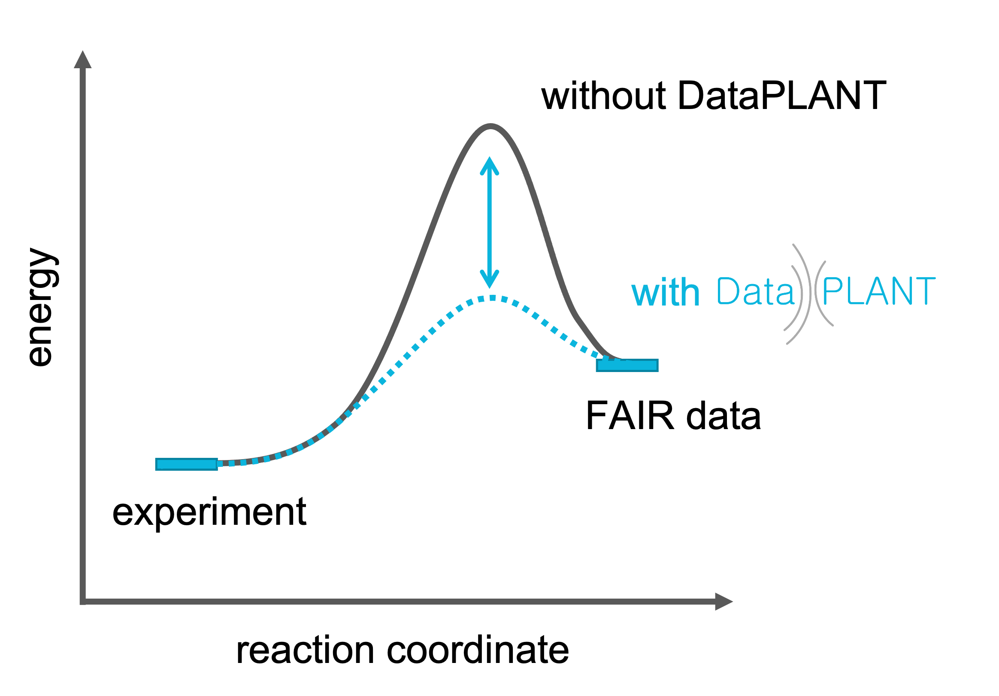</a>  |  <a href="./activation_energy_with_DP.png" target="_blank">https://nfdi4plants.org/nfdi4plants.knowledgebase/docs/img/activation_energy_with_DP.png</a>  | TA3-[DataPLANT](nfdi4plants.org)
<a href="./activation_energy_without_DP.png" target="_blank">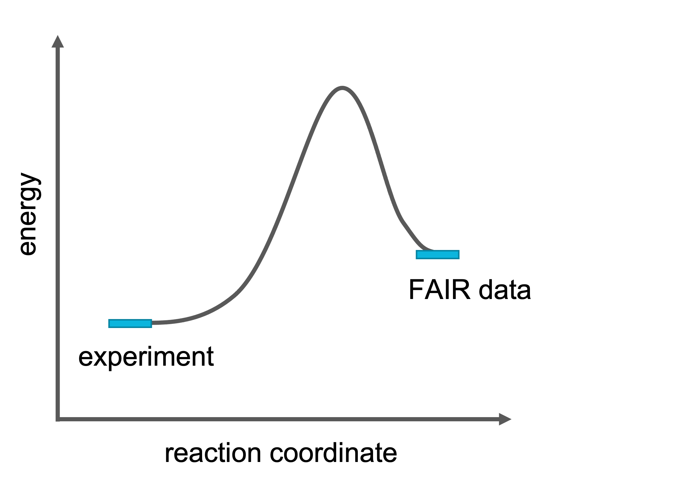</a>  |  <a href="./activation_energy_without_DP.png" target="_blank">https://nfdi4plants.org/nfdi4plants.knowledgebase/docs/img/activation_energy_without_DP.png</a>  | TA3-[DataPLANT](nfdi4plants.org)
  |  <a href="./AnnotationPrinciples/Characteristics.svg" target="_blank">https://nfdi4plants.org/nfdi4plants.knowledgebase/docs/img/AnnotationPrinciples/Characteristics.svg</a>  | TA3-[DataPLANT](nfdi4plants.org)
  |  <a href="./AnnotationPrinciples/Component.svg" target="_blank">https://nfdi4plants.org/nfdi4plants.knowledgebase/docs/img/AnnotationPrinciples/Component.svg</a>  | TA3-[DataPLANT](nfdi4plants.org)
<a href="./AnnotationPrinciples/Data.svg" target="_blank">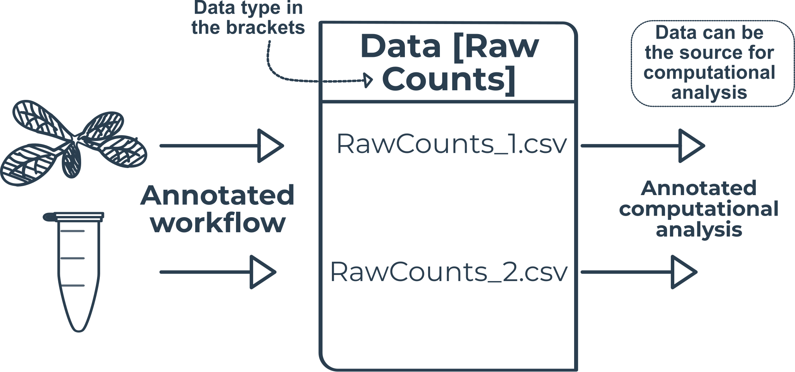</a>  |  <a href="./AnnotationPrinciples/Data.svg" target="_blank">https://nfdi4plants.org/nfdi4plants.knowledgebase/docs/img/AnnotationPrinciples/Data.svg</a>  | TA3-[DataPLANT](nfdi4plants.org)
  |  <a href="./AnnotationPrinciples/Factor.svg" target="_blank">https://nfdi4plants.org/nfdi4plants.knowledgebase/docs/img/AnnotationPrinciples/Factor.svg</a>  | TA3-[DataPLANT](nfdi4plants.org)
  |  <a href="./AnnotationPrinciples/Output.svg" target="_blank">https://nfdi4plants.org/nfdi4plants.knowledgebase/docs/img/AnnotationPrinciples/Output.svg</a>  | TA3-[DataPLANT](nfdi4plants.org)
  |  <a href="./AnnotationPrinciples/Parameter.svg" target="_blank">https://nfdi4plants.org/nfdi4plants.knowledgebase/docs/img/AnnotationPrinciples/Parameter.svg</a>  | TA3-[DataPLANT](nfdi4plants.org)
  |  <a href="./AnnotationPrinciples/Protocol.svg" target="_blank">https://nfdi4plants.org/nfdi4plants.knowledgebase/docs/img/AnnotationPrinciples/Protocol.svg</a>  | TA3-[DataPLANT](nfdi4plants.org)
<a href="./AnnotationPrinciples/Sample.svg" target="_blank">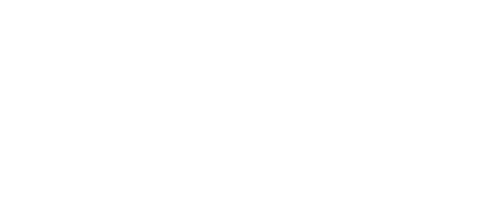</a>  |  <a href="./AnnotationPrinciples/Sample.svg" target="_blank">https://nfdi4plants.org/nfdi4plants.knowledgebase/docs/img/AnnotationPrinciples/Sample.svg</a>  | TA3-[DataPLANT](nfdi4plants.org)
  |  <a href="./AnnotationPrinciples/Source.svg" target="_blank">https://nfdi4plants.org/nfdi4plants.knowledgebase/docs/img/AnnotationPrinciples/Source.svg</a>  | TA3-[DataPLANT](nfdi4plants.org)
  |  <a href="./ARC_assaysSubdirectories.jpg" target="_blank">https://nfdi4plants.org/nfdi4plants.knowledgebase/docs/img/ARC_assaysSubdirectories.jpg</a>  |  [CEPLAS](https://ceplas.eu), DB
  |  <a href="./ARC_bag_ToolingAndPeronnel.svg" target="_blank">https://nfdi4plants.org/nfdi4plants.knowledgebase/docs/img/ARC_bag_ToolingAndPeronnel.svg</a>  | TA3-[DataPLANT](nfdi4plants.org)
<a href="./ARC_bag.svg" target="_blank">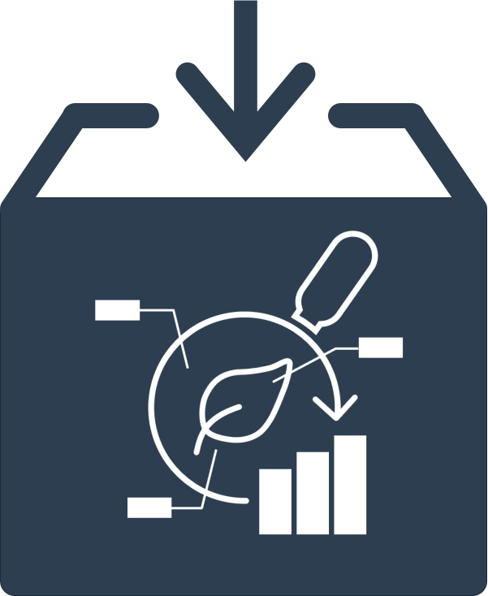</a>  |  <a href="./ARC_bag.svg" target="_blank">https://nfdi4plants.org/nfdi4plants.knowledgebase/docs/img/ARC_bag.svg</a>  | TA3-[DataPLANT](nfdi4plants.org)
  |  <a href="./ARC_BuiltsOnStandards_img1.png" target="_blank">https://nfdi4plants.org/nfdi4plants.knowledgebase/docs/img/ARC_BuiltsOnStandards_img1.png</a>  | TA3-[DataPLANT](nfdi4plants.org)
<a href="./ARC_CommonAPI_Converter_img1.png" target="_blank">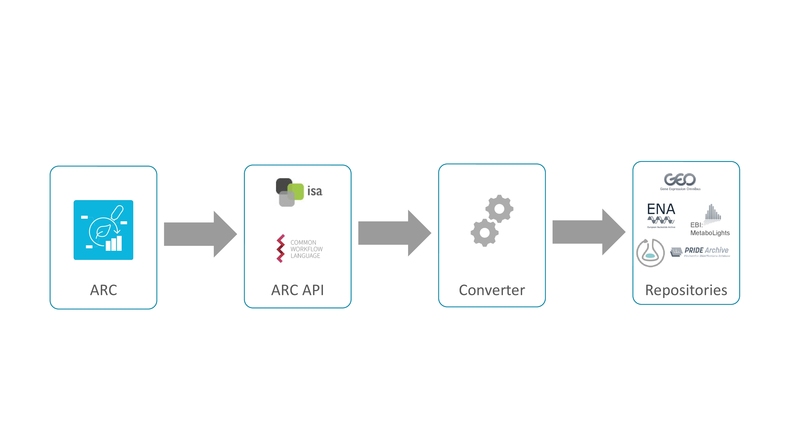</a>  |  <a href="./ARC_CommonAPI_Converter_img1.png" target="_blank">https://nfdi4plants.org/nfdi4plants.knowledgebase/docs/img/ARC_CommonAPI_Converter_img1.png</a>  | TA3-[DataPLANT](nfdi4plants.org)
<a href="./ARC_CommonAPI_Converter.svg" target="_blank">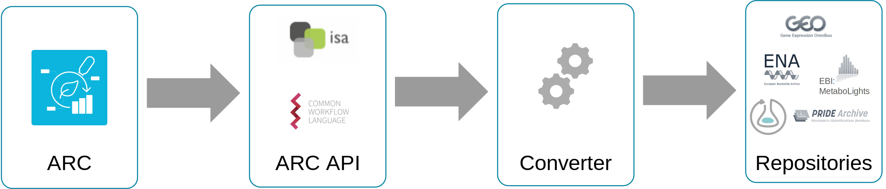</a>  |  <a href="./ARC_CommonAPI_Converter.svg" target="_blank">https://nfdi4plants.org/nfdi4plants.knowledgebase/docs/img/ARC_CommonAPI_Converter.svg</a>  | TA3-[DataPLANT](nfdi4plants.org)
  |  <a href="./ARC_CompleteAuthorityofData.svg" target="_blank">https://nfdi4plants.org/nfdi4plants.knowledgebase/docs/img/ARC_CompleteAuthorityofData.svg</a>  | TA3-[DataPLANT](nfdi4plants.org)
<a href="./ARC_contribute_img1.png" target="_blank">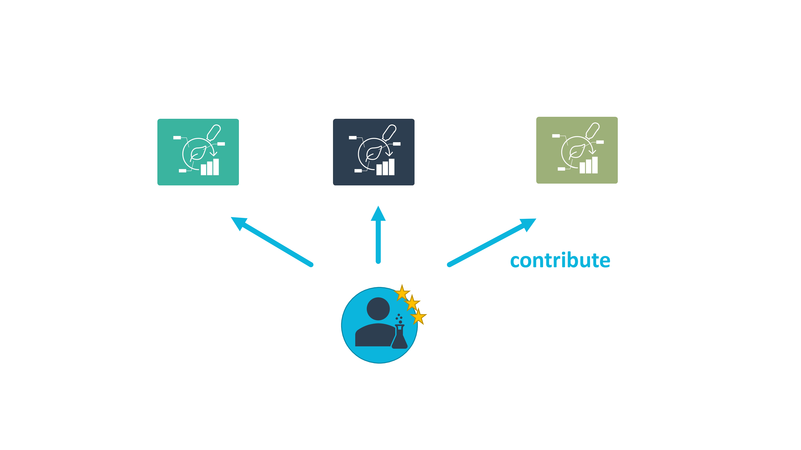</a>  |  <a href="./ARC_contribute_img1.png" target="_blank">https://nfdi4plants.org/nfdi4plants.knowledgebase/docs/img/ARC_contribute_img1.png</a>  | TA3-[DataPLANT](nfdi4plants.org)
<a href="./ARC_contribute_img2.png" target="_blank">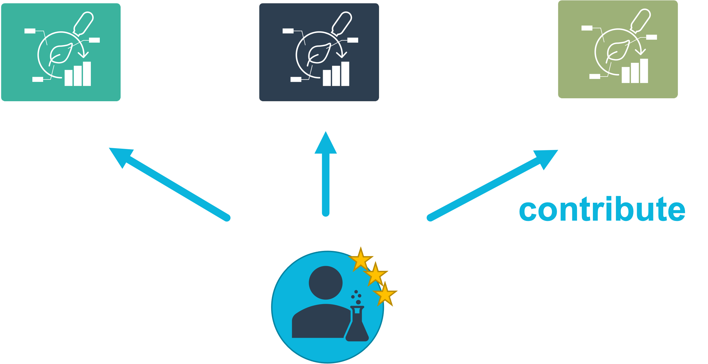</a>  |  <a href="./ARC_contribute_img2.png" target="_blank">https://nfdi4plants.org/nfdi4plants.knowledgebase/docs/img/ARC_contribute_img2.png</a>  | TA3-[DataPLANT](nfdi4plants.org)
<a href="./ARC_CoverableTechnologies.svg" target="_blank">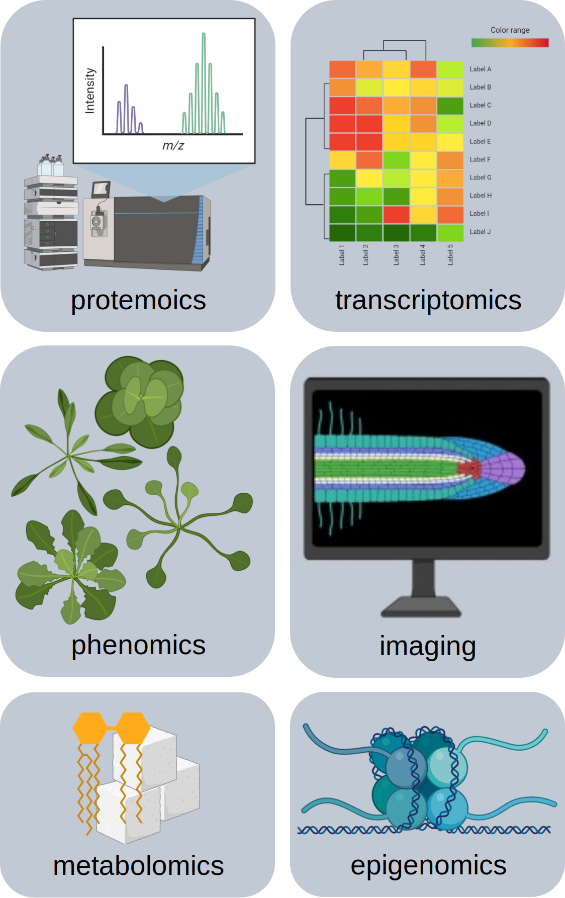</a>  |  <a href="./ARC_CoverableTechnologies.svg" target="_blank">https://nfdi4plants.org/nfdi4plants.knowledgebase/docs/img/ARC_CoverableTechnologies.svg</a>  | TA3-[DataPLANT](nfdi4plants.org)
  |  <a href="./ARC_DataCentricIntegration_img1.png" target="_blank">https://nfdi4plants.org/nfdi4plants.knowledgebase/docs/img/ARC_DataCentricIntegration_img1.png</a>  | TA3-[DataPLANT](nfdi4plants.org)
<a href="./ARC_DataCentricIntegration.svg" target="_blank">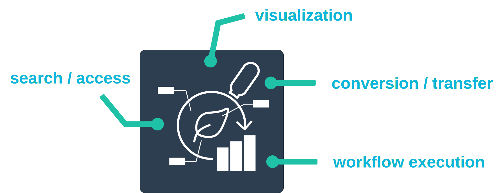</a>  |  <a href="./ARC_DataCentricIntegration.svg" target="_blank">https://nfdi4plants.org/nfdi4plants.knowledgebase/docs/img/ARC_DataCentricIntegration.svg</a>  | TA3-[DataPLANT](nfdi4plants.org)
<a href="./ARC_DataGeneration_MetadataAnnotation_DataHandling_img1.png" target="_blank">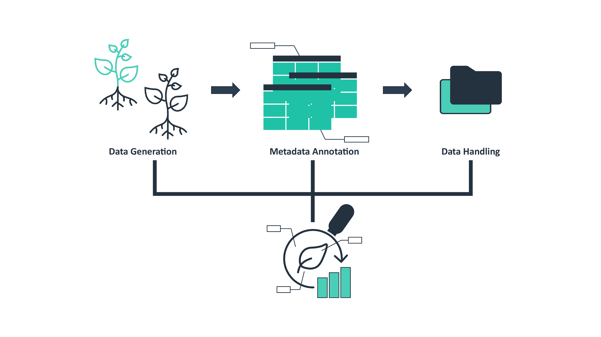</a>  |  <a href="./ARC_DataGeneration_MetadataAnnotation_DataHandling_img1.png" target="_blank">https://nfdi4plants.org/nfdi4plants.knowledgebase/docs/img/ARC_DataGeneration_MetadataAnnotation_DataHandling_img1.png</a>  | TA3-[DataPLANT](nfdi4plants.org)
<a href="./ARC_DataGeneration_MetadataAnnotation_DataHandling.svg" target="_blank">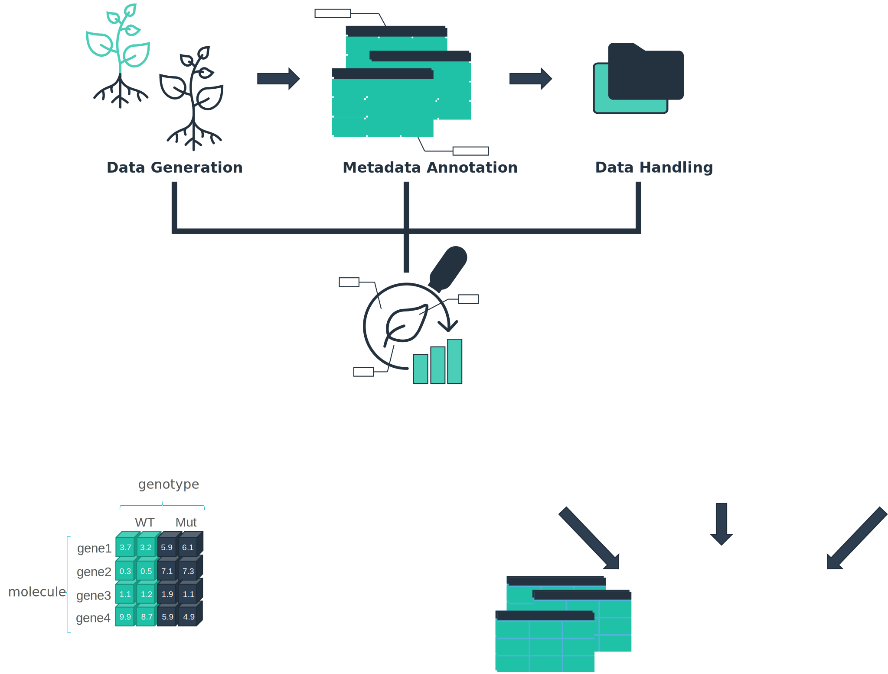</a>  |  <a href="./ARC_DataGeneration_MetadataAnnotation_DataHandling.svg" target="_blank">https://nfdi4plants.org/nfdi4plants.knowledgebase/docs/img/ARC_DataGeneration_MetadataAnnotation_DataHandling.svg</a>  | TA3-[DataPLANT](nfdi4plants.org)
<a href="./ARC_DataSharing_Collaborators_img1.png" target="_blank">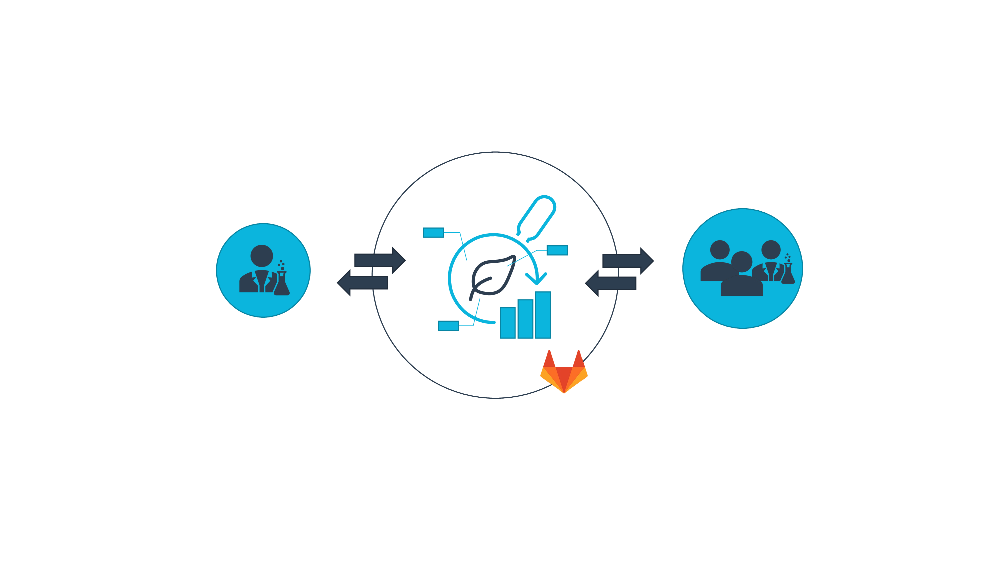</a>  |  <a href="./ARC_DataSharing_Collaborators_img1.png" target="_blank">https://nfdi4plants.org/nfdi4plants.knowledgebase/docs/img/ARC_DataSharing_Collaborators_img1.png</a>  | [CEPLAS](https://ceplas.eu), DB; TA3-[DataPLANT](nfdi4plants.org)
  |  <a href="./ARC_DataSharing_Collaborators_img2.png" target="_blank">https://nfdi4plants.org/nfdi4plants.knowledgebase/docs/img/ARC_DataSharing_Collaborators_img2.png</a>  | [CEPLAS](https://ceplas.eu), DB; TA3-[DataPLANT](nfdi4plants.org)
  |  <a href="./ARC_DataSharing_Experts01_img1.png" target="_blank">https://nfdi4plants.org/nfdi4plants.knowledgebase/docs/img/ARC_DataSharing_Experts01_img1.png</a>  | [CEPLAS](https://ceplas.eu), DB; TA3-[DataPLANT](nfdi4plants.org)
  |  <a href="./ARC_DataSharing_Experts02_img1.png" target="_blank">https://nfdi4plants.org/nfdi4plants.knowledgebase/docs/img/ARC_DataSharing_Experts02_img1.png</a>  | [CEPLAS](https://ceplas.eu), DB; TA3-[DataPLANT](nfdi4plants.org)
<a href="./ARC_EasyDistribution.svg" target="_blank">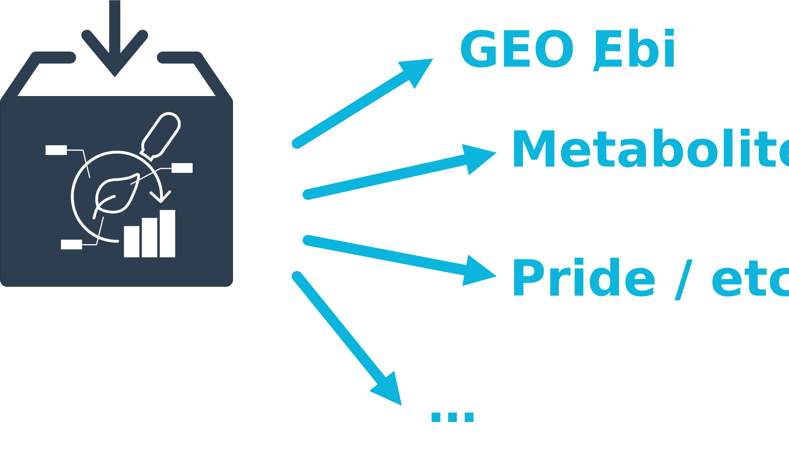</a>  |  <a href="./ARC_EasyDistribution.svg" target="_blank">https://nfdi4plants.org/nfdi4plants.knowledgebase/docs/img/ARC_EasyDistribution.svg</a>  | TA3-[DataPLANT](nfdi4plants.org)
<a href="./ARC_ExistingStandards.svg" target="_blank">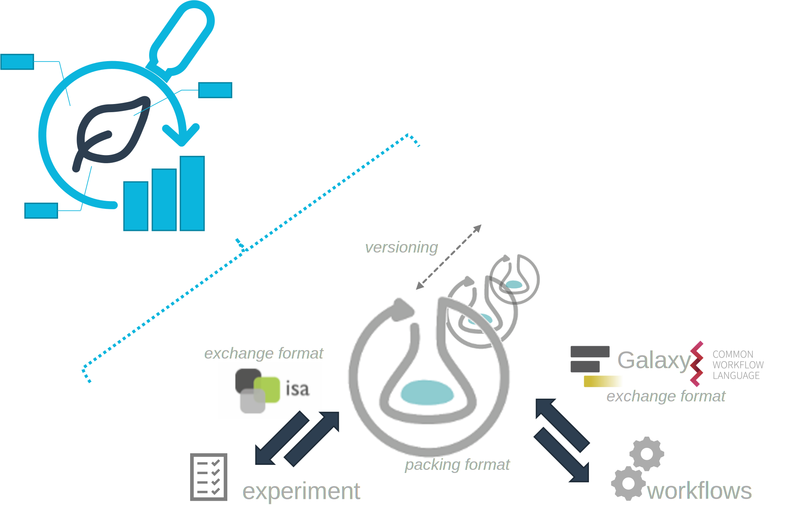</a>  |  <a href="./ARC_ExistingStandards.svg" target="_blank">https://nfdi4plants.org/nfdi4plants.knowledgebase/docs/img/ARC_ExistingStandards.svg</a>  | TA3-[DataPLANT](nfdi4plants.org)
<a href="./ARC_experts_img1.png" target="_blank">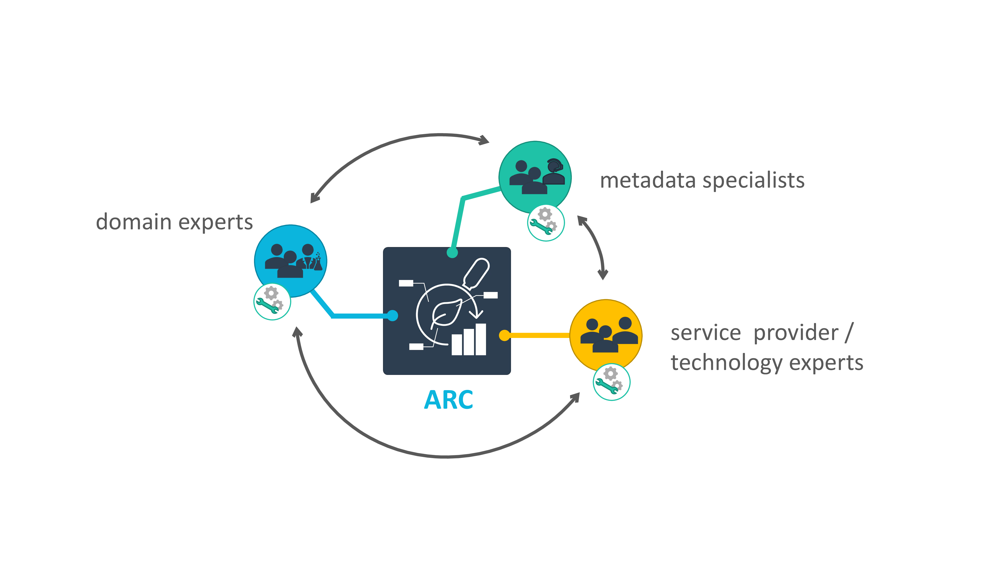</a>  |  <a href="./ARC_experts_img1.png" target="_blank">https://nfdi4plants.org/nfdi4plants.knowledgebase/docs/img/ARC_experts_img1.png</a>  | TA3-[DataPLANT](nfdi4plants.org)
  |  <a href="./ARC_fillWithData_experimental.png" target="_blank">https://nfdi4plants.org/nfdi4plants.knowledgebase/docs/img/ARC_fillWithData_experimental.png</a>  | TA3-[DataPLANT](nfdi4plants.org)
  |  <a href="./ARC_fillWithData_seq1.png" target="_blank">https://nfdi4plants.org/nfdi4plants.knowledgebase/docs/img/ARC_fillWithData_seq1.png</a>  | TA3-[DataPLANT](nfdi4plants.org)
  |  <a href="./ARC_fillWithData_seq2.png" target="_blank">https://nfdi4plants.org/nfdi4plants.knowledgebase/docs/img/ARC_fillWithData_seq2.png</a>  | TA3-[DataPLANT](nfdi4plants.org)
  |  <a href="./ARC_fillWithData_seq3.png" target="_blank">https://nfdi4plants.org/nfdi4plants.knowledgebase/docs/img/ARC_fillWithData_seq3.png</a>  | TA3-[DataPLANT](nfdi4plants.org)
  |  <a href="./ARC_fillWithData_seq4.png" target="_blank">https://nfdi4plants.org/nfdi4plants.knowledgebase/docs/img/ARC_fillWithData_seq4.png</a>  | TA3-[DataPLANT](nfdi4plants.org)
  |  <a href="./ARC_fillWithData_seq5.png" target="_blank">https://nfdi4plants.org/nfdi4plants.knowledgebase/docs/img/ARC_fillWithData_seq5.png</a>  | TA3-[DataPLANT](nfdi4plants.org)
  |  <a href="./ARC_fillWithData_seq6.png" target="_blank">https://nfdi4plants.org/nfdi4plants.knowledgebase/docs/img/ARC_fillWithData_seq6.png</a>  | TA3-[DataPLANT](nfdi4plants.org)
  |  <a href="./ARC_fillWithData_seq8.png" target="_blank">https://nfdi4plants.org/nfdi4plants.knowledgebase/docs/img/ARC_fillWithData_seq8.png</a>  | TA3-[DataPLANT](nfdi4plants.org)
<a href="./ARC_fillWithData.svg" target="_blank">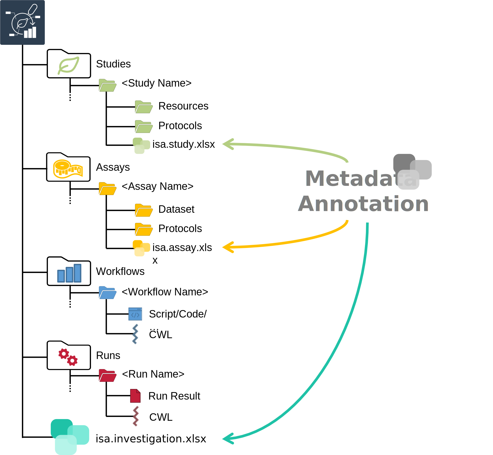</a>  |  <a href="./ARC_fillWithData.svg" target="_blank">https://nfdi4plants.org/nfdi4plants.knowledgebase/docs/img/ARC_fillWithData.svg</a>  | TA3-[DataPLANT](nfdi4plants.org)
<a href="./ARC_Findable_img1.png" target="_blank">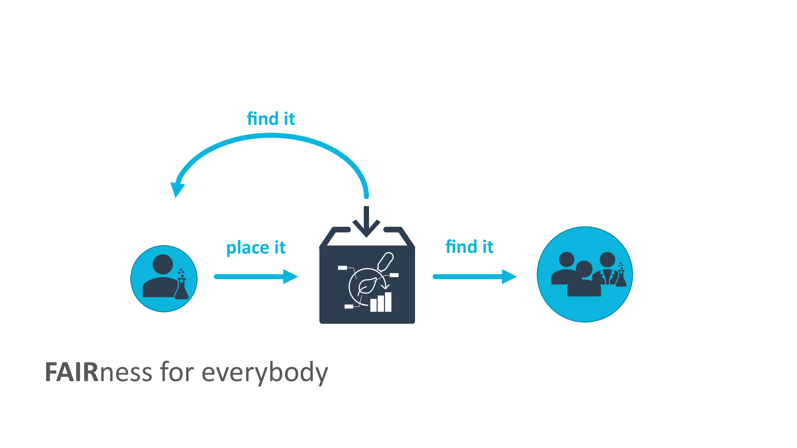</a>  |  <a href="./ARC_Findable_img1.png" target="_blank">https://nfdi4plants.org/nfdi4plants.knowledgebase/docs/img/ARC_Findable_img1.png</a>  | TA3-[DataPLANT](nfdi4plants.org)
  |  <a href="./ARC_FolderStructure.png" target="_blank">https://nfdi4plants.org/nfdi4plants.knowledgebase/docs/img/ARC_FolderStructure.png</a>  | TA3-[DataPLANT](nfdi4plants.org)
<a href="./ARC_IllustratedFolderStructure_Assay.svg" target="_blank">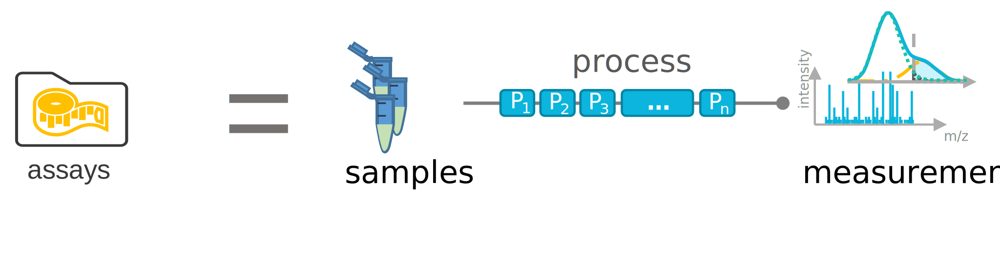</a>  |  <a href="./ARC_IllustratedFolderStructure_Assay.svg" target="_blank">https://nfdi4plants.org/nfdi4plants.knowledgebase/docs/img/ARC_IllustratedFolderStructure_Assay.svg</a>  | TA3-[DataPLANT](nfdi4plants.org)
<a href="./ARC_IllustratedFolderStructure_img1.png" target="_blank">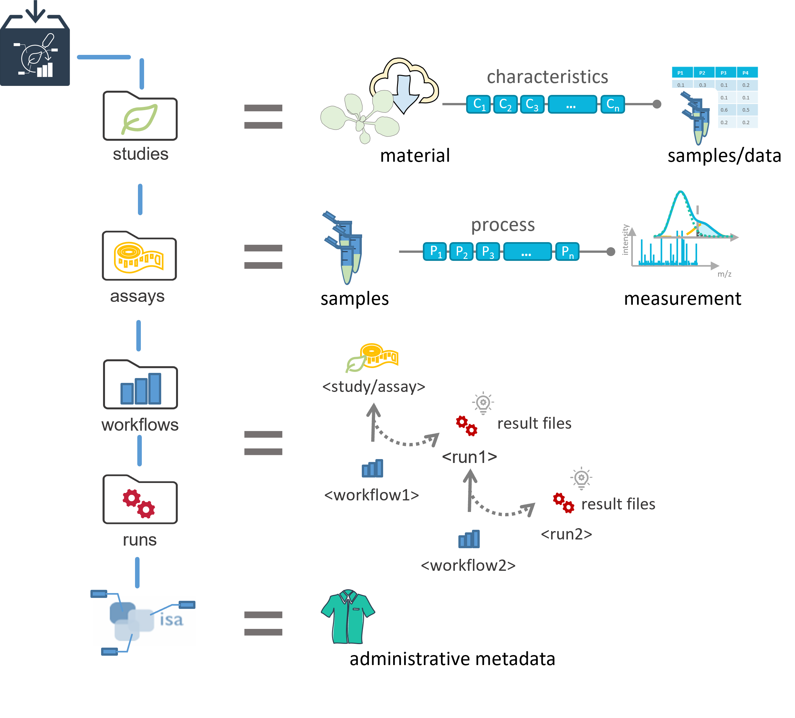</a>  |  <a href="./ARC_IllustratedFolderStructure_img1.png" target="_blank">https://nfdi4plants.org/nfdi4plants.knowledgebase/docs/img/ARC_IllustratedFolderStructure_img1.png</a>  | TA3-[DataPLANT](nfdi4plants.org)
<a href="./ARC_IllustratedFolderStructure_Investigation.svg" target="_blank">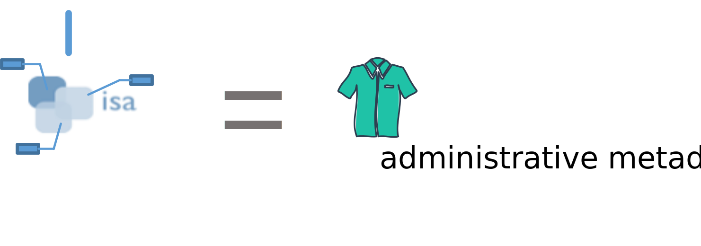</a>  |  <a href="./ARC_IllustratedFolderStructure_Investigation.svg" target="_blank">https://nfdi4plants.org/nfdi4plants.knowledgebase/docs/img/ARC_IllustratedFolderStructure_Investigation.svg</a>  | TA3-[DataPLANT](nfdi4plants.org)
<a href="./ARC_IllustratedFolderStructure_Study.svg" target="_blank">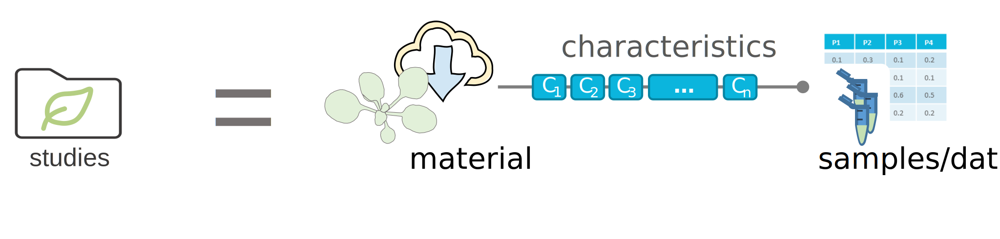</a>  |  <a href="./ARC_IllustratedFolderStructure_Study.svg" target="_blank">https://nfdi4plants.org/nfdi4plants.knowledgebase/docs/img/ARC_IllustratedFolderStructure_Study.svg</a>  | TA3-[DataPLANT](nfdi4plants.org)
<a href="./ARC_IllustratedFolderStructure_WorflowRun.svg" target="_blank">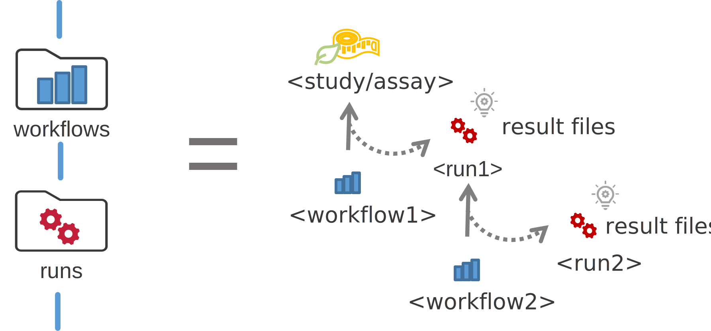</a>  |  <a href="./ARC_IllustratedFolderStructure_WorflowRun.svg" target="_blank">https://nfdi4plants.org/nfdi4plants.knowledgebase/docs/img/ARC_IllustratedFolderStructure_WorflowRun.svg</a>  | TA3-[DataPLANT](nfdi4plants.org)
  |  <a href="./ARC_IllustratedFolderStructure.jpg" target="_blank">https://nfdi4plants.org/nfdi4plants.knowledgebase/docs/img/ARC_IllustratedFolderStructure.jpg</a>  | TA3-[DataPLANT](nfdi4plants.org)
<a href="./ARC_IllustratedFolderStructure.svg" target="_blank">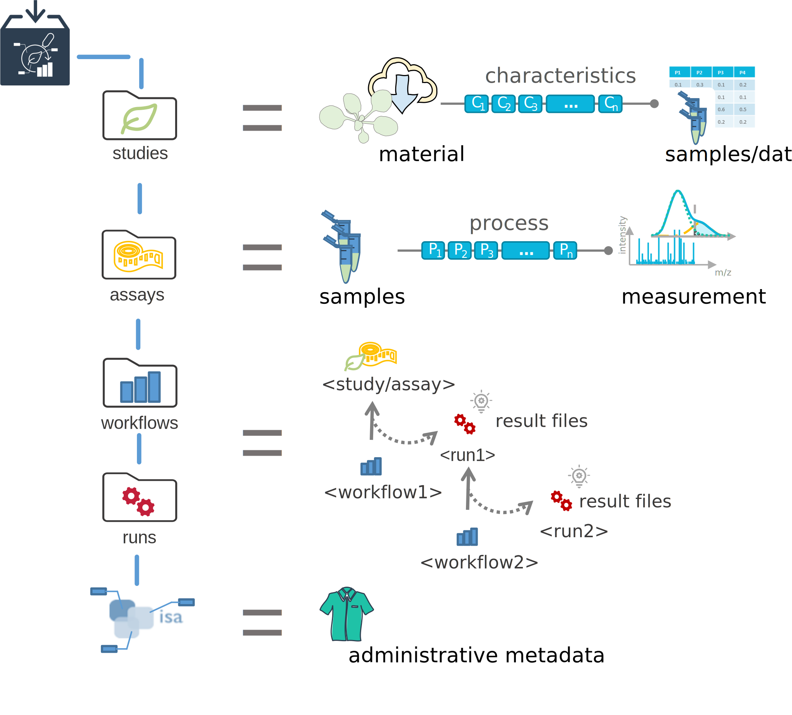</a>  |  <a href="./ARC_IllustratedFolderStructure.svg" target="_blank">https://nfdi4plants.org/nfdi4plants.knowledgebase/docs/img/ARC_IllustratedFolderStructure.svg</a>  | TA3-[DataPLANT](nfdi4plants.org)
<a href="./ARC_IllustratedStructure_002.svg" target="_blank">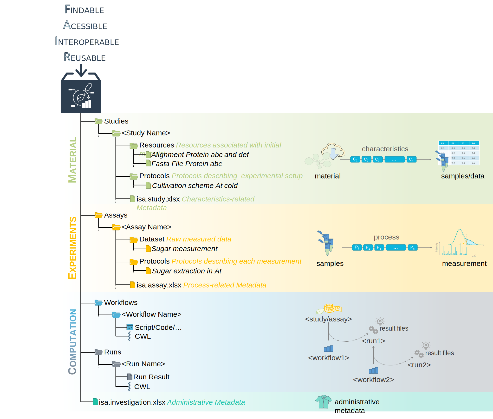</a>  |  <a href="./ARC_IllustratedStructure_002.svg" target="_blank">https://nfdi4plants.org/nfdi4plants.knowledgebase/docs/img/ARC_IllustratedStructure_002.svg</a>  | TA3-[DataPLANT](nfdi4plants.org)
  |  <a href="./ARC_investigation.jpg" target="_blank">https://nfdi4plants.org/nfdi4plants.knowledgebase/docs/img/ARC_investigation.jpg</a>  |  [CEPLAS](https://ceplas.eu), DB
  |  <a href="./ARC_IsaAssay.jpg" target="_blank">https://nfdi4plants.org/nfdi4plants.knowledgebase/docs/img/ARC_IsaAssay.jpg</a>  |  [CEPLAS](https://ceplas.eu), DB
  |  <a href="./ARC_IsaAssayMetadata.jpg" target="_blank">https://nfdi4plants.org/nfdi4plants.knowledgebase/docs/img/ARC_IsaAssayMetadata.jpg</a>  |  [CEPLAS](https://ceplas.eu), DB
  |  <a href="./ARC_LaboratoryWorkflow_img1.png" target="_blank">https://nfdi4plants.org/nfdi4plants.knowledgebase/docs/img/ARC_LaboratoryWorkflow_img1.png</a>  | TA3-[DataPLANT](nfdi4plants.org)
<a href="./ARC_Magnifier.svg" target="_blank">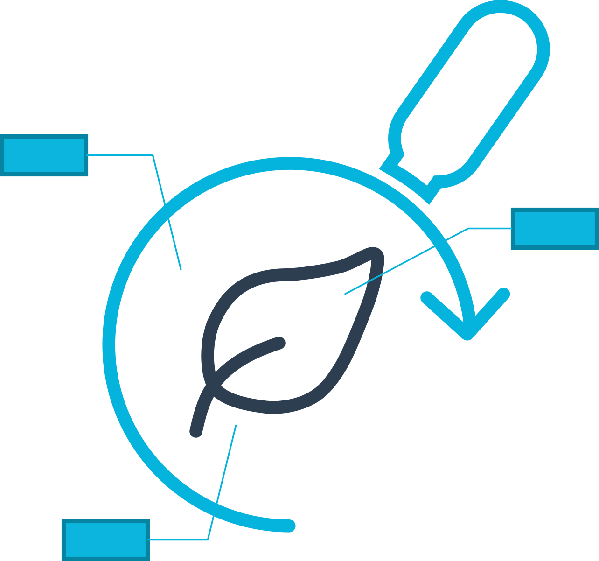</a>  |  <a href="./ARC_Magnifier.svg" target="_blank">https://nfdi4plants.org/nfdi4plants.knowledgebase/docs/img/ARC_Magnifier.svg</a>  | TA3-[DataPLANT](nfdi4plants.org)
  |  <a href="./ARC_MetSubdirectories.jpg" target="_blank">https://nfdi4plants.org/nfdi4plants.knowledgebase/docs/img/ARC_MetSubdirectories.jpg</a>  |  [CEPLAS](https://ceplas.eu), DB
<a href="./ARC_MultipleContribution.svg" target="_blank">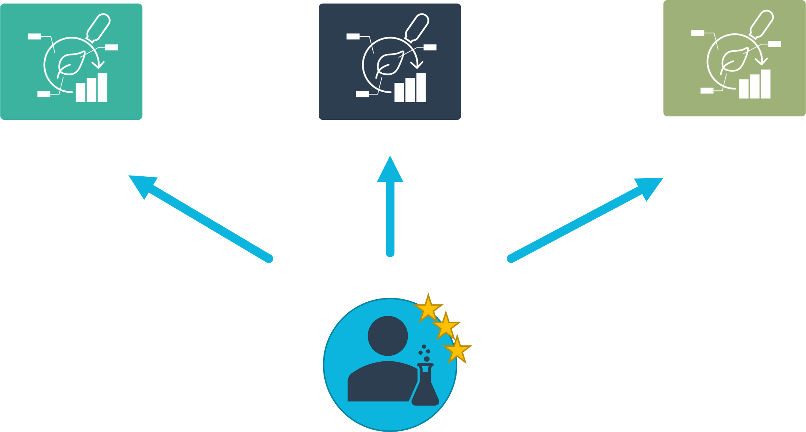</a>  |  <a href="./ARC_MultipleContribution.svg" target="_blank">https://nfdi4plants.org/nfdi4plants.knowledgebase/docs/img/ARC_MultipleContribution.svg</a>  | TA3-[DataPLANT](nfdi4plants.org)
<a href="./ARC_Processing.svg" target="_blank">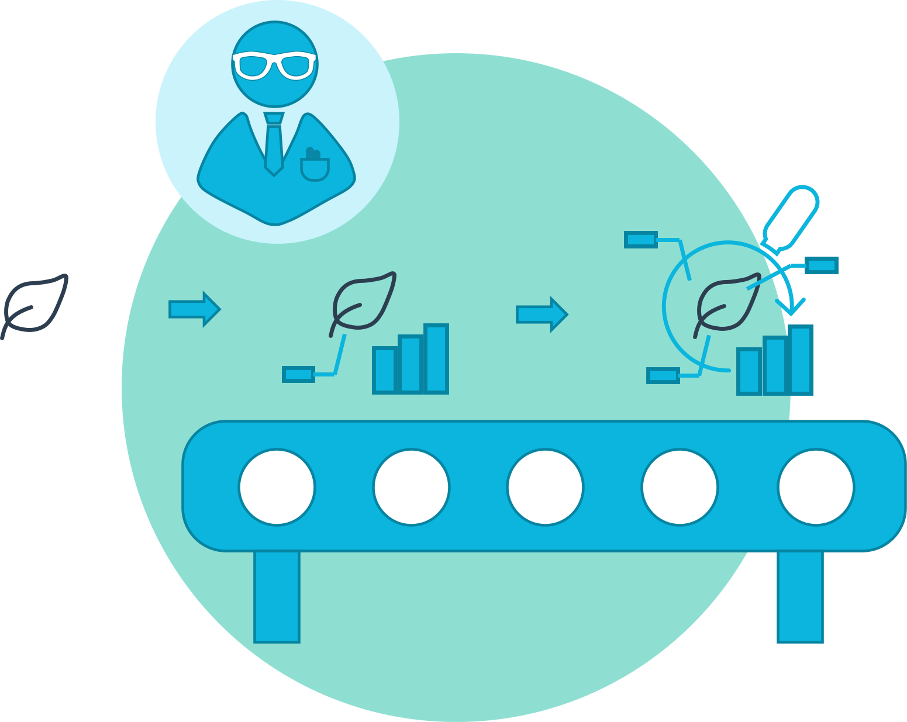</a>  |  <a href="./ARC_Processing.svg" target="_blank">https://nfdi4plants.org/nfdi4plants.knowledgebase/docs/img/ARC_Processing.svg</a>  | TA3-[DataPLANT](nfdi4plants.org)
<a href="./ARC_Provenance_img1.png" target="_blank">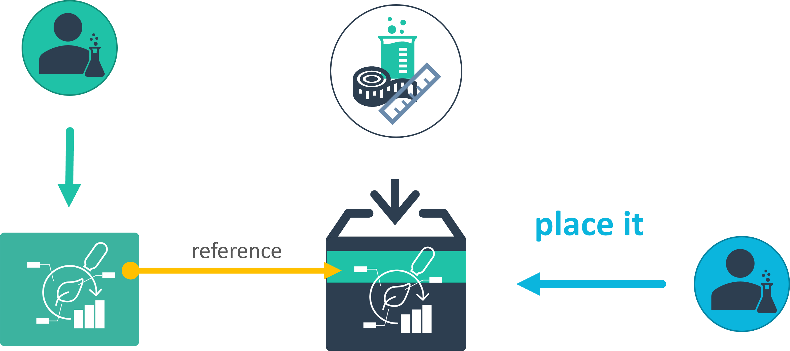</a>  |  <a href="./ARC_Provenance_img1.png" target="_blank">https://nfdi4plants.org/nfdi4plants.knowledgebase/docs/img/ARC_Provenance_img1.png</a>  | TA3-[DataPLANT](nfdi4plants.org)
<a href="./ARC_Provenance.svg" target="_blank">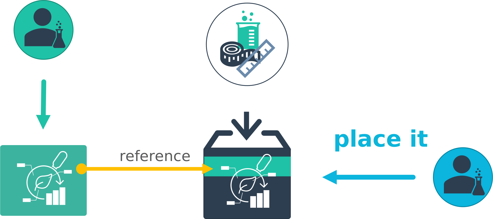</a>  |  <a href="./ARC_Provenance.svg" target="_blank">https://nfdi4plants.org/nfdi4plants.knowledgebase/docs/img/ARC_Provenance.svg</a>  | TA3-[DataPLANT](nfdi4plants.org)
<a href="./ARC_PublishDOI_img1.png" target="_blank">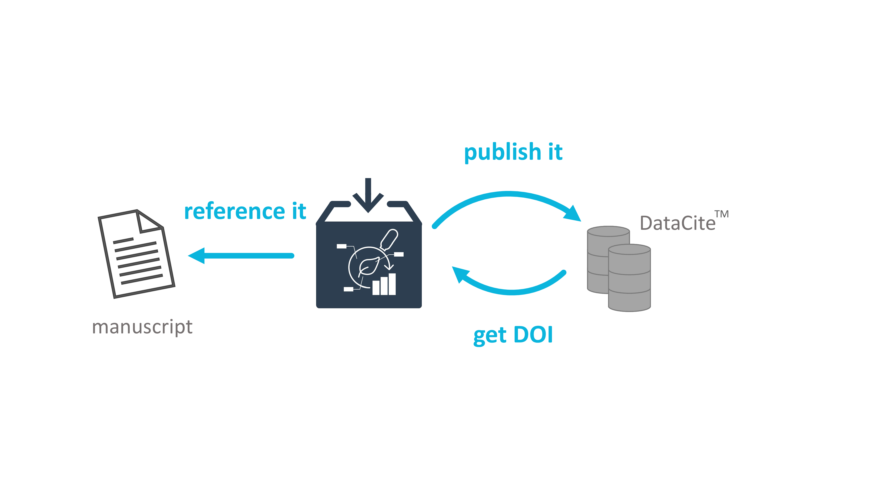</a>  |  <a href="./ARC_PublishDOI_img1.png" target="_blank">https://nfdi4plants.org/nfdi4plants.knowledgebase/docs/img/ARC_PublishDOI_img1.png</a>  | TA3-[DataPLANT](nfdi4plants.org)
<a href="./ARC_PublishDOI_img2.png" target="_blank">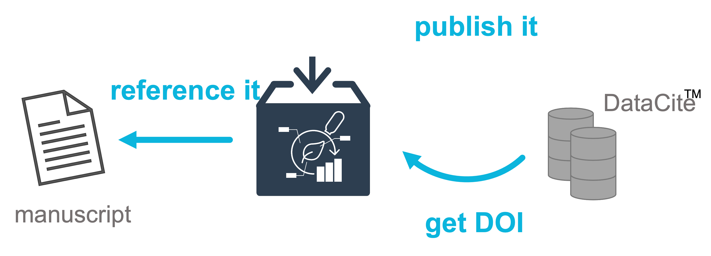</a>  |  <a href="./ARC_PublishDOI_img2.png" target="_blank">https://nfdi4plants.org/nfdi4plants.knowledgebase/docs/img/ARC_PublishDOI_img2.png</a>  | TA3-[DataPLANT](nfdi4plants.org)
<a href="./ARC_realLife_img1.png" target="_blank">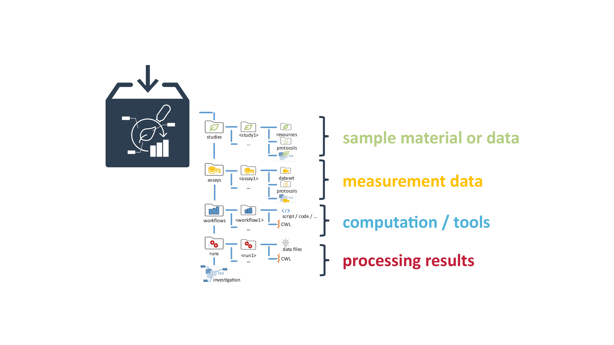</a>  |  <a href="./ARC_realLife_img1.png" target="_blank">https://nfdi4plants.org/nfdi4plants.knowledgebase/docs/img/ARC_realLife_img1.png</a>  | TA3-[DataPLANT](nfdi4plants.org)
  |  <a href="./ARC_realLifeLoading.svg" target="_blank">https://nfdi4plants.org/nfdi4plants.knowledgebase/docs/img/ARC_realLifeLoading.svg</a>  | TA3-[DataPLANT](nfdi4plants.org)
<a href="./ARC_repositories.png" target="_blank">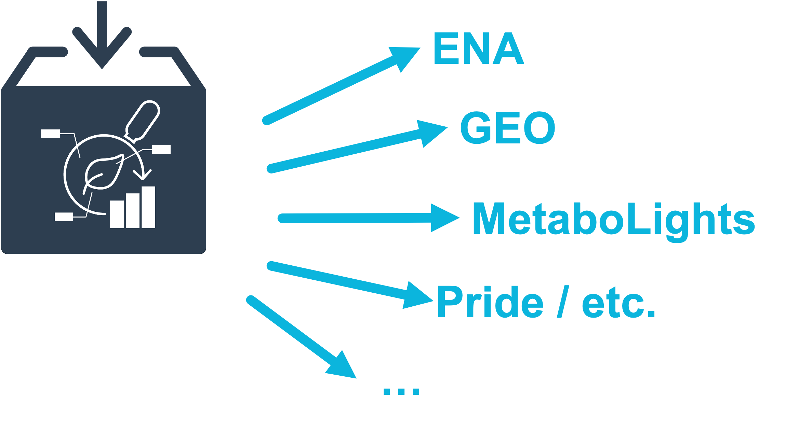</a>  |  <a href="./ARC_repositories.png" target="_blank">https://nfdi4plants.org/nfdi4plants.knowledgebase/docs/img/ARC_repositories.png</a>  | TA3-[DataPLANT](nfdi4plants.org)
<a href="./ARC_Repository02_img1.png" target="_blank">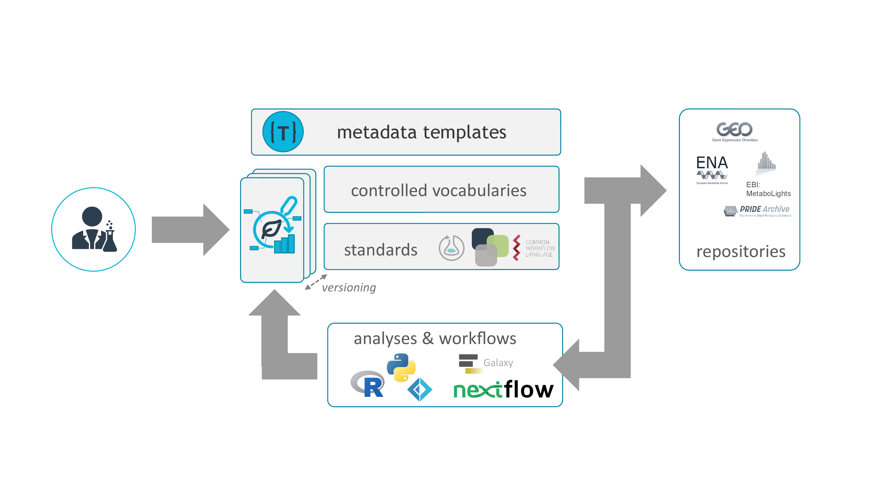</a>  |  <a href="./ARC_Repository02_img1.png" target="_blank">https://nfdi4plants.org/nfdi4plants.knowledgebase/docs/img/ARC_Repository02_img1.png</a>  | TA3-[DataPLANT](nfdi4plants.org)
  |  <a href="./ARC_Repository03_img1.png" target="_blank">https://nfdi4plants.org/nfdi4plants.knowledgebase/docs/img/ARC_Repository03_img1.png</a>  | TA3-[DataPLANT](nfdi4plants.org)
<a href="./ARC_ResearchBag_img1.png" target="_blank">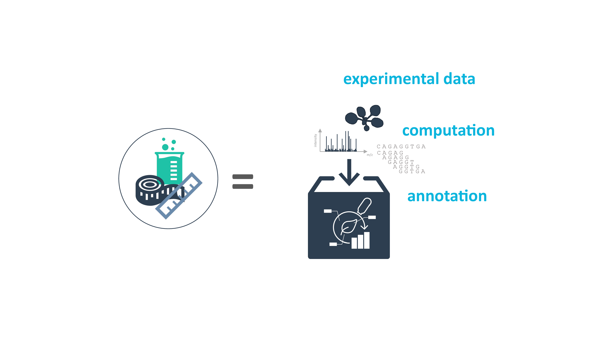</a>  |  <a href="./ARC_ResearchBag_img1.png" target="_blank">https://nfdi4plants.org/nfdi4plants.knowledgebase/docs/img/ARC_ResearchBag_img1.png</a>  | TA3-[DataPLANT](nfdi4plants.org)
<a href="./ARC_ResearchCycle_img1.png" target="_blank">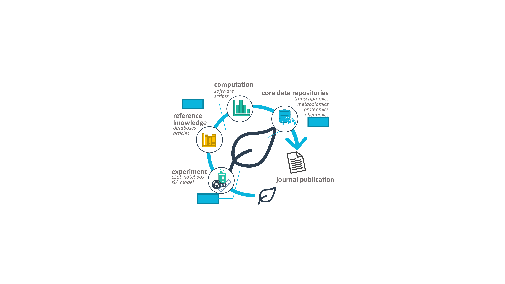</a>  |  <a href="./ARC_ResearchCycle_img1.png" target="_blank">https://nfdi4plants.org/nfdi4plants.knowledgebase/docs/img/ARC_ResearchCycle_img1.png</a>  | TA3-[DataPLANT](nfdi4plants.org)
<a href="./ARC_ResearchCycle.svg" target="_blank">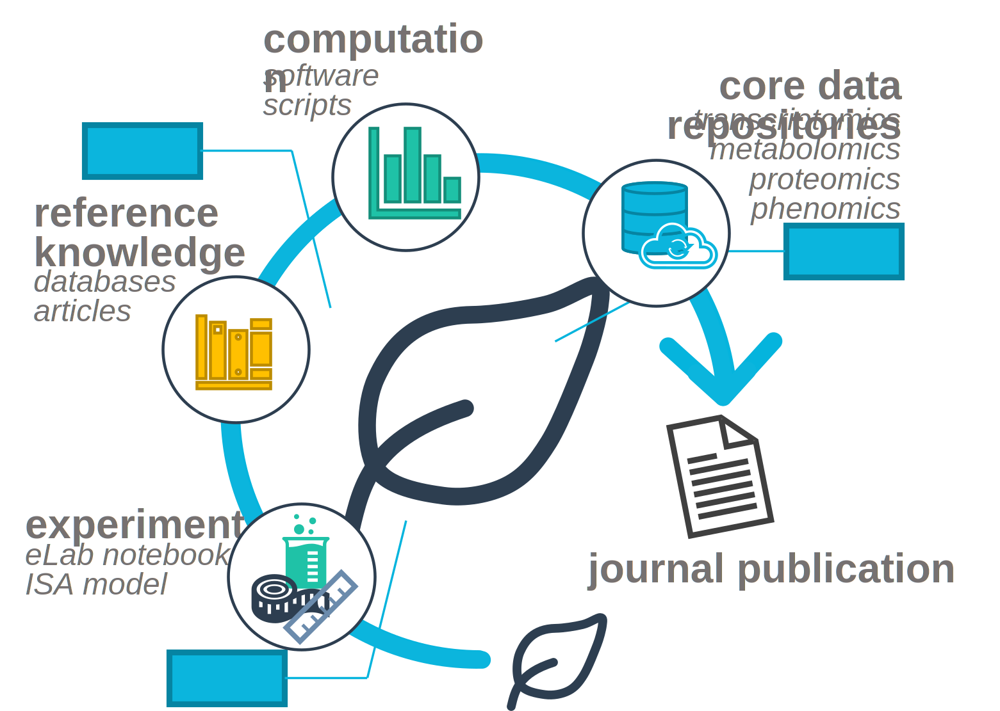</a>  |  <a href="./ARC_ResearchCycle.svg" target="_blank">https://nfdi4plants.org/nfdi4plants.knowledgebase/docs/img/ARC_ResearchCycle.svg</a>  | TA3-[DataPLANT](nfdi4plants.org)
<a href="./ARC_reuse_img1.png" target="_blank">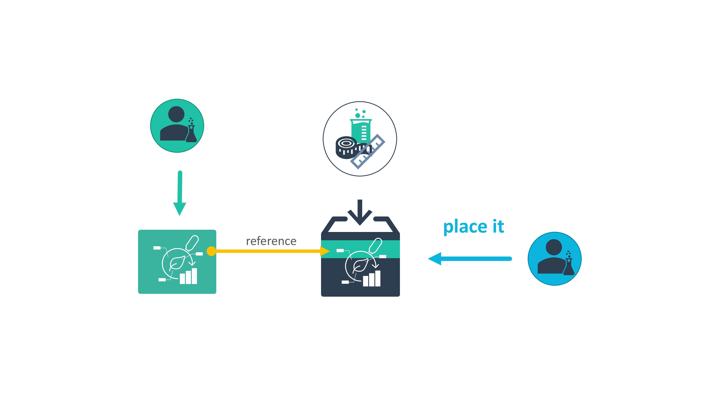</a>  |  <a href="./ARC_reuse_img1.png" target="_blank">https://nfdi4plants.org/nfdi4plants.knowledgebase/docs/img/ARC_reuse_img1.png</a>  | TA3-[DataPLANT](nfdi4plants.org)
<a href="./ARC_reuse_img2.png" target="_blank">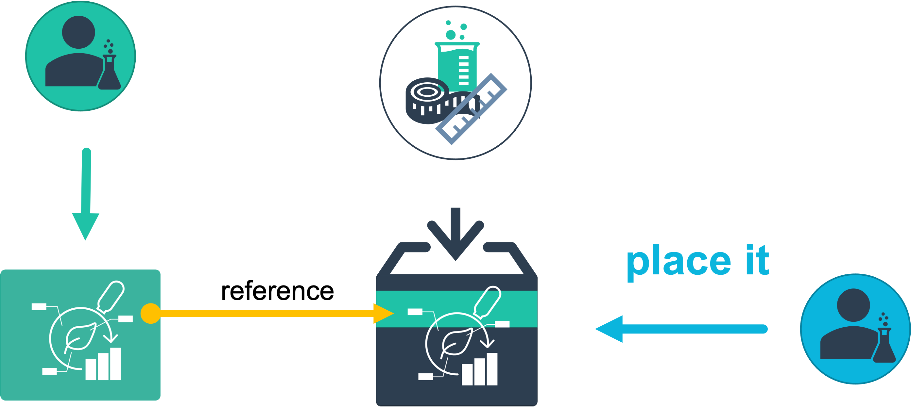</a>  |  <a href="./ARC_reuse_img2.png" target="_blank">https://nfdi4plants.org/nfdi4plants.knowledgebase/docs/img/ARC_reuse_img2.png</a>  | TA3-[DataPLANT](nfdi4plants.org)
  |  <a href="./ARC_SeamlessPublication.svg" target="_blank">https://nfdi4plants.org/nfdi4plants.knowledgebase/docs/img/ARC_SeamlessPublication.svg</a>  | TA3-[DataPLANT](nfdi4plants.org)
<a href="./ARC_Search_img1.png" target="_blank">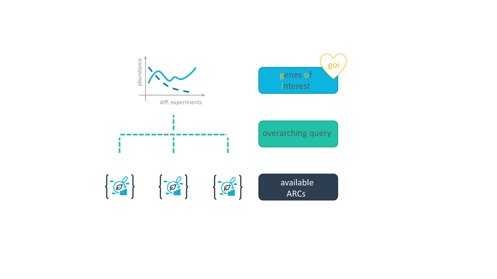</a>  |  <a href="./ARC_Search_img1.png" target="_blank">https://nfdi4plants.org/nfdi4plants.knowledgebase/docs/img/ARC_Search_img1.png</a>  | TA3-[DataPLANT](nfdi4plants.org)
<a href="./ARC_Search.svg" target="_blank">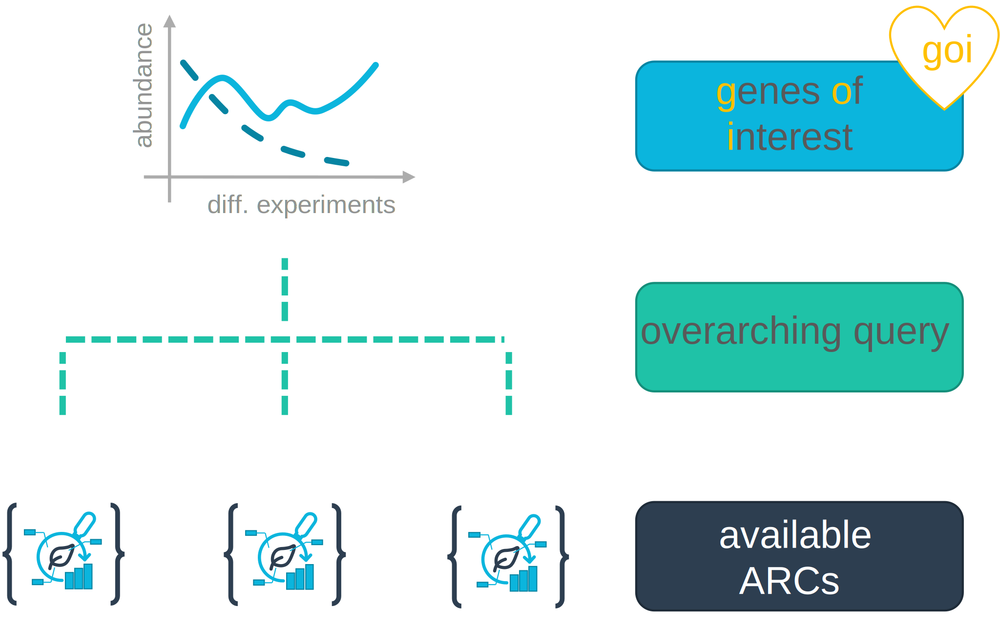</a>  |  <a href="./ARC_Search.svg" target="_blank">https://nfdi4plants.org/nfdi4plants.knowledgebase/docs/img/ARC_Search.svg</a>  | TA3-[DataPLANT](nfdi4plants.org)
  |  <a href="./ARC_Sharing_img1.png" target="_blank">https://nfdi4plants.org/nfdi4plants.knowledgebase/docs/img/ARC_Sharing_img1.png</a>  | TA3-[DataPLANT](nfdi4plants.org)
  |  <a href="./ARC_Sharing_img2.png" target="_blank">https://nfdi4plants.org/nfdi4plants.knowledgebase/docs/img/ARC_Sharing_img2.png</a>  | TA3-[DataPLANT](nfdi4plants.org)
<a href="./ARC_Sharing.svg" target="_blank">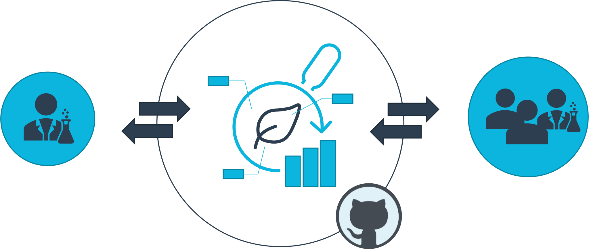</a>  |  <a href="./ARC_Sharing.svg" target="_blank">https://nfdi4plants.org/nfdi4plants.knowledgebase/docs/img/ARC_Sharing.svg</a>  | TA3-[DataPLANT](nfdi4plants.org)
<a href="./ARC_SingleEntryPoint_img1.png" target="_blank">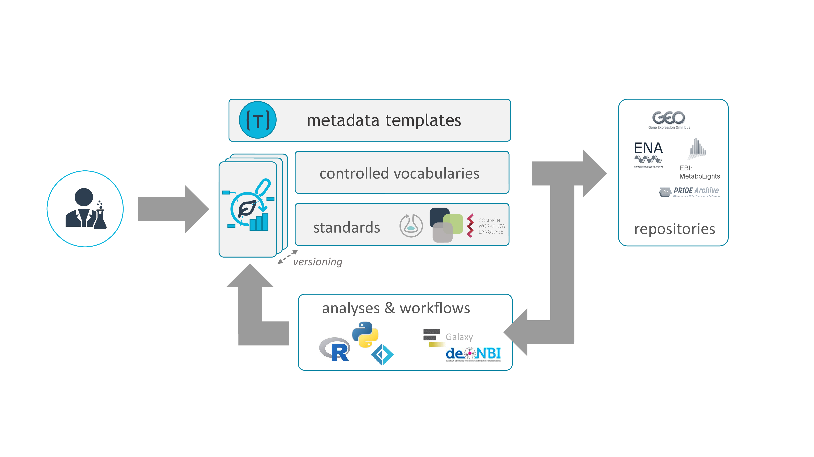</a>  |  <a href="./ARC_SingleEntryPoint_img1.png" target="_blank">https://nfdi4plants.org/nfdi4plants.knowledgebase/docs/img/ARC_SingleEntryPoint_img1.png</a>  | TA3-[DataPLANT](nfdi4plants.org)
<a href="./ARC_SingleEntryPoint.svg" target="_blank">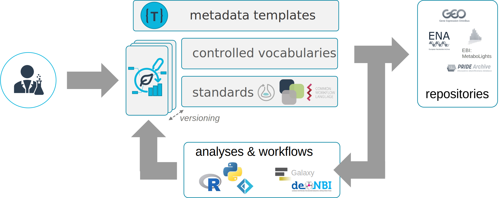</a>  |  <a href="./ARC_SingleEntryPoint.svg" target="_blank">https://nfdi4plants.org/nfdi4plants.knowledgebase/docs/img/ARC_SingleEntryPoint.svg</a>  | TA3-[DataPLANT](nfdi4plants.org)
  |  <a href="./ARC_StoryViolasARC_img1.png" target="_blank">https://nfdi4plants.org/nfdi4plants.knowledgebase/docs/img/ARC_StoryViolasARC_img1.png</a>  |  [CEPLAS](https://ceplas.eu), DB
  |  <a href="./arc_studies_assays.jpg" target="_blank">https://nfdi4plants.org/nfdi4plants.knowledgebase/docs/img/arc_studies_assays.jpg</a>  | TA3-[DataPLANT](nfdi4plants.org)
  |  <a href="./ARC_studiesSubdirectories.jpg" target="_blank">https://nfdi4plants.org/nfdi4plants.knowledgebase/docs/img/ARC_studiesSubdirectories.jpg</a>  |  [CEPLAS](https://ceplas.eu), DB
  |  <a href="./ARC_study.jpg" target="_blank">https://nfdi4plants.org/nfdi4plants.knowledgebase/docs/img/ARC_study.jpg</a>  |  [CEPLAS](https://ceplas.eu), DB
  |  <a href="./ARC_studyMetadata.jpg" target="_blank">https://nfdi4plants.org/nfdi4plants.knowledgebase/docs/img/ARC_studyMetadata.jpg</a>  |  [CEPLAS](https://ceplas.eu), DB
<a href="./ARC_UniversallyAccessible.svg" target="_blank">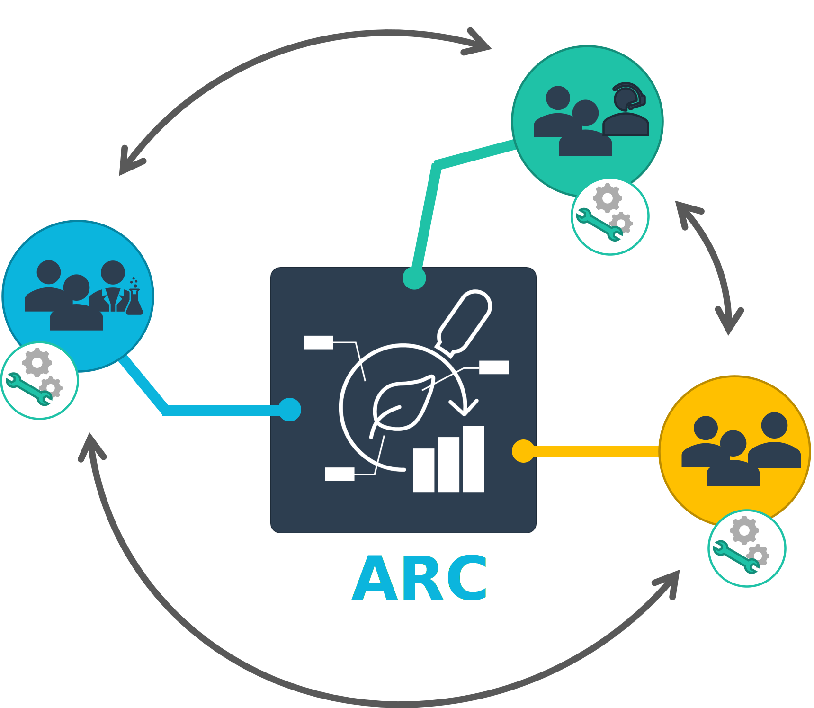</a>  |  <a href="./ARC_UniversallyAccessible.svg" target="_blank">https://nfdi4plants.org/nfdi4plants.knowledgebase/docs/img/ARC_UniversallyAccessible.svg</a>  | TA3-[DataPLANT](nfdi4plants.org)
<a href="./ARC_Versioning.svg" target="_blank">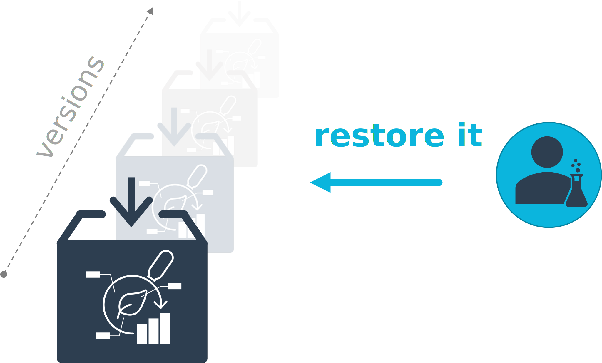</a>  |  <a href="./ARC_Versioning.svg" target="_blank">https://nfdi4plants.org/nfdi4plants.knowledgebase/docs/img/ARC_Versioning.svg</a>  | TA3-[DataPLANT](nfdi4plants.org)
  |  <a href="./arc-manual-setup.png" target="_blank">https://nfdi4plants.org/nfdi4plants.knowledgebase/docs/img/arc-manual-setup.png</a>  
  |  <a href="./ARC.jpg" target="_blank">https://nfdi4plants.org/nfdi4plants.knowledgebase/docs/img/ARC.jpg</a>  | TA3-[DataPLANT](nfdi4plants.org)
  |  <a href="./arcCommander_AccessToken.png" target="_blank">https://nfdi4plants.org/nfdi4plants.knowledgebase/docs/img/arcCommander_AccessToken.png</a>  | TA3-[DataPLANT](nfdi4plants.org)
  |  <a href="./arcCommander_help.png" target="_blank">https://nfdi4plants.org/nfdi4plants.knowledgebase/docs/img/arcCommander_help.png</a>  | TA3-[DataPLANT](nfdi4plants.org)
<a href="./arcCommander_init_img1.png" target="_blank">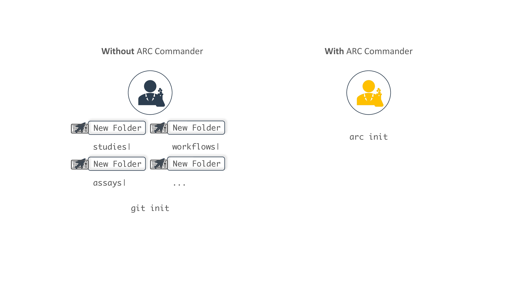</a>  |  <a href="./arcCommander_init_img1.png" target="_blank">https://nfdi4plants.org/nfdi4plants.knowledgebase/docs/img/arcCommander_init_img1.png</a>  |  [CEPLAS](https://ceplas.eu), DB
  |  <a href="./arcCommander_init.png" target="_blank">https://nfdi4plants.org/nfdi4plants.knowledgebase/docs/img/arcCommander_init.png</a>  |  [CEPLAS](https://ceplas.eu), DB
<a href="./arcCommander_sync_img1.png" target="_blank">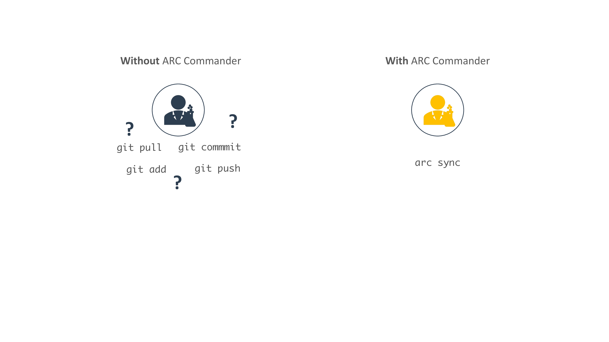</a>  |  <a href="./arcCommander_sync_img1.png" target="_blank">https://nfdi4plants.org/nfdi4plants.knowledgebase/docs/img/arcCommander_sync_img1.png</a>  |  [CEPLAS](https://ceplas.eu), DB
  |  <a href="./arcCommander_syncForce.png" target="_blank">https://nfdi4plants.org/nfdi4plants.knowledgebase/docs/img/arcCommander_syncForce.png</a>  |  [CEPLAS](https://ceplas.eu), DB
<a href="./arcCommander_update_img1.png" target="_blank">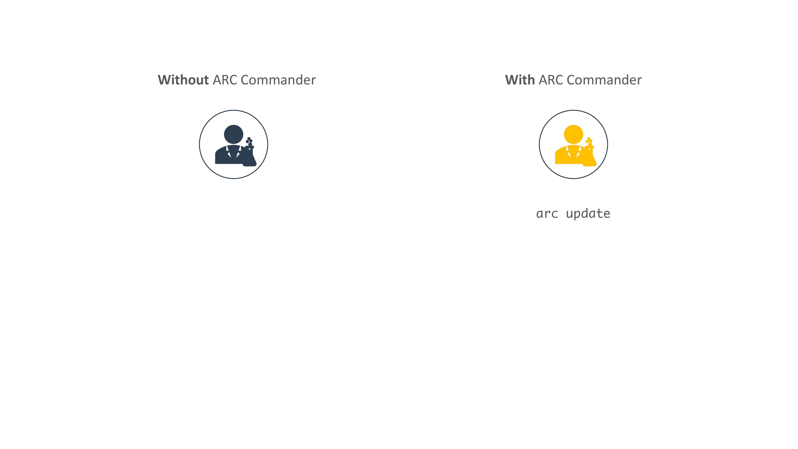</a>  |  <a href="./arcCommander_update_img1.png" target="_blank">https://nfdi4plants.org/nfdi4plants.knowledgebase/docs/img/arcCommander_update_img1.png</a>  
  |  <a href="./arcitect-ARCPanel-assay01.png" target="_blank">https://nfdi4plants.org/nfdi4plants.knowledgebase/docs/img/arcitect-ARCPanel-assay01.png</a>  
  |  <a href="./arcitect-ARCPanel-assay02.png" target="_blank">https://nfdi4plants.org/nfdi4plants.knowledgebase/docs/img/arcitect-ARCPanel-assay02.png</a>  
  |  <a href="./arcitect-ARCPanel-assay03.png" target="_blank">https://nfdi4plants.org/nfdi4plants.knowledgebase/docs/img/arcitect-ARCPanel-assay03.png</a>  
  |  <a href="./arcitect-ARCPanel-protocol.png" target="_blank">https://nfdi4plants.org/nfdi4plants.knowledgebase/docs/img/arcitect-ARCPanel-protocol.png</a>  
  |  <a href="./arcitect-ARCPanel-study01.png" target="_blank">https://nfdi4plants.org/nfdi4plants.knowledgebase/docs/img/arcitect-ARCPanel-study01.png</a>  
  |  <a href="./arcitect-ARCPanel-study02.png" target="_blank">https://nfdi4plants.org/nfdi4plants.knowledgebase/docs/img/arcitect-ARCPanel-study02.png</a>  
  |  <a href="./arcitect-ARCPanel.png" target="_blank">https://nfdi4plants.org/nfdi4plants.knowledgebase/docs/img/arcitect-ARCPanel.png</a>  
  |  <a href="./arcitect-AssayPanel.png" target="_blank">https://nfdi4plants.org/nfdi4plants.knowledgebase/docs/img/arcitect-AssayPanel.png</a>  
  |  <a href="./ARCitect-help-ARCPanel.drawio.svg" target="_blank">https://nfdi4plants.org/nfdi4plants.knowledgebase/docs/img/ARCitect-help-ARCPanel.drawio.svg</a>  
  |  <a href="./ARCitect-help-Sidebar.drawio.svg" target="_blank">https://nfdi4plants.org/nfdi4plants.knowledgebase/docs/img/ARCitect-help-Sidebar.drawio.svg</a>  
  |  <a href="./arcitect-macos-incomingConnections.png" target="_blank">https://nfdi4plants.org/nfdi4plants.knowledgebase/docs/img/arcitect-macos-incomingConnections.png</a>  
  |  <a href="./arcitect-macos-terminal.png" target="_blank">https://nfdi4plants.org/nfdi4plants.knowledgebase/docs/img/arcitect-macos-terminal.png</a>  
  |  <a href="./arcitect-StudyPanel.png" target="_blank">https://nfdi4plants.org/nfdi4plants.knowledgebase/docs/img/arcitect-StudyPanel.png</a>  
  |  <a href="./arcitect-VersionsPanel.png" target="_blank">https://nfdi4plants.org/nfdi4plants.knowledgebase/docs/img/arcitect-VersionsPanel.png</a>  
  |  <a href="./arcitect-win-Defender.png" target="_blank">https://nfdi4plants.org/nfdi4plants.knowledgebase/docs/img/arcitect-win-Defender.png</a>  
  |  <a href="./arcitect-win-Firewall.png" target="_blank">https://nfdi4plants.org/nfdi4plants.knowledgebase/docs/img/arcitect-win-Firewall.png</a>  
<a href="./ARCLogo-colored.drawio.png" target="_blank">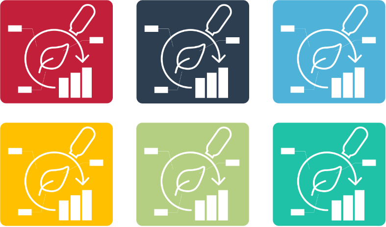</a>  |  <a href="./ARCLogo-colored.drawio.png" target="_blank">https://nfdi4plants.org/nfdi4plants.knowledgebase/docs/img/ARCLogo-colored.drawio.png</a>  
  |  <a href="./contribution_git.png" target="_blank">https://nfdi4plants.org/nfdi4plants.knowledgebase/docs/img/contribution_git.png</a>  
  |  <a href="./data-publication/archigator-metadata-review.png" target="_blank">https://nfdi4plants.org/nfdi4plants.knowledgebase/docs/img/data-publication/archigator-metadata-review.png</a>  | TA3-[DataPLANT](nfdi4plants.org)
  |  <a href="./data-publication/archigator-submit.png" target="_blank">https://nfdi4plants.org/nfdi4plants.knowledgebase/docs/img/data-publication/archigator-submit.png</a>  | TA3-[DataPLANT](nfdi4plants.org)
  |  <a href="./data-publication/cqc-pipeline-path-1.png" target="_blank">https://nfdi4plants.org/nfdi4plants.knowledgebase/docs/img/data-publication/cqc-pipeline-path-1.png</a>  | TA3-[DataPLANT](nfdi4plants.org)
  |  <a href="./data-publication/cqc-pipeline-path-2.png" target="_blank">https://nfdi4plants.org/nfdi4plants.knowledgebase/docs/img/data-publication/cqc-pipeline-path-2.png</a>  | TA3-[DataPLANT](nfdi4plants.org)
  |  <a href="./data-publication/cqc-pipeline-steps.png" target="_blank">https://nfdi4plants.org/nfdi4plants.knowledgebase/docs/img/data-publication/cqc-pipeline-steps.png</a>  | TA3-[DataPLANT](nfdi4plants.org)
  |  <a href="./data-publication/cqc-results.png" target="_blank">https://nfdi4plants.org/nfdi4plants.knowledgebase/docs/img/data-publication/cqc-results.png</a>  | TA3-[DataPLANT](nfdi4plants.org)
  |  <a href="./data-publication/doi-accession.png" target="_blank">https://nfdi4plants.org/nfdi4plants.knowledgebase/docs/img/data-publication/doi-accession.png</a>  | TA3-[DataPLANT](nfdi4plants.org)
  |  <a href="./data-publication/doi-badge-display.png" target="_blank">https://nfdi4plants.org/nfdi4plants.knowledgebase/docs/img/data-publication/doi-badge-display.png</a>  | TA3-[DataPLANT](nfdi4plants.org)
  |  <a href="./data-publication/doi-badge.png" target="_blank">https://nfdi4plants.org/nfdi4plants.knowledgebase/docs/img/data-publication/doi-badge.png</a>  | TA3-[DataPLANT](nfdi4plants.org)
  |  <a href="./data-publication/publication-status.png" target="_blank">https://nfdi4plants.org/nfdi4plants.knowledgebase/docs/img/data-publication/publication-status.png</a>  | TA3-[DataPLANT](nfdi4plants.org)
  |  <a href="./DatacentricIntegration_DataPLANT-Tools.svg" target="_blank">https://nfdi4plants.org/nfdi4plants.knowledgebase/docs/img/DatacentricIntegration_DataPLANT-Tools.svg</a>  | TA3-[DataPLANT](nfdi4plants.org)
  |  <a href="./DatacentricIntegration.svg" target="_blank">https://nfdi4plants.org/nfdi4plants.knowledgebase/docs/img/DatacentricIntegration.svg</a>  | TA3-[DataPLANT](nfdi4plants.org)
<a href="./datahub_clone.png" target="_blank">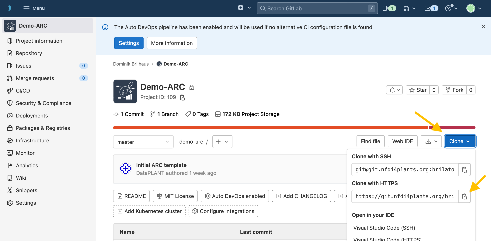</a>  |  <a href="./datahub_clone.png" target="_blank">https://nfdi4plants.org/nfdi4plants.knowledgebase/docs/img/datahub_clone.png</a>  |  [CEPLAS](https://ceplas.eu), DB
  |  <a href="./datahub_collaboration.png" target="_blank">https://nfdi4plants.org/nfdi4plants.knowledgebase/docs/img/datahub_collaboration.png</a>  | TA3-[DataPLANT](nfdi4plants.org)
  |  <a href="./DataHUB_LandingPage.png" target="_blank">https://nfdi4plants.org/nfdi4plants.knowledgebase/docs/img/DataHUB_LandingPage.png</a>  | TA3-[DataPLANT](nfdi4plants.org)
  |  <a href="./datahub_members_seq2.png" target="_blank">https://nfdi4plants.org/nfdi4plants.knowledgebase/docs/img/datahub_members_seq2.png</a>  | TA3-[DataPLANT](nfdi4plants.org)
  |  <a href="./datahub_members_seq3.png" target="_blank">https://nfdi4plants.org/nfdi4plants.knowledgebase/docs/img/datahub_members_seq3.png</a>  | TA3-[DataPLANT](nfdi4plants.org)
  |  <a href="./datahub_members_seq4.png" target="_blank">https://nfdi4plants.org/nfdi4plants.knowledgebase/docs/img/datahub_members_seq4.png</a>  | TA3-[DataPLANT](nfdi4plants.org)
  |  <a href="./datahub_members_seq5.png" target="_blank">https://nfdi4plants.org/nfdi4plants.knowledgebase/docs/img/datahub_members_seq5.png</a>  | TA3-[DataPLANT](nfdi4plants.org)
  |  <a href="./datahub_members_seq6.png" target="_blank">https://nfdi4plants.org/nfdi4plants.knowledgebase/docs/img/datahub_members_seq6.png</a>  | TA3-[DataPLANT](nfdi4plants.org)
  |  <a href="./datahub_members.png" target="_blank">https://nfdi4plants.org/nfdi4plants.knowledgebase/docs/img/datahub_members.png</a>  | TA3-[DataPLANT](nfdi4plants.org)
  |  <a href="./datahub_repository.png" target="_blank">https://nfdi4plants.org/nfdi4plants.knowledgebase/docs/img/datahub_repository.png</a>  | TA3-[DataPLANT](nfdi4plants.org)
  |  <a href="./datahub_roles.png" target="_blank">https://nfdi4plants.org/nfdi4plants.knowledgebase/docs/img/datahub_roles.png</a>  | TA3-[DataPLANT](nfdi4plants.org)
  |  <a href="./datahub-accessToken01.drawio.svg" target="_blank">https://nfdi4plants.org/nfdi4plants.knowledgebase/docs/img/datahub-accessToken01.drawio.svg</a>  
<a href="./datahub-accessToken01.png" target="_blank">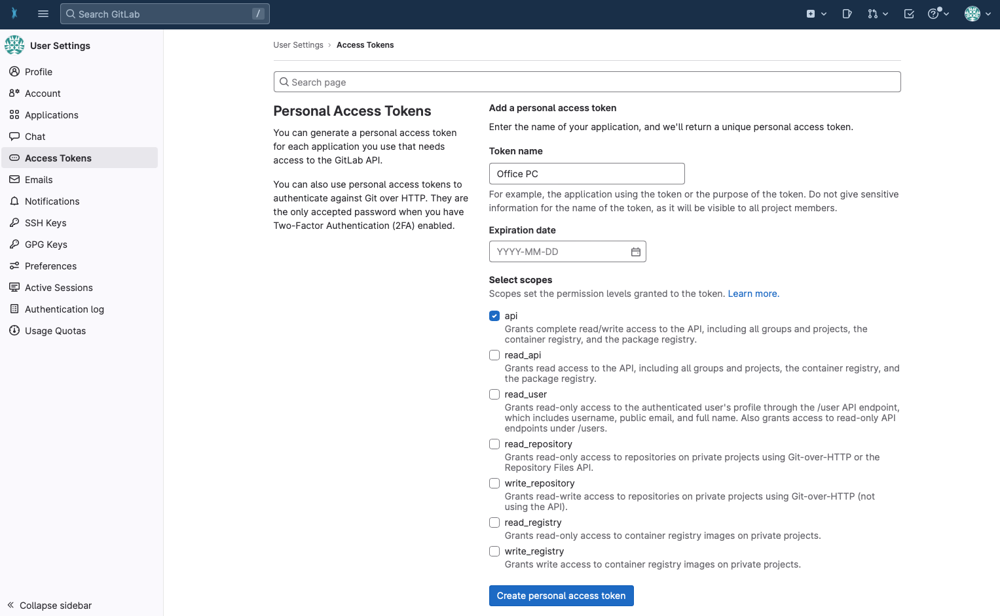</a>  |  <a href="./datahub-accessToken01.png" target="_blank">https://nfdi4plants.org/nfdi4plants.knowledgebase/docs/img/datahub-accessToken01.png</a>  
  |  <a href="./datahub-accessToken02.drawio.svg" target="_blank">https://nfdi4plants.org/nfdi4plants.knowledgebase/docs/img/datahub-accessToken02.drawio.svg</a>  
  |  <a href="./datahub-accessToken02.png" target="_blank">https://nfdi4plants.org/nfdi4plants.knowledgebase/docs/img/datahub-accessToken02.png</a>  
  |  <a href="./datahub-addFiles.drawio.png" target="_blank">https://nfdi4plants.org/nfdi4plants.knowledgebase/docs/img/datahub-addFiles.drawio.png</a>  
<a href="./datahub-addFiles.png" target="_blank">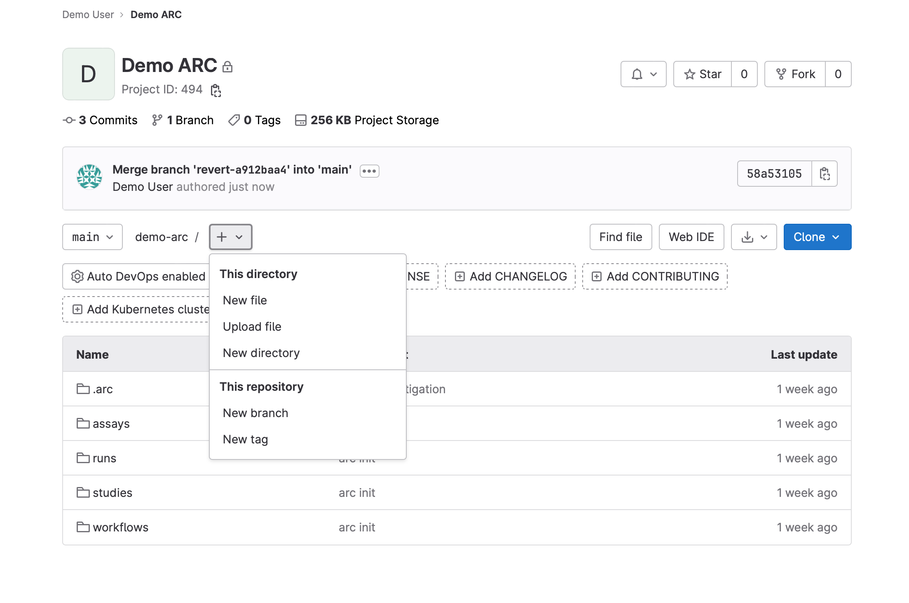</a>  |  <a href="./datahub-addFiles.png" target="_blank">https://nfdi4plants.org/nfdi4plants.knowledgebase/docs/img/datahub-addFiles.png</a>  
  |  <a href="./datahub-ARC-overview.drawio.svg" target="_blank">https://nfdi4plants.org/nfdi4plants.knowledgebase/docs/img/datahub-ARC-overview.drawio.svg</a>  
<a href="./datahub-ARC-overview.png" target="_blank">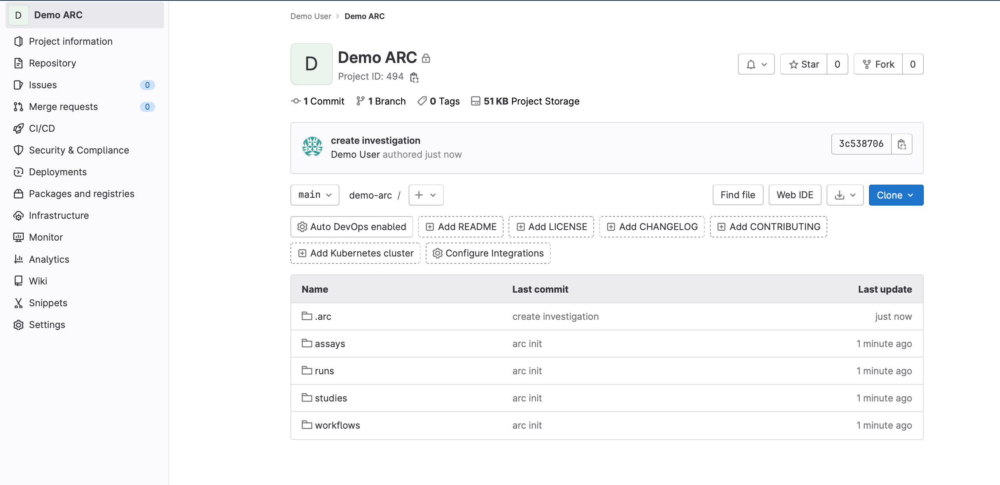</a>  |  <a href="./datahub-ARC-overview.png" target="_blank">https://nfdi4plants.org/nfdi4plants.knowledgebase/docs/img/datahub-ARC-overview.png</a>  
  |  <a href="./datahub-ARC-settings.drawio.svg" target="_blank">https://nfdi4plants.org/nfdi4plants.knowledgebase/docs/img/datahub-ARC-settings.drawio.svg</a>  
<a href="./datahub-ARC-settings.png" target="_blank">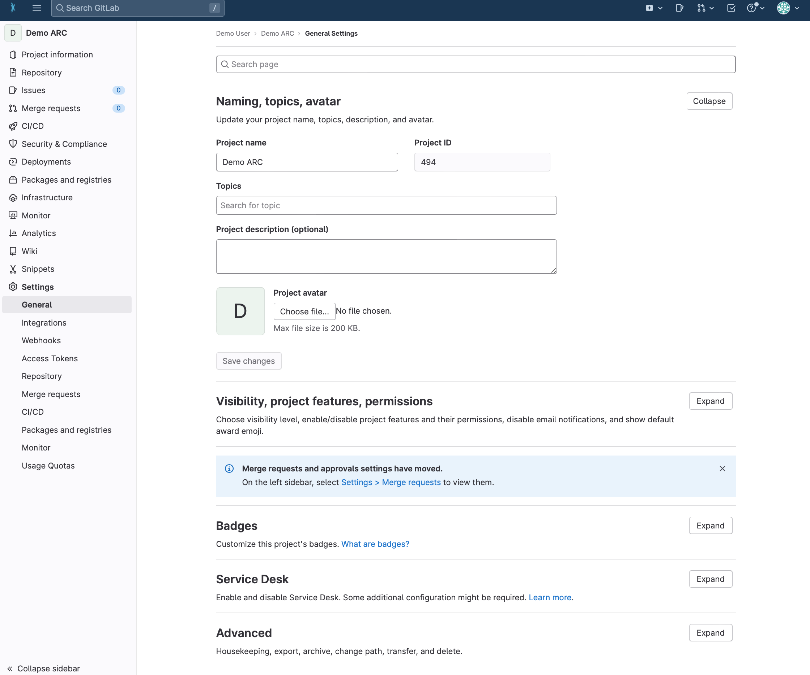</a>  |  <a href="./datahub-ARC-settings.png" target="_blank">https://nfdi4plants.org/nfdi4plants.knowledgebase/docs/img/datahub-ARC-settings.png</a>  
  |  <a href="./datahub-avatarMenu.drawio.svg" target="_blank">https://nfdi4plants.org/nfdi4plants.knowledgebase/docs/img/datahub-avatarMenu.drawio.svg</a>  
  |  <a href="./datahub-avatarMenu.png" target="_blank">https://nfdi4plants.org/nfdi4plants.knowledgebase/docs/img/datahub-avatarMenu.png</a>  
  |  <a href="./datahub-commits-revert01.png" target="_blank">https://nfdi4plants.org/nfdi4plants.knowledgebase/docs/img/datahub-commits-revert01.png</a>  
  |  <a href="./datahub-commits-revert02.png" target="_blank">https://nfdi4plants.org/nfdi4plants.knowledgebase/docs/img/datahub-commits-revert02.png</a>  
  |  <a href="./datahub-commits.png" target="_blank">https://nfdi4plants.org/nfdi4plants.knowledgebase/docs/img/datahub-commits.png</a>  
  |  <a href="./datahub-deleteFile01.drawio.png" target="_blank">https://nfdi4plants.org/nfdi4plants.knowledgebase/docs/img/datahub-deleteFile01.drawio.png</a>  
<a href="./datahub-deleteFile01.png" target="_blank">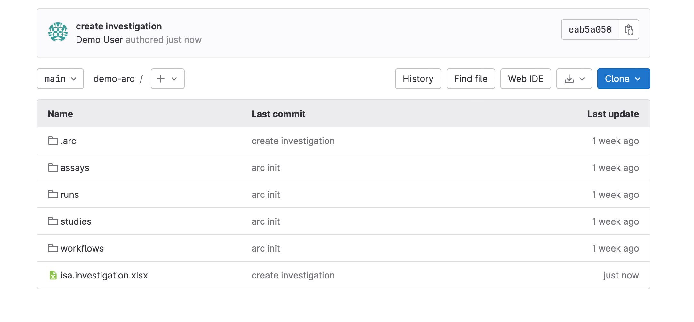</a>  |  <a href="./datahub-deleteFile01.png" target="_blank">https://nfdi4plants.org/nfdi4plants.knowledgebase/docs/img/datahub-deleteFile01.png</a>  
  |  <a href="./datahub-deleteFile02.drawio.png" target="_blank">https://nfdi4plants.org/nfdi4plants.knowledgebase/docs/img/datahub-deleteFile02.drawio.png</a>  
  |  <a href="./datahub-deleteFile02.png" target="_blank">https://nfdi4plants.org/nfdi4plants.knowledgebase/docs/img/datahub-deleteFile02.png</a>  
  |  <a href="./datahub-download.drawio.png" target="_blank">https://nfdi4plants.org/nfdi4plants.knowledgebase/docs/img/datahub-download.drawio.png</a>  
<a href="./datahub-download.png" target="_blank">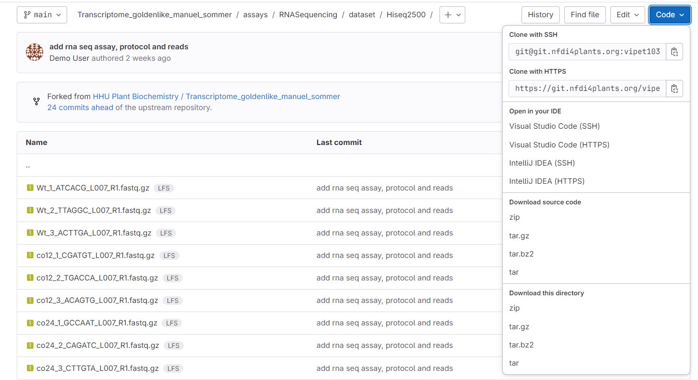</a>  |  <a href="./datahub-download.png" target="_blank">https://nfdi4plants.org/nfdi4plants.knowledgebase/docs/img/datahub-download.png</a>  
  |  <a href="./datahub-fork01.drawio.svg" target="_blank">https://nfdi4plants.org/nfdi4plants.knowledgebase/docs/img/datahub-fork01.drawio.svg</a>  
  |  <a href="./datahub-fork02.drawio.svg" target="_blank">https://nfdi4plants.org/nfdi4plants.knowledgebase/docs/img/datahub-fork02.drawio.svg</a>  
  |  <a href="./datahub-fork03.drawio.svg" target="_blank">https://nfdi4plants.org/nfdi4plants.knowledgebase/docs/img/datahub-fork03.drawio.svg</a>  
  |  <a href="./datahub-groupPanel-createGroup.drawio.svg" target="_blank">https://nfdi4plants.org/nfdi4plants.knowledgebase/docs/img/datahub-groupPanel-createGroup.drawio.svg</a>  
  |  <a href="./datahub-groupPanel-createGroup.png" target="_blank">https://nfdi4plants.org/nfdi4plants.knowledgebase/docs/img/datahub-groupPanel-createGroup.png</a>  
  |  <a href="./datahub-groupPanel.drawio.svg" target="_blank">https://nfdi4plants.org/nfdi4plants.knowledgebase/docs/img/datahub-groupPanel.drawio.svg</a>  
  |  <a href="./datahub-groupPanel.png" target="_blank">https://nfdi4plants.org/nfdi4plants.knowledgebase/docs/img/datahub-groupPanel.png</a>  
  |  <a href="./datahub-hamburgerMenu.drawio.svg" target="_blank">https://nfdi4plants.org/nfdi4plants.knowledgebase/docs/img/datahub-hamburgerMenu.drawio.svg</a>  
<a href="./datahub-hamburgerMenu.png" target="_blank">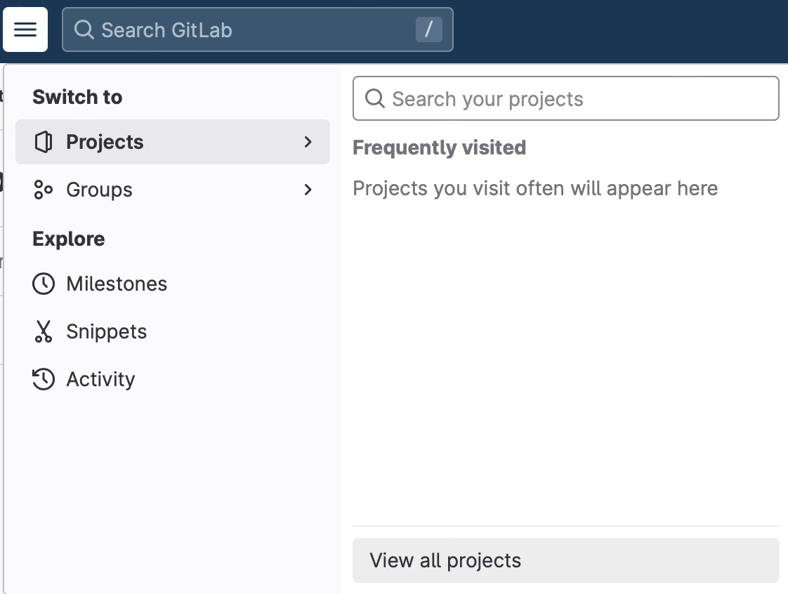</a>  |  <a href="./datahub-hamburgerMenu.png" target="_blank">https://nfdi4plants.org/nfdi4plants.knowledgebase/docs/img/datahub-hamburgerMenu.png</a>  
  |  <a href="./datahub-navbar.drawio.svg" target="_blank">https://nfdi4plants.org/nfdi4plants.knowledgebase/docs/img/datahub-navbar.drawio.svg</a>  
  |  <a href="./datahub-navbar.png" target="_blank">https://nfdi4plants.org/nfdi4plants.knowledgebase/docs/img/datahub-navbar.png</a>  
  |  <a href="./datahub-preferences.drawio.svg" target="_blank">https://nfdi4plants.org/nfdi4plants.knowledgebase/docs/img/datahub-preferences.drawio.svg</a>  
  |  <a href="./datahub-preferences.png" target="_blank">https://nfdi4plants.org/nfdi4plants.knowledgebase/docs/img/datahub-preferences.png</a>  
  |  <a href="./datahub-projectsPanel.drawio.svg" target="_blank">https://nfdi4plants.org/nfdi4plants.knowledgebase/docs/img/datahub-projectsPanel.drawio.svg</a>  
<a href="./datahub-projectsPanel.png" target="_blank">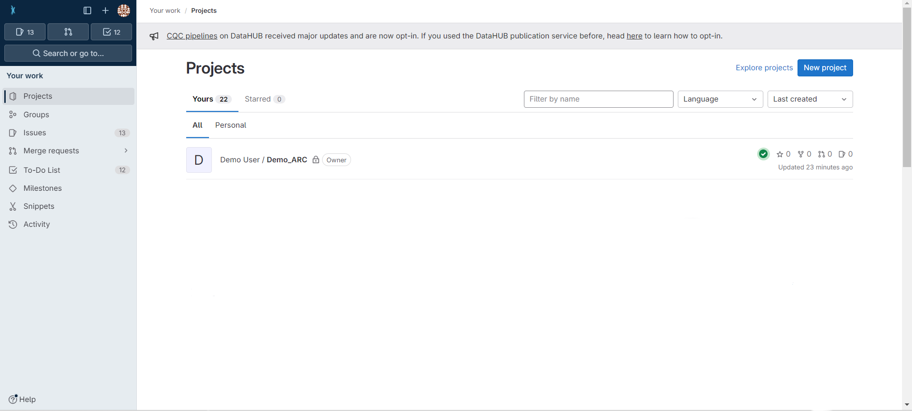</a>  |  <a href="./datahub-projectsPanel.png" target="_blank">https://nfdi4plants.org/nfdi4plants.knowledgebase/docs/img/datahub-projectsPanel.png</a>  
  |  <a href="./datahub-wiki.png" target="_blank">https://nfdi4plants.org/nfdi4plants.knowledgebase/docs/img/datahub-wiki.png</a>  
  |  <a href="./dataplan_after_deselect.png" target="_blank">https://nfdi4plants.org/nfdi4plants.knowledgebase/docs/img/dataplan_after_deselect.png</a>  
  |  <a href="./dataplan_before_deselect.png" target="_blank">https://nfdi4plants.org/nfdi4plants.knowledgebase/docs/img/dataplan_before_deselect.png</a>  
  |  <a href="./dataplan_layout.png" target="_blank">https://nfdi4plants.org/nfdi4plants.knowledgebase/docs/img/dataplan_layout.png</a>  
  |  <a href="./dataplan_save.png" target="_blank">https://nfdi4plants.org/nfdi4plants.knowledgebase/docs/img/dataplan_save.png</a>  
  |  <a href="./dataplan_user_defined.png" target="_blank">https://nfdi4plants.org/nfdi4plants.knowledgebase/docs/img/dataplan_user_defined.png</a>  
<a href="./dataplan.png" target="_blank">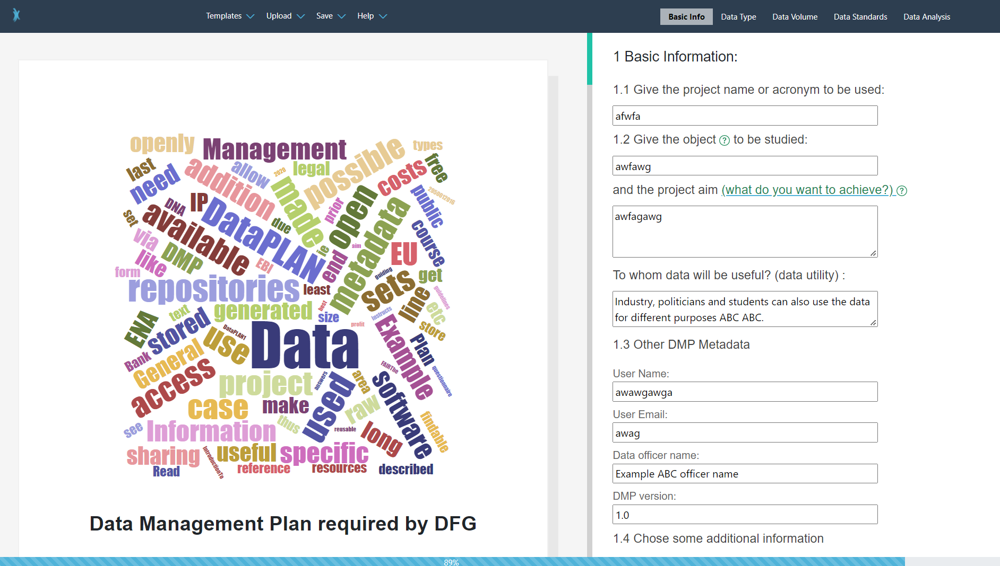</a>  |  <a href="./dataplan.png" target="_blank">https://nfdi4plants.org/nfdi4plants.knowledgebase/docs/img/dataplan.png</a>  
<a href="./DataPLANT_annotationPrinciples_img1.png" target="_blank">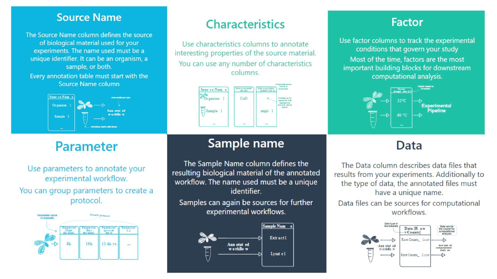</a>  |  <a href="./DataPLANT_annotationPrinciples_img1.png" target="_blank">https://nfdi4plants.org/nfdi4plants.knowledgebase/docs/img/DataPLANT_annotationPrinciples_img1.png</a>  | TA3-[DataPLANT](nfdi4plants.org)
<a href="./DataPLANT_ARC_Assays.svg" target="_blank">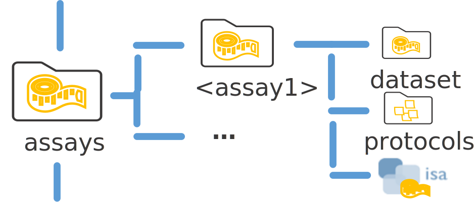</a>  |  <a href="./DataPLANT_ARC_Assays.svg" target="_blank">https://nfdi4plants.org/nfdi4plants.knowledgebase/docs/img/DataPLANT_ARC_Assays.svg</a>  | TA3-[DataPLANT](nfdi4plants.org)
<a href="./DataPLANT_ARC_Hero.svg" target="_blank">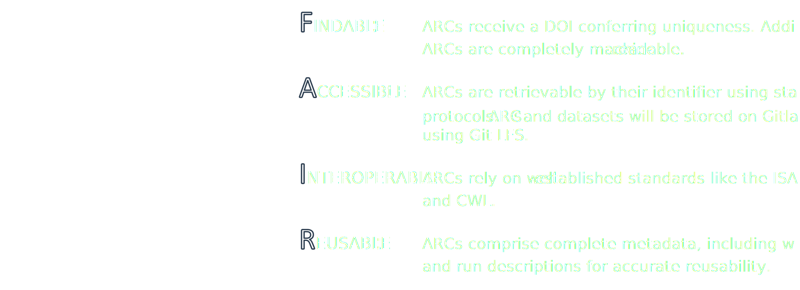</a>  |  <a href="./DataPLANT_ARC_Hero.svg" target="_blank">https://nfdi4plants.org/nfdi4plants.knowledgebase/docs/img/DataPLANT_ARC_Hero.svg</a>  | TA3-[DataPLANT](nfdi4plants.org)
<a href="./DataPLANT_ARC_ISAassay.svg" target="_blank">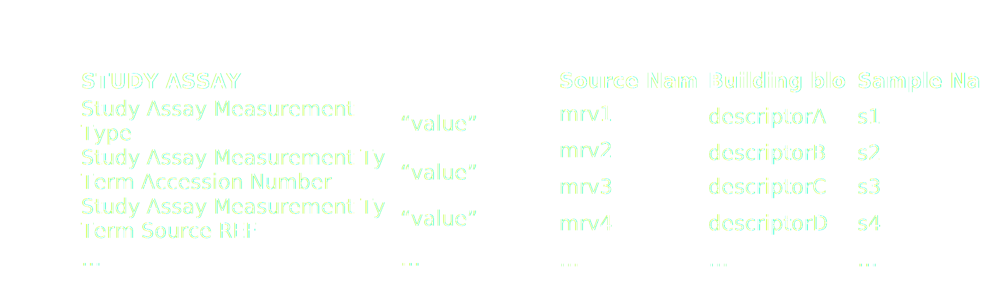</a>  |  <a href="./DataPLANT_ARC_ISAassay.svg" target="_blank">https://nfdi4plants.org/nfdi4plants.knowledgebase/docs/img/DataPLANT_ARC_ISAassay.svg</a>  | TA3-[DataPLANT](nfdi4plants.org)
<a href="./DataPLANT_ARC_ISAinvestigation.svg" target="_blank">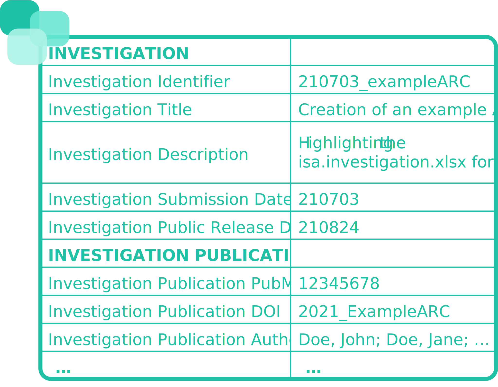</a>  |  <a href="./DataPLANT_ARC_ISAinvestigation.svg" target="_blank">https://nfdi4plants.org/nfdi4plants.knowledgebase/docs/img/DataPLANT_ARC_ISAinvestigation.svg</a>  | TA3-[DataPLANT](nfdi4plants.org)
<a href="./DataPLANT_ARC_RealWorldARC.svg" target="_blank">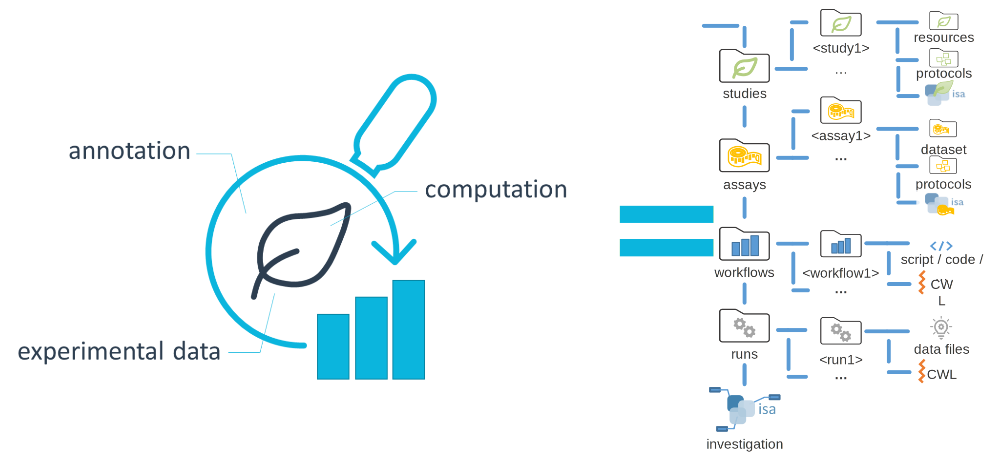</a>  |  <a href="./DataPLANT_ARC_RealWorldARC.svg" target="_blank">https://nfdi4plants.org/nfdi4plants.knowledgebase/docs/img/DataPLANT_ARC_RealWorldARC.svg</a>  | TA3-[DataPLANT](nfdi4plants.org)
<a href="./DataPLANT_ARC_Runs.svg" target="_blank">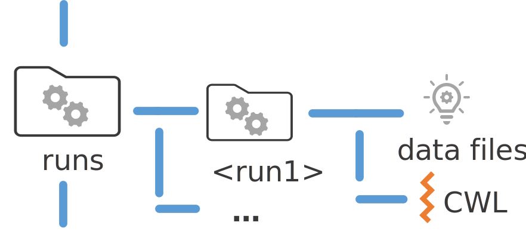</a>  |  <a href="./DataPLANT_ARC_Runs.svg" target="_blank">https://nfdi4plants.org/nfdi4plants.knowledgebase/docs/img/DataPLANT_ARC_Runs.svg</a>  | TA3-[DataPLANT](nfdi4plants.org)
  |  <a href="./DataPLANT_ARC_SinglePointofEntry.svg" target="_blank">https://nfdi4plants.org/nfdi4plants.knowledgebase/docs/img/DataPLANT_ARC_SinglePointofEntry.svg</a>  | TA3-[DataPLANT](nfdi4plants.org)
<a href="./DataPLANT_ARC_Studies.svg" target="_blank">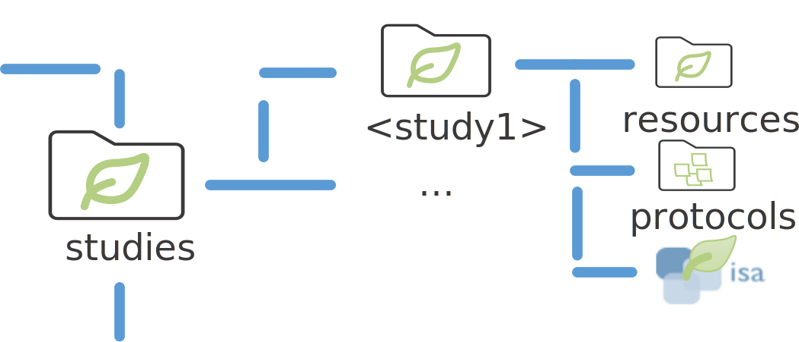</a>  |  <a href="./DataPLANT_ARC_Studies.svg" target="_blank">https://nfdi4plants.org/nfdi4plants.knowledgebase/docs/img/DataPLANT_ARC_Studies.svg</a>  | TA3-[DataPLANT](nfdi4plants.org)
<a href="./DataPLANT_ARC_Tools.svg" target="_blank">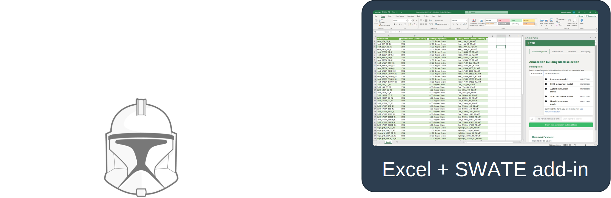</a>  |  <a href="./DataPLANT_ARC_Tools.svg" target="_blank">https://nfdi4plants.org/nfdi4plants.knowledgebase/docs/img/DataPLANT_ARC_Tools.svg</a>  | TA3-[DataPLANT](nfdi4plants.org)
  |  <a href="./DataPLANT_ARC_Workflows.svg" target="_blank">https://nfdi4plants.org/nfdi4plants.knowledgebase/docs/img/DataPLANT_ARC_Workflows.svg</a>  | TA3-[DataPLANT](nfdi4plants.org)
<a href="./DataPLANT_BigPicture_seq1-mid.png" target="_blank">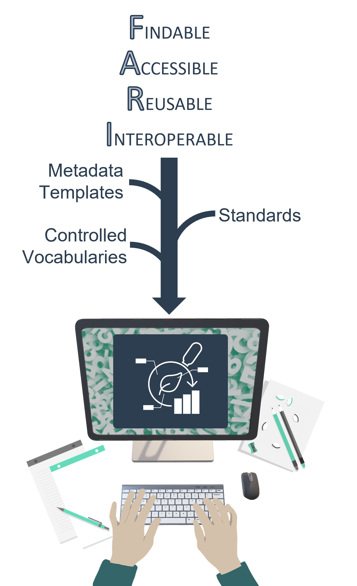</a>  |  <a href="./DataPLANT_BigPicture_seq1-mid.png" target="_blank">https://nfdi4plants.org/nfdi4plants.knowledgebase/docs/img/DataPLANT_BigPicture_seq1-mid.png</a>  
  |  <a href="./DataPLANT_BigPicture_seq1.png" target="_blank">https://nfdi4plants.org/nfdi4plants.knowledgebase/docs/img/DataPLANT_BigPicture_seq1.png</a>  | TA3-[DataPLANT](nfdi4plants.org)/[CEPLAS](https://ceplas.eu), DB
  |  <a href="./DataPLANT_BigPicture_seq2.png" target="_blank">https://nfdi4plants.org/nfdi4plants.knowledgebase/docs/img/DataPLANT_BigPicture_seq2.png</a>  | TA3-[DataPLANT](nfdi4plants.org)/[CEPLAS](https://ceplas.eu), DB
  |  <a href="./DataPLANT_BigPicture_seq3.png" target="_blank">https://nfdi4plants.org/nfdi4plants.knowledgebase/docs/img/DataPLANT_BigPicture_seq3.png</a>  | TA3-[DataPLANT](nfdi4plants.org)/[CEPLAS](https://ceplas.eu), DB
  |  <a href="./DataPLANT_BigPicture_seq4.png" target="_blank">https://nfdi4plants.org/nfdi4plants.knowledgebase/docs/img/DataPLANT_BigPicture_seq4.png</a>  | TA3-[DataPLANT](nfdi4plants.org)/[CEPLAS](https://ceplas.eu), DB
  |  <a href="./DataPLANT_BigPicture_seq5.png" target="_blank">https://nfdi4plants.org/nfdi4plants.knowledgebase/docs/img/DataPLANT_BigPicture_seq5.png</a>  | TA3-[DataPLANT](nfdi4plants.org)/[CEPLAS](https://ceplas.eu), DB
  |  <a href="./DataPLANT_BigPicture_seq6.png" target="_blank">https://nfdi4plants.org/nfdi4plants.knowledgebase/docs/img/DataPLANT_BigPicture_seq6.png</a>  | TA3-[DataPLANT](nfdi4plants.org)/[CEPLAS](https://ceplas.eu), DB
  |  <a href="./DataPLANT_BigPicture_seq7.png" target="_blank">https://nfdi4plants.org/nfdi4plants.knowledgebase/docs/img/DataPLANT_BigPicture_seq7.png</a>  | TA3-[DataPLANT](nfdi4plants.org)/[CEPLAS](https://ceplas.eu), DB
  |  <a href="./DataPLANT_BigPicture_seq8.png" target="_blank">https://nfdi4plants.org/nfdi4plants.knowledgebase/docs/img/DataPLANT_BigPicture_seq8.png</a>  | TA3-[DataPLANT](nfdi4plants.org)/[CEPLAS](https://ceplas.eu), DB
<a href="./DataPLANT_BigPicture1.svg" target="_blank">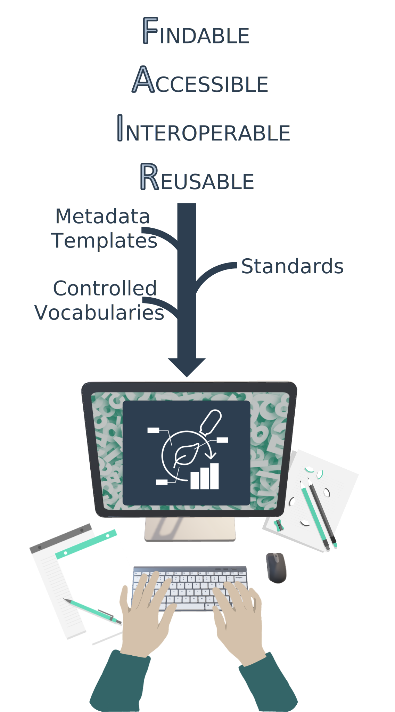</a>  |  <a href="./DataPLANT_BigPicture1.svg" target="_blank">https://nfdi4plants.org/nfdi4plants.knowledgebase/docs/img/DataPLANT_BigPicture1.svg</a>  
  |  <a href="./DataPLANT_BigPicture2.svg" target="_blank">https://nfdi4plants.org/nfdi4plants.knowledgebase/docs/img/DataPLANT_BigPicture2.svg</a>  
  |  <a href="./DataPLANT_BigPicture3.svg" target="_blank">https://nfdi4plants.org/nfdi4plants.knowledgebase/docs/img/DataPLANT_BigPicture3.svg</a>  
  |  <a href="./DataPLANT_BigPicture4.svg" target="_blank">https://nfdi4plants.org/nfdi4plants.knowledgebase/docs/img/DataPLANT_BigPicture4.svg</a>  
  |  <a href="./DataPLANT_BigPicture5.svg" target="_blank">https://nfdi4plants.org/nfdi4plants.knowledgebase/docs/img/DataPLANT_BigPicture5.svg</a>  
<a href="./DataPLANT_BigPicture6.svg" target="_blank">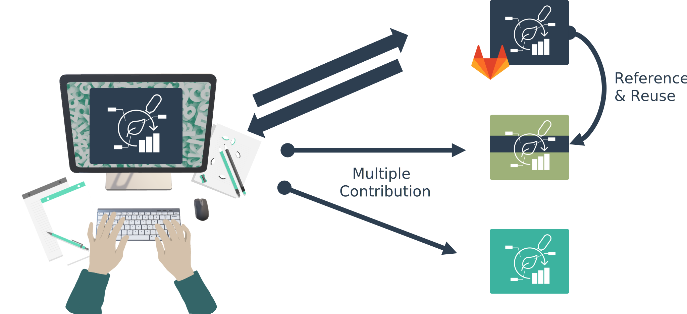</a>  |  <a href="./DataPLANT_BigPicture6.svg" target="_blank">https://nfdi4plants.org/nfdi4plants.knowledgebase/docs/img/DataPLANT_BigPicture6.svg</a>  
<a href="./DataPLANT_BigPicture7.svg" target="_blank">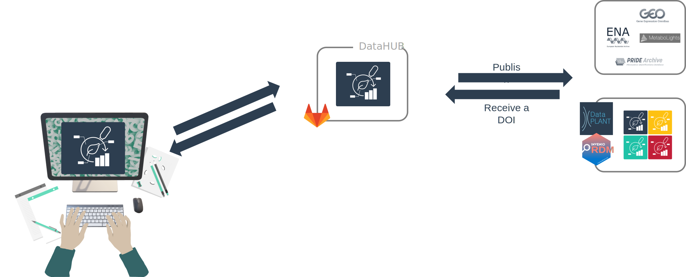</a>  |  <a href="./DataPLANT_BigPicture7.svg" target="_blank">https://nfdi4plants.org/nfdi4plants.knowledgebase/docs/img/DataPLANT_BigPicture7.svg</a>  
<a href="./DataPLANT_BigPicture8.svg" target="_blank">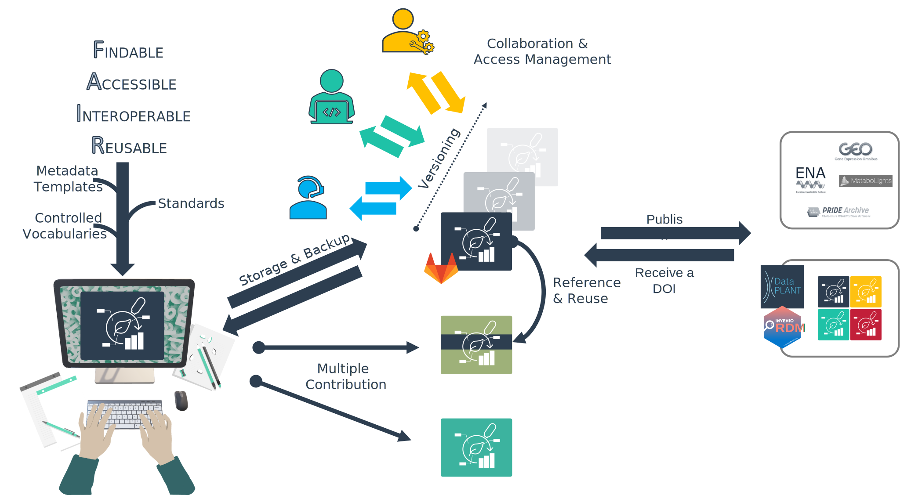</a>  |  <a href="./DataPLANT_BigPicture8.svg" target="_blank">https://nfdi4plants.org/nfdi4plants.knowledgebase/docs/img/DataPLANT_BigPicture8.svg</a>  
<a href="./DataPLANT_DMPG.png" target="_blank">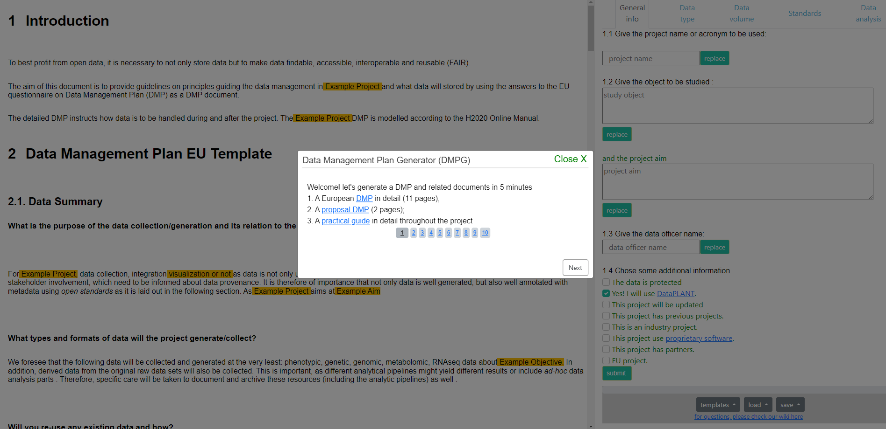</a>  |  <a href="./DataPLANT_DMPG.png" target="_blank">https://nfdi4plants.org/nfdi4plants.knowledgebase/docs/img/DataPLANT_DMPG.png</a>  | TA3-[DataPLANT](nfdi4plants.org)
<a href="./DataPLANT_InitialStructure.svg" target="_blank">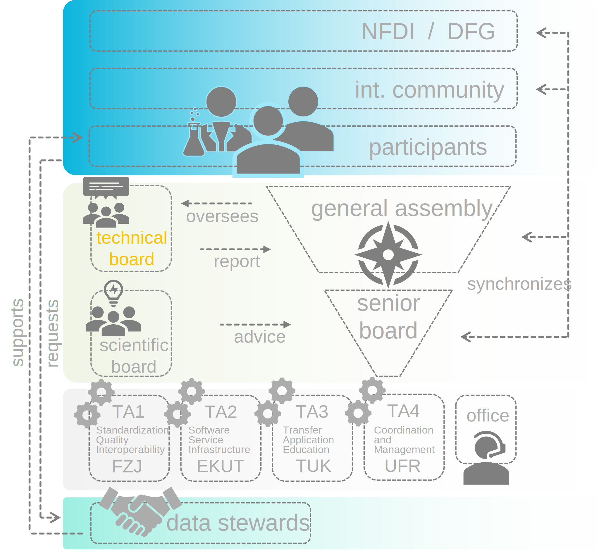</a>  |  <a href="./DataPLANT_InitialStructure.svg" target="_blank">https://nfdi4plants.org/nfdi4plants.knowledgebase/docs/img/DataPLANT_InitialStructure.svg</a>  | TA3-[DataPLANT](nfdi4plants.org)
  |  <a href="./DataPLANT_Invenio.svg" target="_blank">https://nfdi4plants.org/nfdi4plants.knowledgebase/docs/img/DataPLANT_Invenio.svg</a>  | TA3-[DataPLANT](nfdi4plants.org)
<a href="./DataPLANT_LandingPage_ARC.svg" target="_blank">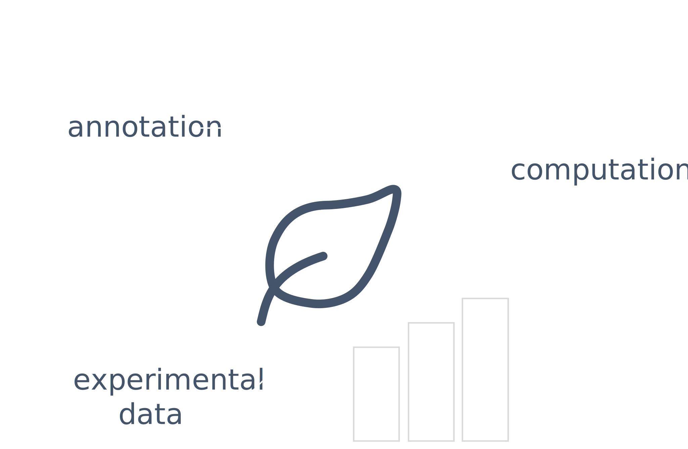</a>  |  <a href="./DataPLANT_LandingPage_ARC.svg" target="_blank">https://nfdi4plants.org/nfdi4plants.knowledgebase/docs/img/DataPLANT_LandingPage_ARC.svg</a>  | TA3-[DataPLANT](nfdi4plants.org)
<a href="./DataPLANT_LandingPage_Community.svg" target="_blank">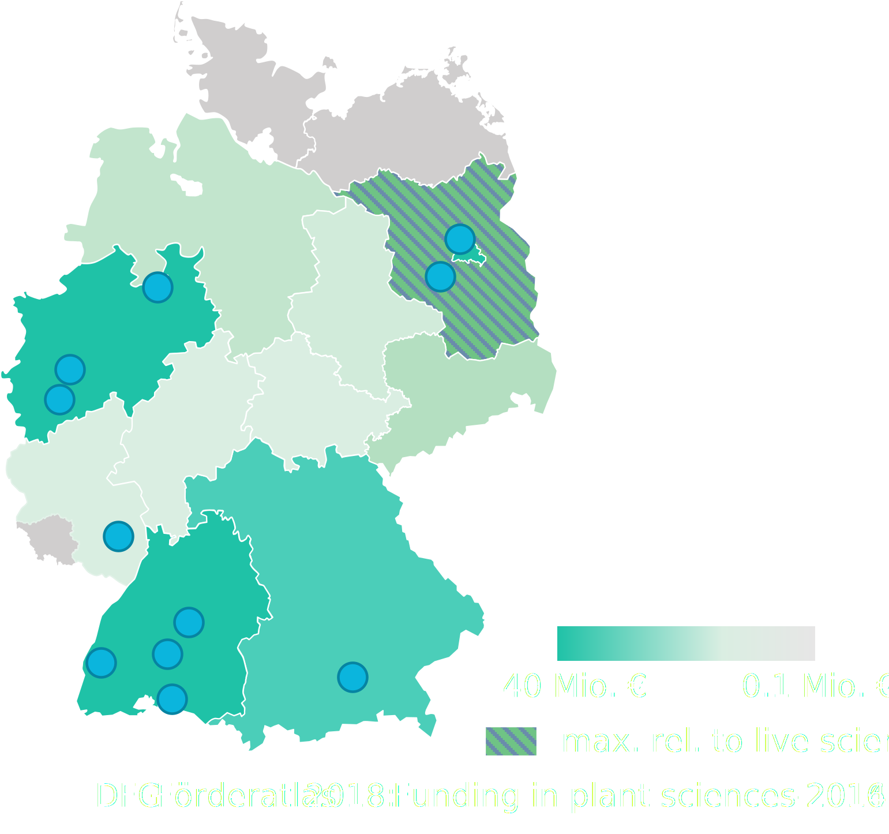</a>  |  <a href="./DataPLANT_LandingPage_Community.svg" target="_blank">https://nfdi4plants.org/nfdi4plants.knowledgebase/docs/img/DataPLANT_LandingPage_Community.svg</a>  | TA3-[DataPLANT](nfdi4plants.org)
<a href="./DataPLANT_LandingPage_Hero.svg" target="_blank">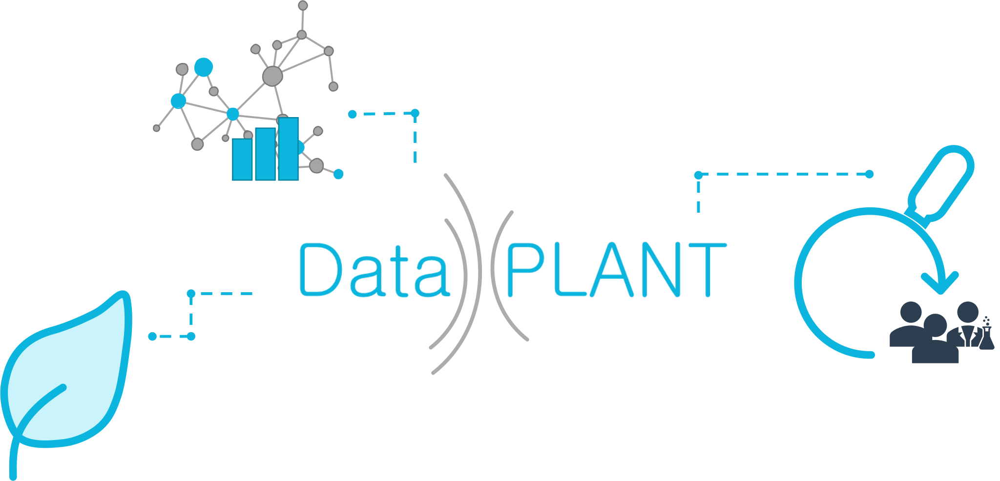</a>  |  <a href="./DataPLANT_LandingPage_Hero.svg" target="_blank">https://nfdi4plants.org/nfdi4plants.knowledgebase/docs/img/DataPLANT_LandingPage_Hero.svg</a>  | TA3-[DataPLANT](nfdi4plants.org)
  |  <a href="./DataPLANT_LandingPage_Mission.svg" target="_blank">https://nfdi4plants.org/nfdi4plants.knowledgebase/docs/img/DataPLANT_LandingPage_Mission.svg</a>  | TA3-[DataPLANT](nfdi4plants.org)
<a href="./DataPLANT_LandingPage_Service.svg" target="_blank">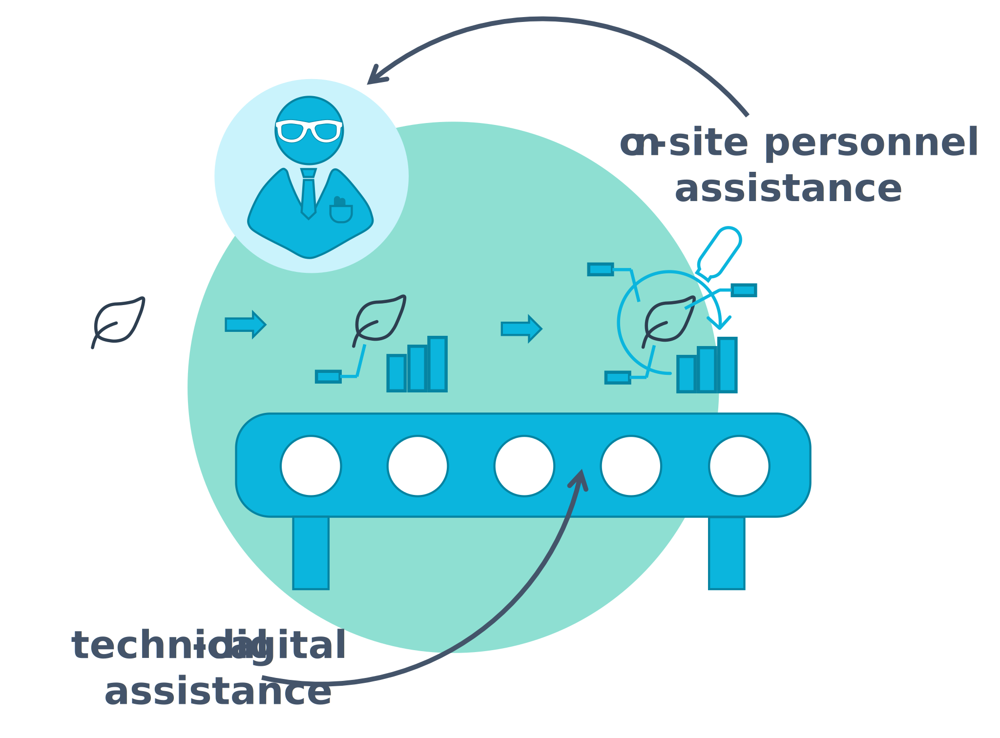</a>  |  <a href="./DataPLANT_LandingPage_Service.svg" target="_blank">https://nfdi4plants.org/nfdi4plants.knowledgebase/docs/img/DataPLANT_LandingPage_Service.svg</a>  | TA3-[DataPLANT](nfdi4plants.org)
<a href="./DataPLANT_NFDI4PlantResearch.svg" target="_blank">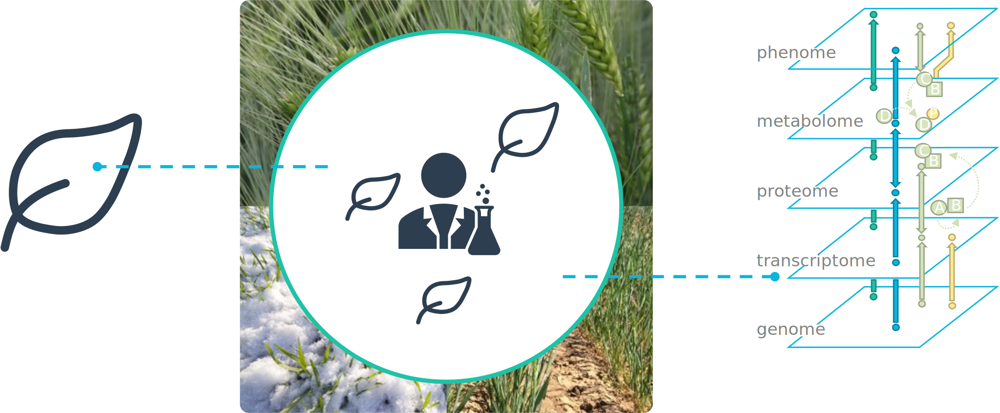</a>  |  <a href="./DataPLANT_NFDI4PlantResearch.svg" target="_blank">https://nfdi4plants.org/nfdi4plants.knowledgebase/docs/img/DataPLANT_NFDI4PlantResearch.svg</a>  | TA3-[DataPLANT](nfdi4plants.org)
  |  <a href="./DataPLANT_registration_roles.png" target="_blank">https://nfdi4plants.org/nfdi4plants.knowledgebase/docs/img/DataPLANT_registration_roles.png</a>  | TA3-[DataPLANT](nfdi4plants.org)
  |  <a href="./dataplant_registration.png" target="_blank">https://nfdi4plants.org/nfdi4plants.knowledgebase/docs/img/dataplant_registration.png</a>  | TA3-[DataPLANT](nfdi4plants.org)
  |  <a href="./DataPLANT_TaskArea1_StandardizationDataQualityInteroperability.svg" target="_blank">https://nfdi4plants.org/nfdi4plants.knowledgebase/docs/img/DataPLANT_TaskArea1_StandardizationDataQualityInteroperability.svg</a>  | TA3-[DataPLANT](nfdi4plants.org)
  |  <a href="./DataPLANT_TaskArea2_SoftwareServiceInfrastructure.svg" target="_blank">https://nfdi4plants.org/nfdi4plants.knowledgebase/docs/img/DataPLANT_TaskArea2_SoftwareServiceInfrastructure.svg</a>  | TA3-[DataPLANT](nfdi4plants.org)
  |  <a href="./DataPLANT_TaskArea3_Education.svg" target="_blank">https://nfdi4plants.org/nfdi4plants.knowledgebase/docs/img/DataPLANT_TaskArea3_Education.svg</a>  | TA3-[DataPLANT](nfdi4plants.org)
  |  <a href="./DataPLANT_TaskArea3_TransferApplicationEducation.svg" target="_blank">https://nfdi4plants.org/nfdi4plants.knowledgebase/docs/img/DataPLANT_TaskArea3_TransferApplicationEducation.svg</a>  | TA3-[DataPLANT](nfdi4plants.org)
  |  <a href="./DataPLANT_TaskAreas_001.svg" target="_blank">https://nfdi4plants.org/nfdi4plants.knowledgebase/docs/img/DataPLANT_TaskAreas_001.svg</a>  | TA3-[DataPLANT](nfdi4plants.org)
  |  <a href="./DataPLANT_TaskAreas.svg" target="_blank">https://nfdi4plants.org/nfdi4plants.knowledgebase/docs/img/DataPLANT_TaskAreas.svg</a>  | TA3-[DataPLANT](nfdi4plants.org)
<a href="./dataplant_titlePage_marp.drawio.png" target="_blank">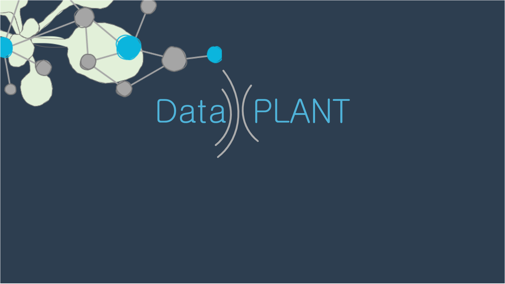</a>  |  <a href="./dataplant_titlePage_marp.drawio.png" target="_blank">https://nfdi4plants.org/nfdi4plants.knowledgebase/docs/img/dataplant_titlePage_marp.drawio.png</a>  
<a href="./DataPLANT_ToolBouquet.svg" target="_blank">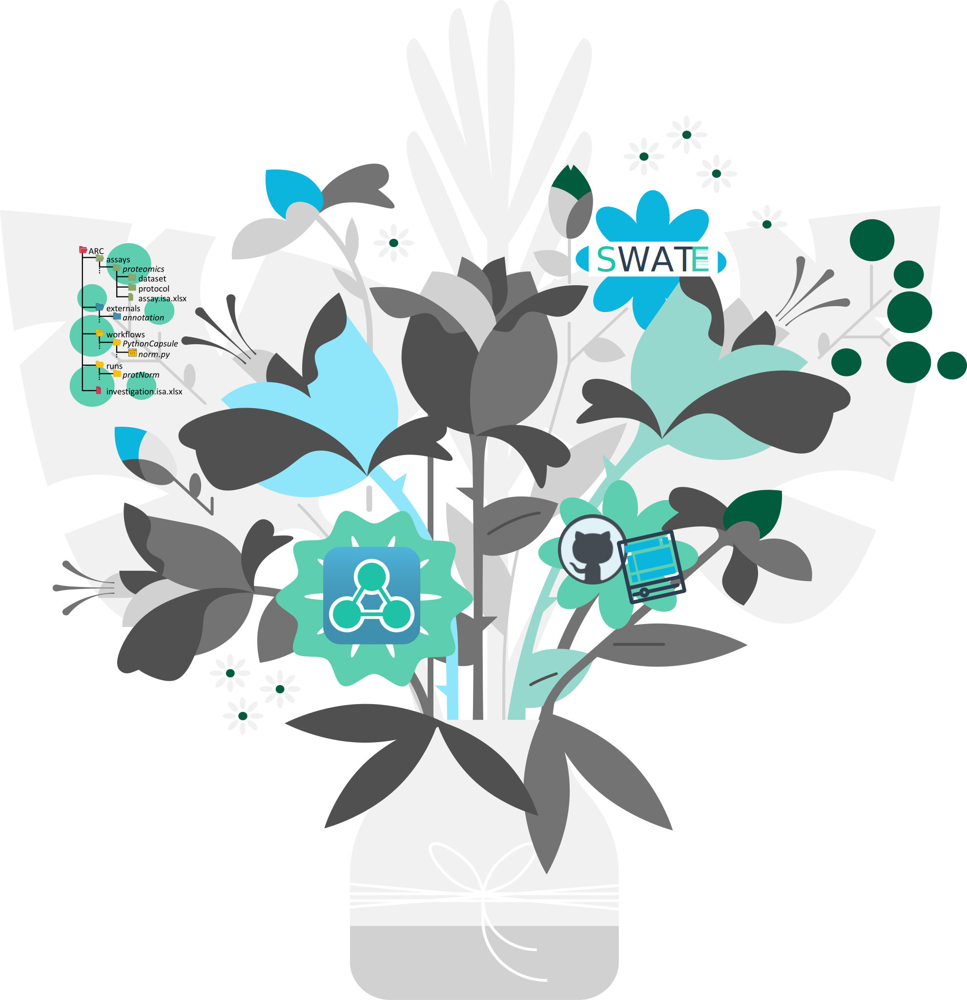</a>  |  <a href="./DataPLANT_ToolBouquet.svg" target="_blank">https://nfdi4plants.org/nfdi4plants.knowledgebase/docs/img/DataPLANT_ToolBouquet.svg</a>  | TA3-[DataPLANT](nfdi4plants.org)
  |  <a href="./DataPLANT-Background-Pictograms.png" target="_blank">https://nfdi4plants.org/nfdi4plants.knowledgebase/docs/img/DataPLANT-Background-Pictograms.png</a>  
  |  <a href="./DataPLANT-Background.png" target="_blank">https://nfdi4plants.org/nfdi4plants.knowledgebase/docs/img/DataPLANT-Background.png</a>  
<a href="./DataPublication.jpg" target="_blank">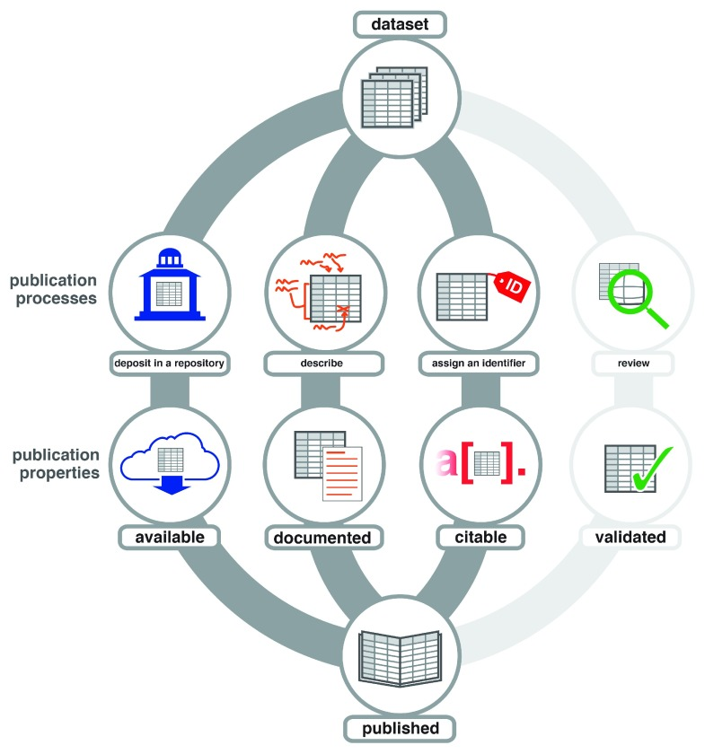</a>  |  <a href="./DataPublication.jpg" target="_blank">https://nfdi4plants.org/nfdi4plants.knowledgebase/docs/img/DataPublication.jpg</a>  |  
<a href="./DataPublishing_Classical.svg" target="_blank">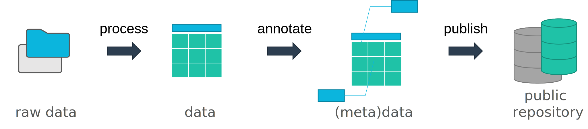</a>  |  <a href="./DataPublishing_Classical.svg" target="_blank">https://nfdi4plants.org/nfdi4plants.knowledgebase/docs/img/DataPublishing_Classical.svg</a>  | TA3-[DataPLANT](nfdi4plants.org)
<a href="./DataPublishing_Declarative.svg" target="_blank">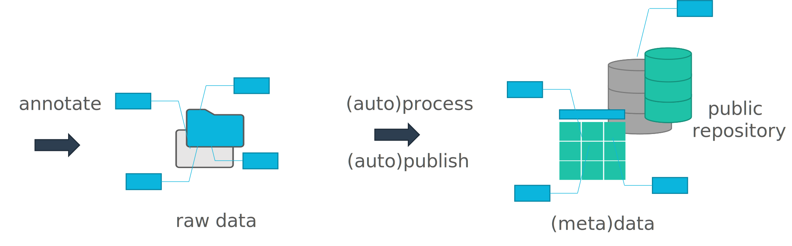</a>  |  <a href="./DataPublishing_Declarative.svg" target="_blank">https://nfdi4plants.org/nfdi4plants.knowledgebase/docs/img/DataPublishing_Declarative.svg</a>  | TA3-[DataPLANT](nfdi4plants.org)
<a href="./DataPublishing_JournalDemands.svg" target="_blank">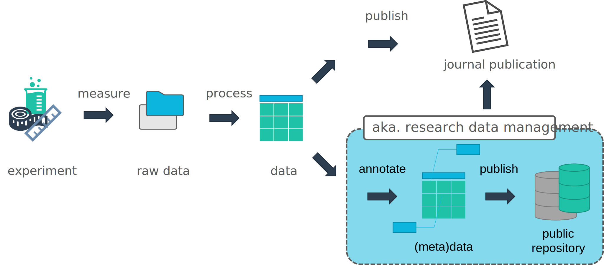</a>  |  <a href="./DataPublishing_JournalDemands.svg" target="_blank">https://nfdi4plants.org/nfdi4plants.knowledgebase/docs/img/DataPublishing_JournalDemands.svg</a>  | TA3-[DataPLANT](nfdi4plants.org)
<a href="./DataSharing_Cloud_img1.png" target="_blank">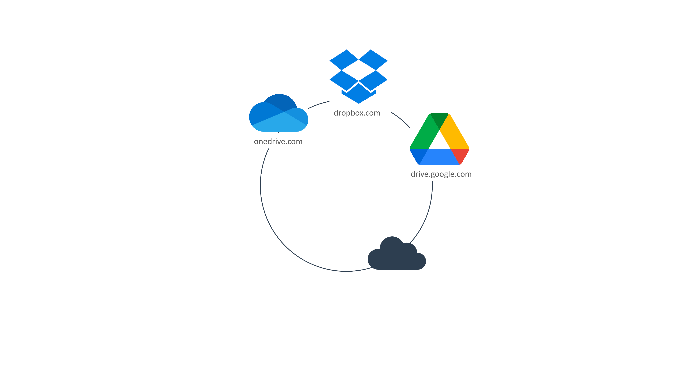</a>  |  <a href="./DataSharing_Cloud_img1.png" target="_blank">https://nfdi4plants.org/nfdi4plants.knowledgebase/docs/img/DataSharing_Cloud_img1.png</a>  |  [CEPLAS](https://ceplas.eu), DB
  |  <a href="./DataSharing_Cloud_img2.png" target="_blank">https://nfdi4plants.org/nfdi4plants.knowledgebase/docs/img/DataSharing_Cloud_img2.png</a>  |  [CEPLAS](https://ceplas.eu), DB
  |  <a href="./DataSharing_Cloud_img3.png" target="_blank">https://nfdi4plants.org/nfdi4plants.knowledgebase/docs/img/DataSharing_Cloud_img3.png</a>  |  [CEPLAS](https://ceplas.eu), DB
  |  <a href="./DataSharing_Cloud_img4.png" target="_blank">https://nfdi4plants.org/nfdi4plants.knowledgebase/docs/img/DataSharing_Cloud_img4.png</a>  |  [CEPLAS](https://ceplas.eu), DB
  |  <a href="./DataSharing_Cloud_img5.png" target="_blank">https://nfdi4plants.org/nfdi4plants.knowledgebase/docs/img/DataSharing_Cloud_img5.png</a>  |  [CEPLAS](https://ceplas.eu), DB
  |  <a href="./DataSharing_Cloud_img6.png" target="_blank">https://nfdi4plants.org/nfdi4plants.knowledgebase/docs/img/DataSharing_Cloud_img6.png</a>  |  [CEPLAS](https://ceplas.eu), DB
  |  <a href="./DataSharing_Cloud_img7.png" target="_blank">https://nfdi4plants.org/nfdi4plants.knowledgebase/docs/img/DataSharing_Cloud_img7.png</a>  |  [CEPLAS](https://ceplas.eu), DB
<a href="./DataSharing_Cloud_img8.png" target="_blank">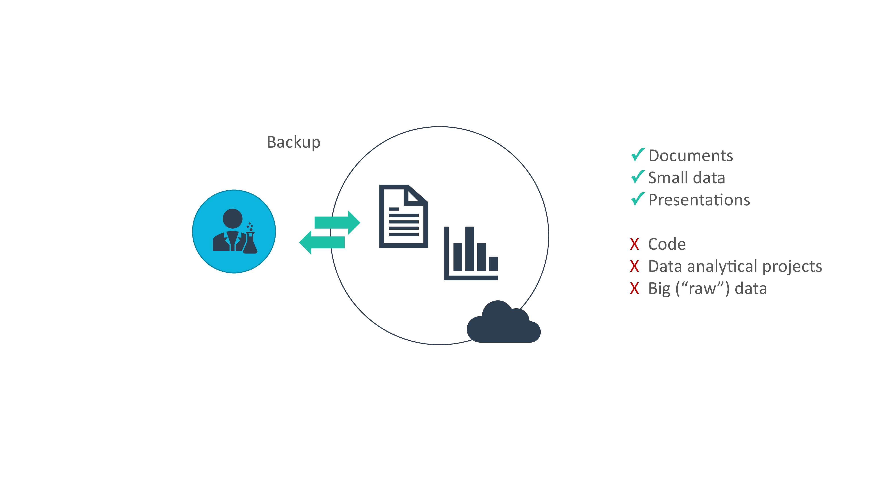</a>  |  <a href="./DataSharing_Cloud_img8.png" target="_blank">https://nfdi4plants.org/nfdi4plants.knowledgebase/docs/img/DataSharing_Cloud_img8.png</a>  |  [CEPLAS](https://ceplas.eu), DB
<a href="./DataSharing_Git_img1.png" target="_blank">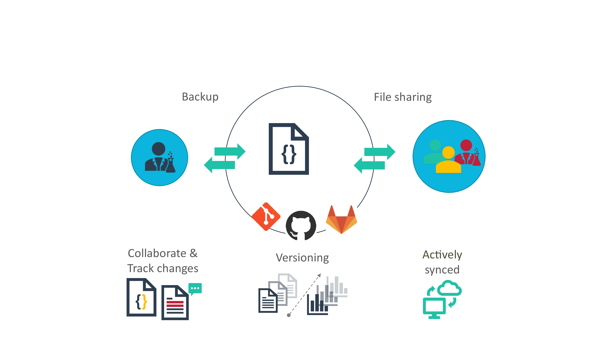</a>  |  <a href="./DataSharing_Git_img1.png" target="_blank">https://nfdi4plants.org/nfdi4plants.knowledgebase/docs/img/DataSharing_Git_img1.png</a>  |  [CEPLAS](https://ceplas.eu), DB
<a href="./DataSharing_Git_img2.png" target="_blank">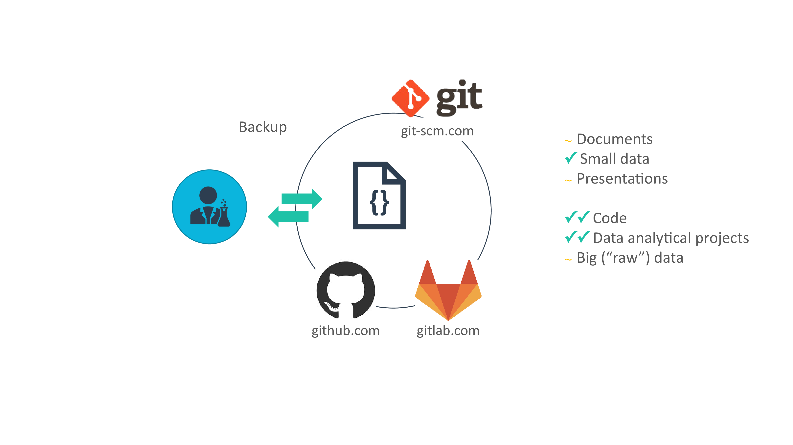</a>  |  <a href="./DataSharing_Git_img2.png" target="_blank">https://nfdi4plants.org/nfdi4plants.knowledgebase/docs/img/DataSharing_Git_img2.png</a>  |  [CEPLAS](https://ceplas.eu), DB
<a href="./DataStewards_CommunityIntegration_img1.png" target="_blank">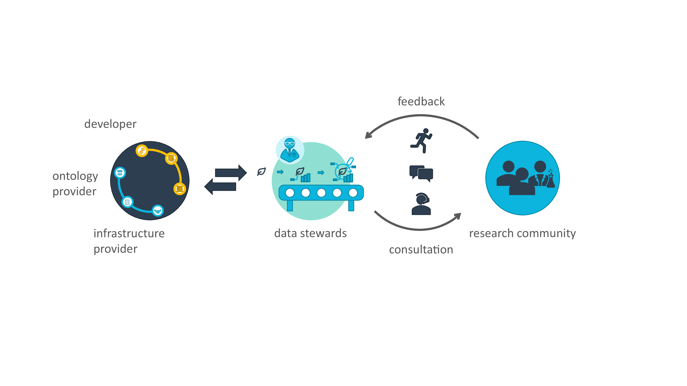</a>  |  <a href="./DataStewards_CommunityIntegration_img1.png" target="_blank">https://nfdi4plants.org/nfdi4plants.knowledgebase/docs/img/DataStewards_CommunityIntegration_img1.png</a>  | TA3-[DataPLANT](nfdi4plants.org)
  |  <a href="./DataStewards_CommunityIntegration_img2.png" target="_blank">https://nfdi4plants.org/nfdi4plants.knowledgebase/docs/img/DataStewards_CommunityIntegration_img2.png</a>  
  |  <a href="./DataStewards_CommunityIntegration.svg" target="_blank">https://nfdi4plants.org/nfdi4plants.knowledgebase/docs/img/DataStewards_CommunityIntegration.svg</a>  
  |  <a href="./DataStewards_PersonalSupport.svg" target="_blank">https://nfdi4plants.org/nfdi4plants.knowledgebase/docs/img/DataStewards_PersonalSupport.svg</a>  | TA3-[DataPLANT](nfdi4plants.org)
  |  <a href="./demo_arc_screenshot.png" target="_blank">https://nfdi4plants.org/nfdi4plants.knowledgebase/docs/img/demo_arc_screenshot.png</a>  
  |  <a href="./demo_data_screenshot.png" target="_blank">https://nfdi4plants.org/nfdi4plants.knowledgebase/docs/img/demo_data_screenshot.png</a>  
  |  <a href="./DMP.png" target="_blank">https://nfdi4plants.org/nfdi4plants.knowledgebase/docs/img/DMP.png</a>  |  [CEPLAS](https://ceplas.eu), DB
<a href="./DMPG_LandingPage.svg" target="_blank">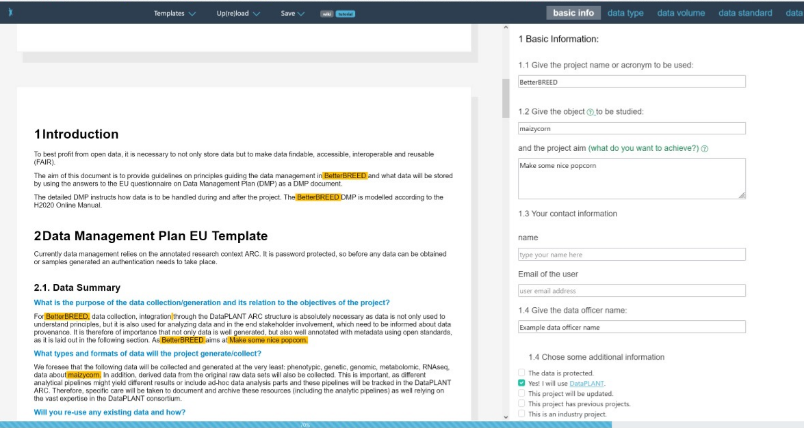</a>  |  <a href="./DMPG_LandingPage.svg" target="_blank">https://nfdi4plants.org/nfdi4plants.knowledgebase/docs/img/DMPG_LandingPage.svg</a>  |  [CEPLAS](https://ceplas.eu), DB
  |  <a href="./DMPG.png" target="_blank">https://nfdi4plants.org/nfdi4plants.knowledgebase/docs/img/DMPG.png</a>  
  |  <a href="./Documents_Handwritten_img1.png" target="_blank">https://nfdi4plants.org/nfdi4plants.knowledgebase/docs/img/Documents_Handwritten_img1.png</a>  | TA3-[DataPLANT](nfdi4plants.org)
  |  <a href="./Documents_Handwritten.svg" target="_blank">https://nfdi4plants.org/nfdi4plants.knowledgebase/docs/img/Documents_Handwritten.svg</a>  
<a href="./enablingPlatform-FileShare.drawio.png" target="_blank">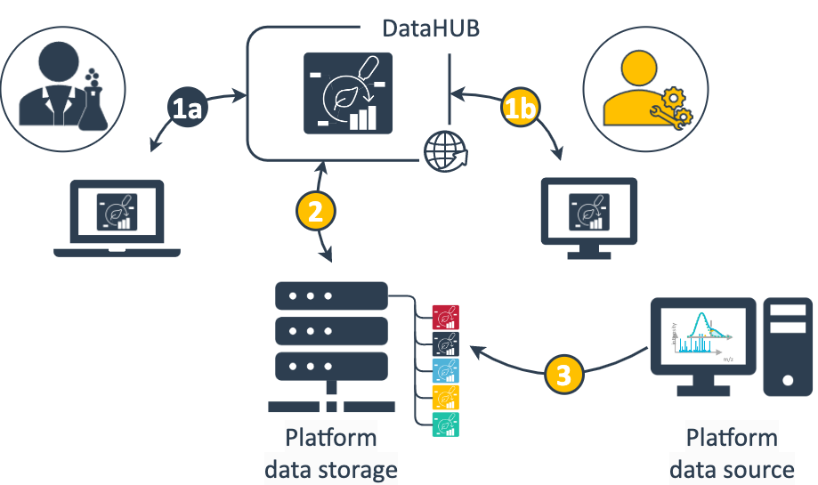</a>  |  <a href="./enablingPlatform-FileShare.drawio.png" target="_blank">https://nfdi4plants.org/nfdi4plants.knowledgebase/docs/img/enablingPlatform-FileShare.drawio.png</a>  
<a href="./enablingPlatform-Timeline.drawio.png" target="_blank">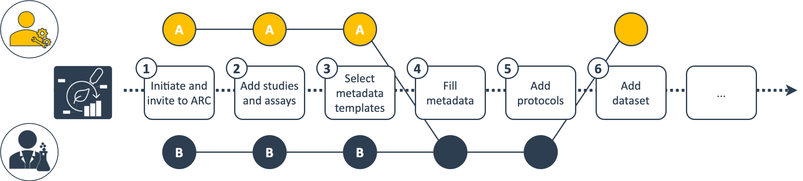</a>  |  <a href="./enablingPlatform-Timeline.drawio.png" target="_blank">https://nfdi4plants.org/nfdi4plants.knowledgebase/docs/img/enablingPlatform-Timeline.drawio.png</a>  
  |  <a href="./FAIR_Benefits.png" target="_blank">https://nfdi4plants.org/nfdi4plants.knowledgebase/docs/img/FAIR_Benefits.png</a>  |  [CEPLAS](https://ceplas.eu), DB
<a href="./FAIR_HumanandMachineReadable.svg" target="_blank">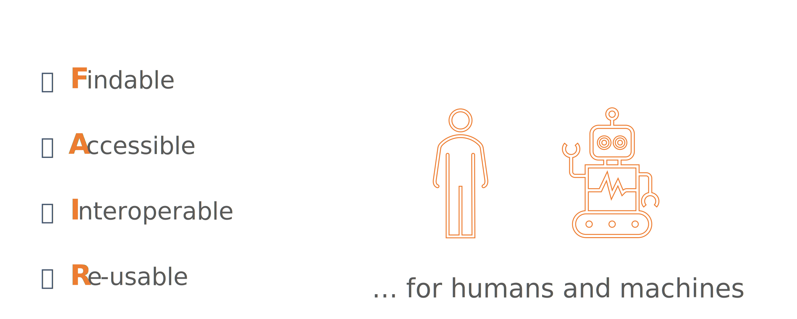</a>  |  <a href="./FAIR_HumanandMachineReadable.svg" target="_blank">https://nfdi4plants.org/nfdi4plants.knowledgebase/docs/img/FAIR_HumanandMachineReadable.svg</a>  | TA3-[DataPLANT](nfdi4plants.org)
  |  <a href="./FAIR_Principles_002_img1.png" target="_blank">https://nfdi4plants.org/nfdi4plants.knowledgebase/docs/img/FAIR_Principles_002_img1.png</a>  | TA3-[DataPLANT](nfdi4plants.org)
  |  <a href="./FAIR_Principles_002.svg" target="_blank">https://nfdi4plants.org/nfdi4plants.knowledgebase/docs/img/FAIR_Principles_002.svg</a>  
  |  <a href="./FAIR_unFAIR_Stories.png" target="_blank">https://nfdi4plants.org/nfdi4plants.knowledgebase/docs/img/FAIR_unFAIR_Stories.png</a>  |  [CEPLAS](https://ceplas.eu), DB
<a href="./FAIR.jpg" target="_blank">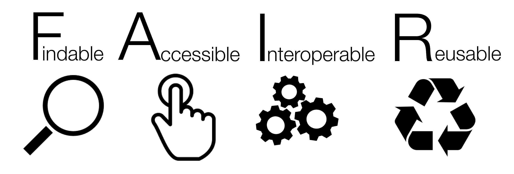</a>  |  <a href="./FAIR.jpg" target="_blank">https://nfdi4plants.org/nfdi4plants.knowledgebase/docs/img/FAIR.jpg</a>  
<a href="./FAIRData_ActivationEnergy_withDataPLANT.svg" target="_blank">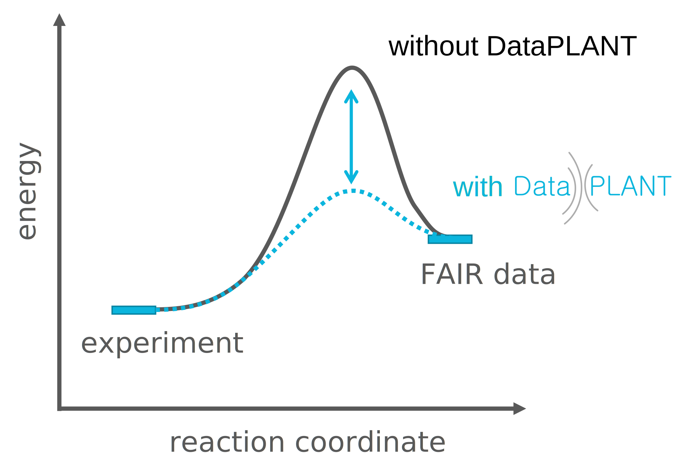</a>  |  <a href="./FAIRData_ActivationEnergy_withDataPLANT.svg" target="_blank">https://nfdi4plants.org/nfdi4plants.knowledgebase/docs/img/FAIRData_ActivationEnergy_withDataPLANT.svg</a>  | TA3-[DataPLANT](nfdi4plants.org)
  |  <a href="./FAIRData_ActivationEnergy.svg" target="_blank">https://nfdi4plants.org/nfdi4plants.knowledgebase/docs/img/FAIRData_ActivationEnergy.svg</a>  | TA3-[DataPLANT](nfdi4plants.org)
  |  <a href="./FAIRData_ClassicalPublication.svg" target="_blank">https://nfdi4plants.org/nfdi4plants.knowledgebase/docs/img/FAIRData_ClassicalPublication.svg</a>  | TA3-[DataPLANT](nfdi4plants.org)
  |  <a href="./FAIRData_FDO_ClassicalPublication.svg" target="_blank">https://nfdi4plants.org/nfdi4plants.knowledgebase/docs/img/FAIRData_FDO_ClassicalPublication.svg</a>  | TA3-[DataPLANT](nfdi4plants.org)
<a href="./FAIRData_KnowledgeGraph.svg" target="_blank">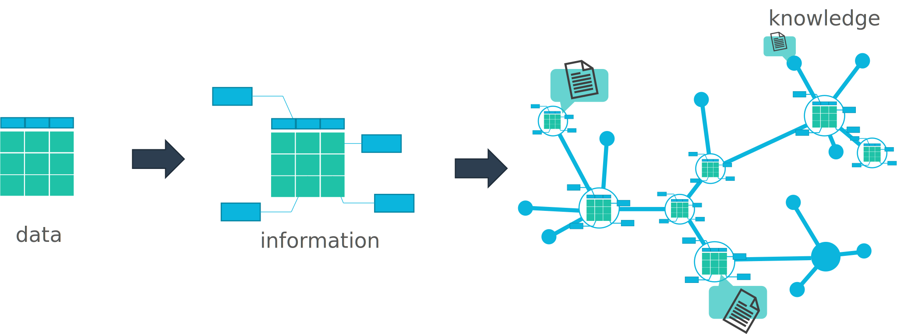</a>  |  <a href="./FAIRData_KnowledgeGraph.svg" target="_blank">https://nfdi4plants.org/nfdi4plants.knowledgebase/docs/img/FAIRData_KnowledgeGraph.svg</a>  | TA3-[DataPLANT](nfdi4plants.org)
  |  <a href="./feedback01_FiveFinger.drawio.svg" target="_blank">https://nfdi4plants.org/nfdi4plants.knowledgebase/docs/img/feedback01_FiveFinger.drawio.svg</a>  |  [CEPLAS](https://ceplas.eu), DB
  |  <a href="./feedback02_circle.drawio.svg" target="_blank">https://nfdi4plants.org/nfdi4plants.knowledgebase/docs/img/feedback02_circle.drawio.svg</a>  |  [CEPLAS](https://ceplas.eu), DB
  |  <a href="./git_cloud_comparison.png" target="_blank">https://nfdi4plants.org/nfdi4plants.knowledgebase/docs/img/git_cloud_comparison.png</a>  |  [CEPLAS](https://ceplas.eu), DB
  |  <a href="./git_cloudServices.png" target="_blank">https://nfdi4plants.org/nfdi4plants.knowledgebase/docs/img/git_cloudServices.png</a>  
  |  <a href="./git_download_img1.png" target="_blank">https://nfdi4plants.org/nfdi4plants.knowledgebase/docs/img/git_download_img1.png</a>  |  [CEPLAS](https://ceplas.eu), DB
  |  <a href="./git_github_gitlab.png" target="_blank">https://nfdi4plants.org/nfdi4plants.knowledgebase/docs/img/git_github_gitlab.png</a>  
  |  <a href="./git_RNASeq_Example_img1.png" target="_blank">https://nfdi4plants.org/nfdi4plants.knowledgebase/docs/img/git_RNASeq_Example_img1.png</a>  |  [CEPLAS](https://ceplas.eu), DB
  |  <a href="./git_RNASeq_Example_img10.png" target="_blank">https://nfdi4plants.org/nfdi4plants.knowledgebase/docs/img/git_RNASeq_Example_img10.png</a>  |  [CEPLAS](https://ceplas.eu), DB
  |  <a href="./git_RNASeq_Example_img11.png" target="_blank">https://nfdi4plants.org/nfdi4plants.knowledgebase/docs/img/git_RNASeq_Example_img11.png</a>  |  [CEPLAS](https://ceplas.eu), DB
  |  <a href="./git_RNASeq_Example_img12.png" target="_blank">https://nfdi4plants.org/nfdi4plants.knowledgebase/docs/img/git_RNASeq_Example_img12.png</a>  |  [CEPLAS](https://ceplas.eu), DB
  |  <a href="./git_RNASeq_Example_img13.png" target="_blank">https://nfdi4plants.org/nfdi4plants.knowledgebase/docs/img/git_RNASeq_Example_img13.png</a>  |  [CEPLAS](https://ceplas.eu), DB
  |  <a href="./git_RNASeq_Example_img14.png" target="_blank">https://nfdi4plants.org/nfdi4plants.knowledgebase/docs/img/git_RNASeq_Example_img14.png</a>  |  [CEPLAS](https://ceplas.eu), DB
  |  <a href="./git_RNASeq_Example_img15.png" target="_blank">https://nfdi4plants.org/nfdi4plants.knowledgebase/docs/img/git_RNASeq_Example_img15.png</a>  |  [CEPLAS](https://ceplas.eu), DB
  |  <a href="./git_RNASeq_Example_img2.png" target="_blank">https://nfdi4plants.org/nfdi4plants.knowledgebase/docs/img/git_RNASeq_Example_img2.png</a>  |  [CEPLAS](https://ceplas.eu), DB
  |  <a href="./git_RNASeq_Example_img3.png" target="_blank">https://nfdi4plants.org/nfdi4plants.knowledgebase/docs/img/git_RNASeq_Example_img3.png</a>  |  [CEPLAS](https://ceplas.eu), DB
  |  <a href="./git_RNASeq_Example_img4.png" target="_blank">https://nfdi4plants.org/nfdi4plants.knowledgebase/docs/img/git_RNASeq_Example_img4.png</a>  |  [CEPLAS](https://ceplas.eu), DB
  |  <a href="./git_RNASeq_Example_img5.png" target="_blank">https://nfdi4plants.org/nfdi4plants.knowledgebase/docs/img/git_RNASeq_Example_img5.png</a>  |  [CEPLAS](https://ceplas.eu), DB
  |  <a href="./git_RNASeq_Example_img6.png" target="_blank">https://nfdi4plants.org/nfdi4plants.knowledgebase/docs/img/git_RNASeq_Example_img6.png</a>  |  [CEPLAS](https://ceplas.eu), DB
  |  <a href="./git_RNASeq_Example_img7.png" target="_blank">https://nfdi4plants.org/nfdi4plants.knowledgebase/docs/img/git_RNASeq_Example_img7.png</a>  |  [CEPLAS](https://ceplas.eu), DB
  |  <a href="./git_RNASeq_Example_img8.png" target="_blank">https://nfdi4plants.org/nfdi4plants.knowledgebase/docs/img/git_RNASeq_Example_img8.png</a>  |  [CEPLAS](https://ceplas.eu), DB
  |  <a href="./git_RNASeq_Example_img9.png" target="_blank">https://nfdi4plants.org/nfdi4plants.knowledgebase/docs/img/git_RNASeq_Example_img9.png</a>  |  [CEPLAS](https://ceplas.eu), DB
  |  <a href="./git_RNASeq_ReuseCode_img1.png" target="_blank">https://nfdi4plants.org/nfdi4plants.knowledgebase/docs/img/git_RNASeq_ReuseCode_img1.png</a>  |  [CEPLAS](https://ceplas.eu), DB
  |  <a href="./git_RNASeq_ReuseCode_img2.png" target="_blank">https://nfdi4plants.org/nfdi4plants.knowledgebase/docs/img/git_RNASeq_ReuseCode_img2.png</a>  |  [CEPLAS](https://ceplas.eu), DB
  |  <a href="./git_RNASeq_ReuseCode_img3.png" target="_blank">https://nfdi4plants.org/nfdi4plants.knowledgebase/docs/img/git_RNASeq_ReuseCode_img3.png</a>  |  [CEPLAS](https://ceplas.eu), DB
  |  <a href="./git_RNASeq_ReuseCode_img4.png" target="_blank">https://nfdi4plants.org/nfdi4plants.knowledgebase/docs/img/git_RNASeq_ReuseCode_img4.png</a>  |  [CEPLAS](https://ceplas.eu), DB
  |  <a href="./git_RNASeq_ReuseCode_img5.png" target="_blank">https://nfdi4plants.org/nfdi4plants.knowledgebase/docs/img/git_RNASeq_ReuseCode_img5.png</a>  |  [CEPLAS](https://ceplas.eu), DB
  |  <a href="./GitHub_Desktop_accessToken.png" target="_blank">https://nfdi4plants.org/nfdi4plants.knowledgebase/docs/img/GitHub_Desktop_accessToken.png</a>  |  [CEPLAS](https://ceplas.eu), DB
<a href="./GitHub_Desktop_clone.png" target="_blank">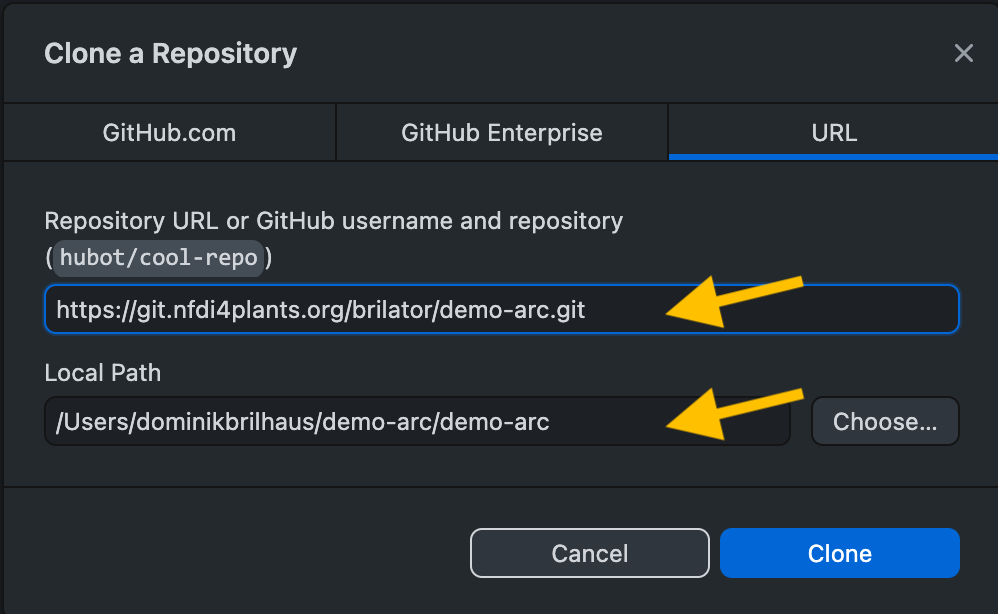</a>  |  <a href="./GitHub_Desktop_clone.png" target="_blank">https://nfdi4plants.org/nfdi4plants.knowledgebase/docs/img/GitHub_Desktop_clone.png</a>  |  [CEPLAS](https://ceplas.eu), DB
  |  <a href="./GitHub_ForkContribute_img1.png" target="_blank">https://nfdi4plants.org/nfdi4plants.knowledgebase/docs/img/GitHub_ForkContribute_img1.png</a>  |  [CEPLAS](https://ceplas.eu), DB
<a href="./githubDesktop_accessToken.png" target="_blank">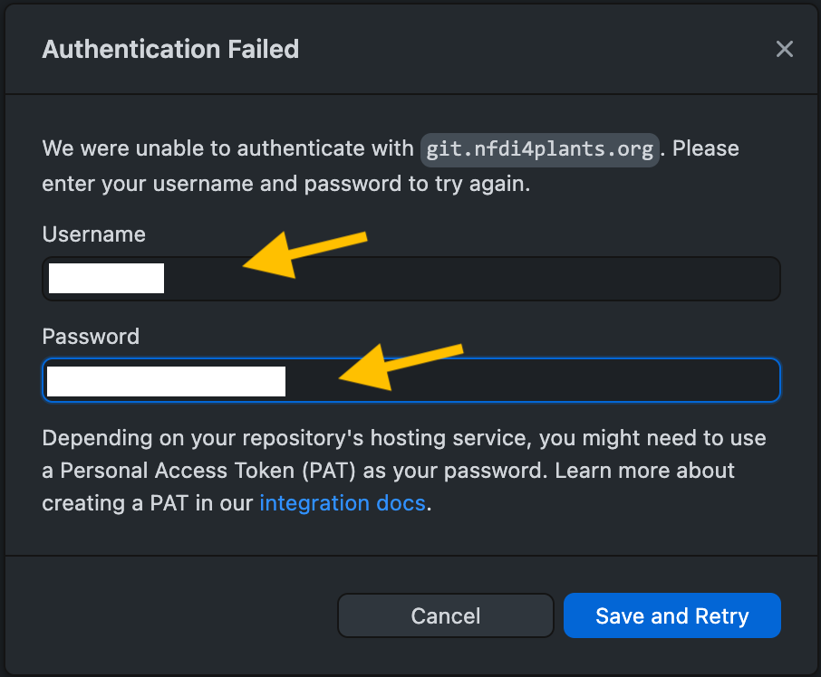</a>  |  <a href="./githubDesktop_accessToken.png" target="_blank">https://nfdi4plants.org/nfdi4plants.knowledgebase/docs/img/githubDesktop_accessToken.png</a>  
<a href="./githubDesktop_clone.png" target="_blank">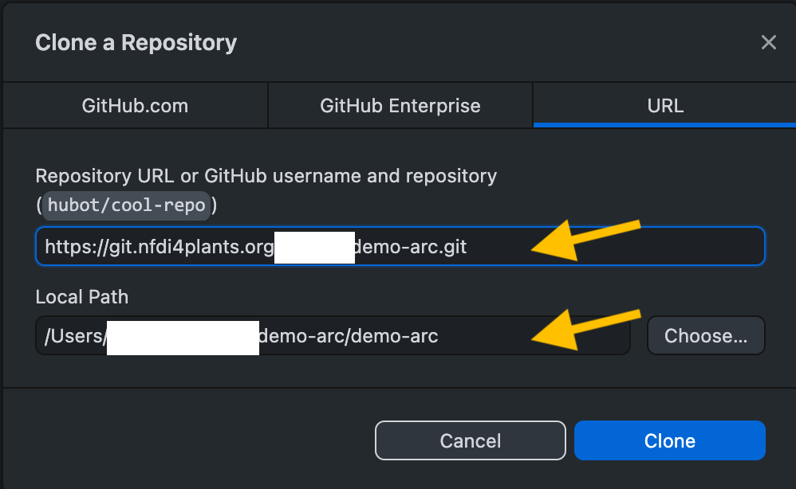</a>  |  <a href="./githubDesktop_clone.png" target="_blank">https://nfdi4plants.org/nfdi4plants.knowledgebase/docs/img/githubDesktop_clone.png</a>  
<a href="./gitlab_roles_img1.png" target="_blank">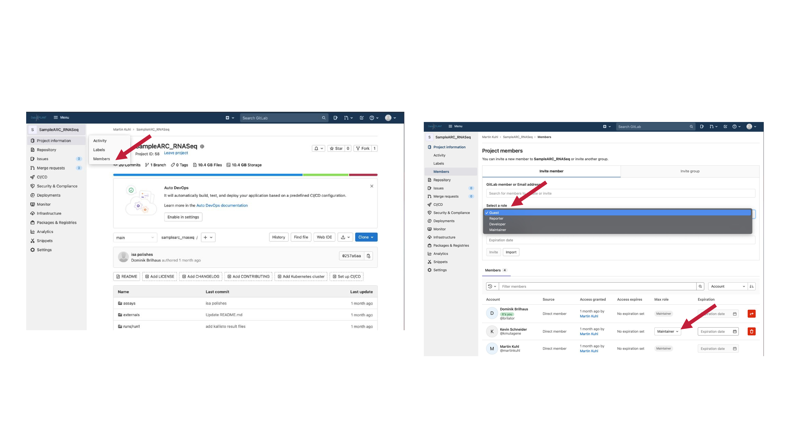</a>  |  <a href="./gitlab_roles_img1.png" target="_blank">https://nfdi4plants.org/nfdi4plants.knowledgebase/docs/img/gitlab_roles_img1.png</a>  | TA3-[DataPLANT](nfdi4plants.org)
  |  <a href="./hackathon_group.png" target="_blank">https://nfdi4plants.org/nfdi4plants.knowledgebase/docs/img/hackathon_group.png</a>  | TA3-[DataPLANT](nfdi4plants.org)
  |  <a href="./icons-characters-dataSpecialist.drawio.png" target="_blank">https://nfdi4plants.org/nfdi4plants.knowledgebase/docs/img/icons-characters-dataSpecialist.drawio.png</a>  
  |  <a href="./icons-characters-dataSteward.drawio.png" target="_blank">https://nfdi4plants.org/nfdi4plants.knowledgebase/docs/img/icons-characters-dataSteward.drawio.png</a>  
  |  <a href="./icons-characters-PhDStudent.drawio.png" target="_blank">https://nfdi4plants.org/nfdi4plants.knowledgebase/docs/img/icons-characters-PhDStudent.drawio.png</a>  
  |  <a href="./icons-characters-PI.drawio.png" target="_blank">https://nfdi4plants.org/nfdi4plants.knowledgebase/docs/img/icons-characters-PI.drawio.png</a>  
  |  <a href="./icons-characters-serviceProvider.drawio.png" target="_blank">https://nfdi4plants.org/nfdi4plants.knowledgebase/docs/img/icons-characters-serviceProvider.drawio.png</a>  
  |  <a href="./icons-characters.drawio.png" target="_blank">https://nfdi4plants.org/nfdi4plants.knowledgebase/docs/img/icons-characters.drawio.png</a> | [CEPLAS](https://ceplas.eu), DB
  |  <a href="./icons-computer.drawio.png" target="_blank">https://nfdi4plants.org/nfdi4plants.knowledgebase/docs/img/icons-computer.drawio.png</a>  | [CEPLAS](https://ceplas.eu), DB
  |  <a href="./Infrastructure_ServerStatus_img1.png" target="_blank">https://nfdi4plants.org/nfdi4plants.knowledgebase/docs/img/Infrastructure_ServerStatus_img1.png</a>  | TA3-[DataPLANT](nfdi4plants.org)
<a href="./Infrastructure_ServerStatus_MaintenanceExample_img1.png" target="_blank">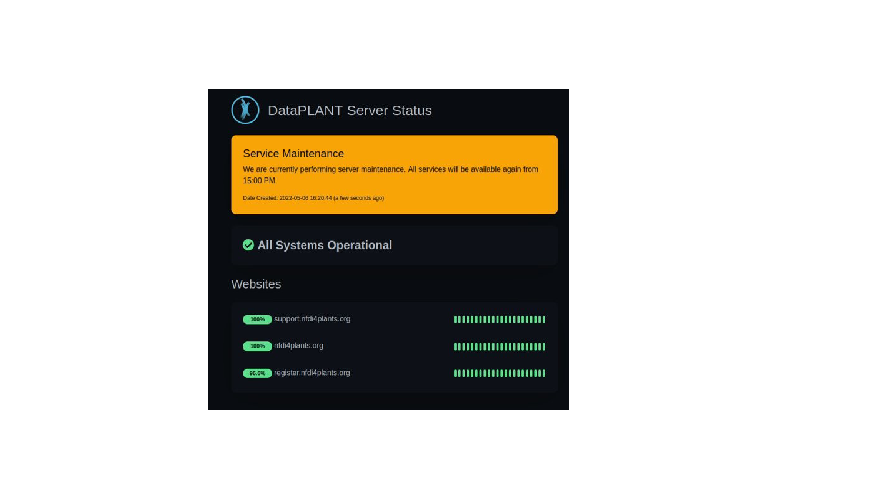</a>  |  <a href="./Infrastructure_ServerStatus_MaintenanceExample_img1.png" target="_blank">https://nfdi4plants.org/nfdi4plants.knowledgebase/docs/img/Infrastructure_ServerStatus_MaintenanceExample_img1.png</a>  | TA3-[DataPLANT](nfdi4plants.org)
<a href="./Infrastructure_ServerStatus_MaintenanceExample.svg" target="_blank">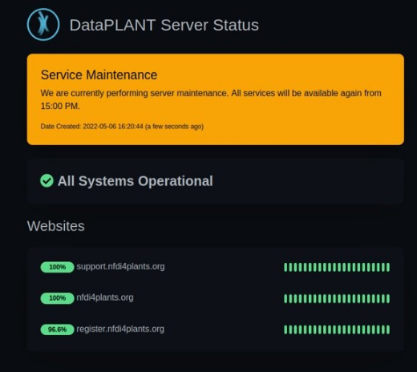</a>  |  <a href="./Infrastructure_ServerStatus_MaintenanceExample.svg" target="_blank">https://nfdi4plants.org/nfdi4plants.knowledgebase/docs/img/Infrastructure_ServerStatus_MaintenanceExample.svg</a>  
<a href="./Infrastructure_ServerStatus.svg" target="_blank">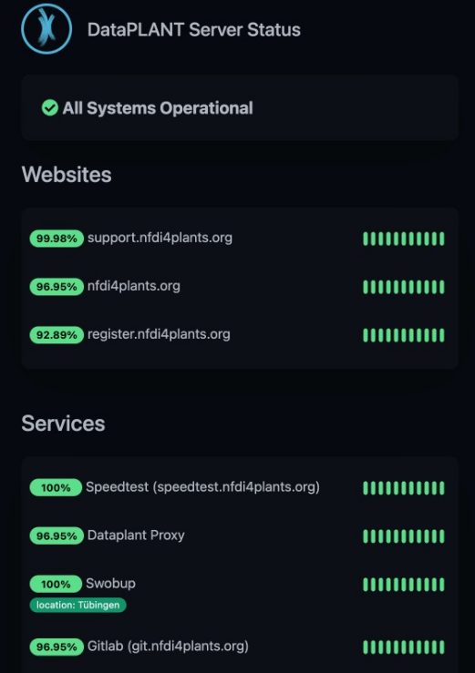</a>  |  <a href="./Infrastructure_ServerStatus.svg" target="_blank">https://nfdi4plants.org/nfdi4plants.knowledgebase/docs/img/Infrastructure_ServerStatus.svg</a>  
<a href="./ISA_AbstractModel.png" target="_blank">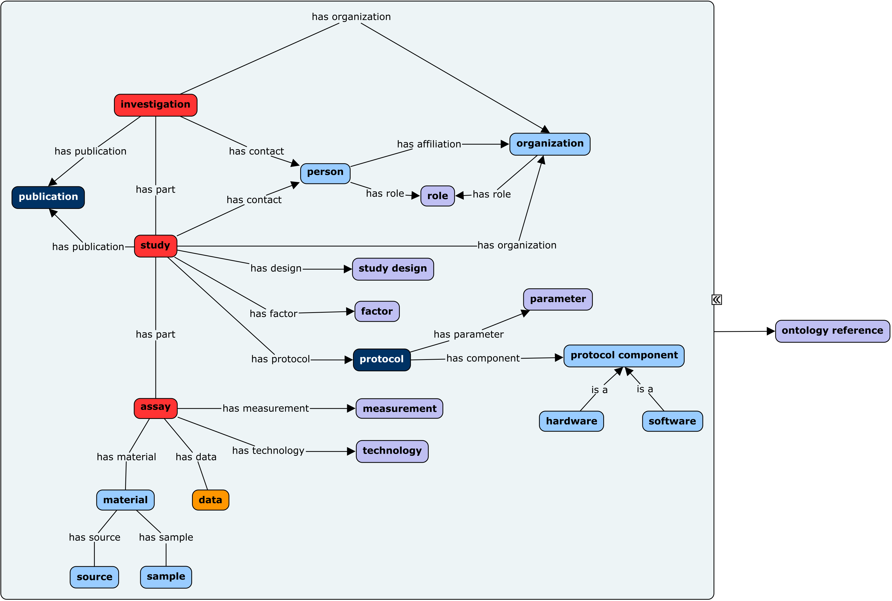</a>  |  <a href="./ISA_AbstractModel.png" target="_blank">https://nfdi4plants.org/nfdi4plants.knowledgebase/docs/img/ISA_AbstractModel.png</a>  |  https://isa-specs.readthedocs.io/en/latest/isamodel.html#
  |  <a href="./ISA_AnnotationPattern_MixingSamples.svg" target="_blank">https://nfdi4plants.org/nfdi4plants.knowledgebase/docs/img/ISA_AnnotationPattern_MixingSamples.svg</a>  
  |  <a href="./ISA_AnnotationPattern_Replicates.svg" target="_blank">https://nfdi4plants.org/nfdi4plants.knowledgebase/docs/img/ISA_AnnotationPattern_Replicates.svg</a>  
  |  <a href="./ISA_AnnotationPattern_TimeSeries.svg" target="_blank">https://nfdi4plants.org/nfdi4plants.knowledgebase/docs/img/ISA_AnnotationPattern_TimeSeries.svg</a>  
  |  <a href="./ISAmodel_ARC01_img01.svg" target="_blank">https://nfdi4plants.org/nfdi4plants.knowledgebase/docs/img/ISAmodel_ARC01_img01.svg</a>  | [CEPLAS](https://ceplas.eu), DB; TA3-[DataPLANT](nfdi4plants.org)
  |  <a href="./ISAmodel_ARC01_img02.svg" target="_blank">https://nfdi4plants.org/nfdi4plants.knowledgebase/docs/img/ISAmodel_ARC01_img02.svg</a>  | [CEPLAS](https://ceplas.eu), DB; TA3-[DataPLANT](nfdi4plants.org)
  |  <a href="./ISAmodel_ARC01_img03.svg" target="_blank">https://nfdi4plants.org/nfdi4plants.knowledgebase/docs/img/ISAmodel_ARC01_img03.svg</a>  | [CEPLAS](https://ceplas.eu), DB; TA3-[DataPLANT](nfdi4plants.org)
  |  <a href="./ISAmodel_ARC01_img04.svg" target="_blank">https://nfdi4plants.org/nfdi4plants.knowledgebase/docs/img/ISAmodel_ARC01_img04.svg</a>  | [CEPLAS](https://ceplas.eu), DB; TA3-[DataPLANT](nfdi4plants.org)
  |  <a href="./ISAmodel_ARC01_img05.svg" target="_blank">https://nfdi4plants.org/nfdi4plants.knowledgebase/docs/img/ISAmodel_ARC01_img05.svg</a>  | [CEPLAS](https://ceplas.eu), DB; TA3-[DataPLANT](nfdi4plants.org)
<a href="./ISAmodel_ARC01_img1.png" target="_blank">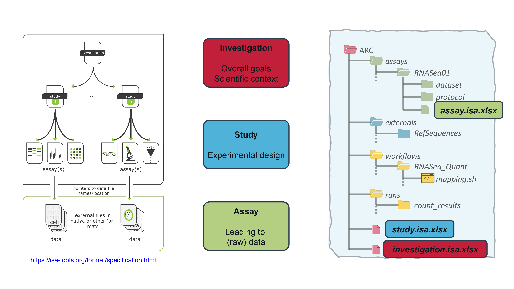</a>  |  <a href="./ISAmodel_ARC01_img1.png" target="_blank">https://nfdi4plants.org/nfdi4plants.knowledgebase/docs/img/ISAmodel_ARC01_img1.png</a>  |  [CEPLAS](https://ceplas.eu), DB
  |  <a href="./ISAmodel_ARC01_img6.svg" target="_blank">https://nfdi4plants.org/nfdi4plants.knowledgebase/docs/img/ISAmodel_ARC01_img6.svg</a>  | [CEPLAS](https://ceplas.eu), DB; TA3-[DataPLANT](nfdi4plants.org)
<a href="./ISAmodel_ARC02_img1.png" target="_blank">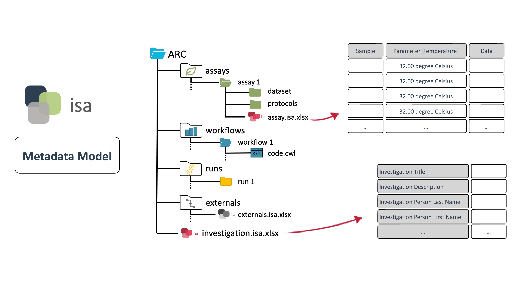</a>  |  <a href="./ISAmodel_ARC02_img1.png" target="_blank">https://nfdi4plants.org/nfdi4plants.knowledgebase/docs/img/ISAmodel_ARC02_img1.png</a>  | [CEPLAS](https://ceplas.eu), DB; TA3-[DataPLANT](nfdi4plants.org)
<a href="./ISAmodel_ARC02.svg" target="_blank">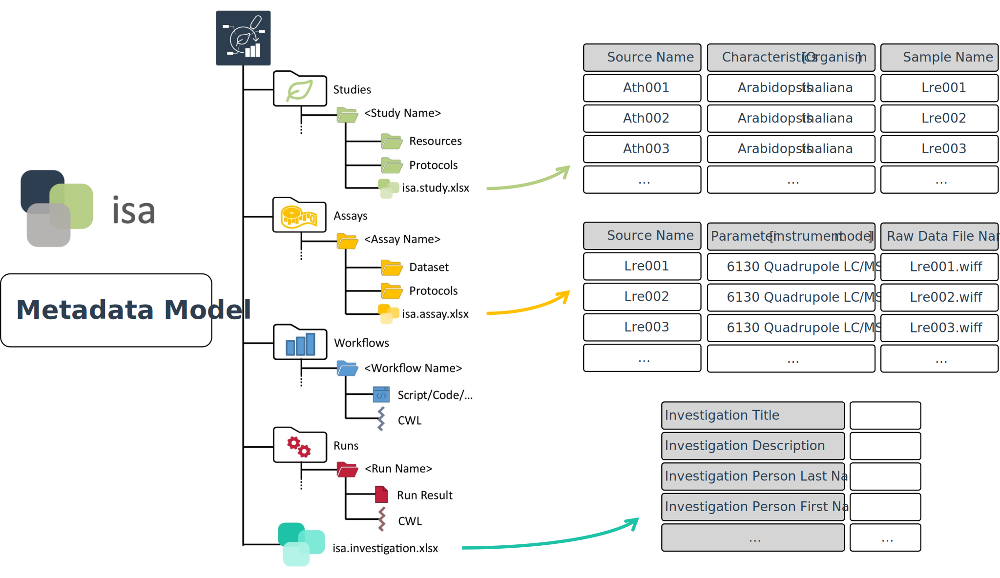</a>  |  <a href="./ISAmodel_ARC02.svg" target="_blank">https://nfdi4plants.org/nfdi4plants.knowledgebase/docs/img/ISAmodel_ARC02.svg</a>  
<a href="./ISAmodel-structure.png" target="_blank">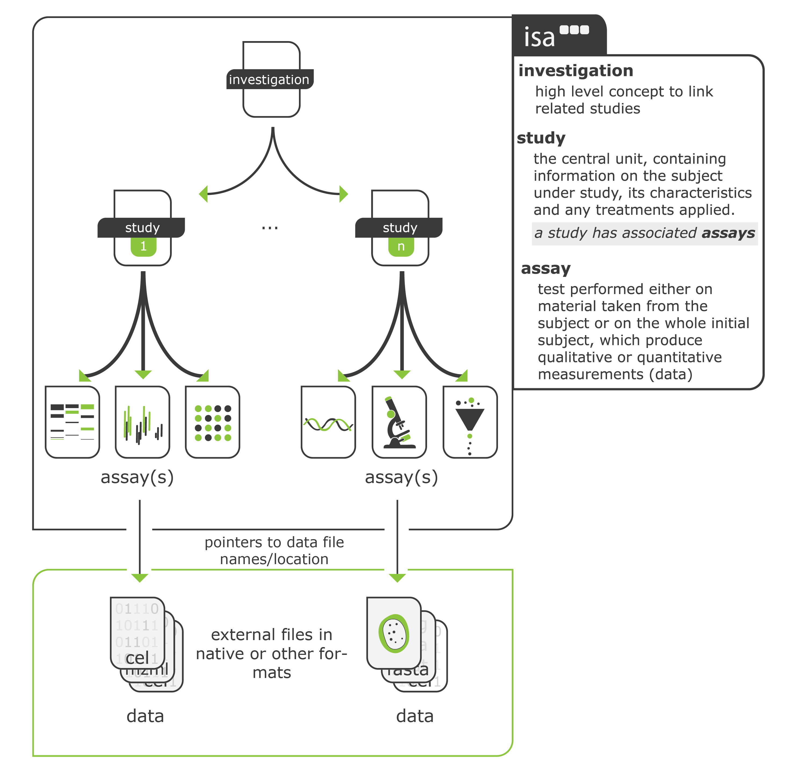</a>  |  <a href="./ISAmodel-structure.png" target="_blank">https://nfdi4plants.org/nfdi4plants.knowledgebase/docs/img/ISAmodel-structure.png</a>  |  https://isa-tools.org/format/specification.html
<a href="./ISAmodel-structure.svg" target="_blank">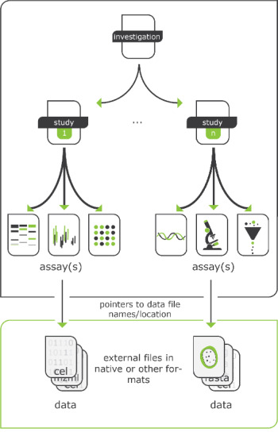</a>  |  <a href="./ISAmodel-structure.svg" target="_blank">https://nfdi4plants.org/nfdi4plants.knowledgebase/docs/img/ISAmodel-structure.svg</a>  
  |  <a href="./knowledgeBase-fornax.drawio.svg" target="_blank">https://nfdi4plants.org/nfdi4plants.knowledgebase/docs/img/knowledgeBase-fornax.drawio.svg</a>  
<a href="./Lifecycle.jpg" target="_blank">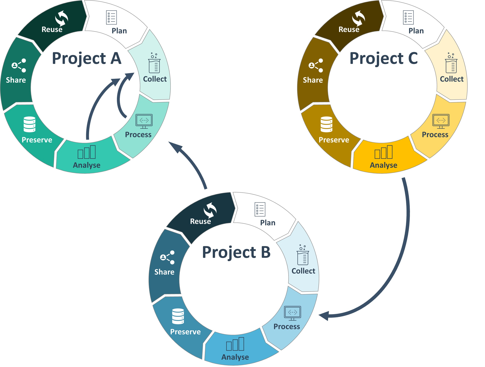</a>  |  <a href="./Lifecycle.jpg" target="_blank">https://nfdi4plants.org/nfdi4plants.knowledgebase/docs/img/Lifecycle.jpg</a>  
<a href="./Metadata_Cube_img1.png" target="_blank">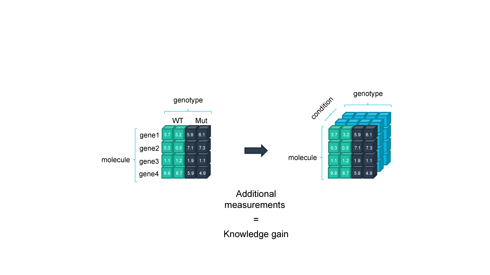</a>  |  <a href="./Metadata_Cube_img1.png" target="_blank">https://nfdi4plants.org/nfdi4plants.knowledgebase/docs/img/Metadata_Cube_img1.png</a>  | TA3-[DataPLANT](nfdi4plants.org)
<a href="./Metadata_Cube.svg" target="_blank">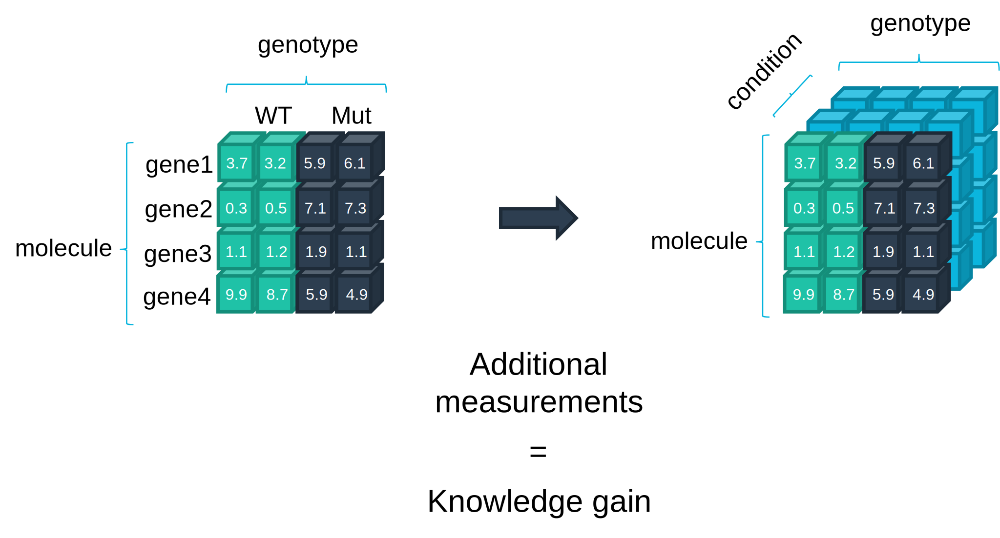</a>  |  <a href="./Metadata_Cube.svg" target="_blank">https://nfdi4plants.org/nfdi4plants.knowledgebase/docs/img/Metadata_Cube.svg</a>  
<a href="./Metadata_DynamicSchemaGeneration_img1.png" target="_blank">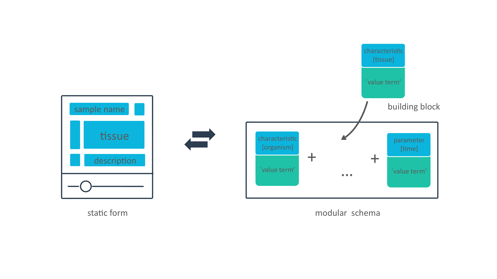</a>  |  <a href="./Metadata_DynamicSchemaGeneration_img1.png" target="_blank">https://nfdi4plants.org/nfdi4plants.knowledgebase/docs/img/Metadata_DynamicSchemaGeneration_img1.png</a>  | TA3-[DataPLANT](nfdi4plants.org)
<a href="./Metadata_DynamicSchemaGeneration.svg" target="_blank">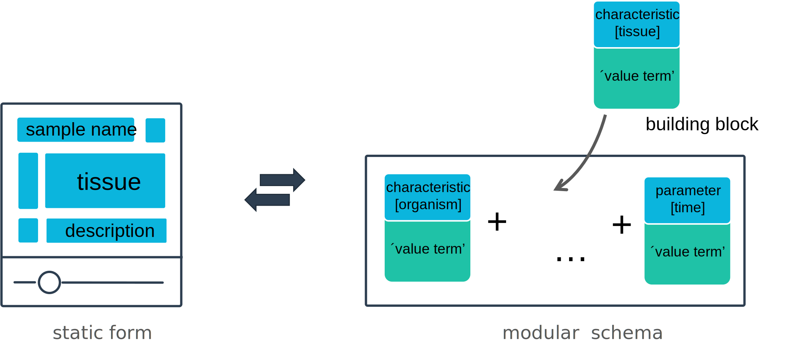</a>  |  <a href="./Metadata_DynamicSchemaGeneration.svg" target="_blank">https://nfdi4plants.org/nfdi4plants.knowledgebase/docs/img/Metadata_DynamicSchemaGeneration.svg</a>  
<a href="./Metadata_Templates_Illustration_img1.png" target="_blank">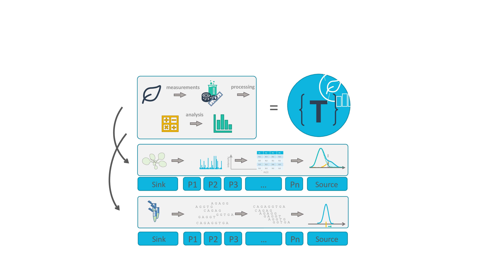</a>  |  <a href="./Metadata_Templates_Illustration_img1.png" target="_blank">https://nfdi4plants.org/nfdi4plants.knowledgebase/docs/img/Metadata_Templates_Illustration_img1.png</a>  | TA3-[DataPLANT](nfdi4plants.org)
<a href="./Metadata_Templates_IllustrationParentChildTerm_img1.png" target="_blank">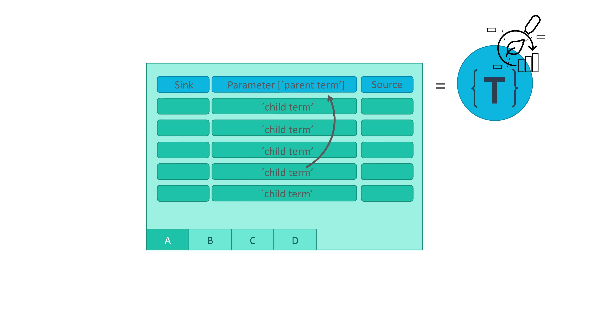</a>  |  <a href="./Metadata_Templates_IllustrationParentChildTerm_img1.png" target="_blank">https://nfdi4plants.org/nfdi4plants.knowledgebase/docs/img/Metadata_Templates_IllustrationParentChildTerm_img1.png</a>  | TA3-[DataPLANT](nfdi4plants.org)
<a href="./Metadata_Templates_IllustrationParentChildTerm.svg" target="_blank">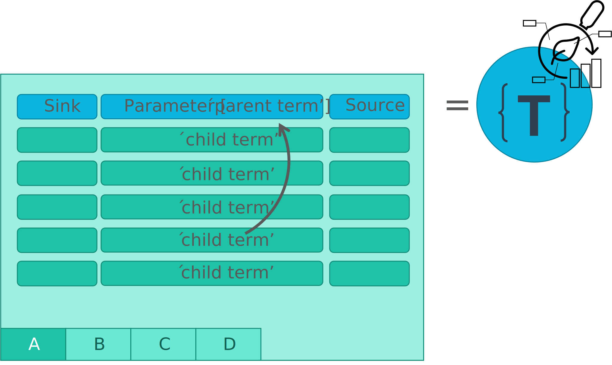</a>  |  <a href="./Metadata_Templates_IllustrationParentChildTerm.svg" target="_blank">https://nfdi4plants.org/nfdi4plants.knowledgebase/docs/img/Metadata_Templates_IllustrationParentChildTerm.svg</a>  
<a href="./Metadata_Templates_Overview_img1.png" target="_blank">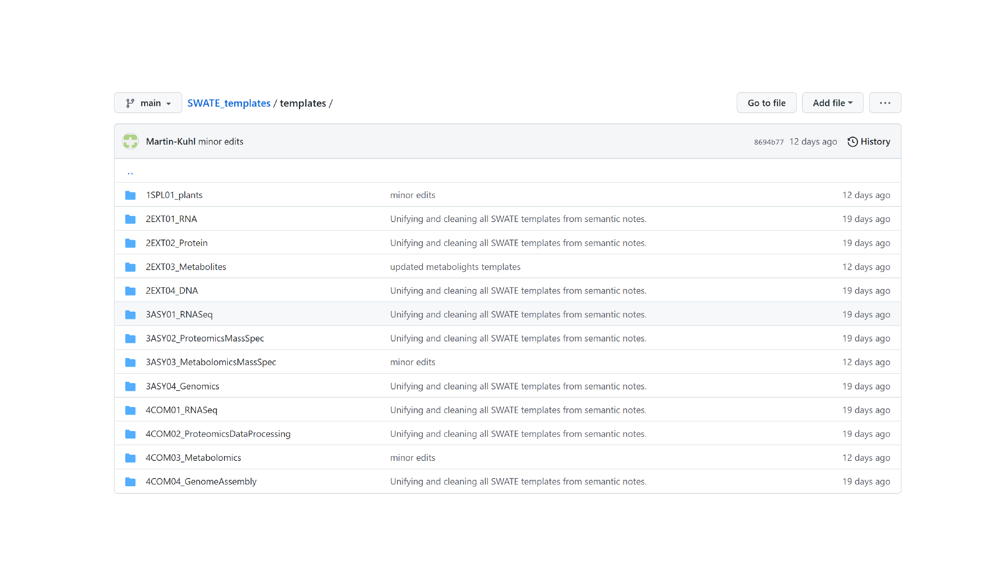</a>  |  <a href="./Metadata_Templates_Overview_img1.png" target="_blank">https://nfdi4plants.org/nfdi4plants.knowledgebase/docs/img/Metadata_Templates_Overview_img1.png</a>  | TA3-[DataPLANT](nfdi4plants.org)
<a href="./Metadata_Templates_Overview.svg" target="_blank">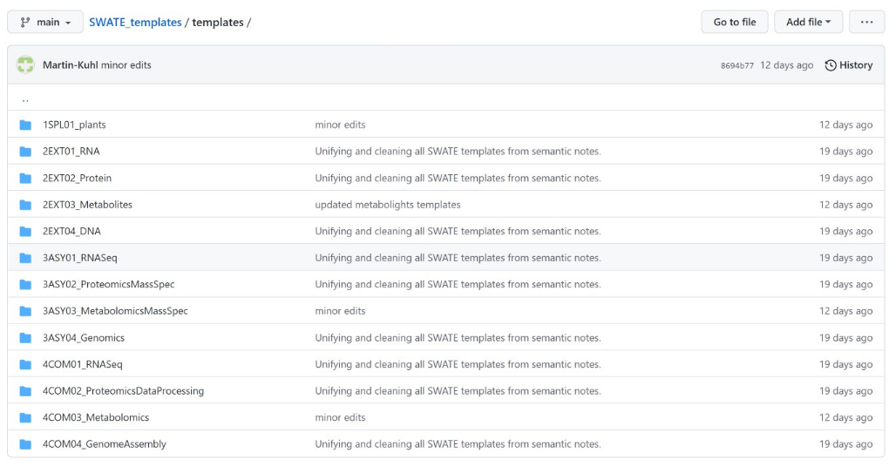</a>  |  <a href="./Metadata_Templates_Overview.svg" target="_blank">https://nfdi4plants.org/nfdi4plants.knowledgebase/docs/img/Metadata_Templates_Overview.svg</a>  
<a href="./Metadata_Toolchain_img1.png" target="_blank">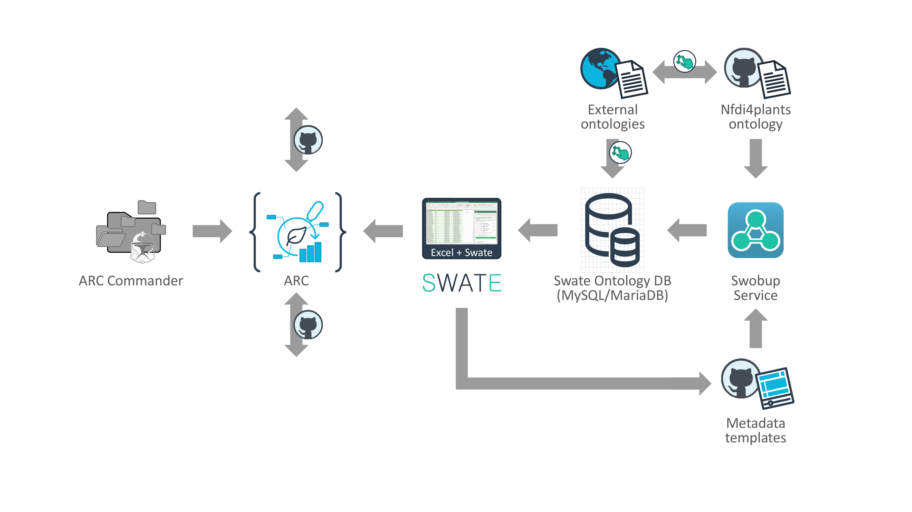</a>  |  <a href="./Metadata_Toolchain_img1.png" target="_blank">https://nfdi4plants.org/nfdi4plants.knowledgebase/docs/img/Metadata_Toolchain_img1.png</a>  | TA3-[DataPLANT](nfdi4plants.org)
<a href="./Metadata_Toolchain_Repositories.svg" target="_blank">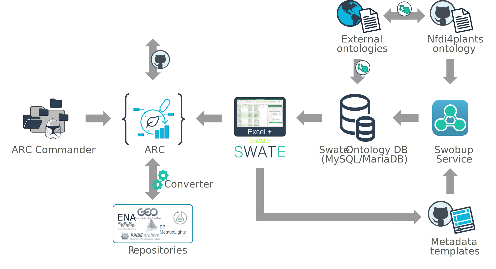</a>  |  <a href="./Metadata_Toolchain_Repositories.svg" target="_blank">https://nfdi4plants.org/nfdi4plants.knowledgebase/docs/img/Metadata_Toolchain_Repositories.svg</a>  | TA3-[DataPLANT](nfdi4plants.org)
<a href="./Metadata_Toolchain.svg" target="_blank">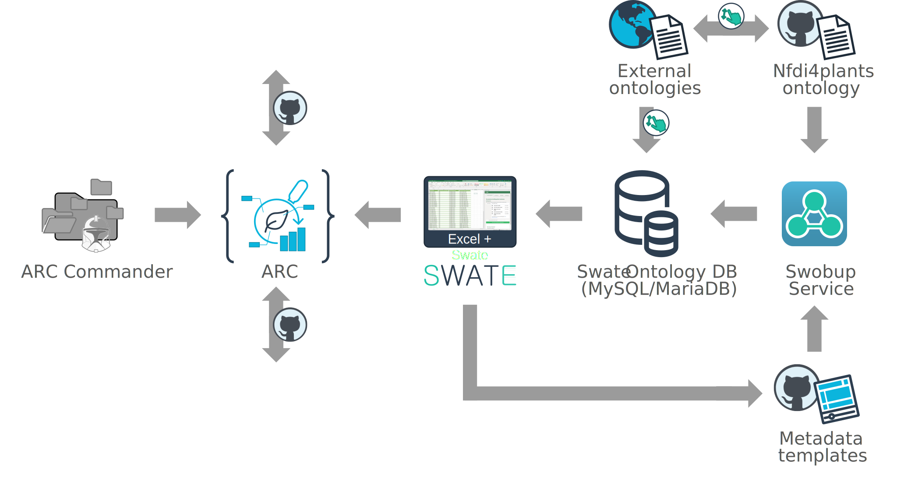</a>  |  <a href="./Metadata_Toolchain.svg" target="_blank">https://nfdi4plants.org/nfdi4plants.knowledgebase/docs/img/Metadata_Toolchain.svg</a>  
<a href="./NFDI_CrossCutting.svg" target="_blank">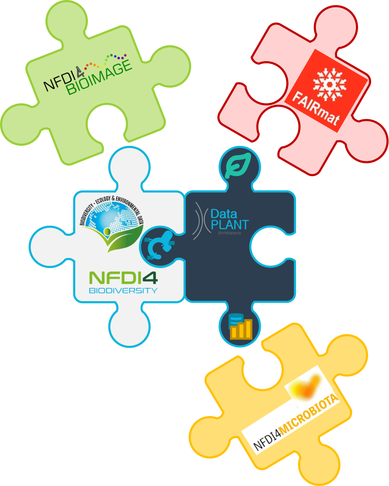</a>  |  <a href="./NFDI_CrossCutting.svg" target="_blank">https://nfdi4plants.org/nfdi4plants.knowledgebase/docs/img/NFDI_CrossCutting.svg</a>  | TA3-[DataPLANT](nfdi4plants.org)
  |  <a href="./NFDI_DockingExistingConsortia_img1.png" target="_blank">https://nfdi4plants.org/nfdi4plants.knowledgebase/docs/img/NFDI_DockingExistingConsortia_img1.png</a>  | TA3-[DataPLANT](nfdi4plants.org)
<a href="./NFDI_DockingExistingConsortia.svg" target="_blank">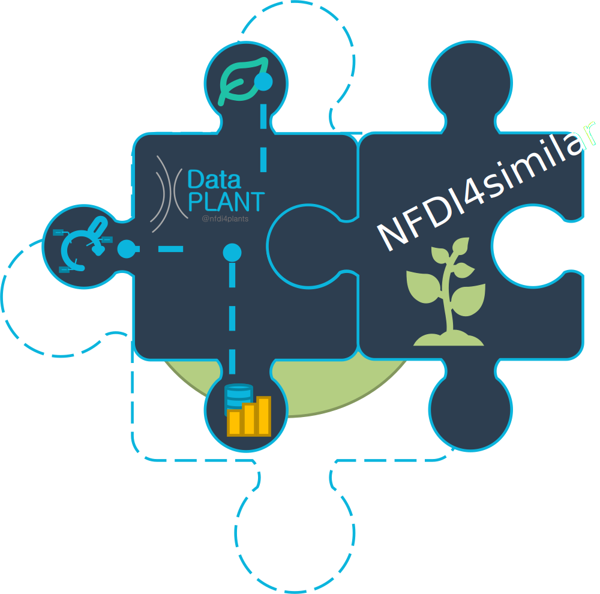</a>  |  <a href="./NFDI_DockingExistingConsortia.svg" target="_blank">https://nfdi4plants.org/nfdi4plants.knowledgebase/docs/img/NFDI_DockingExistingConsortia.svg</a>  
<a href="./NFDI_Future_img1.png" target="_blank">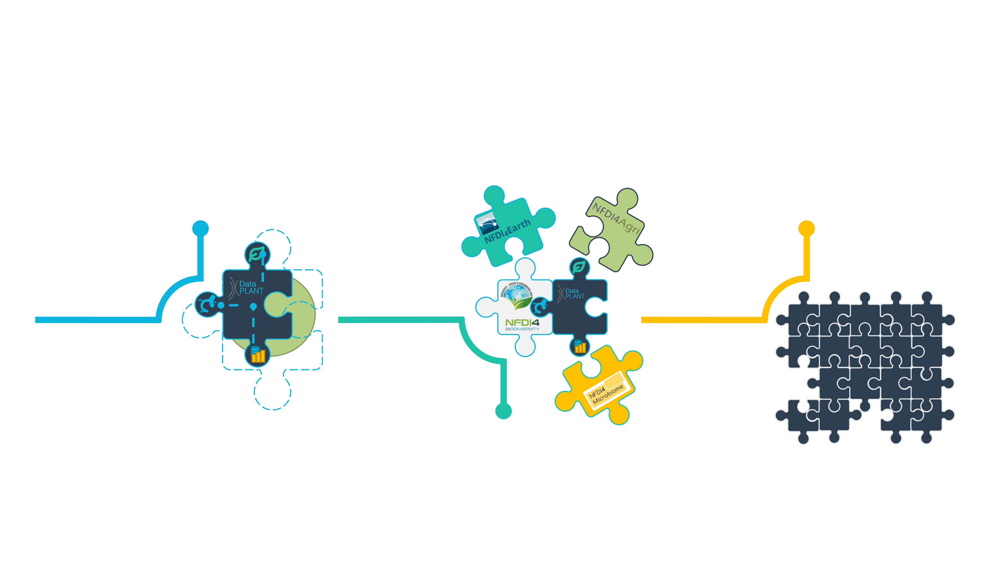</a>  |  <a href="./NFDI_Future_img1.png" target="_blank">https://nfdi4plants.org/nfdi4plants.knowledgebase/docs/img/NFDI_Future_img1.png</a>  | TA3-[DataPLANT](nfdi4plants.org)
<a href="./NFDI_Future.svg" target="_blank">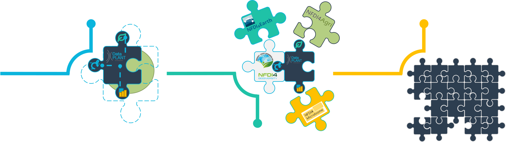</a>  |  <a href="./NFDI_Future.svg" target="_blank">https://nfdi4plants.org/nfdi4plants.knowledgebase/docs/img/NFDI_Future.svg</a>  
  |  <a href="./NFDI_PotentialParticipantOnboarding_img1.png" target="_blank">https://nfdi4plants.org/nfdi4plants.knowledgebase/docs/img/NFDI_PotentialParticipantOnboarding_img1.png</a>  | TA3-[DataPLANT](nfdi4plants.org)
  |  <a href="./NFDI_PotentialParticipantOnboarding.svg" target="_blank">https://nfdi4plants.org/nfdi4plants.knowledgebase/docs/img/NFDI_PotentialParticipantOnboarding.svg</a>  
<a href="./Ontologies_BridgingOntologyGap_Swate.svg" target="_blank">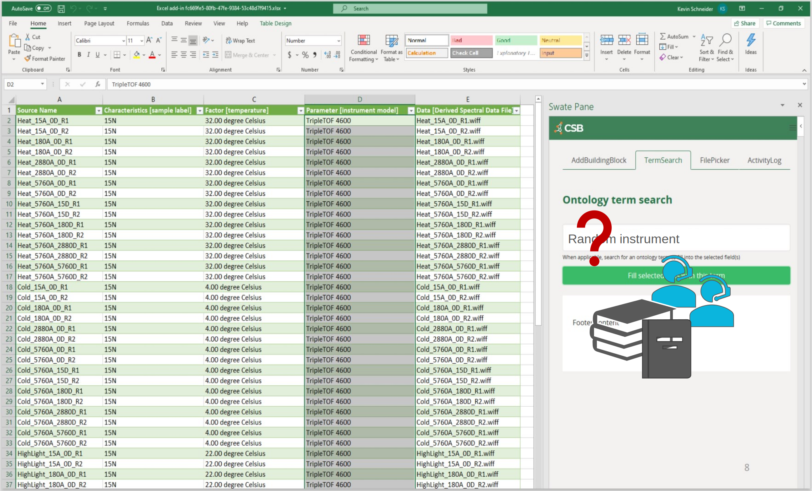</a>  |  <a href="./Ontologies_BridgingOntologyGap_Swate.svg" target="_blank">https://nfdi4plants.org/nfdi4plants.knowledgebase/docs/img/Ontologies_BridgingOntologyGap_Swate.svg</a>  | TA3-[DataPLANT](nfdi4plants.org)
<a href="./Ontologies_BridgingOntologyGap.svg" target="_blank">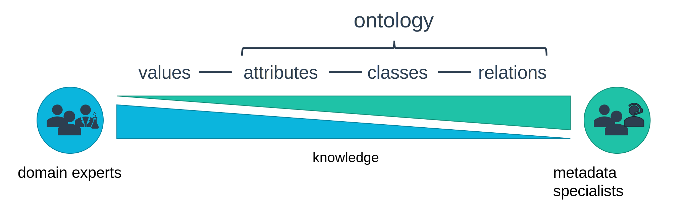</a>  |  <a href="./Ontologies_BridgingOntologyGap.svg" target="_blank">https://nfdi4plants.org/nfdi4plants.knowledgebase/docs/img/Ontologies_BridgingOntologyGap.svg</a>  | TA3-[DataPLANT](nfdi4plants.org)
<a href="./Ontologies_DictionariesIllustration_IDs.svg" target="_blank">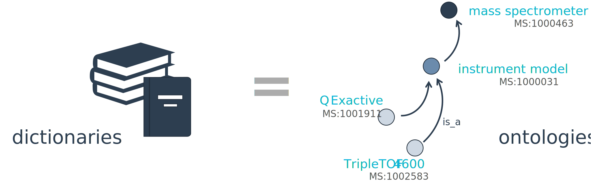</a>  |  <a href="./Ontologies_DictionariesIllustration_IDs.svg" target="_blank">https://nfdi4plants.org/nfdi4plants.knowledgebase/docs/img/Ontologies_DictionariesIllustration_IDs.svg</a>  | TA3-[DataPLANT](nfdi4plants.org)
<a href="./Ontologies_DictionariesIllustration.svg" target="_blank">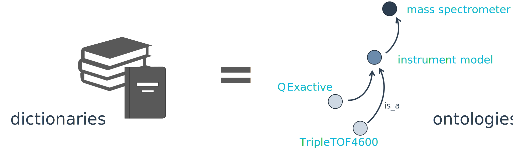</a>  |  <a href="./Ontologies_DictionariesIllustration.svg" target="_blank">https://nfdi4plants.org/nfdi4plants.knowledgebase/docs/img/Ontologies_DictionariesIllustration.svg</a>  | TA3-[DataPLANT](nfdi4plants.org)
  |  <a href="./Ontologies_EMailNotification.svg" target="_blank">https://nfdi4plants.org/nfdi4plants.knowledgebase/docs/img/Ontologies_EMailNotification.svg</a>  | TA3-[DataPLANT](nfdi4plants.org)
  |  <a href="./Ontologies_pizzaAnalogy_seq1.png" target="_blank">https://nfdi4plants.org/nfdi4plants.knowledgebase/docs/img/Ontologies_pizzaAnalogy_seq1.png</a>  |  [CEPLAS](https://ceplas.eu), DB
  |  <a href="./Ontologies_pizzaAnalogy_seq2.png" target="_blank">https://nfdi4plants.org/nfdi4plants.knowledgebase/docs/img/Ontologies_pizzaAnalogy_seq2.png</a>  |  [CEPLAS](https://ceplas.eu), DB
  |  <a href="./Ontologies_pizzaAnalogy_seq3.png" target="_blank">https://nfdi4plants.org/nfdi4plants.knowledgebase/docs/img/Ontologies_pizzaAnalogy_seq3.png</a>  |  [CEPLAS](https://ceplas.eu), DB
  |  <a href="./Ontologies_pizzaAnalogy_seq4.png" target="_blank">https://nfdi4plants.org/nfdi4plants.knowledgebase/docs/img/Ontologies_pizzaAnalogy_seq4.png</a>  |  [CEPLAS](https://ceplas.eu), DB
  |  <a href="./Ontologies_pizzaAnalogy_seq5.png" target="_blank">https://nfdi4plants.org/nfdi4plants.knowledgebase/docs/img/Ontologies_pizzaAnalogy_seq5.png</a>  |  [CEPLAS](https://ceplas.eu), DB
  |  <a href="./Ontologies_pizzaAnalogy_seq6.png" target="_blank">https://nfdi4plants.org/nfdi4plants.knowledgebase/docs/img/Ontologies_pizzaAnalogy_seq6.png</a>  |  [CEPLAS](https://ceplas.eu), DB
  |  <a href="./Ontologies_pizzaAnalogy_seq7.png" target="_blank">https://nfdi4plants.org/nfdi4plants.knowledgebase/docs/img/Ontologies_pizzaAnalogy_seq7.png</a>  |  [CEPLAS](https://ceplas.eu), DB
  |  <a href="./Ontologies_pizzaAnalogy_seq8.png" target="_blank">https://nfdi4plants.org/nfdi4plants.knowledgebase/docs/img/Ontologies_pizzaAnalogy_seq8.png</a>  |  [CEPLAS](https://ceplas.eu), DB
  |  <a href="./Ontologies_pizzaAnalogy_seq9.png" target="_blank">https://nfdi4plants.org/nfdi4plants.knowledgebase/docs/img/Ontologies_pizzaAnalogy_seq9.png</a>  |  [CEPLAS](https://ceplas.eu), DB
<a href="./Ontologies_Protege.svg" target="_blank">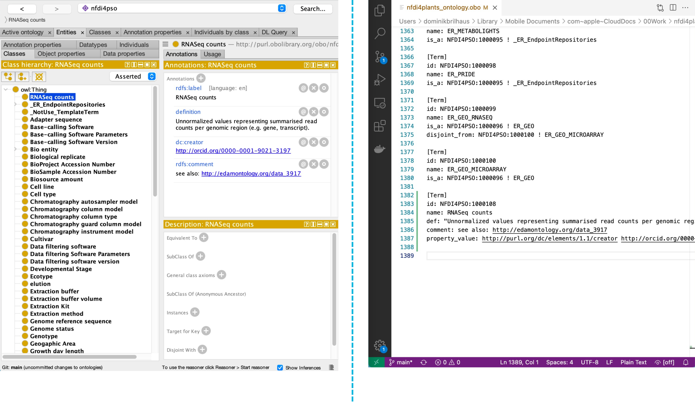</a>  |  <a href="./Ontologies_Protege.svg" target="_blank">https://nfdi4plants.org/nfdi4plants.knowledgebase/docs/img/Ontologies_Protege.svg</a>  | TA3-[DataPLANT](nfdi4plants.org)
<a href="./Ontologies_UpdateUsingGithub.svg" target="_blank">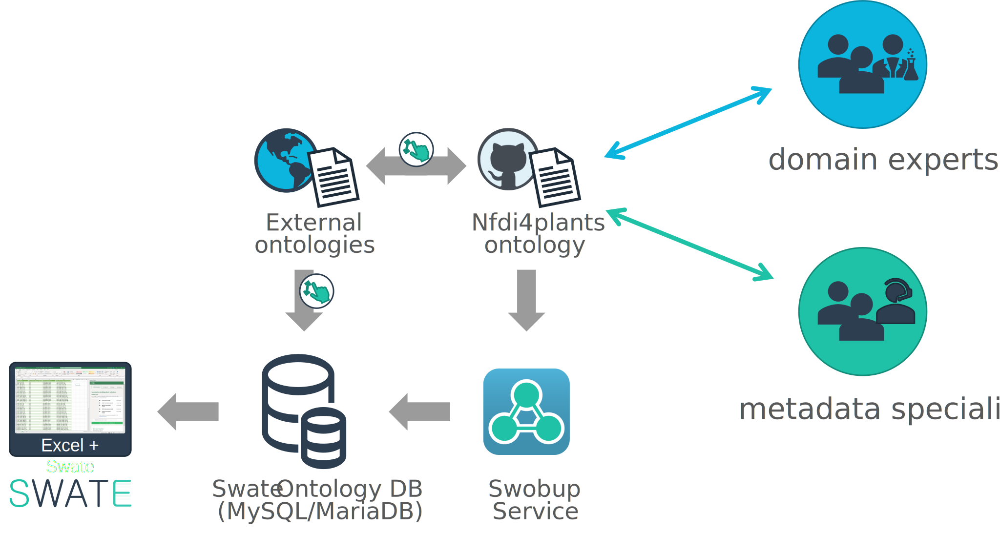</a>  |  <a href="./Ontologies_UpdateUsingGithub.svg" target="_blank">https://nfdi4plants.org/nfdi4plants.knowledgebase/docs/img/Ontologies_UpdateUsingGithub.svg</a>  | TA3-[DataPLANT](nfdi4plants.org)
  |  <a href="./Partners_Galaxy_img1.png" target="_blank">https://nfdi4plants.org/nfdi4plants.knowledgebase/docs/img/Partners_Galaxy_img1.png</a>  | TA3-[DataPLANT](nfdi4plants.org)
<a href="./Partners_Galaxy.svg" target="_blank">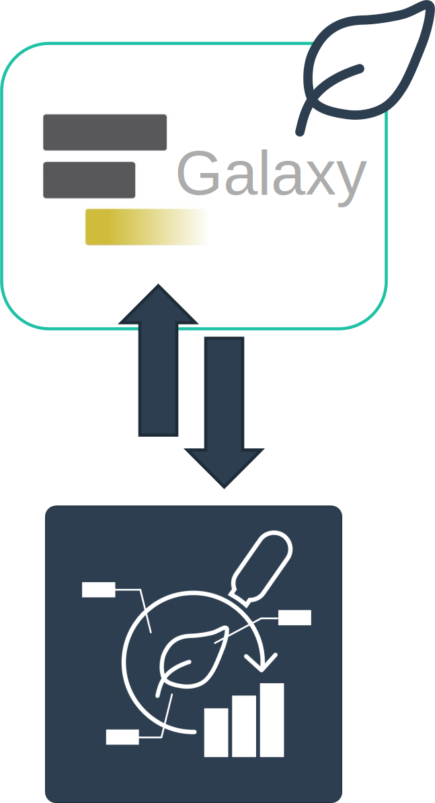</a>  |  <a href="./Partners_Galaxy.svg" target="_blank">https://nfdi4plants.org/nfdi4plants.knowledgebase/docs/img/Partners_Galaxy.svg</a>  
  |  <a href="./Person_idea_experiment_img1.png" target="_blank">https://nfdi4plants.org/nfdi4plants.knowledgebase/docs/img/Person_idea_experiment_img1.png</a>  | TA3-[DataPLANT](nfdi4plants.org)
  |  <a href="./Person_idea_experiment.svg" target="_blank">https://nfdi4plants.org/nfdi4plants.knowledgebase/docs/img/Person_idea_experiment.svg</a>  
  |  <a href="./Person_idea_img1.png" target="_blank">https://nfdi4plants.org/nfdi4plants.knowledgebase/docs/img/Person_idea_img1.png</a>  | TA3-[DataPLANT](nfdi4plants.org)
  |  <a href="./Person_idea.svg" target="_blank">https://nfdi4plants.org/nfdi4plants.knowledgebase/docs/img/Person_idea.svg</a>  
<a href="./plant_ontology_image.png" target="_blank">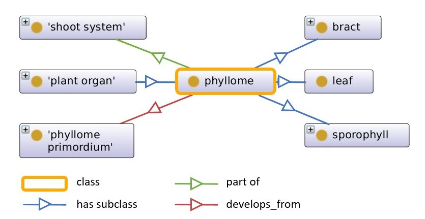</a>  |  <a href="./plant_ontology_image.png" target="_blank">https://nfdi4plants.org/nfdi4plants.knowledgebase/docs/img/plant_ontology_image.png</a>  
<a href="./PlantNetwork_img1.png" target="_blank">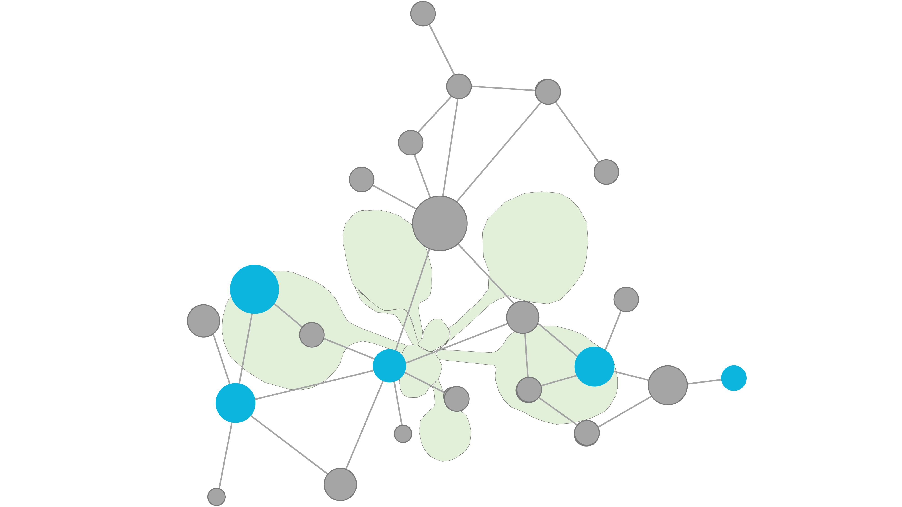</a>  |  <a href="./PlantNetwork_img1.png" target="_blank">https://nfdi4plants.org/nfdi4plants.knowledgebase/docs/img/PlantNetwork_img1.png</a>  | TA3-[DataPLANT](nfdi4plants.org)
  |  <a href="./PlantNetwork_White_img1.png" target="_blank">https://nfdi4plants.org/nfdi4plants.knowledgebase/docs/img/PlantNetwork_White_img1.png</a>  | TA3-[DataPLANT](nfdi4plants.org)
<a href="./PlantNetwork_White.svg" target="_blank">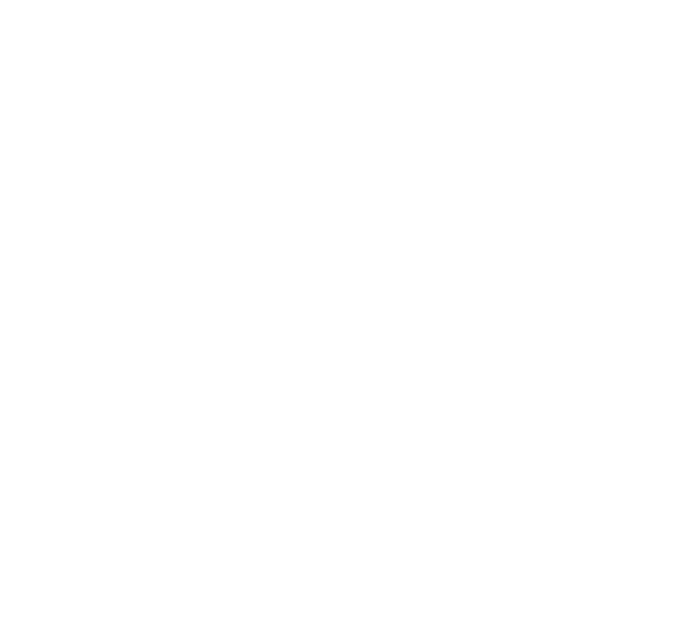</a>  |  <a href="./PlantNetwork_White.svg" target="_blank">https://nfdi4plants.org/nfdi4plants.knowledgebase/docs/img/PlantNetwork_White.svg</a>  
<a href="./PlantNetwork.svg" target="_blank">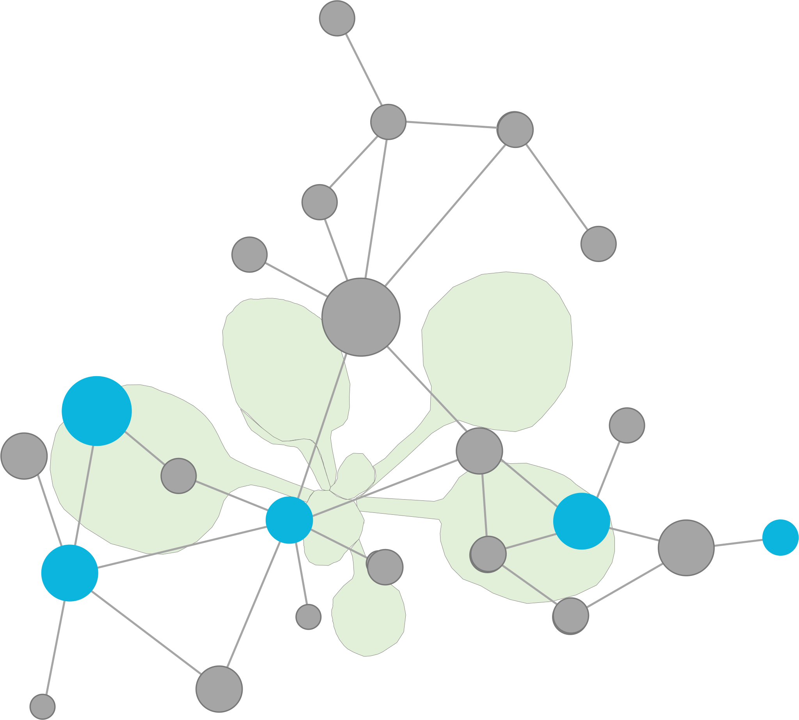</a>  |  <a href="./PlantNetwork.svg" target="_blank">https://nfdi4plants.org/nfdi4plants.knowledgebase/docs/img/PlantNetwork.svg</a>  
  |  <a href="./RDMkit-data_life_cycle_9.svg" target="_blank">https://nfdi4plants.org/nfdi4plants.knowledgebase/docs/img/RDMkit-data_life_cycle_9.svg</a>  |  https://rdmkit.elixir-europe.org/data_life_cycle
  |  <a href="./repositories_genericRepos_collage.drawio.svg" target="_blank">https://nfdi4plants.org/nfdi4plants.knowledgebase/docs/img/repositories_genericRepos_collage.drawio.svg</a>  |  [CEPLAS](https://ceplas.eu), DB
<a href="./repositories_metadataTemplates01_img1.png" target="_blank">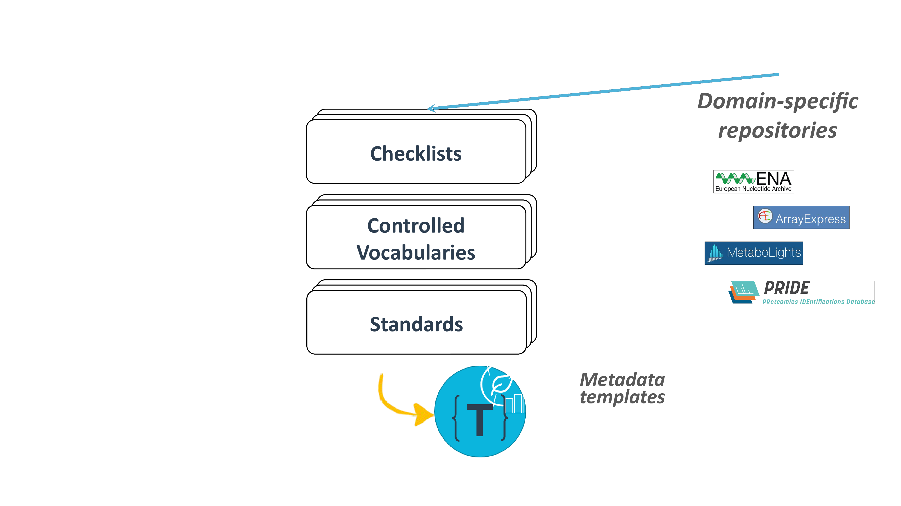</a>  |  <a href="./repositories_metadataTemplates01_img1.png" target="_blank">https://nfdi4plants.org/nfdi4plants.knowledgebase/docs/img/repositories_metadataTemplates01_img1.png</a>  |  [CEPLAS](https://ceplas.eu), DB
<a href="./repositories_submission_seq1.png" target="_blank">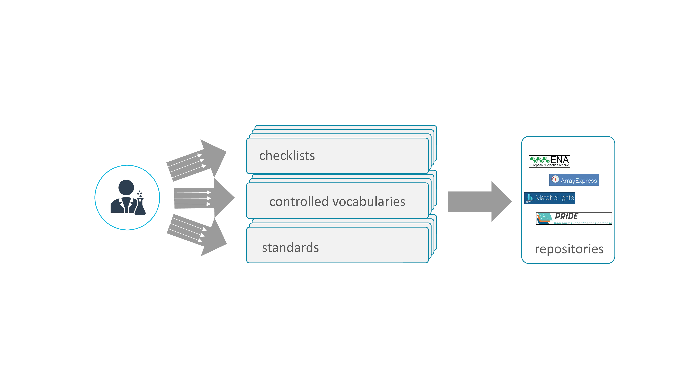</a>  |  <a href="./repositories_submission_seq1.png" target="_blank">https://nfdi4plants.org/nfdi4plants.knowledgebase/docs/img/repositories_submission_seq1.png</a>  | TA3-[DataPLANT](nfdi4plants.org)
<a href="./repositories_submission_seq2.png" target="_blank">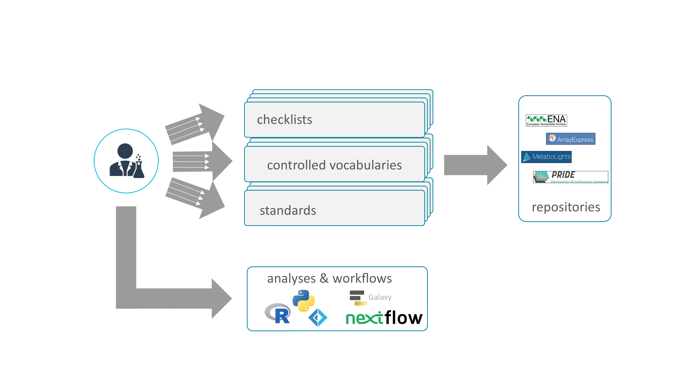</a>  |  <a href="./repositories_submission_seq2.png" target="_blank">https://nfdi4plants.org/nfdi4plants.knowledgebase/docs/img/repositories_submission_seq2.png</a>  | TA3-[DataPLANT](nfdi4plants.org)
<a href="./repositories_submission.png" target="_blank">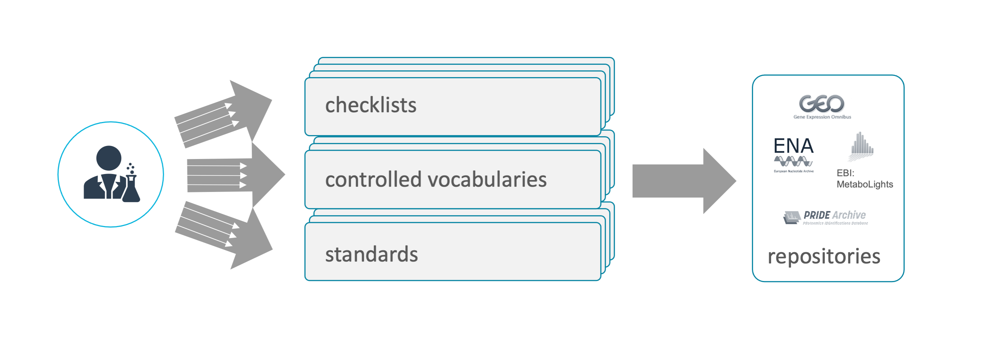</a>  |  <a href="./repositories_submission.png" target="_blank">https://nfdi4plants.org/nfdi4plants.knowledgebase/docs/img/repositories_submission.png</a>  
  |  <a href="./ResearchDataLifecycle_seq1.png" target="_blank">https://nfdi4plants.org/nfdi4plants.knowledgebase/docs/img/ResearchDataLifecycle_seq1.png</a>  | TA3-[DataPLANT](nfdi4plants.org)
  |  <a href="./ResearchDataLifecycle_seq2.png" target="_blank">https://nfdi4plants.org/nfdi4plants.knowledgebase/docs/img/ResearchDataLifecycle_seq2.png</a>  | TA3-[DataPLANT](nfdi4plants.org)
  |  <a href="./ResearchDataLifecycle_seq3.png" target="_blank">https://nfdi4plants.org/nfdi4plants.knowledgebase/docs/img/ResearchDataLifecycle_seq3.png</a>  | TA3-[DataPLANT](nfdi4plants.org)
  |  <a href="./ResearchDataLifecycle_seq4.png" target="_blank">https://nfdi4plants.org/nfdi4plants.knowledgebase/docs/img/ResearchDataLifecycle_seq4.png</a>  | TA3-[DataPLANT](nfdi4plants.org)
  |  <a href="./ResearchDataLifecycle_seq5.png" target="_blank">https://nfdi4plants.org/nfdi4plants.knowledgebase/docs/img/ResearchDataLifecycle_seq5.png</a>  | TA3-[DataPLANT](nfdi4plants.org)
  |  <a href="./ResearchDataLifecycle_seq6.png" target="_blank">https://nfdi4plants.org/nfdi4plants.knowledgebase/docs/img/ResearchDataLifecycle_seq6.png</a>  | TA3-[DataPLANT](nfdi4plants.org)
  |  <a href="./ResearchDataLifecycle_seq7.png" target="_blank">https://nfdi4plants.org/nfdi4plants.knowledgebase/docs/img/ResearchDataLifecycle_seq7.png</a>  | TA3-[DataPLANT](nfdi4plants.org)
  |  <a href="./ResearchDataLifecycle_seq8.png" target="_blank">https://nfdi4plants.org/nfdi4plants.knowledgebase/docs/img/ResearchDataLifecycle_seq8.png</a>  | TA3-[DataPLANT](nfdi4plants.org)
  |  <a href="./ResearchDataLifecycle_seq9.png" target="_blank">https://nfdi4plants.org/nfdi4plants.knowledgebase/docs/img/ResearchDataLifecycle_seq9.png</a>  | TA3-[DataPLANT](nfdi4plants.org)
  |  <a href="./Screenshot-RDMkit-01-plan.png" target="_blank">https://nfdi4plants.org/nfdi4plants.knowledgebase/docs/img/Screenshot-RDMkit-01-plan.png</a>  | Screenshots taken from https://rdmkit.elixir-europe.org/data_life_cycle | [CC BY 4.0](https://creativecommons.org/licenses/by/4.0/)
  |  <a href="./Screenshot-RDMkit-02-collect.png" target="_blank">https://nfdi4plants.org/nfdi4plants.knowledgebase/docs/img/Screenshot-RDMkit-02-collect.png</a>  | Screenshots taken from https://rdmkit.elixir-europe.org/data_life_cycle | [CC BY 4.0](https://creativecommons.org/licenses/by/4.0/)
  |  <a href="./Screenshot-RDMkit-03-process.png" target="_blank">https://nfdi4plants.org/nfdi4plants.knowledgebase/docs/img/Screenshot-RDMkit-03-process.png</a>  | Screenshots taken from https://rdmkit.elixir-europe.org/data_life_cycle | [CC BY 4.0](https://creativecommons.org/licenses/by/4.0/)
  |  <a href="./Screenshot-RDMkit-04-analyse.png" target="_blank">https://nfdi4plants.org/nfdi4plants.knowledgebase/docs/img/Screenshot-RDMkit-04-analyse.png</a>  | Screenshots taken from https://rdmkit.elixir-europe.org/data_life_cycle | [CC BY 4.0](https://creativecommons.org/licenses/by/4.0/)
  |  <a href="./Screenshot-RDMkit-05-preserve.png" target="_blank">https://nfdi4plants.org/nfdi4plants.knowledgebase/docs/img/Screenshot-RDMkit-05-preserve.png</a>  | Screenshots taken from https://rdmkit.elixir-europe.org/data_life_cycle | [CC BY 4.0](https://creativecommons.org/licenses/by/4.0/)
  |  <a href="./Screenshot-RDMkit-06-share.png" target="_blank">https://nfdi4plants.org/nfdi4plants.knowledgebase/docs/img/Screenshot-RDMkit-06-share.png</a>  | Screenshots taken from https://rdmkit.elixir-europe.org/data_life_cycle | [CC BY 4.0](https://creativecommons.org/licenses/by/4.0/)
  |  <a href="./Screenshot-RDMkit-07-reuse.png" target="_blank">https://nfdi4plants.org/nfdi4plants.knowledgebase/docs/img/Screenshot-RDMkit-07-reuse.png</a>  | Screenshots taken from https://rdmkit.elixir-europe.org/data_life_cycle | [CC BY 4.0](https://creativecommons.org/licenses/by/4.0/)
<a href="./StoryTelling_Characters_img1.png" target="_blank">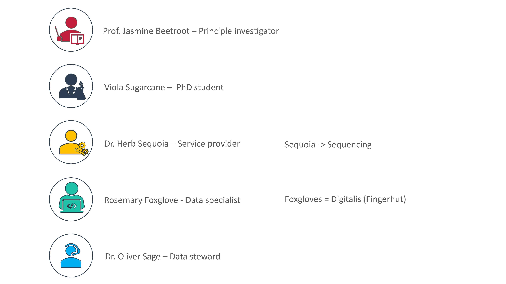</a>  |  <a href="./StoryTelling_Characters_img1.png" target="_blank">https://nfdi4plants.org/nfdi4plants.knowledgebase/docs/img/StoryTelling_Characters_img1.png</a>  |  [CEPLAS](https://ceplas.eu), DB
  |  <a href="./Students_Graduate_Papers.svg" target="_blank">https://nfdi4plants.org/nfdi4plants.knowledgebase/docs/img/Students_Graduate_Papers.svg</a>  | TA3-[DataPLANT](nfdi4plants.org)
  |  <a href="./Students_Lab_Questionmark.svg" target="_blank">https://nfdi4plants.org/nfdi4plants.knowledgebase/docs/img/Students_Lab_Questionmark.svg</a>  | TA3-[DataPLANT](nfdi4plants.org)
  |  <a href="./Swate_AnnotationPrinciples.png" target="_blank">https://nfdi4plants.org/nfdi4plants.knowledgebase/docs/img/Swate_AnnotationPrinciples.png</a>  | TA3-[DataPLANT](nfdi4plants.org)
  |  <a href="./Swate_BuildingBlocks.jpg" target="_blank">https://nfdi4plants.org/nfdi4plants.knowledgebase/docs/img/Swate_BuildingBlocks.jpg</a>  | TA3-[DataPLANT](nfdi4plants.org)
<a href="./swate_ColumnHeaders.svg" target="_blank">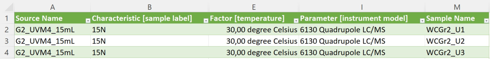</a>  |  <a href="./swate_ColumnHeaders.svg" target="_blank">https://nfdi4plants.org/nfdi4plants.knowledgebase/docs/img/swate_ColumnHeaders.svg</a>  |  [CEPLAS](https://ceplas.eu), DB
<a href="./SWATE_metadataTemplates_img1.png" target="_blank">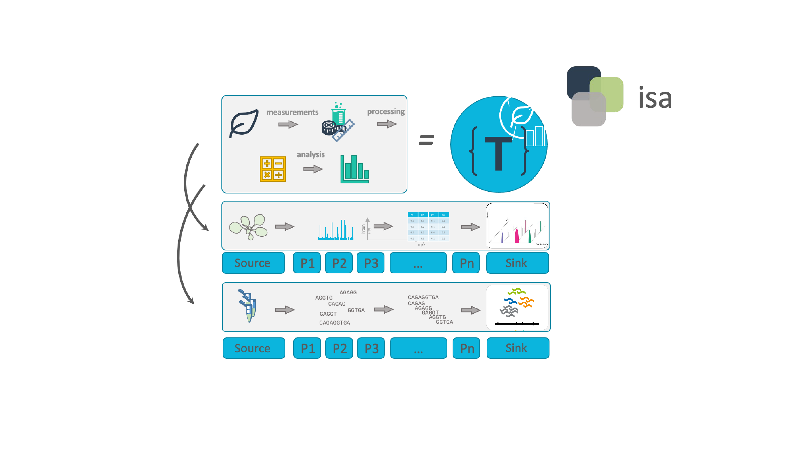</a>  |  <a href="./SWATE_metadataTemplates_img1.png" target="_blank">https://nfdi4plants.org/nfdi4plants.knowledgebase/docs/img/SWATE_metadataTemplates_img1.png</a>  | TA3-[DataPLANT](nfdi4plants.org)
  |  <a href="./SWATE_metadataTemplates.png" target="_blank">https://nfdi4plants.org/nfdi4plants.knowledgebase/docs/img/SWATE_metadataTemplates.png</a>  |  [CEPLAS](https://ceplas.eu), DB
  |  <a href="./Swate_NewParameter.svg" target="_blank">https://nfdi4plants.org/nfdi4plants.knowledgebase/docs/img/Swate_NewParameter.svg</a>  |  [CEPLAS](https://ceplas.eu), DB
  |  <a href="./Swate_OntologyCombination.svg" target="_blank">https://nfdi4plants.org/nfdi4plants.knowledgebase/docs/img/Swate_OntologyCombination.svg</a>  |  [CEPLAS](https://ceplas.eu), DB
  |  <a href="./Swate_OntologyTermSearch.svg" target="_blank">https://nfdi4plants.org/nfdi4plants.knowledgebase/docs/img/Swate_OntologyTermSearch.svg</a>  |  [CEPLAS](https://ceplas.eu), DB
  |  <a href="./swate_ontologyTermSearch2.png" target="_blank">https://nfdi4plants.org/nfdi4plants.knowledgebase/docs/img/swate_ontologyTermSearch2.png</a>  | TA3-[DataPLANT](nfdi4plants.org)
<a href="./swate_ontologyTermSearch2.svg" target="_blank">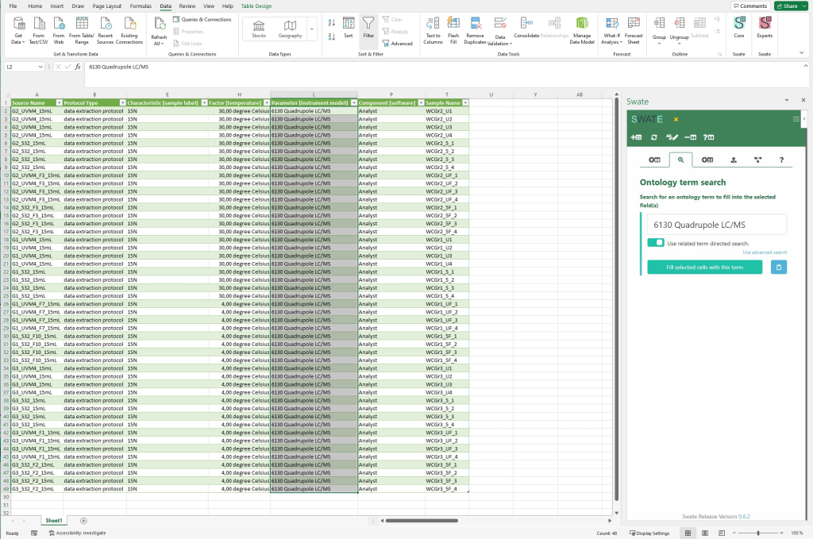</a>  |  <a href="./swate_ontologyTermSearch2.svg" target="_blank">https://nfdi4plants.org/nfdi4plants.knowledgebase/docs/img/swate_ontologyTermSearch2.svg</a>  | TA3-[DataPLANT](nfdi4plants.org)
  |  <a href="./Swate_Overview.png" target="_blank">https://nfdi4plants.org/nfdi4plants.knowledgebase/docs/img/Swate_Overview.png</a>  | TA3-[DataPLANT](nfdi4plants.org)
  |  <a href="./Swate_Overview.svg" target="_blank">https://nfdi4plants.org/nfdi4plants.knowledgebase/docs/img/Swate_Overview.svg</a>  | TA3-[DataPLANT](nfdi4plants.org)
  |  <a href="./Swate_ParentChildTerm.svg" target="_blank">https://nfdi4plants.org/nfdi4plants.knowledgebase/docs/img/Swate_ParentChildTerm.svg</a>  | TA3-[DataPLANT](nfdi4plants.org)
  |  <a href="./Swate_ParentChildTerm2.svg" target="_blank">https://nfdi4plants.org/nfdi4plants.knowledgebase/docs/img/Swate_ParentChildTerm2.svg</a>  | TA3-[DataPLANT](nfdi4plants.org)
  |  <a href="./Swate_templates_tab.png" target="_blank">https://nfdi4plants.org/nfdi4plants.knowledgebase/docs/img/Swate_templates_tab.png</a>  | TA3-[DataPLANT](nfdi4plants.org)
  |  <a href="./Swate_Templates.jpg" target="_blank">https://nfdi4plants.org/nfdi4plants.knowledgebase/docs/img/Swate_Templates.jpg</a>  | TA3-[DataPLANT](nfdi4plants.org)
  |  <a href="./Swate_Templates.svg" target="_blank">https://nfdi4plants.org/nfdi4plants.knowledgebase/docs/img/Swate_Templates.svg</a>  | TA3-[DataPLANT](nfdi4plants.org)
  |  <a href="./swate_TemplatesChecklists.svg" target="_blank">https://nfdi4plants.org/nfdi4plants.knowledgebase/docs/img/swate_TemplatesChecklists.svg</a>  | TA3-[DataPLANT](nfdi4plants.org)
  |  <a href="./Swate_TermRelatedSearch.jpg" target="_blank">https://nfdi4plants.org/nfdi4plants.knowledgebase/docs/img/Swate_TermRelatedSearch.jpg</a>  | TA3-[DataPLANT](nfdi4plants.org)
<a href="./Swate_TermRelatedSearch01.png" target="_blank">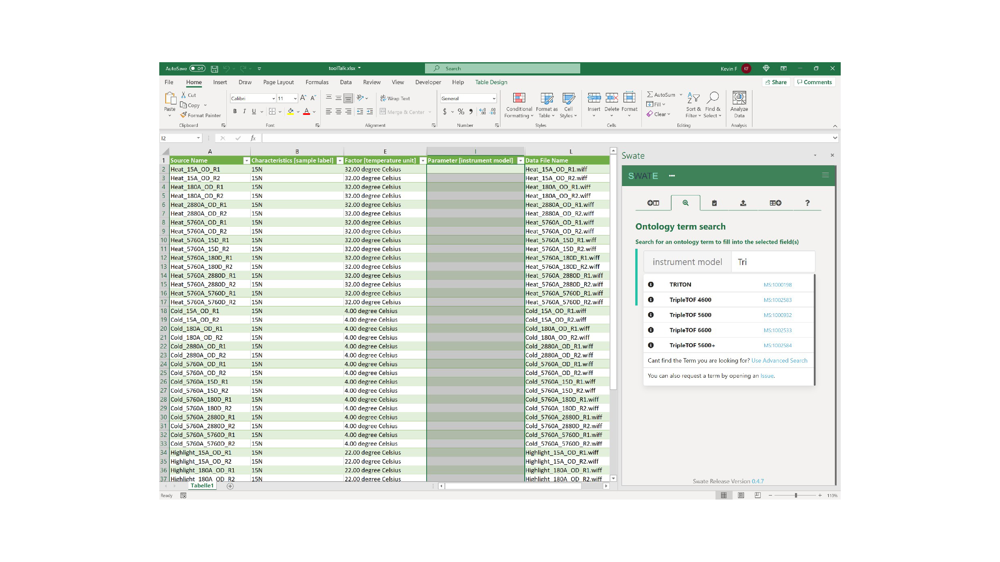</a>  |  <a href="./Swate_TermRelatedSearch01.png" target="_blank">https://nfdi4plants.org/nfdi4plants.knowledgebase/docs/img/Swate_TermRelatedSearch01.png</a>  | TA3-[DataPLANT](nfdi4plants.org)
<a href="./Swate_TermRelatedSearch02.png" target="_blank">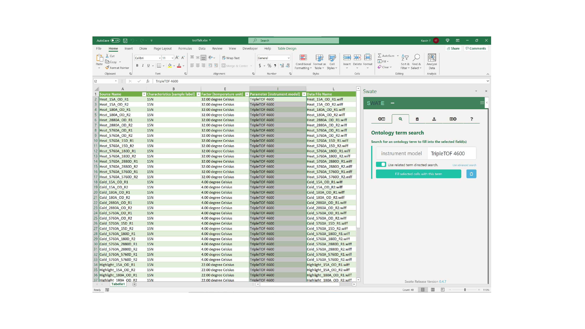</a>  |  <a href="./Swate_TermRelatedSearch02.png" target="_blank">https://nfdi4plants.org/nfdi4plants.knowledgebase/docs/img/Swate_TermRelatedSearch02.png</a>  | TA3-[DataPLANT](nfdi4plants.org)
  |  <a href="./Swate-AddBuildingBlock-Exp.jpg" target="_blank">https://nfdi4plants.org/nfdi4plants.knowledgebase/docs/img/Swate-AddBuildingBlock-Exp.jpg</a>  | TA3-[DataPLANT](nfdi4plants.org)
  |  <a href="./Swate-CreateAnnotationTable-Exp.jpg" target="_blank">https://nfdi4plants.org/nfdi4plants.knowledgebase/docs/img/Swate-CreateAnnotationTable-Exp.jpg</a>  | TA3-[DataPLANT](nfdi4plants.org)
<a href="./Swate-FreeTextInput-Exp.jpg" target="_blank">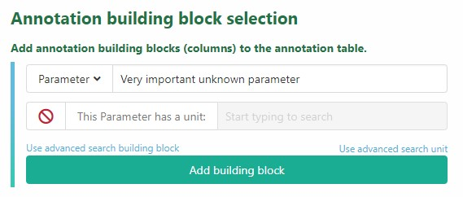</a>  |  <a href="./Swate-FreeTextInput-Exp.jpg" target="_blank">https://nfdi4plants.org/nfdi4plants.knowledgebase/docs/img/Swate-FreeTextInput-Exp.jpg</a>  | TA3-[DataPLANT](nfdi4plants.org)
<a href="./Swate-numberFormat-Exp.jpg" target="_blank">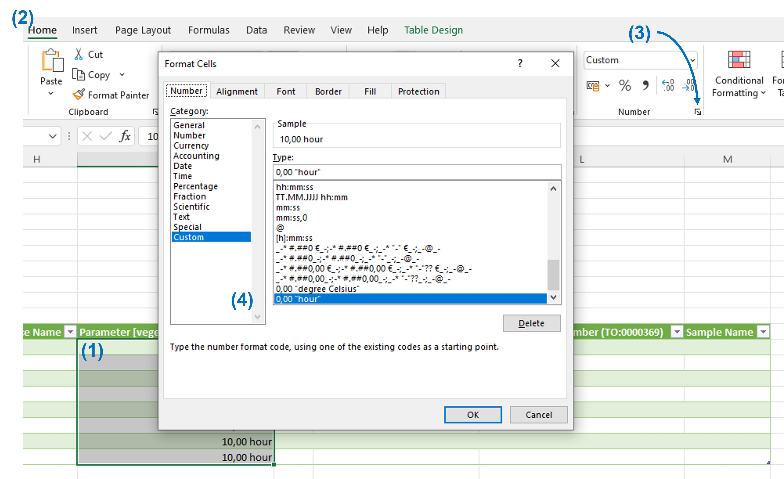</a>  |  <a href="./Swate-numberFormat-Exp.jpg" target="_blank">https://nfdi4plants.org/nfdi4plants.knowledgebase/docs/img/Swate-numberFormat-Exp.jpg</a>  | TA3-[DataPLANT](nfdi4plants.org)
<a href="./Swate-Overlay-Exp.jpg" target="_blank">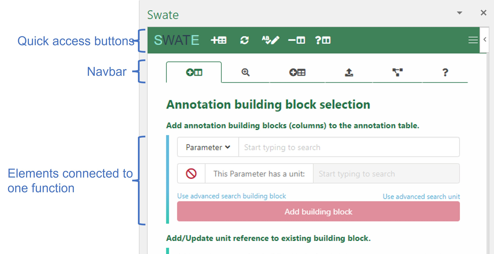</a>  |  <a href="./Swate-Overlay-Exp.jpg" target="_blank">https://nfdi4plants.org/nfdi4plants.knowledgebase/docs/img/Swate-Overlay-Exp.jpg</a>  | TA3-[DataPLANT](nfdi4plants.org)
<a href="./Swate-RelationshipGraph-Exp.jpg" target="_blank">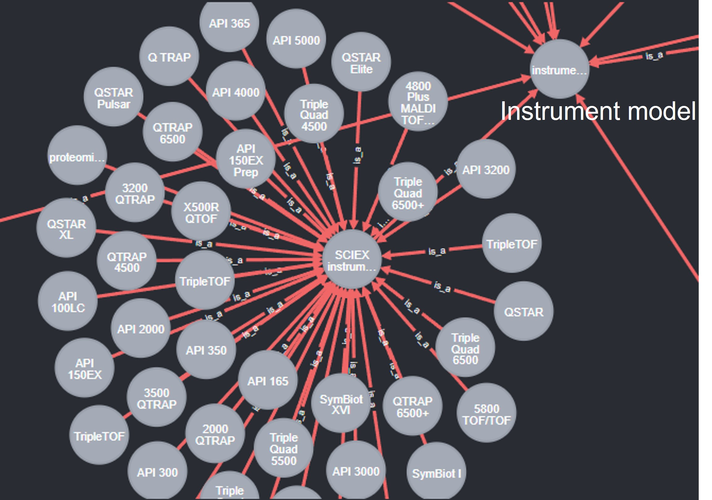</a>  |  <a href="./Swate-RelationshipGraph-Exp.jpg" target="_blank">https://nfdi4plants.org/nfdi4plants.knowledgebase/docs/img/Swate-RelationshipGraph-Exp.jpg</a>  | TA3-[DataPLANT](nfdi4plants.org)
  |  <a href="./swate-tab-templates_example.png" target="_blank">https://nfdi4plants.org/nfdi4plants.knowledgebase/docs/img/swate-tab-templates_example.png</a>  | TA3-[DataPLANT](nfdi4plants.org)
<a href="./swate-tab-templates.png" target="_blank">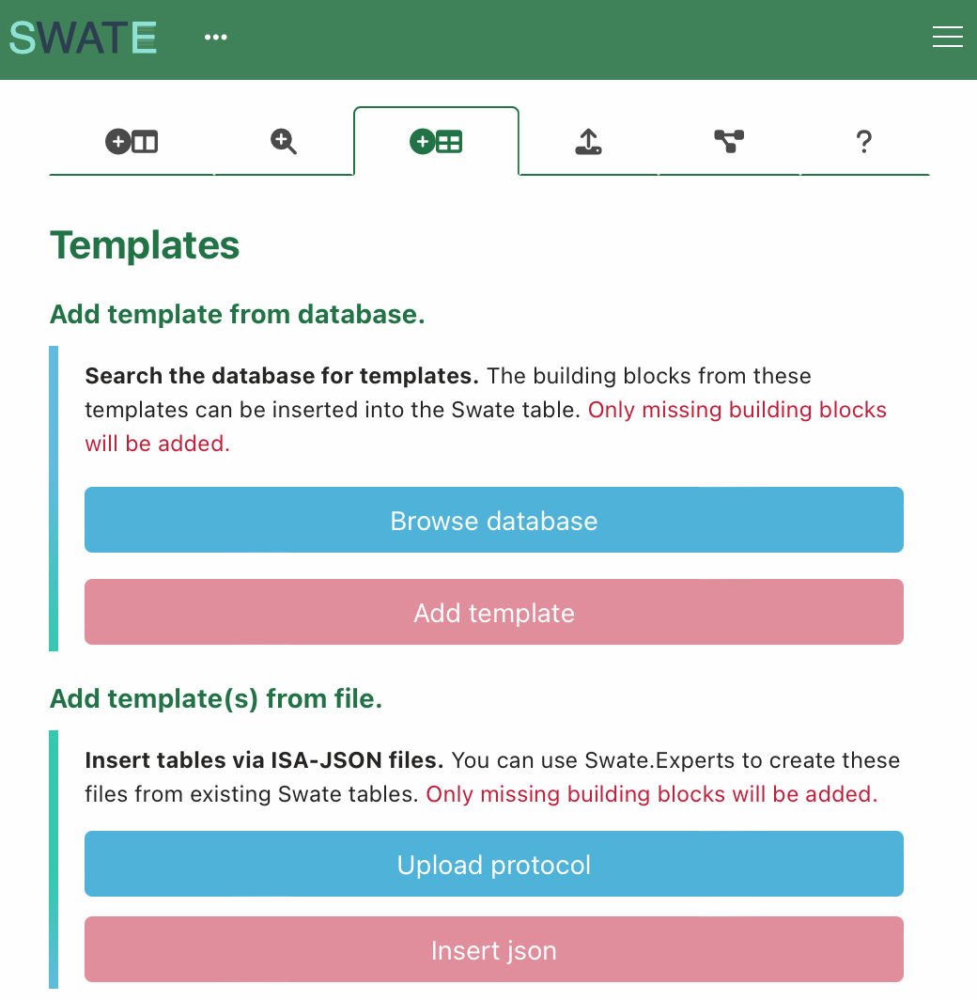</a>  |  <a href="./swate-tab-templates.png" target="_blank">https://nfdi4plants.org/nfdi4plants.knowledgebase/docs/img/swate-tab-templates.png</a>  | TA3-[DataPLANT](nfdi4plants.org)
  |  <a href="./Swate-templates_example_metadata.jpg" target="_blank">https://nfdi4plants.org/nfdi4plants.knowledgebase/docs/img/Swate-templates_example_metadata.jpg</a>  | TA3-[DataPLANT](nfdi4plants.org)
  |  <a href="./Swate-templates_find_table_name.jpg" target="_blank">https://nfdi4plants.org/nfdi4plants.knowledgebase/docs/img/Swate-templates_find_table_name.jpg</a>  | TA3-[DataPLANT](nfdi4plants.org)
  |  <a href="./swate-templates_repo_local.png" target="_blank">https://nfdi4plants.org/nfdi4plants.knowledgebase/docs/img/swate-templates_repo_local.png</a>  | TA3-[DataPLANT](nfdi4plants.org)
  |  <a href="./swate-templates-metadata.png" target="_blank">https://nfdi4plants.org/nfdi4plants.knowledgebase/docs/img/swate-templates-metadata.png</a>  | TA3-[DataPLANT](nfdi4plants.org)
  |  <a href="./Swate-TermInsert-Exp.jpg" target="_blank">https://nfdi4plants.org/nfdi4plants.knowledgebase/docs/img/Swate-TermInsert-Exp.jpg</a>  | TA3-[DataPLANT](nfdi4plants.org)
<a href="./Swate-TermInsert2-Exp.jpg" target="_blank">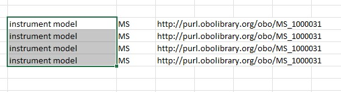</a>  |  <a href="./Swate-TermInsert2-Exp.jpg" target="_blank">https://nfdi4plants.org/nfdi4plants.knowledgebase/docs/img/Swate-TermInsert2-Exp.jpg</a>  | TA3-[DataPLANT](nfdi4plants.org)
<a href="./Swate-UpdateUnit-Exp.jpg" target="_blank">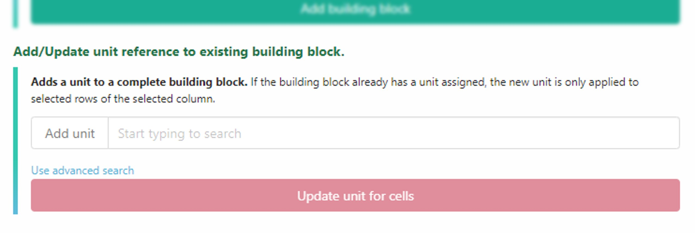</a>  |  <a href="./Swate-UpdateUnit-Exp.jpg" target="_blank">https://nfdi4plants.org/nfdi4plants.knowledgebase/docs/img/Swate-UpdateUnit-Exp.jpg</a>  | TA3-[DataPLANT](nfdi4plants.org)
  |  <a href="./swateExperts-tab-templateMetadata.png" target="_blank">https://nfdi4plants.org/nfdi4plants.knowledgebase/docs/img/swateExperts-tab-templateMetadata.png</a>  | TA3-[DataPLANT](nfdi4plants.org)
  |  <a href="./Tools-and-Services_DataPLANT.png" target="_blank">https://nfdi4plants.org/nfdi4plants.knowledgebase/docs/img/Tools-and-Services_DataPLANT.png</a>  | TA3-[DataPLANT](nfdi4plants.org)
  |  <a href="./User_Challenges_002.svg" target="_blank">https://nfdi4plants.org/nfdi4plants.knowledgebase/docs/img/User_Challenges_002.svg</a>  | TA3-[DataPLANT](nfdi4plants.org)
  |  <a href="./User_Challenges.svg" target="_blank">https://nfdi4plants.org/nfdi4plants.knowledgebase/docs/img/User_Challenges.svg</a>  | TA3-[DataPLANT](nfdi4plants.org)
  |  <a href="./User_Standards_Templates.svg" target="_blank">https://nfdi4plants.org/nfdi4plants.knowledgebase/docs/img/User_Standards_Templates.svg</a>  | TA3-[DataPLANT](nfdi4plants.org)
<a href="./User_Standards.svg" target="_blank">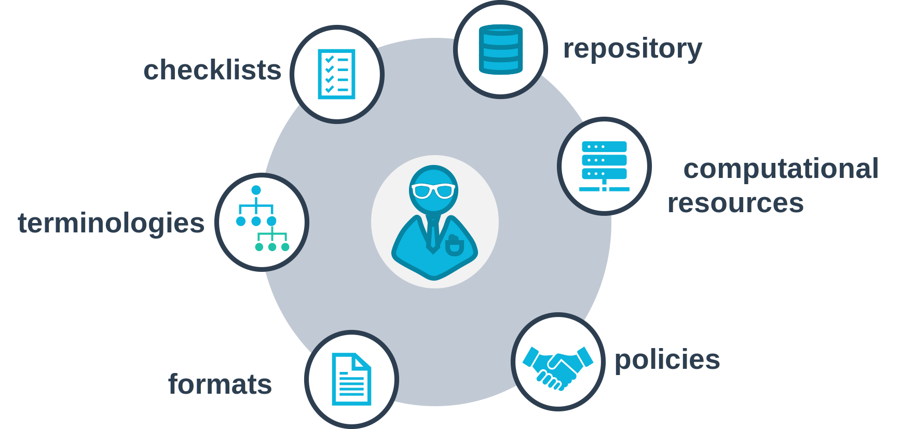</a>  |  <a href="./User_Standards.svg" target="_blank">https://nfdi4plants.org/nfdi4plants.knowledgebase/docs/img/User_Standards.svg</a>  | TA3-[DataPLANT](nfdi4plants.org)
  |  <a href="./tpj16474-fig-0003-m.jpg" target="_blank">https://nfdi4plants.org/nfdi4plants.knowledgebase/docs/img/tpj16474-fig-0003-m.jpg</a>  | Weil, H.L., Schneider, K., et al. (2023), PLANTdataHUB: a collaborative platform for continuous FAIR data sharing in plant research. Plant J. https://doi.org/10.1111/tpj.16474
  |  <a href="./tpj16474-fig-0005-m.jpg" target="_blank">https://nfdi4plants.org/nfdi4plants.knowledgebase/docs/img/tpj16474-fig-0005-m.jpg</a>  | Weil, H.L., Schneider, K., et al. (2023), PLANTdataHUB: a collaborative platform for continuous FAIR data sharing in plant research. Plant J. https://doi.org/10.1111/tpj.16474
  |  <a href="./tpj16474-fig-0006-m.jpg" target="_blank">https://nfdi4plants.org/nfdi4plants.knowledgebase/docs/img/tpj16474-fig-0006-m.jpg</a>  | Weil, H.L., Schneider, K., et al. (2023), PLANTdataHUB: a collaborative platform for continuous FAIR data sharing in plant research. Plant J. https://doi.org/10.1111/tpj.16474
  |  <a href="./tpj16474-fig-0007-m.jpg" target="_blank">https://nfdi4plants.org/nfdi4plants.knowledgebase/docs/img/tpj16474-fig-0007-m.jpg</a>  | Weil, H.L., Schneider, K., et al. (2023), PLANTdataHUB: a collaborative platform for continuous FAIR data sharing in plant research. Plant J. https://doi.org/10.1111/tpj.16474
  |  <a href="./tpj16474-fig-0008-m.jpg" target="_blank">https://nfdi4plants.org/nfdi4plants.knowledgebase/docs/img/tpj16474-fig-0008-m.jpg</a>  | Weil, H.L., Schneider, K., et al. (2023), PLANTdataHUB: a collaborative platform for continuous FAIR data sharing in plant research. Plant J. https://doi.org/10.1111/tpj.16474
  |  <a href="./tpj16474-fig-0008-m-modified.png" target="_blank">https://nfdi4plants.org/nfdi4plants.knowledgebase/docs/img/tpj16474-fig-0008-m-modified.png</a>  | Weil, H.L., Schneider, K., et al. (2023), PLANTdataHUB: a collaborative platform for continuous FAIR data sharing in plant research. Plant J. https://doi.org/10.1111/tpj.16474
  |  <a href="./tpj16474-fig-0001-m.jpg" target="_blank">https://nfdi4plants.org/nfdi4plants.knowledgebase/docs/img/tpj16474-fig-0001-m.jpg</a>  | Weil, H.L., Schneider, K., et al. (2023), PLANTdataHUB: a collaborative platform for continuous FAIR data sharing in plant research. Plant J. https://doi.org/10.1111/tpj.16474
  |  <a href="./windows_powershell.png" target="_blank">https://nfdi4plants.org/nfdi4plants.knowledgebase/docs/img/windows_powershell.png</a>  | TA3-[DataPLANT](nfdi4plants.org)
  |  <a href="./zhou2023-dataplan.png" target="_blank">https://nfdi4plants.org/nfdi4plants.knowledgebase/docs/img/zhou2023-dataplan.png</a>  | Zhou et al. (2023), DataPLAN: a web-based data management plan generator for the plant sciences, bioRxiv 2023.07.07.548147; doi: https://https://doi.org/10.1101/2023.07.07.548147
 | <a href="./Tools-and-Services-new_DataPLANT.png" target="_blank">https://nfdi4plants.org/nfdi4plants.knowledgebase/docs/img/Tools-and-Services-new_DataPLANT.png</a> |  |  
 | <a href="./googlecom-screenshot-kg.png" target="_blank">https://nfdi4plants.org/nfdi4plants.knowledgebase/docs/img/googlecom-screenshot-kg.png</a> |  |  
 | <a href="./ARCitect_Assay_Data.png" target="_blank">https://nfdi4plants.org/nfdi4plants.knowledgebase/docs/img/ARCitect_Assay_Data.png</a> |  |  
 | <a href="./Forschungsdaten-Policy-Kit-Abb2.png" target="_blank">https://nfdi4plants.org/nfdi4plants.knowledgebase/docs/img/Forschungsdaten-Policy-Kit-Abb2.png</a> |  Hiemenz, Bea & Kuberek, Monika (2018). Empfehlungen zur Erstellung institutioneller Forschungsdaten-Policies. Das Forschungsdaten-Policy-Kit als generischer Baukasten mit Leitfragen und Textbausteinen für Hochschulen in Deutschland. http://dx.doi.org/10.14279/depositonce-7521 | [CC BY 4.0](https://creativecommons.org/licenses/by/4.0/legalcode) 
 | <a href="./Hartmann_TerraIncognita-Forschungsdaten-RechtlicheHeimat.png" target="_blank">https://nfdi4plants.org/nfdi4plants.knowledgebase/docs/img/Hartmann_TerraIncognita-Forschungsdaten-RechtlicheHeimat.png</a> | Hartmann, Thomas. (2019). Rechtsfragen: Institutioneller Rahmen und Handlungsoptionen für universitäres FDM. Zenodo. https://doi.org/10.5281/zenodo.2654306 | [CC BY 4.0](https://creativecommons.org/licenses/by/4.0/legalcode)
<a href="./DataPLANT-collaboration01.drawio.png" target="_blank">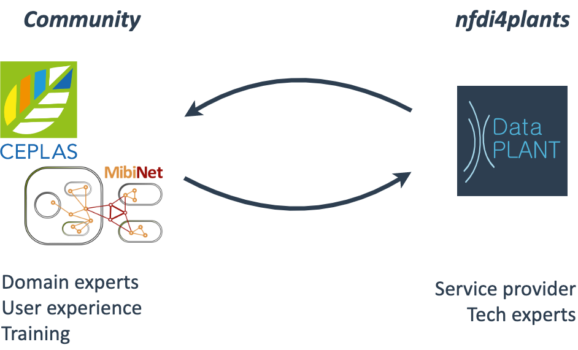</a> | <a href="./DataPLANT-collaboration01.drawio.png" target="_blank">https://nfdi4plants.org/nfdi4plants.knowledgebase/docs/img/DataPLANT-collaboration01.drawio.png</a> |  |  
<a href="./data_fragmentation_CEPLAS_Mibinet_TRR.png" target="_blank">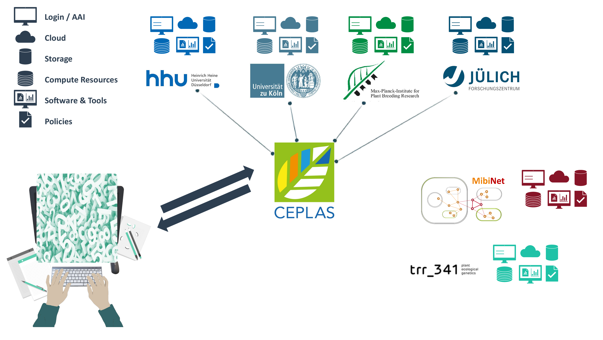</a> | <a href="./data_fragmentation_CEPLAS_Mibinet_TRR.png" target="_blank">https://nfdi4plants.org/nfdi4plants.knowledgebase/docs/img/data_fragmentation_CEPLAS_Mibinet_TRR.png</a> |  |  
 | <a href="./ARCitect_TalinumPhotosynthesis_Study.png" target="_blank">https://nfdi4plants.org/nfdi4plants.knowledgebase/docs/img/ARCitect_TalinumPhotosynthesis_Study.png</a> |  |  
 | <a href="./3-2-1-backup-rule.drawio.svg" target="_blank">https://nfdi4plants.org/nfdi4plants.knowledgebase/docs/img/3-2-1-backup-rule.drawio.svg</a> |  |  
 | <a href="./wilkinson2016-FAIR.png" target="_blank">https://nfdi4plants.org/nfdi4plants.knowledgebase/docs/img/wilkinson2016-FAIR.png</a> | https://doi.org/10.1038/sdata.2016.18 |  
 | <a href="./cqc-error-badges.png" target="_blank">https://nfdi4plants.org/nfdi4plants.knowledgebase/docs/img/cqc-error-badges.png</a> |  |  
 | <a href="./data-stores.drawio.svg" target="_blank">https://nfdi4plants.org/nfdi4plants.knowledgebase/docs/img/data-stores.drawio.svg</a> |  |  
 | <a href="./exercise_PIDs_img1.png" target="_blank">https://nfdi4plants.org/nfdi4plants.knowledgebase/docs/img/exercise_PIDs_img1.png</a> |  |  
 | <a href="./ARCitect_TalinumPhotosynthesis_StudyPanel.png" target="_blank">https://nfdi4plants.org/nfdi4plants.knowledgebase/docs/img/ARCitect_TalinumPhotosynthesis_StudyPanel.png</a> |  |  
 | <a href="./data_fragmentation_CEPLAS.png" target="_blank">https://nfdi4plants.org/nfdi4plants.knowledgebase/docs/img/data_fragmentation_CEPLAS.png</a> |  |  
 | <a href="./ARCitect_TalinumPhotosynthesis_InvestigationPerson.png" target="_blank">https://nfdi4plants.org/nfdi4plants.knowledgebase/docs/img/ARCitect_TalinumPhotosynthesis_InvestigationPerson.png</a> |  |  
 | <a href="./cqc-error-email2.png" target="_blank">https://nfdi4plants.org/nfdi4plants.knowledgebase/docs/img/cqc-error-email2.png</a> |  |  
 | <a href="./ARCitect_TalinumPhotosynthesis_InvestigationMetadata.png" target="_blank">https://nfdi4plants.org/nfdi4plants.knowledgebase/docs/img/ARCitect_TalinumPhotosynthesis_InvestigationMetadata.png</a> |  |  
 | <a href="./ARCitect_TalinumPhotosynthesis_Assay2.png" target="_blank">https://nfdi4plants.org/nfdi4plants.knowledgebase/docs/img/ARCitect_TalinumPhotosynthesis_Assay2.png</a> |  |  
 | <a href="./ARCitect_TalinumPhotosynthesis.png" target="_blank">https://nfdi4plants.org/nfdi4plants.knowledgebase/docs/img/ARCitect_TalinumPhotosynthesis.png</a> |  |  
 | <a href="./demo_isa.study1.png" target="_blank">https://nfdi4plants.org/nfdi4plants.knowledgebase/docs/img/demo_isa.study1.png</a> |  |  
 | <a href="./ARCitect_TalinumPhotosynthesis_Assay.png" target="_blank">https://nfdi4plants.org/nfdi4plants.knowledgebase/docs/img/ARCitect_TalinumPhotosynthesis_Assay.png</a> |  |  
 | <a href="./cqc-activate-autodevops.png" target="_blank">https://nfdi4plants.org/nfdi4plants.knowledgebase/docs/img/cqc-activate-autodevops.png</a> |  |  
 | <a href="./legalAspects_rdm_guidelines_img1.png" target="_blank">https://nfdi4plants.org/nfdi4plants.knowledgebase/docs/img/legalAspects_rdm_guidelines_img1.png</a> |  |  
 | <a href="./ARCitect_TalinumPhotosynthesis_AssayPanel.png" target="_blank">https://nfdi4plants.org/nfdi4plants.knowledgebase/docs/img/ARCitect_TalinumPhotosynthesis_AssayPanel.png</a> |  |  
 | <a href="./pid_collage.drawio.svg" target="_blank">https://nfdi4plants.org/nfdi4plants.knowledgebase/docs/img/pid_collage.drawio.svg</a> |  |  
 | <a href="./cqc-error-email.png" target="_blank">https://nfdi4plants.org/nfdi4plants.knowledgebase/docs/img/cqc-error-email.png</a> |  |  
 | <a href="./creative_commons_brochure.png" target="_blank">https://nfdi4plants.org/nfdi4plants.knowledgebase/docs/img/creative_commons_brochure.png</a> | adapted from https://wiki.creativecommons.org/images/0/01/6licenses-folded.pdf | [CC BY 4.0](https://creativecommons.org/licenses/by/4.0/legalcode)
