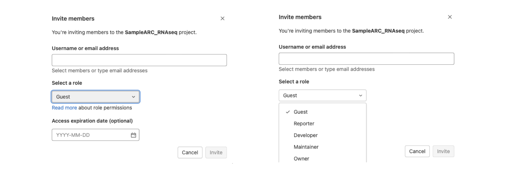
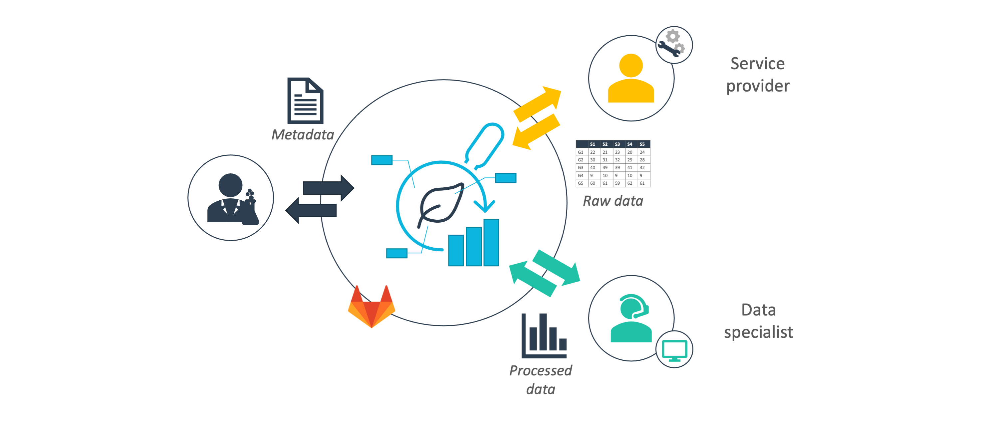

The DataPLANT [DataHUB][hp-DataHUB] is the platform where several strings of DataPLANT's [research data management][kb-ResearchDataManagement] run together. Here you can upload your research data as an annotated research context ([ARC][kb-AnnotatedResearchContext]), to document its changes (via [git][kb-VersionControlGit]-based version control) and [share][kb-DataSharing] it with collaborators. [Metadata][kb-Metadata] associated with your ARC feeds into the metadata registry to make your research findable. From there, you can analyse your data using external workflows, publish it to specific [data repositories][kb-PublicDataRepositories] or [data publications][kb-DataPublications].
<!-- TODO_ link to wms -->

## Data management: DataHUB In-and-out

[ARCs][kb-AnnotatedResearchContext] are the core units managed in the DataHUB, which technically is a DataPLANT-tailored GitLab (see [Git][kb-VersionControlGit]). The DataHUB is more than a cloud service to share your ARCs with other researchers. It already helps you individually to stay synced and on track between multiple locations where you produce or process your research data. For instance, you might design an experiment on your office desktop, collect experiment data using an instrument in the lab and afterwards analyse the data on a workstation or remote server. All you need is internet access on these computers and you can smoothly develop your ARC from multiple locations, without loosing any information.
There are different options to upload data into the DataHUB. DataPLANT's [ARC Commander][kb-ArcCommander-Manual] supports you in easy ARC creation and management between your local computers and the DataHUB. For small changes to your ARC, you can directly use the tools offered in the DataHUB (via your web browser). Here you can create new files and directories in your ARC or edit, upload and download individual files or directories. Online editing is however currently limited to simple text-based files. Finally, as the DataHUB is based on GitLab, you can also interact with it via your usual git-routines. This also comes in handy, if you would like to transfer data for analyses via computational workflows to an external platform such as [galaxy][ext-galaxy], and *vice versa* import the results into your ARC in the DataHUB. <!-- TODO add link to wms (see also [][kb-WMS]).  -->
Once you wish to share and collaborate on your ARC, the DataHUB allows you to invite other researchers.

## Access management: Sharing data the good way

The DataHUB is connected to a login system (single sign-on solution) that allows researchers to register independent of their institutional affiliation. Different options allow you to adapt the scope of sharing your ARC. You can define, (i) with whom you want to share  &ndash; individual researchers or group of members such as your research consortium &ndash;, (ii) the member rights &ndash; granting permissions to read from, write to or manage the ARC &ndash; and (iii) for how long you want to grant these permissions. 

<figure><figcaption align = "left">Inviting collaborators to your ARC</figcaption></figure>

In this way, the DataHUB enables you to discuss your research data at different stages of the project and with varying collaborators. No matter if you just designed an experiment, already sampled your plants, ran the experiment or are in the middle of data wrangling or preparing a manuscript. For example, you can communicate metadata about your samples directly from the ARC with a core facility before submitting the samples for measurement to that facility and receive back measurement data and metadata directly into your ARC. Likewise, you could exchange assay data with a data scientist or computational biologist and receive back the results together with the documented workflow they employed. And everything without the need to download the data and finding a proper routine to share it.

<figure><figcaption align = "left">Contribution of different data types</figcaption></figure>

The additional layer of access management on top of the ARC-stored research datasets enables you to keep track of contributions: what was done, why, when, and by whom. This transparent exchange not only spikes fruitful and targeted discussions. It also facilitates properly crediting individual contributions to the project, also persistently in the future as user accounts can be connected to ORCIDs (see [persistent identifiers][kb-PersistentIdentifiers]).
Once your research project is ready for publication, you can either make the whole ARC publicly accessible directly via the DataHUB (with above-mentioned scopes) or publish a current snapshot of your ARC via the invenio RDM service to retrieve a [persistent identifier][kb-PersistentIdentifiers] to make it citable in [publications][kb-DataPublications].
<!-- TODO: add link to invenio -->

## Project management: More than version-control and data

A plant biologist's day-to-day routines circle around more than just data and collaborators. And the DataHUB offers intuitive features to associate project-related matters directly with your ARC. Rather than losing relevant discussion outcomes somewhere between chats, emails, notebooks, or other platforms, you can add and attach them with your ARC. For instance meeting minutes or tasks can become wiki entries and issue lists, transparent and traceable for all invited collaborators. Issues can be assigned to self or others, labelled, grouped or assigned to milestones for clear structure and categorization into topics. Any small idea or sudden inspiration from a phone call, discussion with a colleague in the passing can easily become a significant contribution to your research project. The development of the ARC within the DataHUB thus parallels and aligns well with the development of your research project.

<!-- And it does not have to be the most formal piece of documentation. 
    - want to keep it private -->

<!-- 
## User-friendliness and third-party apps

- The technical back-end is gitlab, 
- git and GitLab become more established
- more tools being developed to integrate git (e.g. IDEs on computer)
- other third-party tools / apps
  - take photo of lab work and add directly to your project -->

### Register with DataPLANT

In order to use the [DataHUB][hp-DataHUB] and other DataPLANT infrastructure and services, please [sign up][hp-Registration] with DataPLANT.  

<!-- Links to DataPLANT knowledge base (kb-) -->

<!-- kb-Fundamentals -->

[kb-DataManagementPlan]: ../fundamentals/DataManagementPlan.html "Data Management Plan"
[kb-DataPublications]: ../fundamentals/DataPublications.html "Data Publication"
[kb-DataSharing]: ../fundamentals/DataSharing.html "Data Sharing"
[kb-FairDataPrinciples]: ../fundamentals/FairDataPrinciples.html "FAIR Data principles"
[kb-Metadata]: ../fundamentals/Metadata.html "Metadata"
[kb-PersistentIdentifiers]: ../fundamentals/PersistentIdentifiers.html "Persistent Identifiers"
[kb-PublicDataRepositories]: ../fundamentals/PublicDataRepositories.html "Repositories"
[kb-ResearchDataManagement]: ../fundamentals/ResearchDataManagement.html "Research Data Management"
[kb-VersionControlGit]: ../fundamentals/VersionControlGit.html "Version Control and Git"

<!-- kb-Implementation -->
[kb-AnnotatedResearchContext]: ../implementation/AnnotatedResearchContext.html "Annotated Research Context"
[kb-DataHub]: ../implementation/DataHub.html "DataPLANT DataHUB"

<!-- kb-Tutorials -->
[kb-QuickStart_arc]: ../tutorials/ARCUserJourney.html "ARC User Journey"

<!-- Links to DataPLANT Homepage (hp-) -->

[hp-Registration]: <https://register.nfdi4plants.org/> "DataPLANT Registration"
[hp-DataHUB]: <https://git.nfdi4plants.org> "DataPLANT DataHUB"
[hp-HelpDesk]: <https://helpdesk.nfdi4plants.org> "DataPLANT Help Desk"

<!-- Links to DataPLANT GitHub (gh-) -->

[gh-DataPlant]: <https://github.com/nfdi4plants/ARC-specification/> "GitHub DataPLANT"
[kb-ArcSpecs]: ./../implementation/ARC-specification.html "ARC specification"
[kb-ArcCommander-Manual]: ../ArcCommanderManual/index.html "ARC Commander Manual"

<!-- Links to external (ext-) sources -->

[ext-github-join]: <https://github.com/join/> "Join GitHub"
[ext-github-desktop]: <https://desktop.github.com/> "GitHub Desktop"
[ext-git]: <https://git-scm.com/download/> "Git"
[ext-git-lfs]: <https://git-lfs.github.com/> "Git-LFS"
[ext-excel-online]: <https://www.microsoft.com/en-us/microsoft-365/excel> "Excel online"

[ext-VSCode]: https://code.visualstudio.com/ "Visual Studio Code"

[ext-galaxy]: <https://plants.usegalaxy.eu/> "Galaxy Plants"
[ext-omero]: <https://www.openmicroscopy.org/omero/> "Omero"
[ext-zenodo]: <https://zenodo.org/> "Zenodo"
[ext-invenio]: <https://inveniosoftware.org/products/rdm/> "Invenio"
[ext-DataJournals]: https://www.researchdata.uni-jena.de/en/information/data-publication "RDM Jena Data Journals"