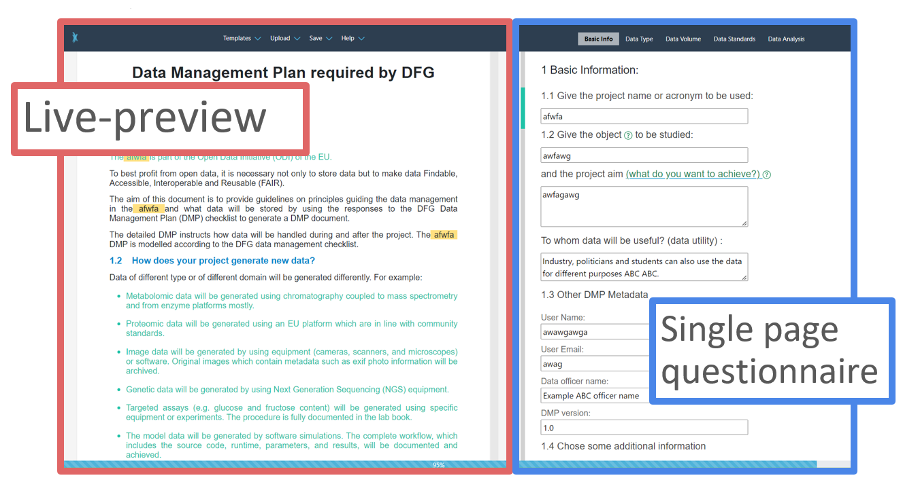
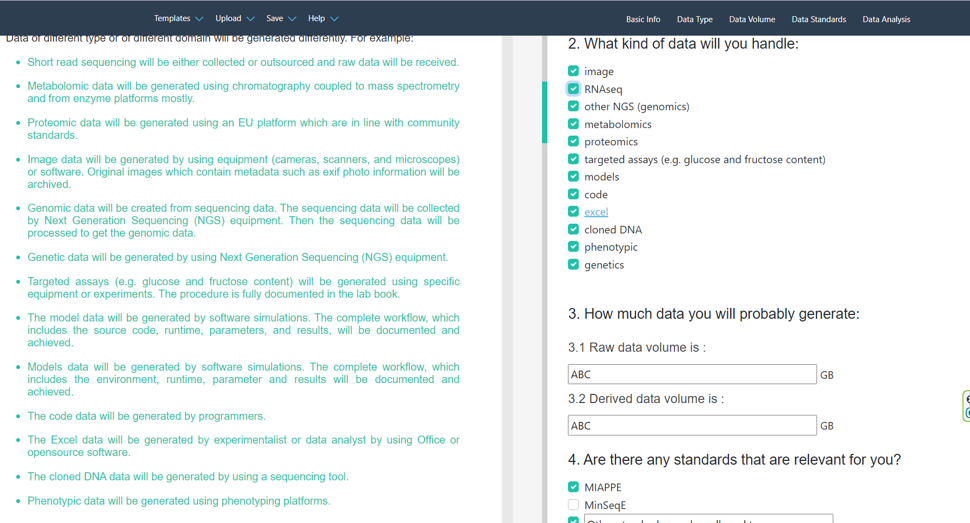
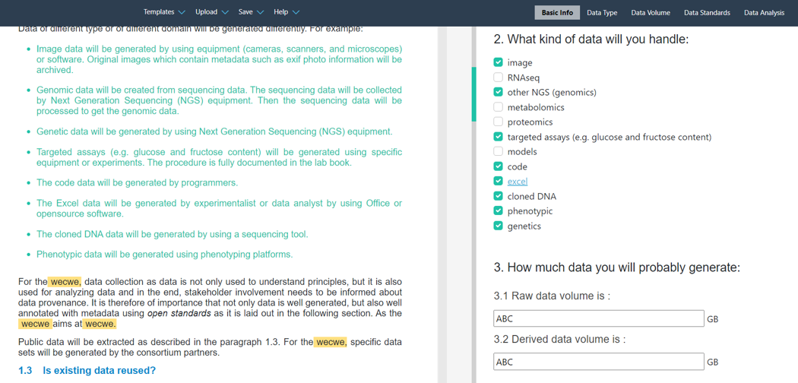
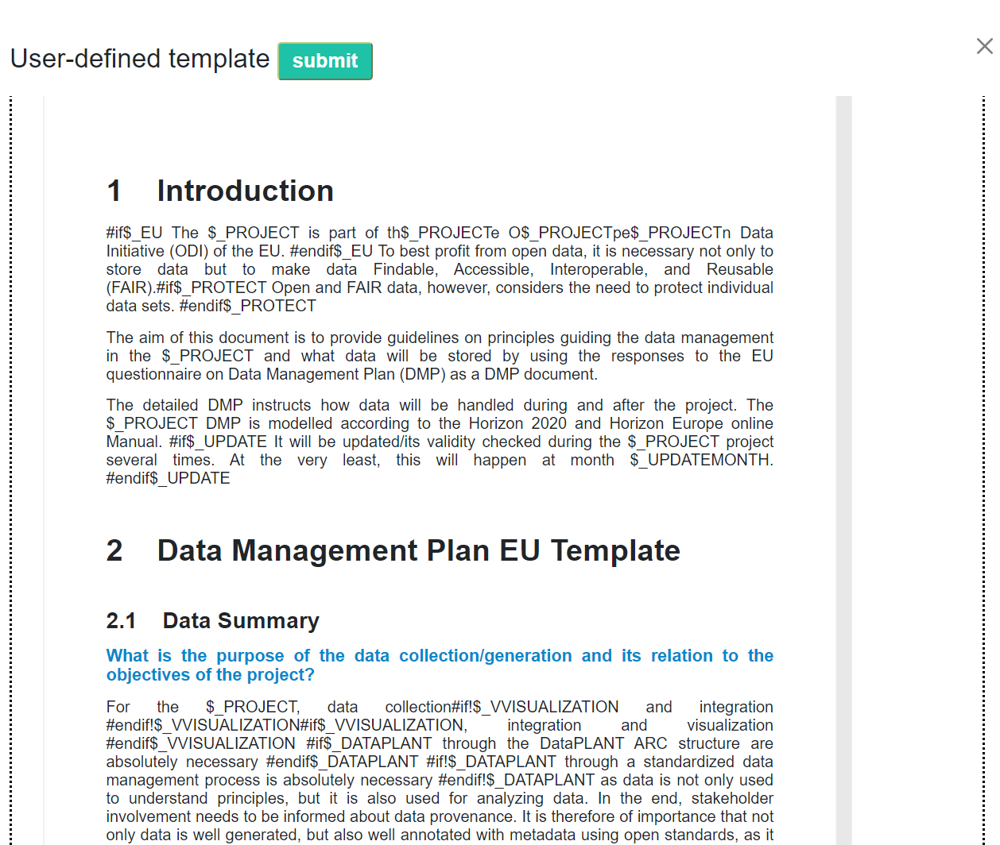
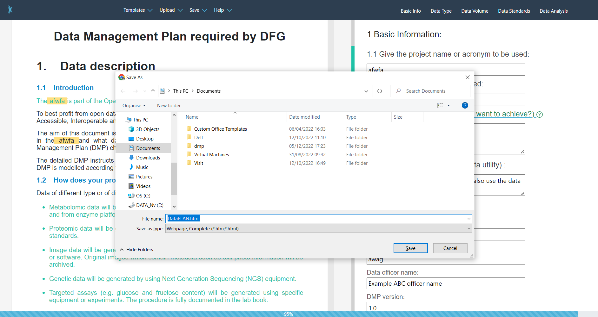

[DataPLAN][hp-DataPLAN] is a [Data Management Plan][kb-DataManagementPlan] generator, which can help users creating a plan for their [research data management][kb-ResearchDataManagement]. By using DataPLAN, standardized DMPs for Horizon Europe and Deutsche Forschungsgemeinschaft (DFG) can be generated in five minutes. The fast generation speed is enabled by a template design with integratable answers and single-page web application technology. 

## Why is another DMP tool needed?

From funding agencies to research institutes, DMPs are required more and more often. Generating, following up and updating a DMP has increased the cost and workload of researchers. Although many tools have been developed to help creating DMPs, most of the tools do not reduce a significant amount workload. As DataPLANT uses standardized tools, protocols and formats to manage data, planing of the data management can also be standardized. The tool DataPLAN does not only help people to answer the DMPs, but comes already with a superset of standardized answers. Thus, instead of writing their own answers from scratch, users can select predefined ones, which can save a lot of workload. In addition, DataPLAN offers a practical guide, which is a detailed and comprehensive document for the project team and data stewards to follow.   
  

## Simple layout
DataPLAN has a two-column layout (Fig. 1). In the left column (the red box), a live-preview of the generated document is shown; in the right column (the blue box), a questionnaire is shown. While answering all the questions in the questionnaire, the DMP in the live-preview will automatically update based on the answers to the questionnaire. This live update gives users a unique What You See Is What You Get (WYSIWYG) experience.

<figure><figcaption style="margin: auto;">Figure 1: Layout of DataPLAN. The red box shows a live preview of the generated document; the blue box shows the single-page questionnaire</figcaption></figure>

## The answers-integrated templates

Unlike other DMP tools, which only have questions in their templates, the standardized answers of the DMP questions are directly integrated into the templates with DataPLAN. The final exported DMP document will only include answers selected by the users. For example, in Fig. 2, all checkbox options of Question 2 are selected. Therefore, all the integrated answers are shown in the final DMP document (green text). In Fig. 3, some checkbox options in Question 2 are not selected. Therefore, these answers are not shown in the final DMP document. The answers prepared in the DataPLAN tool are deeply coordinated with other DataPLANT tools such as the [ARC Commander][kb-ArcCommander] and [Swate][kb-Swate].  

<figure><figcaption style="margin: auto;">Figure 2: If all checkboxes of question 2 are selected, all counterparts in the DMP text will be kept.</figcaption></figure>  

<figure><figcaption style="margin: auto;">Figure 3: If some of the checkboxes are not selected in question 2, the respective counterparts in the DMP text will be removed.</figcaption></figure>  

For specific information, which is unique between different projects, such as the "project name" and the "project aim", the users can use free-text for the respective input fields. The counter parts in the DMP will be updated lively as well.   

## Templates can be customized
All templates prepared and provided by DataPLAN are customizable. DataPLAN has a user-defined template section (Fig. 4), in which templates are editable and can be directly loaded into DataPLAN.   

<figure><figcaption style="margin: auto;">Figure 4: All  templates prepared and provided by the DataPLAN are customizable. The templates can be reused to create user-defined templates.</figcaption></figure>

## Offline usable and absolute secure
DataPLAN can be used offline conveniently. Unlike other DMP tools, which can be complicated to run in offline situations, the [DataPLAN][hp-DataPLAN] tool itself can be saved as html file using "ctrl + s" (Fig. 5) and used subsequently. The user can also disconnect the internet after the DataPLAN website has been loaded completely. The serverless design of DataPLAN makes it absolute secure, because it prevents the loss and exposure of data during internet data transfer or online storage.  

<figure><figcaption style="margin: auto;">Figure 5: press Ctrl + S to save the file in html for using it later on.</figcaption></figure>

## No registration and free to share
Any user with or without registration can use all features of DataPLAN. The user input is saved automatically in the local storage. To share the answers or synchronize between different computers, answers can be exported in a first step and afterwards imported again into DataPLAN. 

Give [DataPLAN][hp-DataPLAN] a try and share your feedback or feature request with us. The developers of DataPLAN will be happy to hear about your needs and further improve the DataPLAN tool. 

<!-- Links to DataPLANT knowledge base (kb-) -->

<!-- kb-Fundamentals -->

[kb-DataManagementPlan]: ../fundamentals/DataManagementPlan.html "Data Management Plan"
[kb-DataPublications]: ../fundamentals/DataPublications.html "Data Publication"
[kb-DataSharing]: ../fundamentals/DataSharing.html "Data Sharing"
[kb-FairDataPrinciples]: ../fundamentals/FairDataPrinciples.html "FAIR Data principles"
[kb-Metadata]: ../fundamentals/Metadata.html "Metadata"
[kb-PersistentIdentifiers]: ../fundamentals/PersistentIdentifiers.html "Persistent Identifiers"
[kb-PublicDataRepositories]: ../fundamentals/PublicDataRepositories.html "Repositories"
[kb-ResearchDataManagement]: ../fundamentals/ResearchDataManagement.html "Research Data Management"
[kb-VersionControlGit]: ../fundamentals/VersionControlGit.html "Version Control and Git"

<!-- kb-Implementation -->
[kb-AnnotatedResearchContext]: ../implementation/AnnotatedResearchContext.html "Annotated Research Context"
[kb-DataHub]: ../implementation/DataHub.html "DataPLANT DataHUB"
[kb-ArcCommander]: ../implementation/ArcCommander.html "ARC Commander"

[kb-Swate]: ../implementation/Swate.html "DataPLANT Swate"
<!-- kb-Tutorials -->
[kb-QuickStart_arc]: ../tutorials/ARCUserJourney.html "ARC User Journey"

<!-- Links to DataPLANT Homepage (hp-) -->

[hp-Registration]: <https://register.nfdi4plants.org/> "DataPLANT Registration"
[hp-DataHUB]: <https://git.nfdi4plants.org> "DataPLANT DataHUB"
[hp-HelpDesk]: <https://helpdesk.nfdi4plants.org> "DataPLANT Help Desk"
[hp-DataPLAN]: <https://plan.nfdi4plants.org> "DataPLANT data management plan tool"
<!-- Links to DataPLANT GitHub (gh-) -->

[gh-DataPlant]: <https://github.com/nfdi4plants/ARC-specification/> "GitHub DataPLANT"
[kb-ArcSpecs]: ./../implementation/ARC-specification.html "ARC specification"
[kb-ArcCommander-Manual]: ../ArcCommanderManual/index.html "ARC Commander Manual"

<!-- Links to external (ext-) sources -->

[ext-github-join]: <https://github.com/join/> "Join GitHub"
[ext-github-desktop]: <https://desktop.github.com/> "GitHub Desktop"
[ext-git]: <https://git-scm.com/download/> "Git"
[ext-git-lfs]: <https://git-lfs.github.com/> "Git-LFS"
[ext-excel-online]: <https://www.microsoft.com/en-us/microsoft-365/excel> "Excel online"

[ext-VSCode]: https://code.visualstudio.com/ "Visual Studio Code"

[ext-galaxy]: <https://plants.usegalaxy.eu/> "Galaxy Plants"
[ext-omero]: <https://www.openmicroscopy.org/omero/> "Omero"
[ext-zenodo]: <https://zenodo.org/> "Zenodo"
[ext-invenio]: <https://inveniosoftware.org/products/rdm/> "Invenio"
[ext-DataJournals]: https://www.researchdata.uni-jena.de/en/information/data-publication "RDM Jena Data Journals"
