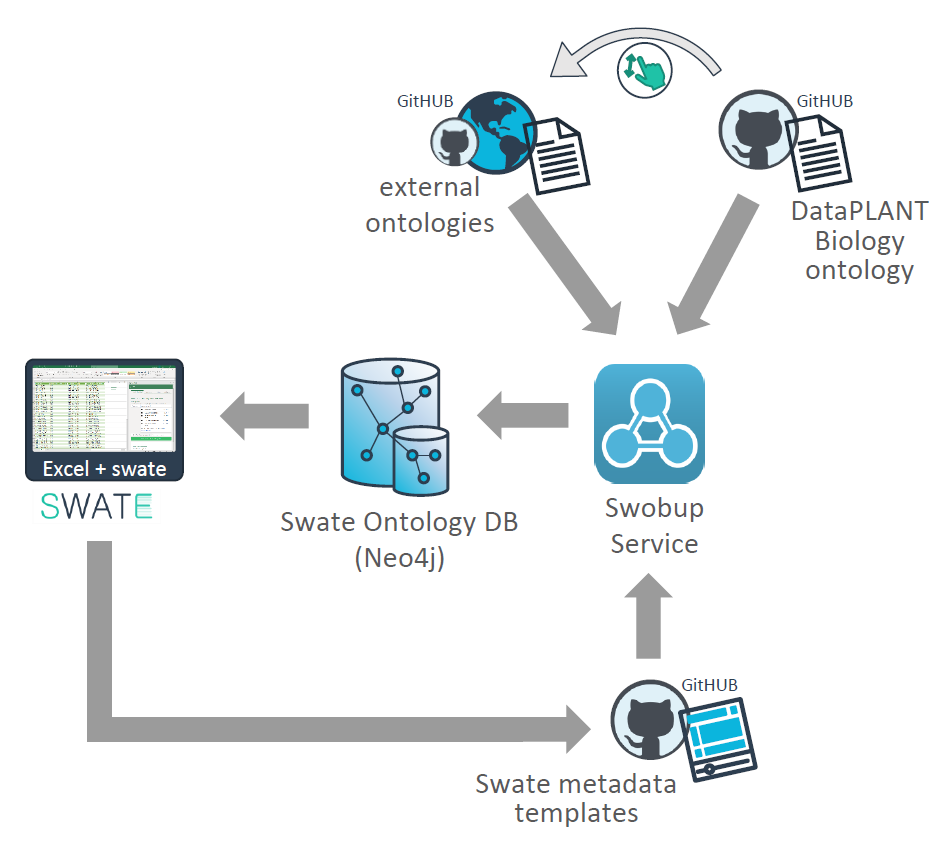

# The DataPLANT Metadata Annotation and Ontology Service Landscape

The [Annotated Research Context (ARC) ](https://nfdi4plants.org/nfdi4plants.knowledgebase/docs/implementation/AnnotatedResearchContext.html) as a concept for systematic storage of data and metadata contributes to FAIRness (findability, accessibility, interoperability and reusability) of data throughout the whole research data life cycle. This is achieved by relying on established standards, which include the use of unambiguous language for the description of the data via ontologies and controlled vocabularies. [Ontologies](https://nfdi4plants.org/nfdi4plants.knowledgebase/docs/fundamentals/Ontologies.html) are collections of concepts, or terms, relevant to a specific research domain, as well as the relations between them. Terms can include additional annotations, such as a human readable label, definition, synonyms and equivalent terms. Most importantly, each term must include a unique, permanent identifier, such as a persistent identifier (PID), which allows for the term to be forever identified. By defining a common vocabulary, ontologies enable data to be shared, integrated, and reused across different systems and applications in a standardized way. They help to ensure that data is semantically interoperable, which means that it can be understood and interpreted consistently by different users and applications. In order to allow ontology-driven metadata annotation, DataPLANT provides a dynamic service and tool [landscape](https://doi.org/10.48550/arXiv.2309.07129).
 

 

*Tools and components of the DataPLANT metadata annotation toolchain*
 

## Swate
The spreadsheet-based tool Swate allows ontology-driven metadata annotation of experimental workflows. It links Microsoft Excel to a set of ontologies (saved in the Swate database SwateDB) that can be searched for terms when generating metadata description files. Swate already provides a selection of different templates for metadata description that e.g. fulfill requirements for endpoint repositories, but it is also possible to generate own templates. More information on how to use Swate (including best practices for data annotation) can be found [here](https://nfdi4plants.org/nfdi4plants.knowledgebase/docs/implementation/Swate.html).
 

### SwateDB and Swobup
A collection of ontologies that can be used to annotate metadata sheets via Swate are stored and structured within the SwateDB. These include a collection of external ontologies relevant to plant data as well as the DataPLANT Biology Ontology (DPBO). Detailed descriptions of the ontologies that are currently included in the SwateDB can be found below. The [Swate OBO Updater](https://github.com/nfdi4plants/Swobup) (Swobup) facilitates the integration of new ontologies by automatically reading newly added ontologies in the database.
 

## Ontologies in DataPLANT – Best practices
Please consider reading our background article about [ontologies](https://nfdi4plants.org/nfdi4plants.knowledgebase/docs/fundamentals/Ontologies.html) before continuing.
 

### How can I find a certain ontology term for my data annotation?
Let‘s imagine you decide to use Swate to annotate metadata of your next specific investigation. Swate provides the possibility to use ontologies via the [‘Ontology term search’]( https://nfdi4plants.org/nfdi4plants.knowledgebase/docs/SwateManual/Docs04-Ontology-Term-Search.html) tab. There are several external ontologies as well as our own DPBO available in the SwateDB. When searching for terms, vocabulary from these ontologies will be suggested. 
 

Since not every term or ontology is currently available in Swate, you can contribute to the SwateDB and DPBO by requesting terms or ontologies to be added.
 

### Your contribution – Missing ontologies and terms

*Do you need many or all terms from another external ontology?* 
*Do you miss a specific term or a specific definition for a term?* 
*Do you want to improve an existing term?* 
*Do you miss a relation between terms?* 

If you have answered yes to any of these questions, then we invite you to contribute to the DataPLANT Ontology Landscape!
 

*But how can you contribute?*
 

You can either open an issue on [GitHub](https://github.com/nfdi4plants/nfdi4plants_ontology) or you can contact us via the [Helpdesk](https://support.nfdi4plants.org/). A detailed description of how to contribute via a GitHub issue can be found [here](https://github.com/nfdi4plants/nfdi4plants_ontology/blob/main/README.md).
On our GitHub page we provide a few instructions and issue templates that offer guidance for your contribution:
 

 

*Issue templates for importing or changing terms and ontologies in the SwateDB*
 

If you are unsure about what kind of issue template to use, you can always use an empty issue to explain your wishes.
 

*What happens after you have submitted an issue?*
 

Our DataPLANT ontology curation team reviews your suggestion and then incorporates the term (including any relations that are necessary) into the DPBO or the full ontology into the SwateDB.
 

 

*Integration of new terms into the DPBO*
 

The term or ontology is then directly available in Swate via the “Ontology Term Search” tab. If the term is considered to be relevant for the general scientific community, we will also suggest the integration of this term to a suitable external ontology.
 

### Terminology services
Several ontology search services (also called terminology services) are available that offer definitions of searched terms, list related terms and provide extensive information on the listed ontologies. These can be helpful when deciding on terms for metadata annotation or when suggesting terms or ontologies to be added to the SwateDB.
 

Some relevant ontology search services for plant sciences are:
- [Open Biological and Biomedical Ontology (OBO) Foundry]( https://obofoundry.org/)
- [Agroportal](http://agroportal.lirmm.fr/)
- [Planteome](https://planteome.org/)
- [Ontobee](https://ontobee.org/)
- [BioPortal](https://www.bioontology.org/)
- [The Ontology Lookup Service](https://www.ebi.ac.uk/ols/index)
- [TIB Terminology Service](https://terminology.tib.eu/ts)

## Ontologies included in the SwateDB
Plant investigations are often complex, incorporating a diverse range of methods and techniques. For this reason, it will often be necessary to use terms from a variety of ontologies when annotating metadata for a plant experiment, as illustrated in the figure below. The review by [Dumschott et al. 2023](https://doi.org/10.3389/fpls.2023.1279694) provides an overview of relevant ontologies and their application for metadata annotation in the field of plant sciences. 
 

 

*Figure from [Dumschott et al. 2023](https://doi.org/10.3389/fpls.2023.1279694), depicting how ontologies are used to annotate different aspects of an investigation.*
 

The ontologies in the SwateDB can be categorized into general scientific ontologies and plant-specific ontologies. General scientific ontologies are those that can be applied to the broader scientific domain and not just to a specific field of research such as plant sciences. They include upper-level ontologies (foundational frameworks for other ontologies to build upon in order to increase their interoperability) and ontologies that focus on a specific domain, such as environmental conditions, traits and phenotypes of organisms, or experimental methods and setups. Several ontologies are particularly well-suited for describing and annotating experiments, phenotypic traits, structures and experimental conditions relating to plant research, which we categorize as plant-specific ontologies.
 

The following table gives an overview of ontologies included in the SwateDB that are relevant to experiment descriptions within the plant sciences as well as the [ISA entity](https://isa-specs.readthedocs.io/en/latest/isamodel.html) (investigation, study, assay) they will most likely be of relevance for. A more detailed description of the listed ontologies is given below.
 

*Plant-specific and general scientific ontologies included in the SwateDB*
 

|Ontology ID|Ontology Name|Domain|ISA Entity|
|:----|:----|:----|:----|
|**Plant-specific ontologies**| | | |
|DPBO|DataPLANT Biology Ontology|Broker ontology for plant sciences|Investigation, Study, Assay|
|PECO|Plant Experimental Conditions Ontology|Plant experimental conditions|Investigation, Study|
|PPEO|Plant Phenotype Experiment Ontology|Plant phenotypes and traits (implementation of the Minimal Information About Plant Phenotyping Experiment)|Investigation, Study, Assay|
|PO|Plant Ontology|Plant anatomy, morphology and growth and development|Study|
|TO|Plant Trait Ontology|Phenotypic traits in plants|Study, Assay|
|**General scientific ontologies-domain specific**| | | |
|ChEBI|Chemical Entities of Biological Interest Ontology|Molecular entities of biological interest|Assay|
|EFO|Experimental Factor Ontology|Experimental variables|Investigation, Study|
|ENVO|Environment Ontology|Environmental systems, components and processes|Investigation, Study|
|MOD|Protein modification (PSI-MOD)|Protein chemical modifications, classified by molecular structure or amino acid|Study, Assay|
|MS|PSI Mass Spectrometry Ontology|Proteomics mass spectrometry|Assay|
|NCBITAXON|National Center for Biotechnology Information (NCBI) Organismal Classification|NCBI organismal taxonomy|Investigation, Study|
|NCIT|National Cancer Institute Thesaurus|Broad coverage of the cancer domain|Study, Assay|
|OBI|Ontology for Biomedical Investigations|Life-science and clinical investigations|Investigation, Study, Assay|
|PATO|Phenotype And Trait Ontology|Phenotypic qualities (properties, attributes or characteristics)|Assay|
|UO|Unit Ontology|Metrical units for use in conjunction with PATO|Study, Assay|

 

### Plant-specific ontologies

#### [The DataPLANT Biology Ontology (DPBO)]( https://github.com/nfdi4plants/nfdi4plants_ontology)
The DPBO is a broker ontology that collects missing vocabulary that is required by plant scientists for annotating their metadata. Users can suggest new terms or improvements to already existing terms by posting an issue with the relevant information to [GitHub](https://github.com/nfdi4plants/nfdi4plants_ontology). Once a term suggestion or improvement has been submitted, the ontology team incorporates the information into the DPBO. This process involves assigning a unique ID to the term, adding the term definition and relevant synonyms, and incorporating the term into the ontology structure by defining relationships to other terms. The team will also suggest the term to be added to the relevant external ontology.
 

#### [Plant Experimental Conditions Ontology (PECO)](https://obofoundry.org/ontology/peco.html)
The PECO is a standardized and structured vocabulary used to describe experimental conditions in plant research. It provides a set of terms and definitions that researchers can use to annotate their experiments, allowing for consistent and detailed reporting of key variables such as growth conditions, treatments, and environmental factors in plant-related studies. PECO facilitates data integration, sharing, and analysis across different plant research studies and databases.
 

#### [Plant Phenotype Experiment Ontology (PPEO)](https://agroportal.lirmm.fr/ontologies/PPEO)
For ensuring sufficient description of metadata for plant phenotyping experiments, the [‘Minimum Information About a Plant Phenotype Experiment’ (MIAPPE) standards]( https://www.miappe.org/) [(Papoutsoglou et al. 2020)](https://doi.org/10.1111/nph.16544) have been developed. For easier implementation of MIAPPE for metadata description the associated ontology PPEO was generated. It covers the different sections and associated attributes necessary for describing plant phenotyping experiments in accordance with MIAPPE, and focuses on the MIAPPE structure rather than defining terms for metadata description. In Swate, the ontology ‘MIAPPE’ is used in the place of PPEO.
 

#### [Plant Ontology (PO)](https://obofoundry.org/ontology/po.html)
The PO covers plant anatomy, morphology and developmental stages of both plants and plant parts. The primary aim of the PO is to bridge the diversity of data that can be collected during plant research- from genetics, molecular and cellular biology to taxonomy and botany research. The PO is divided into two main branches: ‘plant anatomical entity’ and ‘plant structure development stage’. The branch ‘plant anatomical entity’ includes terms for plant morphology and anatomy, such as structures, whereas the branch ‘plant structure development stage’ includes terms for developmental stages of different plant parts.
 

#### [Plant Trait Ontology (TO)](https://obofoundry.org/ontology/to.html)
The TO is a standardized vocabulary used to describe and categorize various traits and characteristics observed in plants. It provides a structured set of terms and definitions that researchers can use to annotate plant phenotyping data, encompassing a wide range of traits, including morphological, physiological, and ecological features. The TO facilitates data integration, sharing, and analysis across different plant research studies and databases, promoting better understanding and comparison of plant traits among various species and experimental conditions.
 

### General scientific ontologies

#### [Chemical Entities of Biological Interest (ChEBI)](https://obofoundry.org/ontology/chebi.html)
ChEBI is a freely available database and ontology of small molecular entities that play a significant role in biological systems. It provides detailed information and standardized annotations for chemical compounds, including their structures, names, and biological activities. ChEBI serves as a valuable resource for researchers in various fields, facilitating the understanding of the chemical diversity and complexity of biological processes, such as metabolism, signaling, and drug interactions.
 

#### [Experimental Factor Ontology (EFO)](https://ontobee.org/ontology/EFO)
The EFO is a controlled vocabulary of terms and relationships that describes experimental variables or factors (e.g. genetic variations, environmental exposures, etc.) to facilitate data integration and interoperability across different scientific domains. EFO is also used to annotate data in public data repositories, such as the European Bioinformatics Institute (EBI) and the National Center for Biotechnology Information (NCBI), to ensure that data is annotated with standardized terms and can be easily searched and retrieved.
 

#### [Environment Ontology (ENVO)](https://obofoundry.org/ontology/envo.html)
The ENVO is a structured vocabulary that aims to provide a standardized and comprehensive representation of environmental concepts. It encompasses terms and relationships related to biotic and abiotic entities, environmental materials, habitats, and processes, facilitating the integration and sharing of environmental data across diverse research domains and applications.
 

#### [Protein Modification Ontology (MOD)](https://bioportal.bioontology.org/ontologies/PSIMOD)
The PSI MOD is a controlled vocabulary that provides standardized terms and definitions for describing post-translational modifications of proteins. It encompasses a wide range of modifications, such as phosphorylation, glycosylation, acetylation, and ubiquitination. MOD enables researchers to annotate and share information about protein modifications consistently, allowing for better understanding of the functional implications of post-translational modifications in biological processes and disease mechanisms.
 

#### [Mass Spectrometry Ontology (MS)](https://obofoundry.org/ontology/ms.html)
The PSI MS is a controlled vocabulary of terms and relationships describing research aspects for the field of mass spectrometry. Mass spectrometry is an analytical technique used to identify and quantify the chemical and biological properties of samples based on their mass-to-charge ratio. The MS ontology provides a standardized and structured way to describe mass spectrometry data, including, for example, instrumentation and experimental protocols, as well as data analysis.
 

#### [National Center of Biotechnology Information Organismal Classification (NCBITaxon)](https://bioportal.bioontology.org/ontologies/NCBITAXON/?p=summary)
The NCBITaxon is a database that contains a nomenclature and classification for all organisms in public sequencing databases. It is needed for the annotation of species names and their placement in the taxonomy tree. In the SwateDB we currently use the ontology NCBITaxonmin, which we created as a minimized version of the NCBITaxon database. It contains the 20,000 species names most commonly used in research papers.
 

#### [National Cancer Institute Thesaurus (NCIT)](https://ncithesaurus.nci.nih.gov/ncitbrowser/)
The NCIT is a broad biomedical ontology and reference terminology for the cancer domain. It includes terms of several biological processes, biochemical pathways, gene products as well as chemicals that can be of relevance for the general scientific community when describing experiments and data. 
 

#### [Ontology for Biomedical Investigations (OBI)](http://obofoundry.org/ontology/obi.html)
The OBI is a formal ontology that provides a comprehensive representation of the entities and processes involved in biomedical experiments and investigations. It aims to standardize the description and integration of data from various biomedical studies, including genomics, proteomics, and clinical research, fostering interoperability and facilitating the interpretation and sharing of experimental results across different domains and disciplines. 
 

#### [Phenotype And Trait Ontology (PATO)](https://obofoundry.org/ontology/pato.html)
The PATO is a standardized ontology that serves as a controlled vocabulary for describing phenotypic qualities and traits in biological organisms. It provides a set of terms and definitions that researchers can use to annotate and characterize various observable characteristics, such as physical features, behaviors, and physiological properties. PATO enables the consistent and structured representation of phenotype data, allowing for efficient data integration and comparison across different species and experimental studies.
 

#### [Units of Measurement Ontology (UO)](https://obofoundry.org/ontology/uo.html)
The UO is a controlled vocabulary of terms for describing units of measurement and their relationships. It is intended to provide a standardized and structured way to describe measurements in scientific data and to support interoperability and data integration across different scientific domains. The UO provides a hierarchy of classes and subclasses that represent different categories of units, such as length, mass, time, and temperature.
 

