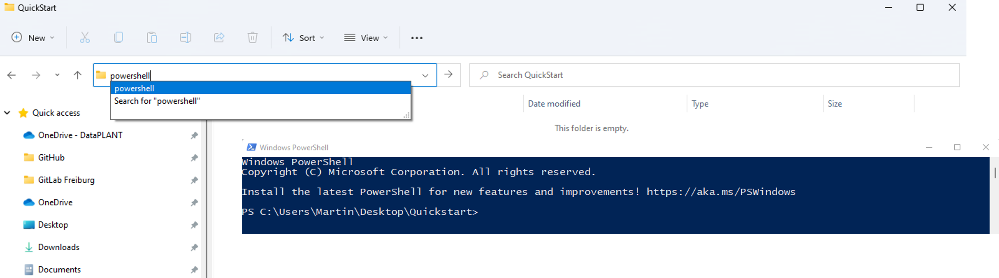
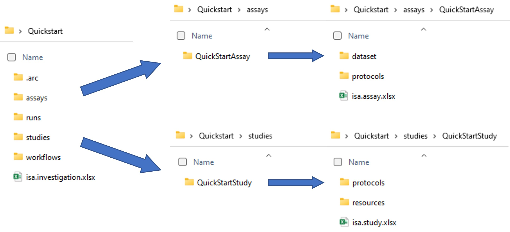

This document is work in progress. If you experience any inconsistencies, have questions or would like to suggest additions, please feel free to <a href="javascript:location='mailto:\u0069\u006e\u0066\u006f\u0040\u006e\u0066\u0064\u0069\u0034\u0070\u006c\u0061\u006e\u0074\u0073\u002e\u006f\u0072\u0067';void 0">contact us</a> or open an issue in our [Helpdesk](<https://helpdesk.nfdi4plants.org>).

We are very happy that you chose our tools and infrastructure to create and share your own ARCs. In this QuickStart we focus on how to use the "ARC Commander" to store and share your data.


- [Environment and setup](#environment-and-setup)
  - [The command line](#the-command-line)
  - [Required software](#required-software)
- [ARC initialization](#arc-initialization)
- [Adding metadata](#adding-metadata)
  - [ISA investigation](#isa-investigation)
  - [ISA studies and assays](#isa-studies-and-assays)
- [Sharing your ARC](#sharing-your-arc)
  - [DataPLANT registration and access](#dataplant-registration-and-access)
  - [ARC synchronization](#arc-synchronization)
  - [Setting a git user](#setting-a-git-user)
  - [Invite collaborators](#invite-collaborators)
- [The Minimalist's ARC-QuickStart](#the-minimalists-arc-quickstart)

## Environment and setup

### The command line

- Most of this Quickstart (especially the section [ARC initialization](#arc-initialization)) is based on the command line (Windows: powershell; Linux and Mac: terminal).
- The following picture shows exemplarily how to open a powershell on windows by entering *powershell* into the explorer path:  



- Text formatted as code blocks represents commands to copy/paste into the command line:

```bash
echo "hello - I am a code block"
```

### Required software

- [ ] Prerequisites for using the ARC Commander are [git](https://git-scm.com/downloads) and [git LFS](https://git-lfs.github.com/)

> Note: If this is your first time using git on this computer, you need to set your git user name and email address. These are needed for displaying them on the git commits. You can update the settings with

  ```bash
  git config --global user.name <your_name>
  git config --global user.email <your_email>
  ```

- [ ] Please download the latest version of the [ARC Commander](https://github.com/nfdi4plants/arcCommander/releases) for your operating system and install it according to [these instructions](https://github.com/nfdi4plants/arcCommander#install-and-start).

- Check if the ARC Commander is functional by displaying the ARC commander version and help menu:

```bash
arc --version
arc --help
```


<div style="page-break-after: always;"></div>

## ARC initialization

1. Create and navigate to a local folder, which you want to initialize as an ARC.

```bash
mkdir ~/Desktop/QuickStart; 
cd ~/Desktop/QuickStart
```

2. Initialize your ARC by executing

```bash
arc init
```

3. This will create the general ARC folder structure:


<div style="page-break-after: always;"></div>

## Adding metadata

### ISA investigation

The ISA investigation (`-i`) workbook allows you to record administrative metadata of your project. Add the isa.investigation.xlsx workbook including an identifier to your ARC with

```bash
arc i create -i QuickStartInvestigation
```
> Note: Avoid using spaces in the identifier. Use underscores and capital letters instead.>

### ISA studies and assays

The ISA study (`-s`) and ISA assay (`-a`) workbooks allow you to annotate your experimental data.

1. Add an isa.study.xlsx workbook including an identifier to your ARC with

```bash
arc s add -s QuickStartStudy
```
  
2. Add an isa.assay.xlsx workbook including an identifier to your ARC with

```bash
arc a add -s QuickStartStudy -a QuickStartAssay
```

> Note: An assay must be linked to a study. If a study does not exist, it will be created automatically in this step.

- The ARC Commander will add a subdirectories to the *studies* and *assays* folder. Your ARC should
    look similar to this now:  



- These steps can be repeated to add as many studies and assays as needed. Accordingly, more subdirectories will be added. Multiple assays can be grouped in a study when the same StudyIdentifier is used.

3. Place the data for each assay in the respective dataset folder.

<div style="page-break-after: always;"></div>

## Sharing your ARC

### DataPLANT registration and access

In case you are not a member of DataPLANT yet, please visit [sign up](<https://register.nfdi4plants.org>). Afterwards, you will be granted access to DataPLANT’s [DataHUB](<https://git.nfdi4plants.org>). The DataHUB allows you to share your ARCs with registered lab or project partners.


After successful registration, create and set an access token for ARC Commander synchronization using

```bash
arc remote accesstoken get -s https://git.nfdi4plants.org
```

A window within your browser will open, asking for your DataPLANT Log In. In case you are already logged in, the browser will directly display a Success message to you:


### ARC synchronization

1. Synchronize your ARCs with the DataHUB using the command

```bash
arc sync 
```

2. If you did not connect your local ARC with a remote one so far, you can specify the remote address with the flag `-r` followed by an URL, e.g.,

```bash
arc sync -r https://git.nfdi4plants.org/martinkuhl/QuickStart
```

3. In case you want to create a new remote repository at this URL, it needs to be assembled as the following example: 
```bash
# https://git.nfdi4plants.org/<YourUserName>/<YourARC>
```

4. If no repository exists under the given URL, the ARC Commander will produce an error ensuring that you spelled the URL correctly. To force synchronization, use 

```bash
arc sync -f
```


5. Check if the upload was successful by visiting your ARC at the respective URL in your browser.


>Note: Alternatively, you can first create a new blank repository in the [DataHUB](https://git.nfdi4plants.org) by clicking "New project/repository" in the plus drop down menu of the navigation bar on top. Afterwards, you can sync your local ARC to the respective repository by adapting the URL to the newly generated one. 

### Setting a git user

Some users might want to use different signatures for different repositories, e.g. for developing software on GitHub and working on ARCs on [DataPLANT's DataHUB](https://git.nfdi4plants.org). Besides your global git configuration, you can store the information you want to use for editing ARCs within the ARC Commander config:

```bash
arc config set -g -n "general.gitname" -v "Name of choice"
arc config set -g -n "general.gitemail" -v "Email of choice"
```
To transfer the information from the global ARC Commander config to the local git config of the ARC use

```bash
arc config setgituser
```

### Invite collaborators

You can invite lab-colleagues or project partners to join your ARC for collaboration. While inside your ARC on the DataHUB, click on *Project information -\> Members* in the left navigation panel. Search for registered researchers and select a role for each individually. These roles come along with different rights.  
Briefly:

- *Guests:* Have the least rights. This is recommended for people you ask for consultancy.
- *Developers:* The choice for most people you want to invite to your ARC. Developers have read and write access, but cannot maintain the project on the DataHUB, e.g. inviting others.  
- *Maintainers:* Gives the person the same rights as you have (except of removing you from your own project). This is recommended for inviting PIs or group leaders allowing them to add their group members for data upload or analysis to the project as well.


> Note: A detailed usage instruction for the ARC Commander can be found [here](https://github.com/nfdi4plants/arcCommander/wiki/Detailed-usage-instruction).

<div style="page-break-after: always;"></div>


<div style="page-break-after: always;"></div>

## The Minimalist's ARC-QuickStart

- [x] You know how to use a command line
- [x] You have created an ARC before
- [x] The latest version of the [ARC Commander](https://github.com/nfdi4plants/arcCommander/releases) as well as [git](https://git-scm.com/downloads) and [git LFS](https://git-lfs.github.com/) are installed on your computer
- [x] You have a [DataPLANT](https://register.nfdi4plants.org) account
- [x] Your computer is linked to the [DataHUB](https://git.nfdi4plants.org) via an ssh key or a personal access token.

Voila! You are ready to follow these few steps to create a minimal ARC sharable via DataPLANT's DataHUB:

1. Visit the [DataHUB](https://git.nfdi4plants.org), create a new repository and copy the URL to your clipboard.
2. Replace the `<variables>` in the following code block with your information and execute it in your command line.

```bash
# Create and navigate to your ARC folder
mkdir <YourARC>
cd <YourARC>

# Setup the ARC structure with one study and one assay
arc init
arc i create -i <YourInvestigation>
arc a add -s <YourStudy> -a <YourAssay>
arc sync -f -r https://git.nfdi4plants.org/<YourUserName>/<YourARC> -m "initialize ARC structure"
```
