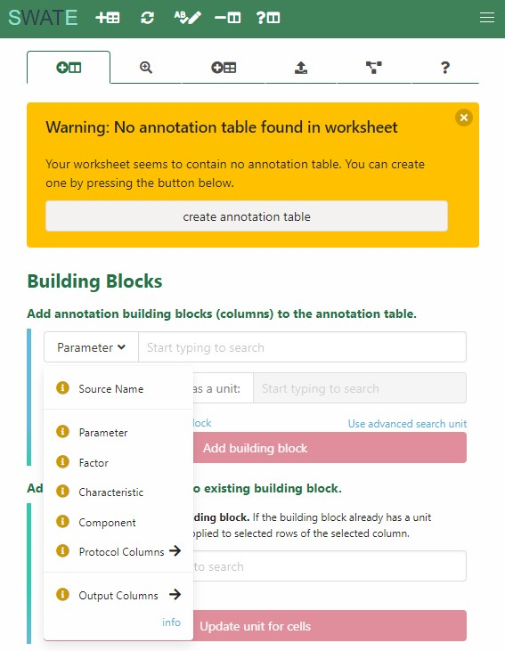
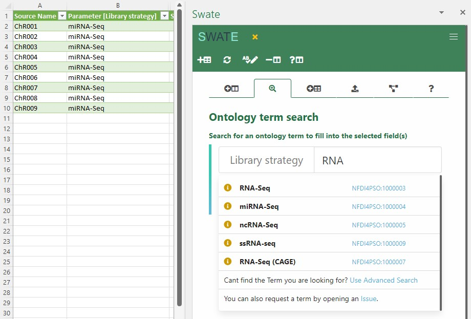
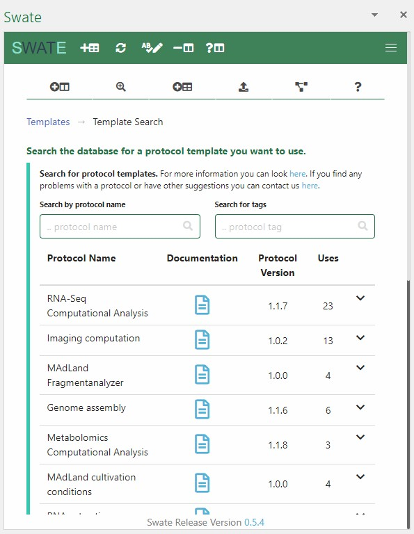

Swate (Swate workflow annotation tool for Excel) is one of two central DataPLANT tools designed for convenient interaction with your [ARC][kb-AnnotatedResearchContext] (the other one being the [ARC Commander][kb-ArcCommander]).
Swate simplifies adding standardized metadata for your experimental workflows by leveraging a simple use of ontologies. <!-- link to ontology --> 

## Swate for ontology driven metadata annotation
A key factor in the development of research data management tools is finding the balance between standardization and the requirements of researchers for annotating their experimental workflows. The spreadsheet-based version of the well-established ISA framework allows for ontology-driven metadata annotation of these workflows in a simple and accessible way. However, finding the appropriate ontology term can be extremely tedious and often results in incomplete metadata annotation. To overcome this hurdle, DataPLANT offers SWATE to facilitate the generation of ISA-Tab annotation tables with an integrated search function and an ontology guided metadata annotation. 

Fully integrated in Microsoft Excel (Excel online, Excel 365, and Excel 2019), Swate leverages standard spreadsheet features, such as color coding or highlighting (increasing user experience and acceptance) without polluting the actual metadata information. Users can add and delete building blocks to their ISA compliant annotation tables, describing the data in a clear representation. These building blocks can either represent a 
- `Source Name` (input, one per table), 
- `Characteristic`, 
- `Parameter`, 
- `Factor`, 
- `Component`, 
- `Protocol Column` (Protocol REF/Protocol Type), or an
- `Output Column` (Sample Name/Raw Data File//Derived Data File, one per table).  

Combination of ISA (Characteristic, Parameter, Factor, Component) and a biological or technological ontology (e.g. temperature, strain, instrument model) gives the flexibility to display an ontology term, e.g. temperature, as a regular process parameter or as the factor your study is based on within your annotation table (Parameter [temperature] or Factor [temperature]). For more information on these building blocks, please check our [annotation principles](https://nfdi4plants.github.io/AnnotationPrinciples/). 

Ontology terms within the Swate database can not only be used to standardize the headers of your annotation table, but also for standardization of the respective values. When filling in metadata via the "related term directed search", Swate will suggest matching metadata terms for the respective building block within the database. Of course, users are not forced to use this feature in case they opt for more flexibility.

## Templates for convenient metadata annotation
Metadata annotation as part of the data submission routine to public repositories is often bothersome due to a high variability between repository requirements. This can become particularly inconvenient when the same metadata is submitted repeatedly, e.g. to unrelated public repositories. To assist researchers in this process, DataPLANT provides a growing collection of templates as a starting point for their annotation tables. The template design process is initiated “backwards”, starting from the requirements of public repositories and thereby, compliance with metadata standards. Our Data stewards supervise the metadata harmonization between template and target repository and simultaneously contribute to the development of the DataPLANT broker ontology <!-- linkt to DPBO-->.  
From a technical perspective, these templates are ISA Protocols containing various Characteristics, Parameters, and the Study specific Factor. DataPLANT provides checklists and requirements of public repositories as templates that are considered useful for various technologies and common standards, e.g. MIAPPE or MINSEQE. The templates can directly be integrated to the isa.study.xlsx and isa.assay.xlsx files using Swate. Once loaded into the table, they still can be modified to special needs in the sense of adding or deleting annotation building blocks. The modularity of the system also gives labs and institutions the possibility to create their own lab specific templates for experiments that are frequently run in the lab, e.g. a metabolomics experiment of a measurement facility. High flexibility is fostered by offering a manual or Swate-supported template customization, distribution, and use.

## There is no wrong or right
Neither does DataPLANT tell you which building blocks or terms you should use for your data annotation, nor do we enforce the usage of our templates. These shall only serve as a starting point for your annotation table and CAN assist you during data submission to specific endpoint repositories.

If you cannot find a fitting term for your data annotation, you can try to use Swate's Advanced Term Search. If you still cannot find a fitting term, annotate your data with free-text. Any annotation will help to understand your data. Hence, an ontology-independent annotation is still preferred over a missing annotation. Feel free to <a href="javascript:location='mailto:\u0069\u006e\u0066\u006f\u0040\u006e\u0066\u0064\u0069\u0034\u0070\u006c\u0061\u006e\u0074\u0073\u002e\u006f\u0072\u0067';void 0">contact us</a> or open an issue in our [Helpdesk](<https://helpdesk.nfdi4plants.org>) if you want to request the addition of a term to our broker ontology. 

## What's next?
After reading this article, you should 

- check the [Swate QuickStart][kb-swate_QuickStart] and
- explore the [Swate Manual][kb-SwateManual] for in-depth details.

<!-- Links to DataPLANT knowledge base (kb-) -->

<!-- kb-Fundamentals -->

[kb-DataManagementPlan]: ../fundamentals/DataManagementPlan.html "Data Management Plan"
[kb-DataPublications]: ../fundamentals/DataPublications.html "Data Publication"
[kb-DataSharing]: ../fundamentals/DataSharing.html "Data Sharing"
[kb-FairDataPrinciples]: ../fundamentals/FairDataPrinciples.html "FAIR Data principles"
[kb-Metadata]: ../fundamentals/Metadata.html "Metadata"
[kb-PersistentIdentifiers]: ../fundamentals/PersistentIdentifiers.html "Persistent Identifiers"
[kb-PublicDataRepositories]: ../fundamentals/PublicDataRepositories.html "Repositories"
[kb-ResearchDataManagement]: ../fundamentals/ResearchDataManagement.html "Research Data Management"
[kb-VersionControlGit]: ../fundamentals/VersionControlGit.html "Version Control and Git"
[kb-SwateManual]: ../SwateManual/index.html "Swate Manual"

<!-- kb-Implementation -->
[kb-AnnotatedResearchContext]: ../implementation/AnnotatedResearchContext.html "Annotated Research Context"
[kb-DataHub]: ../implementation/DataHub.html "DataPLANT DataHUB"
[kb-ArcCommander]: ../implementation/ArcCommander.html "ARC Commander"

<!-- kb-Tutorials -->
[kb-swate_QuickStart]: ../guides/swate_QuickStart.html "Swate QuickStart"

<!-- Links to DataPLANT Homepage (hp-) -->

[hp-Registration]: <https://register.nfdi4plants.org/> "DataPLANT Registration"
[hp-DataHUB]: <https://git.nfdi4plants.org> "DataPLANT DataHUB"
[hp-HelpDesk]: <https://helpdesk.nfdi4plants.org> "DataPLANT Help Desk"

<!-- Links to DataPLANT GitHub (gh-) -->

[gh-DataPlant]: <https://github.com/nfdi4plants/> "GitHub DataPLANT"
[kb-ArcSpecs]: ./../implementation/ARC-specification.html "ARC specification"
[gh-ArcCommander]: <https://github.com/nfdi4plants/arcCommander/> "ArcCommander"
[kb-ArcCommander-Manual]: ../ArcCommanderManual/index.html "ARC Commander Manual"
[gh-Swate]: <https://github.com/nfdi4plants/Swate/> "GitHub Swate"

<!-- Links to external (ext-) sources -->