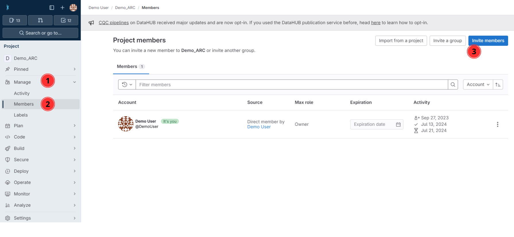

## Invite collaborators

* Unless changed, your ARC is set to private by default. 
* To collaborate, you can invite lab colleagues or project partners to your ARC by following the steps on the subsequent slides. 
* To get started [sign in](https://auth.nfdi4plants.org/realms/dataplant/login-actions/registration?client_id=account&tab_id=4bQkU161waI) to the DataHUB and open the ARC you want to share.

---

1. Click on **Project Information** in the left navigation panel

---

2. Click on **Members**

---

3. Click on **Invite members**

---

4. Search for potential collaborators

---

5. Select a role 

