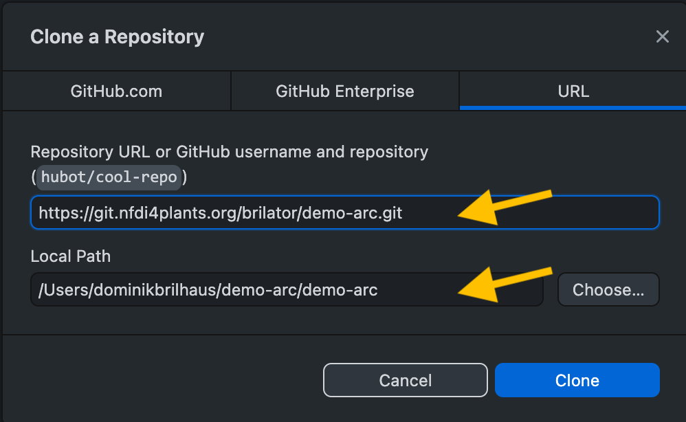

# GitHub Desktop Clone

1. Open GitHub Desktop.
2. On top: Select `File` -> `Clone repository`
3. Select the tab `URL` on top
4. Paste the HTTPS url to your ARC inside the URL field
5. Select a destination folder (local path), where your ARC will be stored locally
6. Click `Clone`

