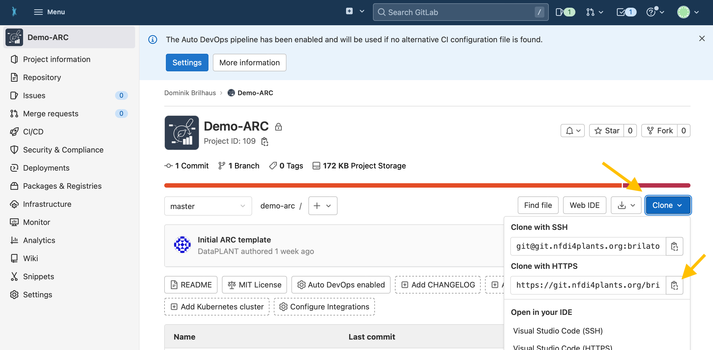

# Navigate to your ARC in the DataHUB

1. Open the [DataHUB](https://git.nfdi4plants.org/)
2. Navigate to an ARC you want to sync locally
3. Click on `Clone` and copy the HTTPS url, e.g. `https://git.nfdi4plants.org/<yourUserName>/<yourArc>.git`

