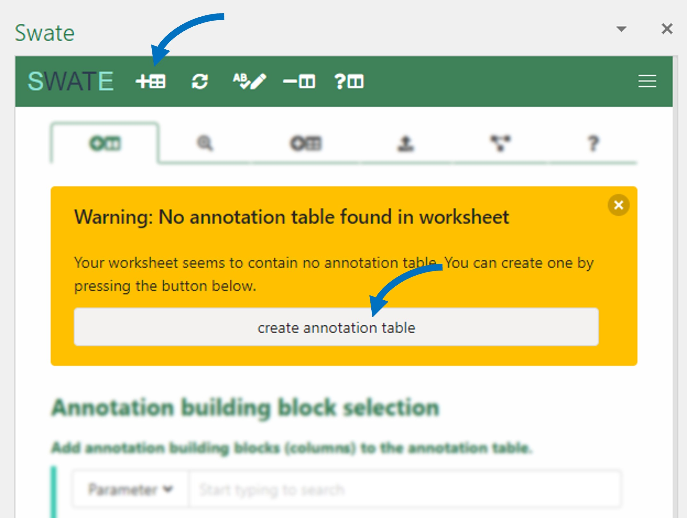

# Create a Swate table

- Click *create annotation table* in the yellow pop-up box (only appears on Excel worksheets without annotation table). 
- An annotation table with the building blocks *Source Name* and *Sample Name* will be generated.  

