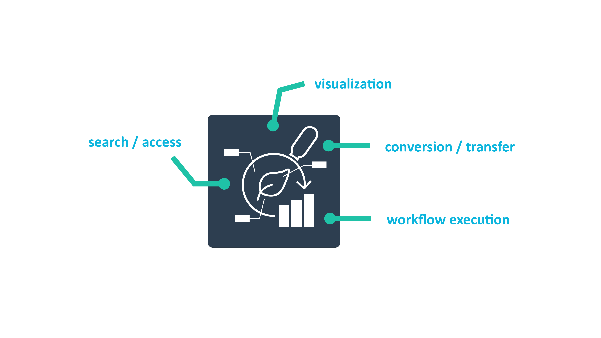
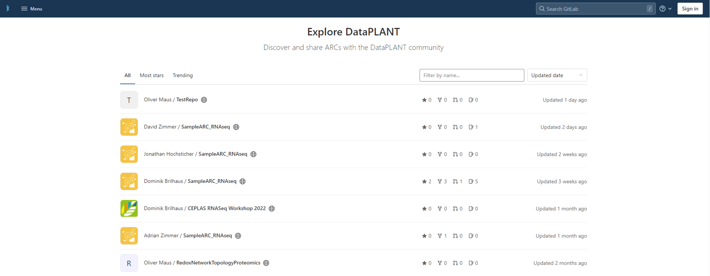

# The ARC Club

<!--  -->
<!-- _paginate: false -->

a two-day adventure to prepare your lab for the ARC universe

 
 

Dominik Brilhaus &ndash; CEPLAS Data Science
June 28th, 2023

# Annotated Research Context (ARC)

# The ARC &ndash; a package for your research data

# The DataHUB &ndash; a place to share your ARCs

DataHUB: https://git.nfdi4plants.org/

## Status quo: Institute FileShare

## Moving from FileShare to DataHUB

## Moving from FileShare to DataHUB &ndash; *via* ARCs

## There's a tiny burden

## The ARC Club &ndash; Setting

- Good internet connection
- Isolated from lab // office // daily duties
- Access to the data to be ARCified
(file share, hard disks)
- Agile, communicative, collaborative, positive
- Technical *ad-hoc* support by DataPLANT

## The ARC Club &ndash; Goals

- Move existing datasets into ARCs
- Share them via the DataHUB
- First few steps into ARCs
- Data users can pick them up from there

## The ARC Club &ndash; Rules

You do not talk about **ARC Club**

## Rules: perfect is the enemy of good

- There is no perfect ARC
- There is no complete ARC
- The only bad ARCs are those that don't exist yet.

 

  :rocket: Let's get started, the rest is easy :rocket:

## Preparation

- DataHUB user accounts https://register.nfdi4plants.org/
- DataHUB user group: https://git.nfdi4plants.org/hhu-plant-biochemistry
- Installation
  - [ARCitect](https://nfdi4plants.org/nfdi4plants.knowledgebase/docs/ARCitect-Manual/index.html)
  - [Swate](https://nfdi4plants.org/nfdi4plants.knowledgebase/docs/SwateManual/Docs01-Installing-Swate.html)
  - [ARC Commander](https://nfdi4plants.org/nfdi4plants.knowledgebase/docs/ArcCommanderManual/index-setup.html)  
- List of projects to be ARCified

## Why you want to join the **ARC Club**

- You've needed data before, now is your chance to make data available
- Your contribution to the project / ARC will be visible

## Why you want to join the **ARC Club**

- You've needed data before, now is your chance to make data available
- Your contribution to the ARC will be visible
- Food :pizza:
- Drinks :beers:
- After-ARCathon Party 🥳

## Rough Schedule

### Day 1

Time | Content
--- | ---
Morning | - Tech-check (Installation)   - Intro ARC, ARC Commander & DataHUB   - hands-on with dummy data
Lunch | *tbd* :hamburger:
Afternoon | - Discuss / assign projects   - Start creating ARCs
Evening | *tbd* :tropical_drink:

### Day 2

Time | Content
--- | ---
Morning | - Present project status   - Intro Swate   - hands-on with dummy data
Lunch | *tbd* :pizza: 
Afternoon | - Annotate experimental data   - Start creating ARCs
Evening | *tbd* :beers:

## Volunteers

- coders
- data handlers
- data users
- ARC early adopters
- long-term lab-associates

## Dates

August 16/17 or August 17/18
