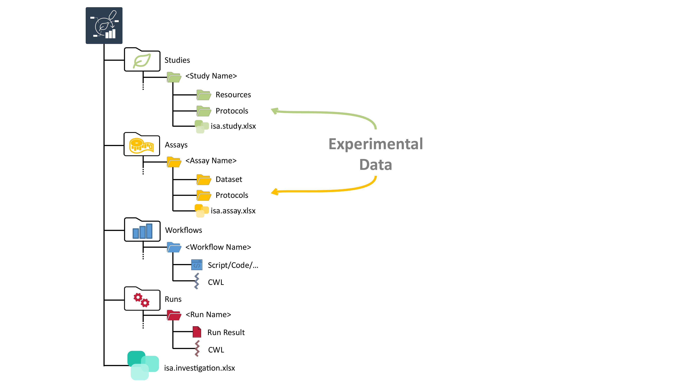
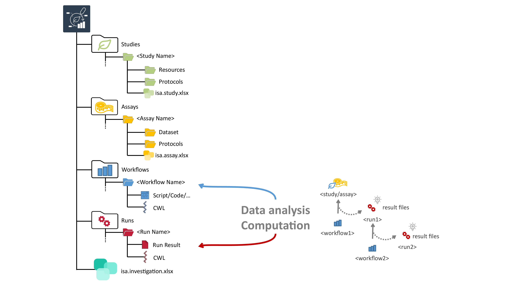
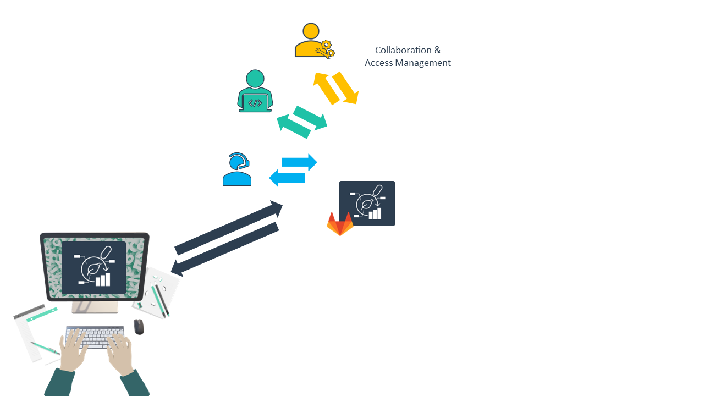

# The ARC Club

Day 1 &ndash; Into the ARC

Dominik Brilhaus &ndash; CEPLAS Data Science
August 16th, 2023

---

# ARC Club Goals

- Move existing datasets into ARCs
- Share them via the DataHUB
- First few steps into ARCs
- Data users can pick them up from there

---

# Rules: perfect is the enemy of good

- There is no perfect ARC
- There is no complete ARC
- The only bad ARCs are those that don't exist yet.

 

:rocket: Let's get started, the rest is easy :rocket:

---

# Annotated Research Context (ARC)

---

# What does an ARC look like?

---

# What does an ARC look like?

---

# What does an ARC look like?

---

# What does an ARC look like?

---

# What does an ARC look like?

---

# What does an ARC look like?

---

---

---

---

---

---

---

---

---

--- 

## Contributors

Slides presented here include contributions by 

- Dominik Brilhaus | [GitHub](https://github.com/brilator) | [ORCID](https://orcid.org/0000-0001-9021-3197)
- Cristina Martins Rodrigues  | [GitHub](https://github.com/CMR248) | [ORCID](https://orcid.org/0000-0002-4849-1537)
- Martin Kuhl  | [GitHub](https://github.com/Martin-Kuhl) | [ORCID](https://orcid.org/0000-0002-8493-1077)
