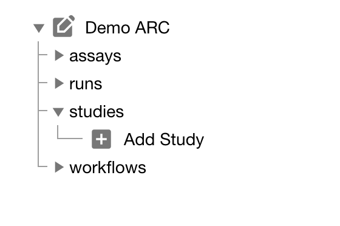

# The ARC Club

ARCitect QuickStart

Dominik Brilhaus &ndash; CEPLAS Data Science
August 16th, 2023

---

## Initiate the ARC folder structure

1. Create a **New ARC** (2)
2. Select a location and name (*Talinum Photosynthesis*) for your ARC

:bulb: Your ARC's name will be used for the folder as well as the investigation identifier.

---

---

---

---

---

---

---

## Create an investigation

---

## Add a study

talinum_drought

---

## Add assays

rnaseq
arc assay add -s  -a metabolomics

:bulb: Link them to the study "talinum_drought"

---

# Upload your local ARC to the DataHUB

https://git.nfdi4plants.org/<username>/arc-demo
