<style>

section {
   /* background: none; */
   background-color: white;
}

</style>


# RDM in practice &ndash; Electronic lab notebooks

Dominik Brilhaus &ndash; [CEPLAS Data Science](https://www.ceplas.eu/en/research/data-science-and-data-management/)

RPTU Summer School
July 20th, 2023

--- 

# Content

* Intro to elabFTW as one example for electronic lab notebooks
* Pros & Cons of elabFTW
* Shaping your lab documentation towards FAIR

---

# Check-in

elabFTW @ RPTU: https://elab.rptu.de/

&emsp; :warning: this is the RPTU elabFTW instance &rarr; Changes cannot be deleted. 

Demo elabFTW: https://demo.elabftw.net/

&emsp; :warning: this is a public demo &rarr; All changes are public

<hr>

:rocket: **For today:** https://clerk.cs.uni-kl.de/

&emsp; :bulb: this instance will be deleted after the summer school

---

# Hands-on Circle


---

# Experiments panel

- Create an experiment
- View / edit mode


---

# 👩‍💻 Exercise

Create an experiment **Baking pancakes**

```yaml
1. Ingredients
   - Flour
   - Eggs
   - Milk
2. Procedure
   - Mix ingredients
   - Fry in pan
   - Serve with maple syrup
3. ...
```


---

# :bulb: Recap

- keine Metadaten
- Freitext
- JSON hilfreich
- Daten nicht verlinkt


<!-- FAIR Recap: 


-->

---

# Categorize

- Tags
- Database
- Link items

---

## Tags


<br>

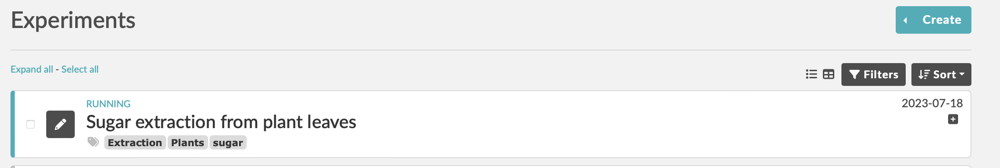

---

## Database

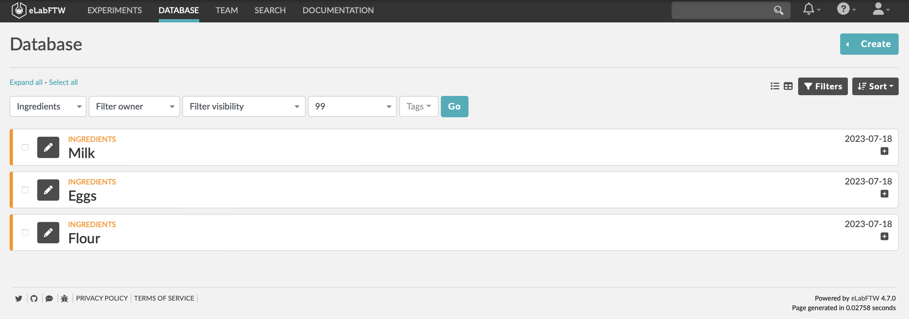

<br>


---

## Linking items

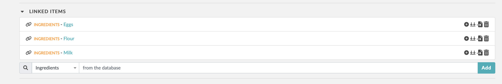

<br>

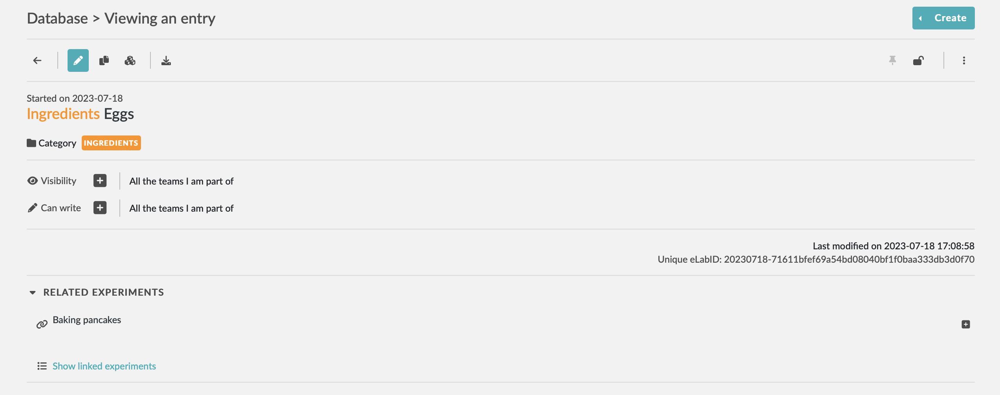


---

# 👩‍💻 Exercise

**Categorize** your experiment items

- Use tags &rarr; "baking recipes"
- Create database entries &rarr; "ingredients"
- link items

---

# :bulb: Recap

- 2x selbes Item
- Capitalization
- using items in an experiment
- different approaches of linking / resuing items (from database)
- which metadata to add where
- "different ways to do it"
- CV / ontologies
- PIDs

---

# 👩‍💻 Exercise

Start another experiment **Baking a chocolate cake**

```yaml
1. Grocery list
   - Flour, Sugar, Eggs, Butter, Milk, Chocolate
2. Steps
   1. Mix ingredients
      1. type of mixer
      2. speed
      3. type of beater
   2. Prepare cake pan
      1. type of cake pan
      2. butter cake pan
   3. Bake
      1. temperature
      2. top heat / circulating air
      3. Cooling phase
```


---

# :bulb: Recap

- 

<!-- FAIR Recap: 
- re-use process (-> function "duplicate")
- re-use items
-->

---

# Provide structure: Create templates


<br>

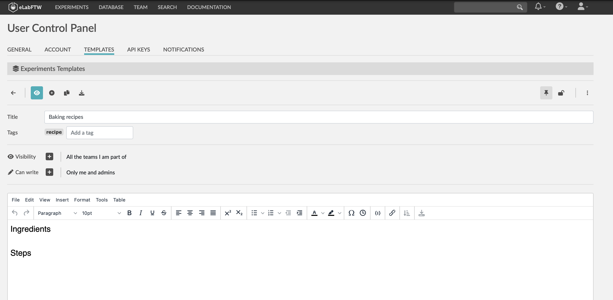


---

# 👩‍💻 Exercise

Create an experiment template for **baking recipes**

---

# :bulb: Recap

- user-friendly ++
- but a lot of free-text
- templating helps towards reusable structure


<!-- FAIR Recap 
- everyone comes up with their own template
- need for schema
- need for CV / ontology
-->

---

# Add data to your experiment

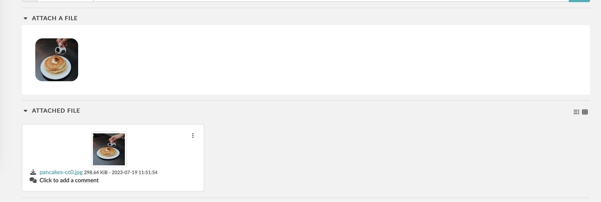

---

# :bulb: Recap

<!-- FAIR Recap 
- small data ok, large data impossible, but
- process / protocol and data are all dumped together
- linking data?
-->

---

# Share & Collaborate

---

# Visibility and write access


---

# Version history


---

# Restore revision

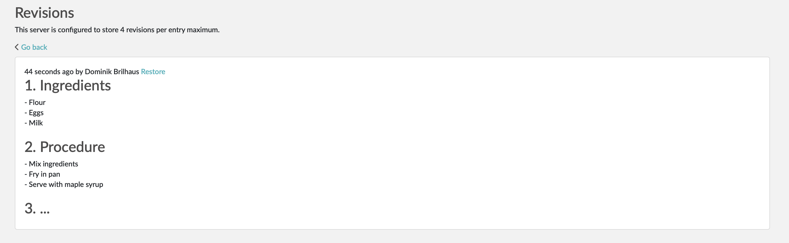


---

# Export experiments

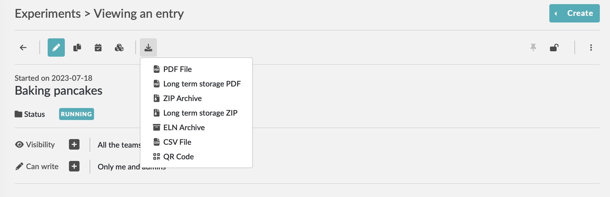

---

# :bulb: Recap

<!-- FAIR Recap: 
- can only collaborate within instance -> complicated user management
- no re-usable format -> 
- provenance / reuse / contribution -> compare versioning to git (graph)
-->

---


# Towards **FAIR** elabFTW
---

# Cut protocols into pieces (processes)

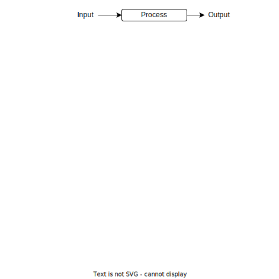

---

# Define inputs and outputs

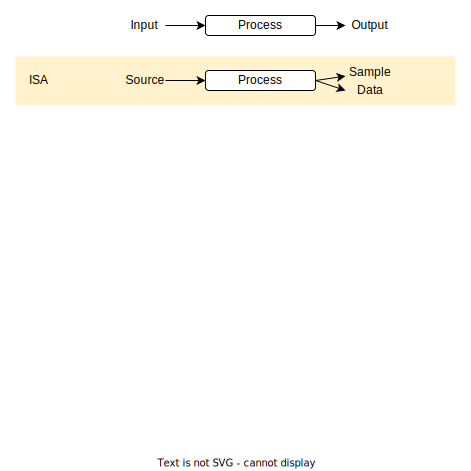

---

# Cut protocols into pieces

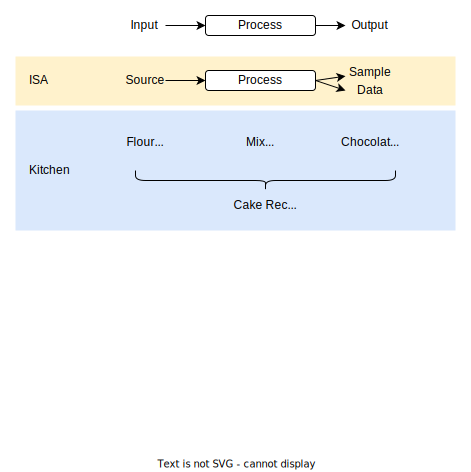

---

# Cut protocols into pieces


---


# Bridging elabFTW and ARC

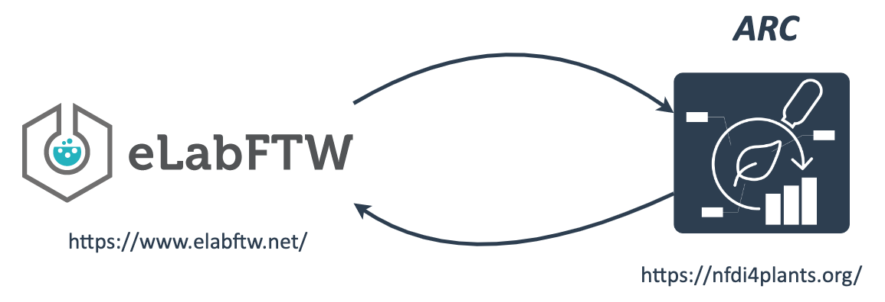


---

# Example Scenario

1. You use **ARCs** to

   - organize and store your (raw) data locally
   - share and communicate data with collaboration partners
   - annotate and prepare your data for publication

2. You use **elabFTW** to

   - document your daily lab work "on the fly"
   - organize lab routines with colleagues


---

# Goals

1. Benefit from "both worlds" (ARC and elabFTW)

   - iteratively work on protocols
   - be able to associate metadata to the raw data

2. Align elabFTW structure and ARCs

<!-- :bulb: Note, the following slides outline the overlapping concepts of elabFTW a manual approach. -->


---


# Schematize: JSON templates


<style scoped>
.columns {
    display: grid;
    grid-template-columns: repeat(2, minmax(0, 1fr));
    gap: 1rem;
}
</style>

<br>


<div class="columns">

<div class="columns-right">

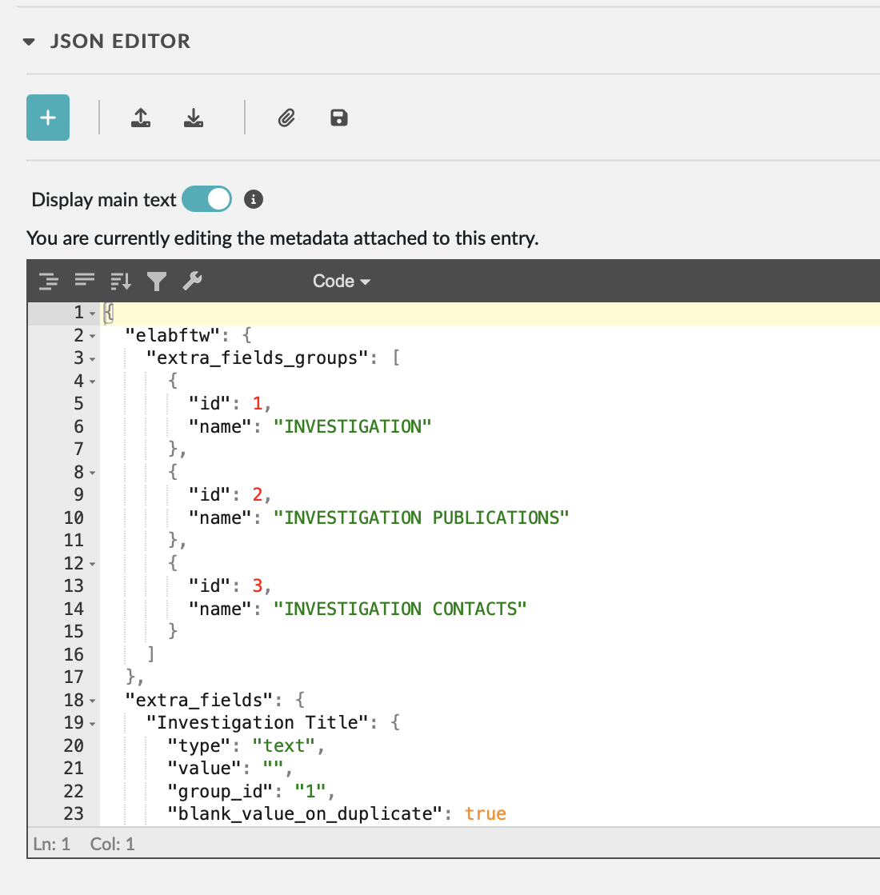

</div>


<div class="columns-left">

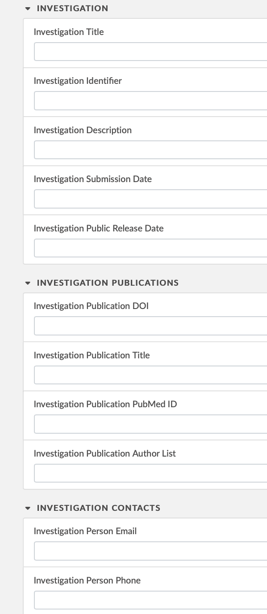

</div>


</div>


---


# Catalog your lab

1. Which items want to be shared and cataloged? 
2. catalog: Name / ID items
3. Create item database 

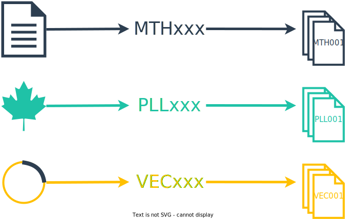


---

# Local ARCs - <br> Project overview


---

# Local ARCs - <br> Project overview


---

# Local ARCs - <br> Protocols


---

# DataHUB

https://git.nfdi4plants.org


---

# Example ARC DataHUB - project overview


---

# Example ARC DataHUB - ARC overview


---

# Example ARC DataHUB - assay protocols


---

# Example ARC DataHUB - protocol detail


---

# elabFTW - Overview


elabFTW data is mainly divided in two main panels

> `Experiments`  

> `Database`


---


# Experiment Panel


The `Experiment` panel is the default "working area" for protocols of daily lab work

---

# Database Panel


The `Database` panel is elabFTW's place to categorize contents

---

# Database item types

:bulb: Item types can be defined in the `Admin Panel`


---

# Preparing database lists for elabFTW import

:bulb: elabFTW offers batch-import from csv.

- elabFTW offers to import data from a csv file as described here: https://doc.elabftw.net/user-guide.html#importing-from-a-csv-file
- These can be imported as any type of database item or experiment
- elabFTW-specific columns
  - `title`: will be the displayed name of the individual item
  - `tags`: (separated by `|`) will be used as tags

---

# Database import


---

# Database import example - Investigations

`db_investigations.csv`

title | tags | Investigation Identifier | Investigation Person Last Name | Investigation Person First Name | Investigation Person Email | Investigation Person Phone
------|------|--------------------------|--------------------------------|---------------------------------|----------------------------|---------------------------
inv001-talinum-cam | inv001-talinum-cam | inv001-talinum-cam | Beetroot | Jasmine | jasmine.beetroot@arc-uni.org | 0211-0212
inv002-arabidopsis-heat | inv002-arabidopsis-heat | inv002-arabidopsis-heat | Sage | Oliver | oliver.sage@arc-uni.org | 0211-0213
inv003-welwitschia-clock | inv003-welwitschia-clock | inv003-welwitschia-clock | Sugarcane | Viola | viola.sugarcane@arc-uni.org | 0211-0214

---

# Database import example - Studies

`exp_inv001-talinum-cam_studies.csv`


title | tags | Study Identifier | Study Title | Study Description
------|------|------------------|-------------|-------------------
sty01-aba-pre-experiment | inv001-talinum-cam | sty01-aba-pre-experiment | Pre-experiment to test ABA treatment | ABA treatment
sty02-aba-full | inv001-talinum-cam | sty02-aba-full | Large scale experiment with ABA | ABA treatment
sty03-aba-timeseries | inv001-talinum-cam | sty03-aba-timeseries | Time series experiment with ABA | Time Series Design

---

# Database import


---

# Database import


---

# Database Panel


---

# Linking / grouping items

:bulb: Two mechanisms

1. Tags
   1. user-friendly, easy way to group items
2. Linking
   1. Database items
   2. Experiment items

---

# Linking items

In edit mode


---

# Linked items


---

# elabFTW &ndash; Conclusion


<style scoped>
.columns {
    display: grid;
    grid-template-columns: repeat(3, minmax(0, 1fr));
    gap: rem;
}
ul {
    /* margin: 5; padding: 0; */
}
</style>

<div class="columns">
<div class="columns-left">

### <span style="color:#B4CE82">Good</span>

- Documenting daily lab routine
- Lab methods & protocols
- Lab inventory (biologicals, chemicals, instruments)
- Local sharing & collaboration
- Backup (locally)

</div>
<div class="columns-right">

### <span style="color:#F9CD69">Intermediate</span>

- Version control
- Track changes / contributions
- Use of IDs
- External sharing

</div>

<div class="columns-right">

### <span style="color:#c21f3a">Limited</span>  

- Data storage
- Analyses
- Structured metadata
- PIDs

</div>
</div>


---


---

# Demo

:construction: The following slides are attached to prep a demo 


---

# Creating the ARC structure locally (demo)

---

# settings

```bash
gitlab_base_url=https://git.nfdi4plants.org/elab-demo-arcs/
arc_dir_local=~/gitlab_dataplant/elab-demo-arcs
```

---

# create a first arc

:bulb: This is a line-by-line example to initiate and share an ARC with a few studies and assays

```bash
arc_name=inv001-talinum-cam

mkdir -p "$arc_dir_local"/"$arc_name"
cd "$arc_dir_local"/"$arc_name"

arc init
arc investigation create -i "$arc_name"

arc study add -s sty01-aba-pre-experiment
arc assay add -s sty01-aba-pre-experiment -a sty01-asy01-acidity

arc study add -s sty02-aba-full
arc assay add -s sty02-aba-full -a sty02-asy01-acidity
arc assay add -s sty02-aba-full -a sty02-asy02-starch-content
arc assay add -s sty02-aba-full -a sty02-asy04-pepc-activity

arc study add -s sty03-aba-timeseries
arc assay add -s sty03-aba-timeseries -a sty03-asy01-plant-pictures
arc assay add -s sty03-aba-timeseries -a sty03-asy02-acidity
arc assay add -s sty03-aba-timeseries -a sty03-asy03-starch-content
arc assay add -s sty03-aba-timeseries -a sty03-asy04-chlorophyll-content
arc assay add -s sty03-aba-timeseries -a sty03-asy05-pepc-activity
arc assay add -s sty03-aba-timeseries -a sty03-asy06-rnaseq

arc sync -f -r "$gitlab_base_url""$arc_name" -m "initialize ARC structure"

```

---

# create and push more arcs (for loop)

```bash
for arc_name in inv002-arabidopsis-heat inv003-welwitschia-clock; do
  echo $arc_name
  mkdir -p "$arc_dir_local"/"$arc_name"
  cd "$arc_dir_local"/"$arc_name"    
  arc init
  arc investigation create -i "$arc_name"
  arc sync -f -r "$gitlab_base_url""$arc_name" -m "initialize ARC structure $arc_name"
done
```
