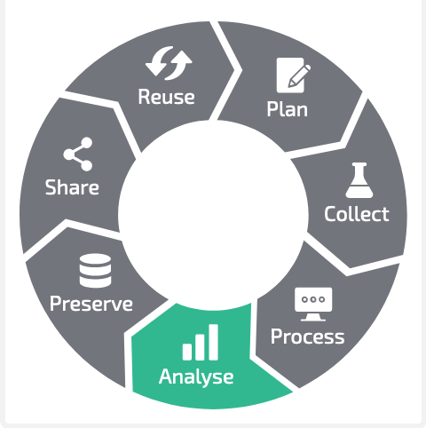
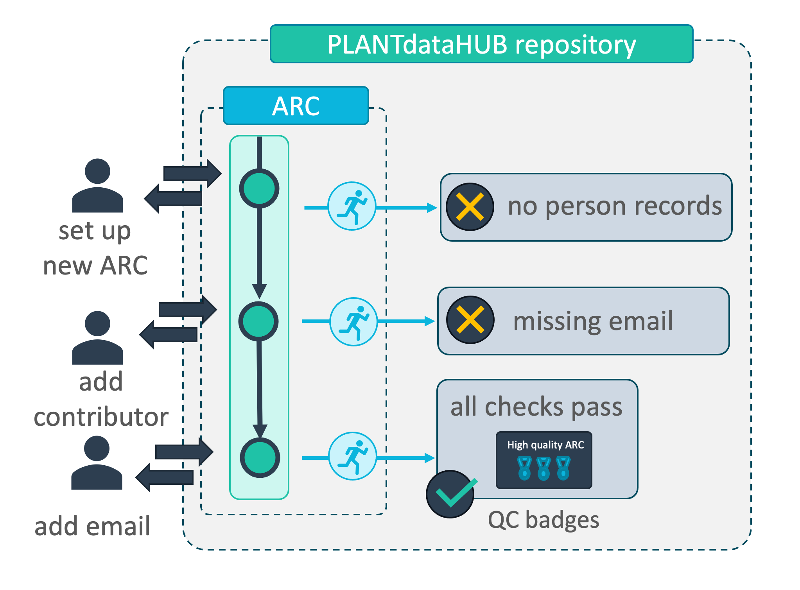
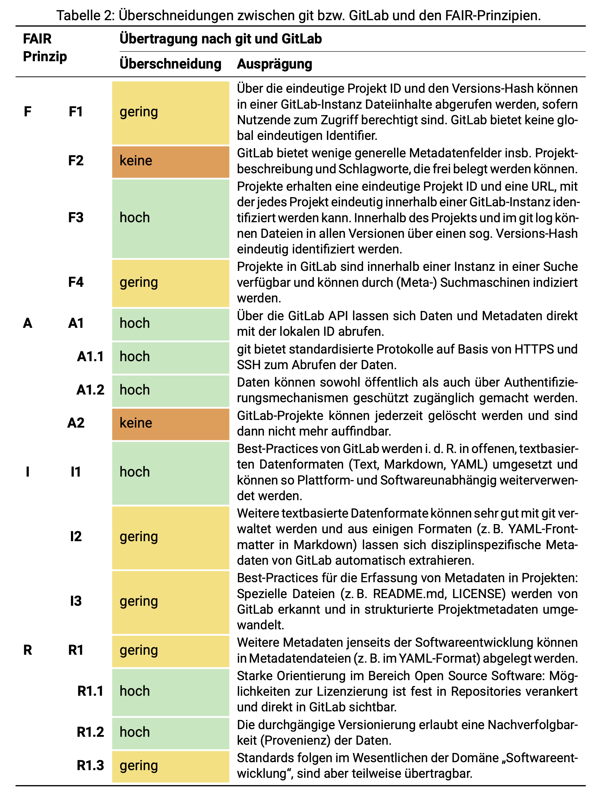

# Annotated Research Contexts (ARCs)

## A FAIR RDM journey along a mutable data life cycle

<!-- _paginate: false -->

 

fdm.nrw
"Best Practice Day &ndash; die Tools des FDMs"
September 19th, 2023

  

    
  

  

  Dominik Brilhaus   [CEPLAS Data Science](https://www.ceplas.eu/en/research/data-science-and-data-management/)

  

---

# Annotated Research Contexts (ARCs)

## A FAIR RDM journey along a mutable data life cycle

<!-- _paginate: false -->

 

fdm.nrw
"Best Practice Day &ndash; die Tools des FDMs"
September 19th, 2023

---

# Goal

- Illustrate current state of DataPLANT **tools** and concepts
- with a **practical** example

---

# Annotated Research Contexts (ARCs)

---

# Intro

- ARC
- ISA
- DataHUB

---

# A FAIR RDM journey along a (mutable) data life cycle

 https://rdmkit.elixir-europe.org, [CC BY 4.0](https://creativecommons.org/licenses/by/4.0/)

---

# Plan

<figure style="position: fixed; top: 0px; right: 0px; width: 150px">
    </img>
    <figcaption align=right> rdmkit.elixir-europe.org, CC BY 4.0 </figcaption>
</figure>

<!-- 
 
 - **ARCitect**: Create empty ARC
   - description
   - author
     - first name
     - last name
     - email
 - **ARCitect**: Upload ARC to DataHUB
 - **DataHUB**
   - Discuss, collect meeting minutes in Wiki
   - design / plant investigation (datahub wiki, issues)

-->

---

# Collect

<figure style="position: fixed; top: 0px; right: 0px; width: 150px">
    </img>
    <figcaption align=right> rdmkit.elixir-europe.org, CC BY 4.0 </figcaption>
</figure>

- create study folder
  - take a picture (add more demo pictures)
- create assay folder
  - add fastq data

---

# Process (e.g. annotate)

- annotate
- annotate rnaseq extraction

<figure style="position: fixed; top: 0px; right: 0px; width: 150px">
    </img>
    <figcaption align=right> rdmkit.elixir-europe.org, CC BY 4.0 </figcaption>
</figure>

---

# Analyse

<figure style="position: fixed; top: 0px; right: 0px; width: 150px">
    </img>
    <figcaption align=right> rdmkit.elixir-europe.org, CC BY 4.0 </figcaption>
</figure>

<!-- 
- run fastqc
- receive back results
-->

---

# Preserve

<figure style="position: fixed; top: 0px; right: 0px; width: 150px">
    </img>
    <figcaption align=right style="font"> rdmkit.elixir-europe.org, CC BY 4.0 </figcaption>
</figure>

<!--
1. Validation: CQC on each DataHUB commit
2. Publication: DOI
-->

 adapted from **Weil, Schneider *et al.*** (2023) "PLANTdataHUB: A collaborative platform for continuous FAIR data sharing in plant research",  The Plant Journal, https://doi.org/10.1111/tpj.16474 (*in production*) 

---

# Share

<figure style="position: fixed; top: 0px; right: 0px; width: 150px">
  </img>
  <figcaption align=right style="font"> rdmkit.elixir-europe.org, CC BY 4.0 </figcaption>
</figure>

 **Weil, Schneider *et al.*** (2023) "PLANTdataHUB: A collaborative platform for continuous FAIR data sharing in plant research",  The Plant Journal, https://doi.org/10.1111/tpj.16474 (*in production*) 

---

# Reuse

<figure style="position: fixed; top: 0px; right: 0px; width: 150px">
  </img>
  <figcaption align=right style="font"> rdmkit.elixir-europe.org, CC BY 4.0 </figcaption>
</figure>

- Find ARCs *via* Metadata Registry

  - ARC https://arcregistry.nfdi4plants.org/arcsearch
  - via https://arcregistry.nfdi4plants.org/isasearch

---

# **mutable** data life cycle

*Immutable, but evolving*

---

# Resources

###  DataPLANT (nfdi4plants)

Website: <a href="https://nfdi4plants.org/" target="_blank">https://nfdi4plants.org/</a>
Knowledge Base: <a href="https://nfdi4plants.org/nfdi4plants.knowledgebase/" target="_blank">https://nfdi4plants.org/nfdi4plants.knowledgebase/</a>
DataHUB: <a href="https://git.nfdi4plants.org" target="_blank">https://git.nfdi4plants.org</a>
GitHub: <a href="https://github.com/nfdi4plants" target="_blank">https://github.com/nfdi4plants</a>

--- 

--- 

# Is GitLab FAIR?

Cyra et al. 2022. A push for better RDM: Erfahrungsbericht aus dem Einsatz von git für Forschungsdaten. DOI: 10.17192/bfdm.2022.2.8435.

---

# PLANTdataHUB publication

**Weil, Schneider *et al.* (2023)** "PLANTdataHUB: A collaborative platform for continuous FAIR data sharing in plant research",  The Plant Journal, https://doi.org/10.1111/tpj.16474
(*in production*)

---
