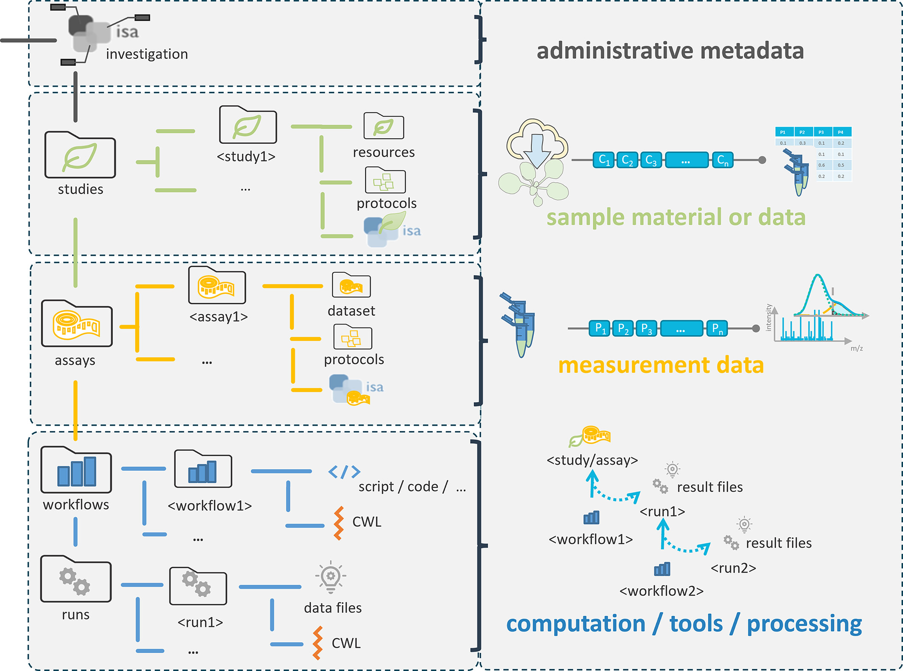
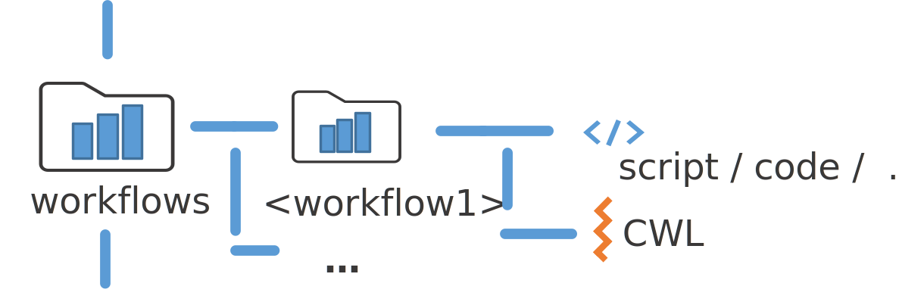
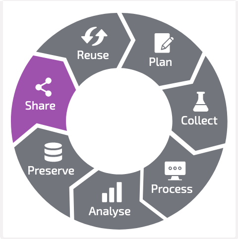
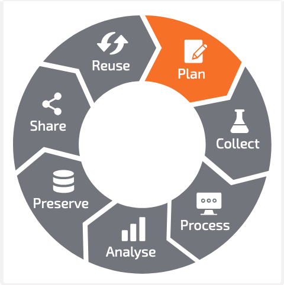

# Annotated Research Contexts (ARCs)

## A FAIR RDM journey along a mutable data life cycle

<!-- _paginate: false -->

 

fdm.nrw
"Best Practice Day &ndash; die Tools des FDMs"
September 19th, 2023

  

    
  

  

  Dominik Brilhaus   [CEPLAS Data Science](https://www.ceplas.eu/en/research/data-science-and-data-management/)

  

---

# Annotated Research Contexts (ARCs)

## A FAIR RDM journey along a mutable data life cycle

<!-- _paginate: false -->

 

fdm.nrw
"Best Practice Day &ndash; die Tools des FDMs"
September 19th, 2023

---

# Data Stewardship between DataPLANT and the community  <!-- fit -->

---

# Annotated Research Context (ARC)

---

# The ARC &ndash; a package for your research data

<!-- --- 

# Annotated Research Contexts (ARCs)

 Weil, H.L., Schneider, K., et al. (2023), PLANTdataHUB: a collaborative platform for continuous FAIR data sharing in plant research. Plant J. https://doi.org/10.1111/tpj.16474  -->

---

# "A FAIR RDM journey along a (mutable) data life cycle" <!-- fit -->

 

 https://rdmkit.elixir-europe.org, [CC BY 4.0](https://creativecommons.org/licenses/by/4.0/)

---

# Collect 

<!-- 

- create study folder
  - take a picture (add more demo pictures)
- create assay folder
  - add fastq data

-->

---

# Process (e.g. annotate)  

<!-- 

- annotate plant samples
- annotate rnaseq extraction -->

---

# Analyse 

<!-- 
- run fastqc
- receive back results
-->

<!-- 
 -->

---

# Preserve  

<!--
1. Validation: CQC on each DataHUB commit
2. Publication: DOI
-->

 adapted from Weil, H.L., Schneider, K., et al. (2023), PLANTdataHUB: a collaborative platform for continuous FAIR data sharing in plant research. Plant J. https://doi.org/10.1111/tpj.16474 

---

# Preserve and publish 

<!--
1. Validation: CQC on each DataHUB commit
2. Publication: DOI
-->

 Weil, H.L., Schneider, K., et al. (2023), PLANTdataHUB: a collaborative platform for continuous FAIR data sharing in plant research. Plant J. https://doi.org/10.1111/tpj.16474 

---

# Share and collaborate 

---

# Reuse 

<!-- 
- via ARC https://arcregistry.nfdi4plants.org/arcsearch
- via ISA https://arcregistry.nfdi4plants.org/isasearch 
-->

 Weil, H.L., Schneider, K., et al. (2023), PLANTdataHUB: a collaborative platform for continuous FAIR data sharing in plant research. Plant J. https://doi.org/10.1111/tpj.16474 

---

# **Mutable** data life cycle

<!-- 

- Invite other (demo) account
- add notes from there
-->

---

# Plan (ARC scale) 

 Weil, H.L., Schneider, K., et al. (2023), PLANTdataHUB: a collaborative platform for continuous FAIR data sharing in plant research. Plant J. https://doi.org/10.1111/tpj.16474 

<!--
 
 - **ARCitect**: Create empty ARC
   - description
   - author
     - first name
     - last name
     - email
 - **ARCitect**: Upload ARC to DataHUB
 - **DataHUB**
   - Discuss, collect meeting minutes in Wiki
   - design / plant investigation (datahub wiki, issues)

-->

---

# Plan (proposal scale) 

**Zhou *et al.* (2023)**, DataPLAN: a web-based data management plan generator for the plant sciences, bioRxiv 2023.07.07.548147; doi: https://doi.org/10.1101/2023.07.07.548147 

https://dmpg.nfdi4plants.org

---

## Conclusion

- ARC ecosystem support the full data life cycle
- **Data-centric**: it's more about the data than tools or implementations

---

# Resources

###  DataPLANT (nfdi4plants)

Website: <a href="https://nfdi4plants.org/" target="_blank">https://nfdi4plants.org/</a>
Knowledge Base: <a href="https://nfdi4plants.org/nfdi4plants.knowledgebase/" target="_blank">https://nfdi4plants.org/nfdi4plants.knowledgebase/</a>
DataHUB: <a href="https://git.nfdi4plants.org" target="_blank">https://git.nfdi4plants.org</a>
GitHub: <a href="https://github.com/nfdi4plants" target="_blank">https://github.com/nfdi4plants</a>

---

# Acknowledgements

**CEPLAS**

Björn Usadel, Andrea Schrader, Hajira Jabeen (until 2021)

**DataPLANT**

Kaiserslautern: Timo Mühlhaus, Christoph Garth
- Kevin Frey, Lukas Weil, Oliver Maus, Kevin Schneider  
(`ARC Commander`, `Swate`, `ARChigator`)
- Jonas Lukasczyk (`ARCitect`)

Freiburg: Dirk von Suchodeletz
- Jonathan Bauer, Marcel Tschöpe (`DataHUB`, `Swobup`)
- Cristina Martins Rodrigues (`Knowledge Base`)

