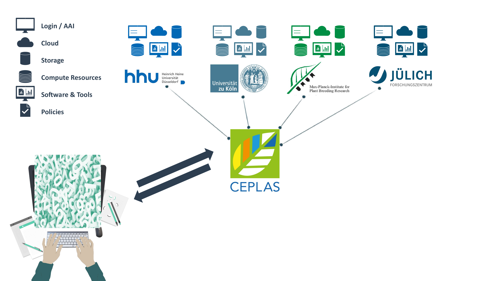
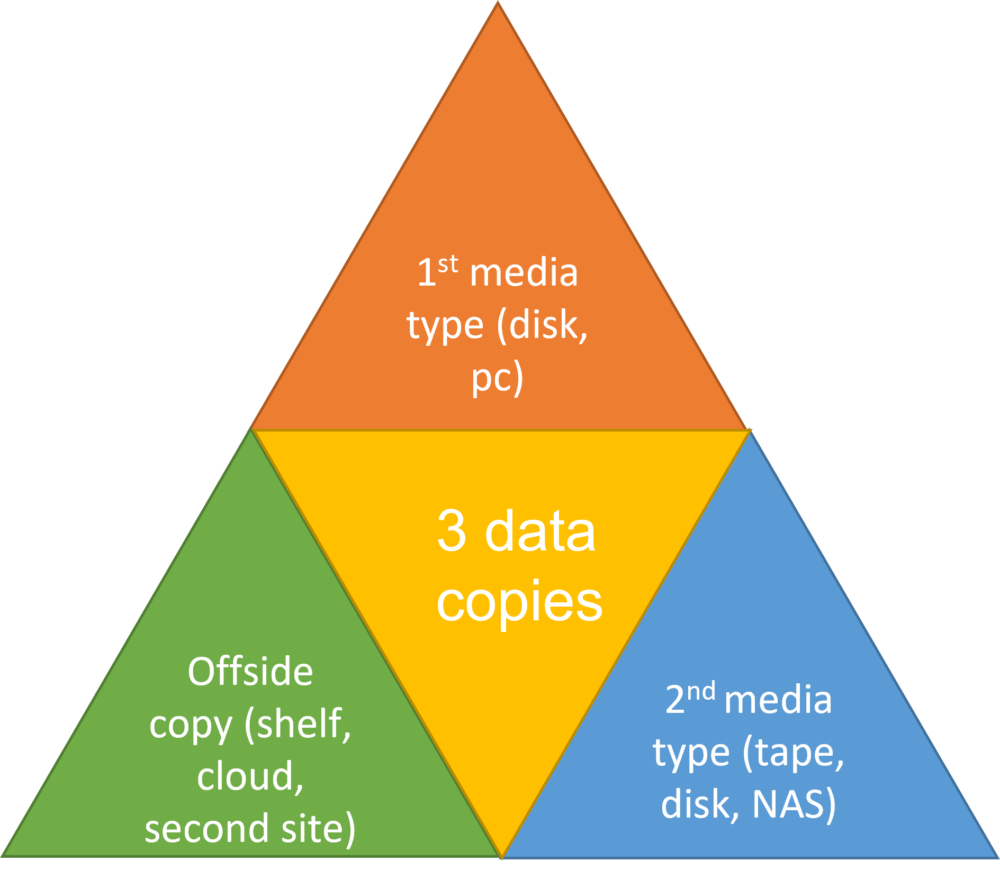

# Block 1 &ndash; Welcome and Intro

<!-- _paginate: false -->

September 21st, 2023
 

  

     
  

  

  Sabrina Zander   [MibiNet](https://www.sfb1535.hhu.de/projects/research-area-z/z03)
  

  

    
  

  

  Dominik Brilhaus   [CEPLAS Data Science](https://www.ceplas.eu/en/research/data-science-and-data-management/)

  

---

# Welcome

---

# About us

---

# Goals

- Appreciate FAIR principles
- Tools and services for FAIR data management
- Effectively manage your own research data
- Communication and terminology

 
  
:bulb: In this workshop we focus more on **how** and less on **why**

---

# Why Research Data Management (RDM)?

- Increase transparency
- Make data accessible
- Save time (writing, reusing)
- Reduce the risk of data loss
- Optimize the costs
- Facilitate future reuse and sharing
- Improve citations

---

# The Research Data Lifecycle

---

# The Research Data Lifecycle

---

# The Research Data Lifecycle

---

# The Research Data Lifecycle

---

# The Research Data Lifecycle

---

# The Research Data Lifecycle

---

# The Research Data Lifecycle

---

# The Research Data Lifecycle 

<!-- ################# -->
<!-- Source to following slide(s) -->
<!-- ./bricks/exercise_014_fair.md -->
<!-- ################# -->

---

# Have you ever heard about the   **FAIR principles**?

<!-- 
Exercise: Association map
-->

<!-- ################# -->
<!-- Source to following slide(s) -->
<!-- ./bricks/lesson_018_FAIR_intro.md -->
<!-- ################# -->

<!-- TODO

- Illustrate the development since
- tentatively touch on the implications
  - researchers
  - infrastructures
  - stakeholders

 -->

---

# The FAIR guiding principles for scientific data management and stewardship

https://doi.org/10.1038/sdata.2016.18

---

# The FAIR principles

---

# Scattered Data Silos
 

---

# Scattered Data Silos

<!-- TODO

- enlarge picture 

 -->

---

# FAIR Data for everyone

---

# 3-2-1 backup rule
<!--replace figure-->
- **Three** different copies
- **Two** storage media
- **One** copy offsite

--- 

# Version control / Track changes

It’s good practice to document:
- What was changed?
- Who is responsible?
- When did it happen?
- Why the changes?

---

# Data Sharing - while working collaboratively

---

# Sharing is caring

- Research = Collaboration = Sharing
  - interaction
  - knowledge exchange
  - input from peers
  - elaborate, initiate or expand collaborations
- Sharing saves time and resources
  - common pipelines for data analysis
  - prevent redundant or overlapping investigations

**Sharing research data is the key to every successful research project.**

---

# Collaborative platforms

### Personal use
- GoogleDrive <https://drive.google.com/>
- Microsoft OneDrive / Sharepoint /Teams <https://onedrive.live.com/>
- Apple iCloud <https://www.icloud.com>

### Business solutions
- Owncloud https://owncloud.com/
- Nextcloud https://nextcloud.com/de/
- google cloud, aws, azure, etc.

---

# Collaborative platforms
### Institute's solutions
- local clouds, NAS server
- regional cloud solutions
- are guests allowed?

---

# Cloud Services

✓ Documents  
✓ Small data  
✓ Presentations  

X  Code  
X  Data analytical projects  
X  Big (“raw”) data  

---

# Using cloud services for text documents

### Good

- Collaborative writing
- Shared text
- Easy format, and conversion

### Intermediate

- Flexibility in drawing, editing
- Sometimes learning curve

### Limited  

- Too large files
- Security issues
- Proprietary documents

---

# Collaborative platforms

- Easy sharing and online collaboration
- Cloud based
- Unlimited open sharing (any one with link can edit)
- Closed sharing (sharing upon invitation)
- Limited project size (e.g. not suitable for large projects with many files/folders) 
- Paid
- Version control
- Easy format conversion
- Sustainable format
- Security?

---

# HHU Düsseldorf - Links

- Research Data Management Competence Center: https://www.fdm.hhu.de
- Support for research including HPC: https://www.zim.hhu.de/servicekatalog/forschungsunterstuetzung 
- Processing & storing data: https://www.zim.hhu.de/servicekatalog/rechnen-und-speichern

