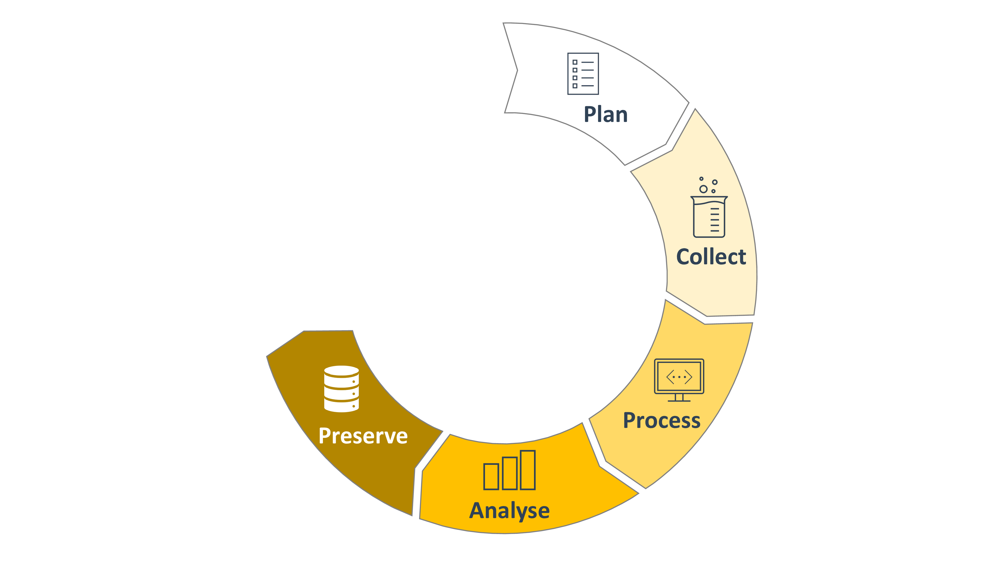
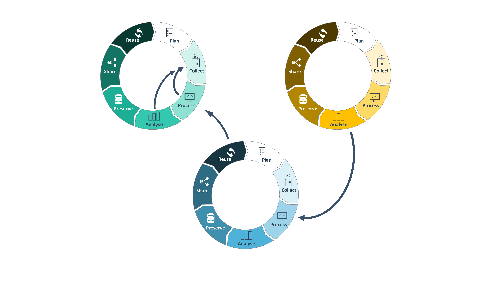

# Block 1 &ndash; Welcome and Intro

<!-- _paginate: false -->

September 21st, 2023
 

  

     
  

  

  Sabrina Zander   [MibiNet](https://www.sfb1535.hhu.de/projects/research-area-z/z03)
  

  

    
  

  

  Dominik Brilhaus   [CEPLAS Data Science](https://www.ceplas.eu/en/research/data-science-and-data-management/)

  

---

# Welcome

---

# About us

---

# Goals

- Appreciate FAIR principles
- Tools and services for FAIR data management
- Effectively manage your own research data
- Communication and terminology

 
  
  :bulb: In this workshop we focus more on **how** and less on **why**

---

# Shared notes and feedback

We collect notes during the course in an online pad:

https://pad.hhu.de/Aem023liTWKyfPysU0H8Gw?view

---

# Research Data

- Any information;
  - Collected
  - Observed
  - Generated
  - Created
- ...to validate research findings
- Types of research data
  - Digital
  - Non-digital

---

# Forms and formats of research data

- Documents
- Spreadsheets
- Laboratory Notebooks
- Field Notebooks
- Diaries
- Questionnaires
- Transcripts
- Codebooks
- Audiotapes
- SOPs
- Videotapes
- Photographs
- Films
- Test Responses
- Slides
- Artifacts
- Specimens
- Models
- Protocols
- Algorithms
- Scripts
- Contents Of An Application
- Analysis Software
- Simulation Software
- Schemas
- Methodologies
- Workflows
- ...

---

# CEPLAS: Versatile data types and sources <!-- fit -->

---

# Why Research Data Management (RDM)?

- Increase transparency
- Make data accessible
- Save time (writing, reusing)
- Reduce the risk of data loss
- Optimize the costs
- Facilitate future reuse and sharing
- Improve citations

---

# The Research Data Lifecycle

---

# The Research Data Lifecycle

---

# The Research Data Lifecycle

---

# The Research Data Lifecycle

---

# The Research Data Lifecycle

---

# The Research Data Lifecycle

---

# The Research Data Lifecycle

---

# The Research Data Lifecycle 

<!-- ################# -->
<!-- Source to following slide(s) -->
<!-- ./bricks/exercise_014_fair.md -->
<!-- ################# -->

---

# Have you ever heard about the   **FAIR principles**?

<!-- 
Exercise: Association map
-->

<!-- ################# -->
<!-- Source to following slide(s) -->
<!-- ./bricks/lesson_018_FAIR_intro.md -->
<!-- ################# -->

<!-- TODO

- Illustrate the development since
- tentatively touch on the implications
  - researchers
  - infrastructures
  - stakeholders

 -->

---

# The FAIR guiding principles for scientific data management and stewardship

https://doi.org/10.1038/sdata.2016.18

---

# The FAIR principles

---

# Scattered Data Silos
 

---

# Scattered Data Silos

---

# FAIR Data for everyone

