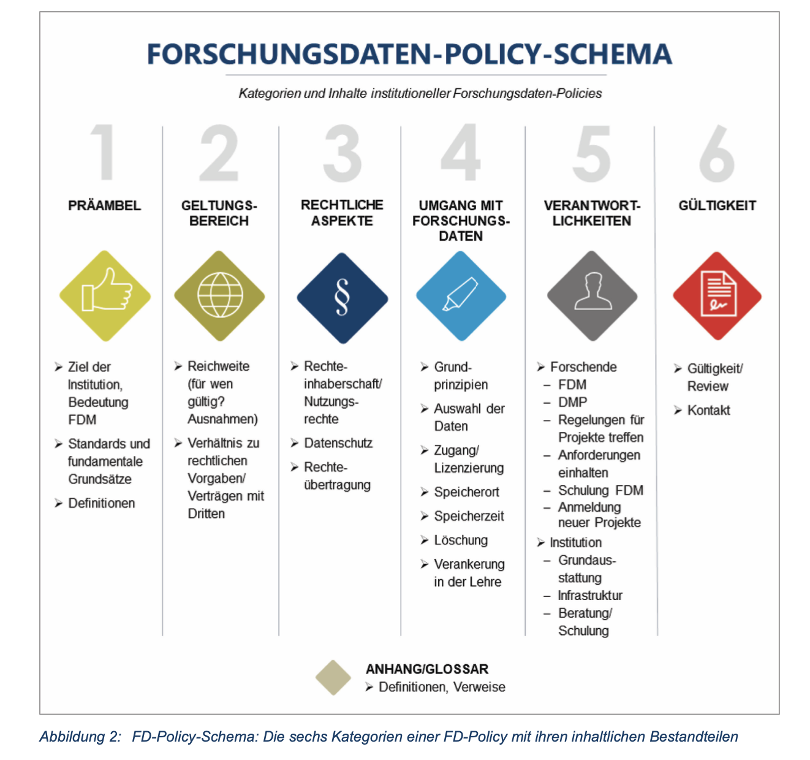
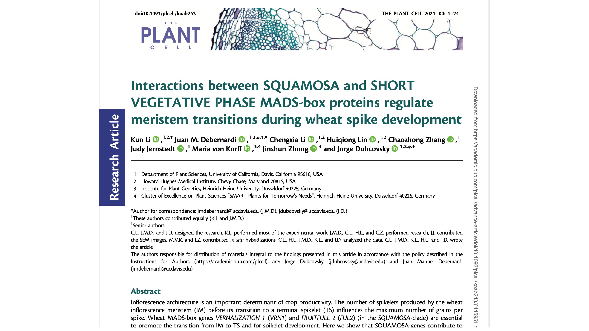

# RDM fundamentals

Dominik Brilhaus
Sept 20th, 2023

---

# Legal aspects of RDM

---

# Different laws touched by RDM

Hartmann, Thomas. (2019). Rechtsfragen: Institutioneller Rahmen und Handlungsoptionen für universitäres FDM. Zenodo. https://doi.org/10.5281/zenodo.2654306

---

# Open Access (OA) categories

- Gold: Published in an open-access journal that is indexed by the [DOAJ](https://doaj.org).
- Green: Toll-access on the publisher page, but there is a free copy in an OA repository.
- Hybrid: Free under an open license in a toll-access journal.
- Bronze: Free to read on the publisher page, but without a clearly identifiable license.
- Closed: All other articles, including those shared only on an Academic Social Network or in Sci-Hub.

Piwowar H et al. (2018), PeerJ https://doi.org/10.7717/peerj.4375

---

# Open Science is more than Open Access

Okafor et al. (2022) https://doi.org/10.3389/frma.2022.855198, Figure 1

---

# Creative commons

Check out: https://creativecommons.org/about/cclicenses/

adapted from https://wiki.creativecommons.org/images/0/01/6licenses-folded.pdf

---

# Data protection

[GDPR](https://gdpr-info.eu/): General Data Protection Regulation
[DS-GVO](https://www.datenschutz-wiki.de/Datenschutz-Grundverordnung) (german): Datenschutz-Grundverordnung

---

# Use of biological materials

- MTA: material transfer agreement
- Nagoya Protocol: https://www.cbd.int/abs/about/
- DSI: [Digital sequence information](https://www.genres.de/en/access-and-benefit-sharing/digital-sequence-information)

---

# FAIR and CARE

https://www.gida-global.org/care

---

# CARE principles

https://datascience.codata.org/articles/10.5334/dsj-2020-043/

---

# Research Data policies

Hiemenz, Bea & Kuberek, Monika (2018) http://dx.doi.org/10.14279/depositonce-7521

---

# CEPLAS relevant data handling guidelines & policies

- [Deutsche Forschungsgemeinschaft (2015): DFG Guidelines on the Handling of Research Data](https://www.dfg.de/en/research_funding/proposal_review_decision/applicants/research_data/)
- [Amtliche Mitteilungen der Universität zu Köln AM 07/2018: Leitlinie zum Umgang mit Forschungsdaten](https://am.uni-koeln.de/e21463/am_mitteilungen/@6/AM_2018-07_Leitlinie-zum-Umgang-mit-Forschungsdaten_ger.pdf)
- [Amtliche Bekanntmachung der Heinrich-Heine-Universität Nr. 43/2022: Forschungsdaten-Richtlinie](https://www.fdm.hhu.de/fileadmin/redaktion/Forschungsdatenmanagement/2022_Forschungsdaten-Richtlinie.pdf) 
- [Leitlinie zum Umgang mit Forschungsdaten im Forschungszentrum Jülich 05/2019](https://www.fz-juelich.de/SharedDocs/Downloads/ZB/DE/Forschungsdaten/fdm_leitlinie_forschungsdaten_fzj.pdf)
- [Senat der Max-Planck-Gesellschaft (2009): Regeln zur Sicherung guter wissenschaftlicher Praxis](https://www.mpg.de/199493/regelnWissPraxis.pdf)

---

# The Data Management Plan (DMP)

- Covers the full research data lifecycle
- Frequently updated as your project develops
- Required to different extents by funding agencies (e.g. DFG, Horizon Europe, BMBF, BMEL, ... )

---

# DMP tools

- Data Stewardship Wizard https://ds-wizard.org/
- RDMO https://rdmorganiser.github.io/ (e.g. https://rdmo.hhu.de)
- Dataplan: https://dmpg.nfdi4plants.org

> Check out the [Elixir RDMkit](https://rdmkit.elixir-europe.org/data_management_plan) for more

---

# Public data repositories

---

# Domain-specific data repositories

Repository | Description | Biological data domain
-- | -- | --
[EBI-ENA](<https://www.ebi.ac.uk/ena/>) | European Nucleotide Archive | genome / transcriptome sequences
[EBI-ArrayExpress](<https://www.ebi.ac.uk/arrayexpress/>) | Archive of Functional Genomics Data | transcriptome  
[EBI-MetaboLights](<https://www.ebi.ac.uk/metabolights/>) | Database of Metabolomics | metabolome
[EBI-PRIDE](<https://www.ebi.ac.uk/pride/>) | PRoteomics IDEntifications Database | proteome
[EBI-BioImage Archive](<https://www.ebi.ac.uk/bioimage-archive/>) | Stores and distributes biological images | imaging, microscopy
[e!DAL-PGP](<https://edal.ipk-gatersleben.de/index.html>) | Plant Genomics & Phenomics Research Data Repository | phenome
[NCBI-GEO](<https://www.ncbi.nlm.nih.gov/geo/>) | Gene Expression Omnibus | transcriptome
[NCBI-GenBank](<https://www.ncbi.nlm.nih.gov/genbank/>) | Genetic Sequence Database | genome
[NCBI-SRA](<https://www.ncbi.nlm.nih.gov/sra/>) | Sequence Read Archive | genome / transcriptome sequences

---

# Choosing a data repository

Domain-specific >> Generic >> Institutional

*Find repositories at:*

- <https://www.re3data.org>
- <https://fairsharing.org>

---

# Domain-specific data repositories

**Good**

- Assign PIDs / DOIs
- Long-term accessible
- Data type specific
- Apply metadata standards
- Usually recommended / required by journals
- Mostly accepted by the community

**Intermediate**

- User-friendliness
- Different metadata schema
- Complex and versatile submission routines

---

# Generic data repositories

**Good**

- Allow publication of any kind of data Assign PIDs / DOIs
- Long-term accessible
- Very simple to use

**Intermediate**

- Only generic / high-level metadata schema
- Limited reusability

---

# Peristent Identifiers (PIDs)

--- 

# Spot the PIDs

 https://doi.org/10.1093/plcell/koab243

---

# Globally unique, stable, persistent identifiers (PIDs)

- Long-term findability
- Make data, digital objects, people, … uniquely identifiable
- Diminish “dead links”
- Cope with name changes

---

# Properties of a PID

Ideally, PIDs are

- Stable and permanent
- Location-independent
- Globally unique and valid
- Addressable (citable)
- Clickable (resolvable)

Adapted from https://www.ebi.ac.uk/rdf/documentation/good_practice_uri/

---

# Additional resources

- https://www.doi.org
- https://www.orcid.org
- https://pidservices.org/
- https://datacite.org
- https://www.project-freya.eu/en

---

# Data stores

---

# Backup vs. Archive

        |    Backup     |    Archive
-------|-----------|-----------
Storage type  | Short-, mid-term  | Long-term
Purpose  | Disaster recovery | Long-term storage, compliance
Reason  | Duplication  | Migration
Usage  | Work in progress  | Cold, Unused data
Changes  | Short-term updates  | No updates
Trend  | Cyclic, Replacement  | Growing
Latency  | Short/Costly  | High/Cheaper

---

# 3-2-1 backup rule

---

# Version control and track changes

It’s good practice to document:

- What was changed?
- Who is responsible?
- When did it happen?
- Why the changes?

---

# Types of Version Control

- by file name (_v1, _v2)
- cloud services
  - dropbox, icloud, gdrive
- distributed version control system
  - e.g. Git

---

# Data Sharing

---

# Cloud Services

✓ Documents  
✓ Small data  
✓ Presentations  

X  Code  
X  Data analytical projects  
X  Big (“raw”) data  

---

# Overview of Institutional services at UoC and HHU

### UoC

- C3RDM: https://fdm.uni-koeln.de/en/home
- Data storage and sharing: https://rrzk.uni-koeln.de/daten-speichern-teilen
- HPC: https://rrzk.uni-koeln.de/hpc-projekte 
- service overview: https://fdm.uni-koeln.de/en/rdm-services/service-catalogue

### HHU

- RDM Competence Center: https://www.fdm.hhu.de
- Support for research including HPC: https://www.zim.hhu.de/servicekatalog/forschungsunterstuetzung 
- Processing & storing data: https://www.zim.hhu.de/servicekatalog/rechnen-und-speichern

---

---

# Contributors

Slides presented here include contributions by

- name: Dominik Brilhaus
  github: https://github.com/brilator
  orcid: https://orcid.org/0000-0001-9021-3197
- name: Hajira Jabeen
  github: https://github.com/HajiraJabeen
  orcid: https://orcid.org/0000-0003-1476-2121