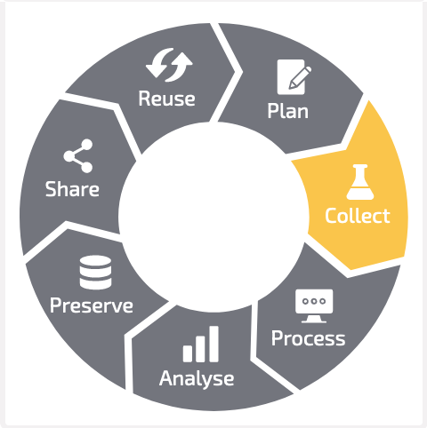
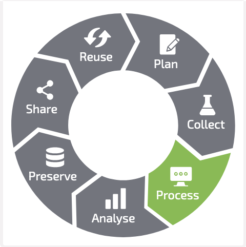
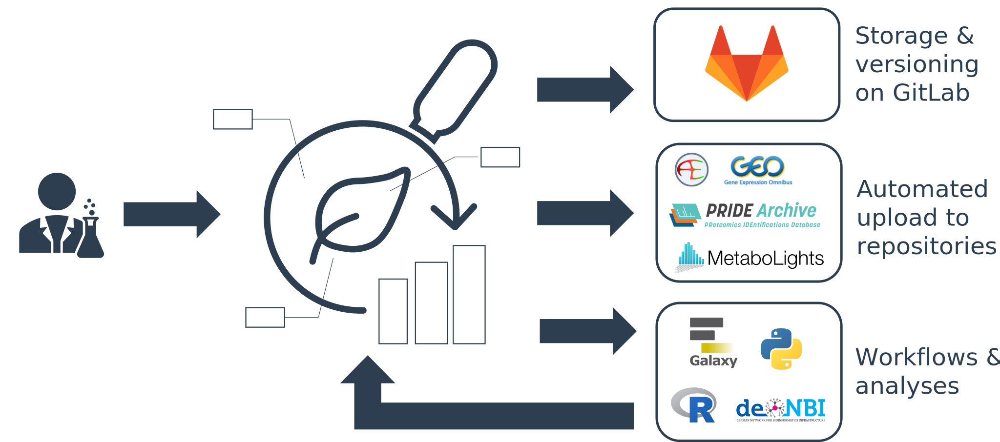
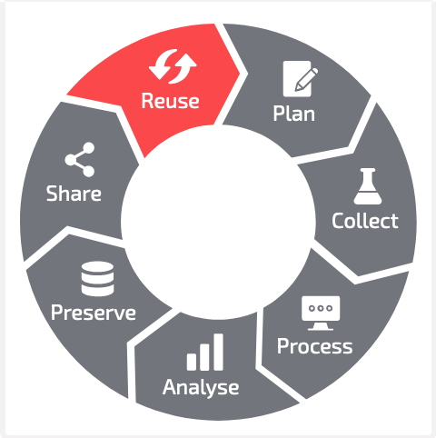

# ARC Ecosystem Demo

"A FAIR RDM journey along a (mutable) data life cycle"

 

 https://rdmkit.elixir-europe.org, [CC BY 4.0](https://creativecommons.org/licenses/by/4.0/)

---

# Collect 

<!-- 

- create study folder
  - take a picture (add more demo pictures)
- create assay folder
  - add fastq data

-->

---

# Process (e.g. annotate)  

<!-- 

- annotate plant samples
- annotate rnaseq extraction -->

---

# Analyse 

<!-- 
- run fastqc
- receive back results
-->

<!-- 
 -->

---

# Preserve  

<!--
1. Validation: CQC on each DataHUB commit
2. Publication: DOI
-->

 adapted from **Weil, Schneider *et al.*** (2023) "PLANTdataHUB: A collaborative platform for continuous FAIR data sharing in plant research",  The Plant Journal, https://doi.org/10.1111/tpj.16474 (*in production*) 

---

# Preserve and publish 

<!--
1. Validation: CQC on each DataHUB commit
2. Publication: DOI
-->

 **Weil, Schneider *et al.*** (2023) "PLANTdataHUB: A collaborative platform for continuous FAIR data sharing in plant research",  The Plant Journal, https://doi.org/10.1111/tpj.16474 (*in production*) 

---

# Share and collaborate 

---

# Reuse 

<!-- 
- via ARC https://arcregistry.nfdi4plants.org/arcsearch
- via ISA https://arcregistry.nfdi4plants.org/isasearch 
-->

 **Weil, Schneider *et al.*** (2023) "PLANTdataHUB: A collaborative platform for continuous FAIR data sharing in plant research",  The Plant Journal, https://doi.org/10.1111/tpj.16474 (*in production*) 

---

# **Mutable** data life cycle

<!-- 

- Invite other (demo) account
- add notes from there
-->

---

# Plan (ARC scale) 

 **Weil, Schneider *et al.*** (2023) "PLANTdataHUB: A collaborative platform for continuous FAIR data sharing in plant research",  The Plant Journal, https://doi.org/10.1111/tpj.16474 (*in production*) 

<!--
 
 - **ARCitect**: Create empty ARC
   - description
   - author
     - first name
     - last name
     - email
 - **ARCitect**: Upload ARC to DataHUB
 - **DataHUB**
   - Discuss, collect meeting minutes in Wiki
   - design / plant investigation (datahub wiki, issues)

-->

---

# Plan (proposal scale) 

**Zhou *et al.* (2023)**, DataPLAN: a web-based data management plan generator for the plant sciences, bioRxiv 2023.07.07.548147; doi: https://doi.org/10.1101/2023.07.07.548147 

https://dmpg.nfdi4plants.org

