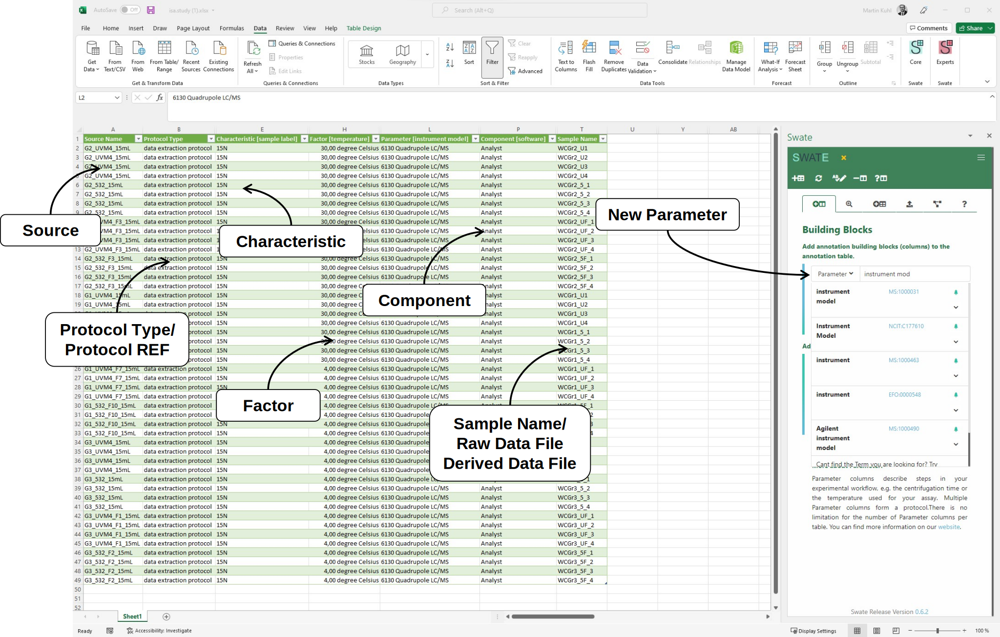

# Part 1: Metadata

---

# Part 2: ISA

---

## ARC builds on ISA

https://isa-tools.org/format/specification.html

<!-- Source to slide(s) -->
<!-- ../../bricks/ARC_ISAmodel.md -->

---

# ARC builds on ISA

<!-- Source to slide(s) -->
<!-- ../../bricks/ARC_ISA-tab.md -->

---

# isa.<>.xlsx files within ARCs

<!-- Source to slide(s) -->
<!-- ../../bricks/ARC_ISAxlsx01.md -->

---

# Study and assay files are registered in the investigation file <!-- fit -->

<!-- Source to slide(s) -->
<!-- ../../bricks/ARC_ISAxlsx02.md -->

---

# The output of a study or assay file can function as input for a new isa.assay.xlsx 

Output building blocks:
- Sample Name
- Raw Data File
- Derived Data File

<!-- Source to slide(s) -->
<!-- ../../bricks/ARC_ISAxlsx03.md -->

---

# 

<!-- Source to slide(s) -->
<!-- ../../bricks/ARC_ISAxlsx04.md -->

---

# Annotation Building Block types <!--fit-->

- Source Name (Input)
- Protocol Columns
  - Protocol Type, Protocol Ref
- Characteristic
- Parameter
- Factor
- Component
- Output Columns
  - Sample Name, Raw Data File, Derived Data File

:bulb: For details, check out the [Annotation Principles](https://nfdi4plants.github.io/AnnotationPrinciples/).

<!-- Source to slide(s) -->
<!-- ../../bricks/lesson_Swate_DataPLANT-Annotation_Building_Block_types.md -->

---
