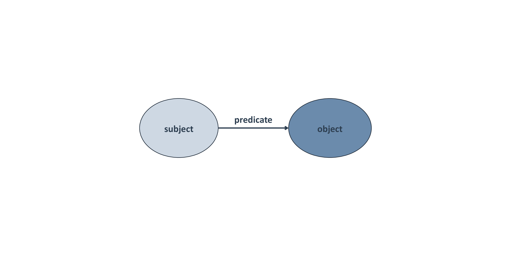
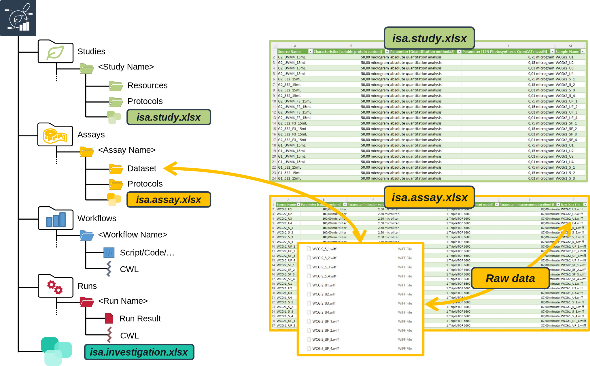
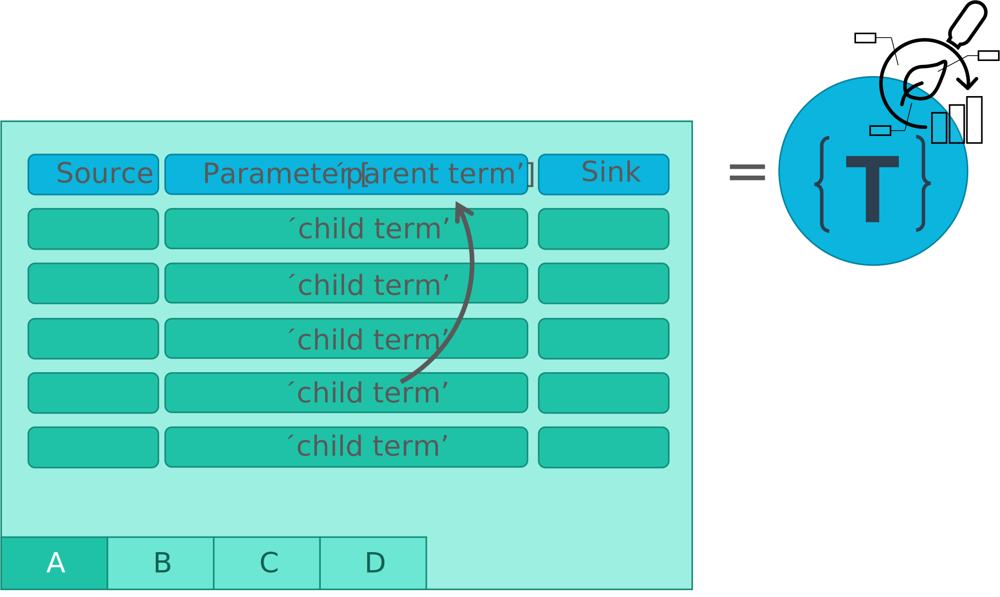

# Block 5 &ndash; Metadata and ISA

<style scoped>section {background: none; background-color: white}</style>
<!-- _paginate: false -->

September 28th, 2023
 

<div style="position: fixed; bottom: 10%; right: 40%;">
  <div class="profile-picture">
     
  </div>

  <div>

  Sabrina Zander <br> [MibiNet](https://www.sfb1535.hhu.de/projects/research-area-z/z03)
  </div>
</div>

<div style="position: fixed; bottom: 10%; right: 10%;">
  <div class="profile-picture">
    
  </div>

  <div>

  Dominik Brilhaus <br> [CEPLAS Data Science](https://www.ceplas.eu/en/research/data-science-and-data-management/)

  </div>

</div>

---


# Metadata

---

# What is <br> **metadata**?

<style scoped>
section {
  text-align: center;
  background: #F9CD69;
}
section::after {
  display: none;
}
footer {
  display: none;
}
</style>

<!-- 
Exercise: Association map

Online: Let participants annotate (via video conference tool)
Presence: Draw map on (white) board

-->

<!-- ################# -->
<!-- Source to following slide(s) -->
<!-- ./bricks/exercise_012_metadataViola.md -->
<!-- ################# -->


---

# Viola's PhD Project

Exercise: Take 5 minutes to note down the metadata

<style scoped>
section {
  text-align: justify;  
}
</style>

Viola investigates the effect of the plant circadian clock on sugar metabolism in *W. mirabilis*. For her PhD project, which is part of an EU-funded consortium in Prof. Beetroot's lab, she acquires seeds from a South-African botanical society. Viola grows the plants under different light regimes, harvests leaves from a two-day time series experiment, extracts polar metabolites as well as RNA and submits the samples to nearby core facilities for metabolomics and transcriptomics measurements, respectively. After a few weeks of iterative consultation with the facilities' heads as well as technicians and computational biologists involved, Viola receives back a wealth of raw and processed data. From the data she produces figures and wraps everything up to publish the results in the Journal of Wonderful Plant Sciences.

---

# Metadata everywhere

<style scoped>
section {
  text-align: justify;  
}
</style>

`Viola` investigates the `effect of the plant circadian clock` on `sugar metabolism` in *`W. mirabilis`*. For her `PhD project`, which is part of an `EU-funded consortium` in `Prof. Beetroot's lab`, she acquires `seeds` from a `South-African botanical society`. Viola `grows the plants` under `different light regimes`, harvests `leaves` from a `two-day time series experiment`, extracts `polar metabolites` as well as `RNA` and submits the samples to nearby `core facilities for metabolomics and transcriptomics` measurements, respectively. `After a few weeks` of iterative consultation with the facilities' heads as well as `technicians` and `computational biologists` involved, Viola receives back a wealth of `raw and processed data`. From the data she `produces figures` and wraps everything up to `publish the results in the Journal of Wonderful Plant Sciences`.

<!-- ################# -->
<!-- Source to following slide(s) -->
<!-- ./bricks/lesson_009_metadata.md -->
<!-- ################# -->

---

# Project metadata

<style scoped>
.columns {
    display: grid;
    grid-template-columns: repeat(3, minmax(0, 1fr));
    gap: 1rem;
}
ul {
    margin: 5; padding: 0;
}
</style>

<div class="columns">
<div class="columns-left">

### project design

- researcher
- institute and project
- biological context
- research question
- purpose of data collection
- ...

</div>
<div class="columns-right">

### experimental processes

- origin and nature of the biological material
- lab protocols
- instrument model
- ...

</div>

<div class="columns-right">

### data-analytical processes

- algorithms
- tools
- software versions and dependencies employed
- ...

</div>
</div>

---

# Other types of metadata

<style scoped>
.columns {
    display: grid;
    grid-template-columns: repeat(3, minmax(0, 1fr));
    gap: 1rem;
}
ul {
    margin: 5; padding: 0;
}
</style>

<div class="columns">
<div class="columns-left">

### bibliographic

- Title
- Publication date and title
- Description
- Author
- Contacts
- Keywords
- ...

</div>
<div class="columns-right">

### legal or administrative

- data origin, ownership, rovenance,
- licensing
- ethical aspects
- ...

</div>

<div class="columns-right">

### technical

- expected data volume
- storage location
- file formats
- ...

</div>
</div>

---

# Metadata from a FAIR perspective

<style scoped>
.columns {
    display: grid;
    grid-template-columns: repeat(2, minmax(0, 1fr));
    gap: 4rem;
}

</style>

<div class="columns">
<div class="columns-left">

**Findable**

- metadata names the content of the data
- basis for search engines
- makes it categorizable for people and machines

**Accessible**

- information about origin
- location of storage
- access rights

</div>

<div class="columns-right">

**Interoperable**

- metadata identifies software and file formats
- required conversions between file formats

**Reusable**

- obtain and reuse research data according to clear rules described in licenses

</div>
</div>

---

# Metadata "Standards"

Examples from Minimum Information for Biological and Biomedical Investigations (MIBBI):
- MIAPPE | Minimum Information About a Plant Phenotyping Experiment https://www.miappe.org
- MIAME | Minimum Information About a Microarray Experiment http://fged.org/projects/miame/
- MIAPE | Minimum Information About a Proteomics Experiment http://www.psidev.info/miape
- MINSEQE | Minimum Information about a high-throughput SEQuencing Experiment http://fged.org/projects/minseqe/

*Check: https://fairsharing.org/*

<!-- Remove? TODO
## A closer look at MIAPE 

(*MIAPPE = Minimum Information About a **Proteomics** Experiment*)

<style scoped>
  section p img {
  width: 1000px;
  height: 400px;
  object-fit: cover;
  object-position: 100% 10%;
  margin: 0 auto 0 auto ;
  }
</style>


> Note: This is just an excerpt!

https://www.psidev.info/sites/default/files/2018-03/MIAPE_MS_2.98.pdf


---

# A closer look at MIAPPE

(*MIAPPE = Minimum Information About a **Plant Phenotyping** Experiment*)

<style scoped>
  section p img {
  width: 1000px;
  height: 400px;
  object-fit: cover;
  object-position: 100% 10%;
  margin: 0 auto 0 auto ;
  }
</style>


> Note: This is just a tiny excerpt!

http://doi.org/10.1111/nph.16544

---

# Metadata standards ~ Checklists

- Determine the (minimal) required information (content)
- Usually **do not** determine the format (i.e. shape or file type)

---

# Connecting (i.e. “mapping”) MIAPPE and ISA


http://doi.org/10.1111/nph.16544

<!-- ################# -->
<!-- Source to following slide(s) -->
<!-- ./bricks/lesson_002_ontology.md -->
<!-- ################# -->

---

# Ontology

(Sometimes also referred to "semantic model")

An ontology combines features of

- a **dictionary**,
- a **taxonomy**, and
- a **thesaurus**

--- 

## Dictionary

Alphabetically lists terms and their definitions
<br>

**Pizza**: *"a dish made typically of flattened bread dough spread with a savory mixture usually including tomatoes and cheese and often other toppings and baked"*

--- 


## Taxonomy

Hierarchy or classification


--- 

## Thesaurus

Dictionary of synonyms and relations
<br>

**Pizza** ≈ Lahmacun ≈ Focaccia ≈ Flammkuchen

---

# Ontology

- Structures a set of **concepts** in a particular area and the relations between them in a **graph-like manner**
- Can be used in disambiguation, defining hierarchies, a standard to define terms
- Define a common vocabulary of concepts and their relationships to **model** a particular domain while making it **machine understandable**

---

# The semantic triple



---

# Modeling a pizza menu


---

# Modeling a pizza menu


---

# Modeling a pizza menu


---

# Predicates have two directions


---

# Looking at the menu from a different perspective

An object of one triplet can be the subject to another


---

# (Towards) a knowledge graph


---

# Searching the menu

An ontology can be queried:

- *"name all pizzas with topping mushrooms"*


<!-- 
TODO: 
- This is actually not a proper ontology(!), but rather a knowledge graph (= ontology + data)
 -->

---

# The Pizza Ontology

- Example from protege: https://protege.stanford.edu/ontologies/pizza/pizza.owl
- Visualize viw WebVOWL http://vowl.visualdataweb.org/webvowl.html


<!-- Remove? TODO

# Example ontologies

### EDAM ontology

- Description: http://edamontology.org/page
- Browser: https://edamontology.github.io/edam-browser

### PECO ontology

- Human-readble: https://www.ebi.ac.uk/ols/ontologies/peco
- Raw (OWL): http://purl.obolibrary.org/obo/peco.owl

> Explore more examples
> - https://www.ebi.ac.uk/ols/
> - https://bioportal.bioontology.org

<!-- 
LIVE-Demo 
- Search an "interesting" term from PECO in browser (EBI OLS)
  - Example: 
    - plant exposure
       abiotic plant exposure
          physical plant exposure
            water environment exposure
              drought environment exposure
- Show the graph view (and expand it interactively)
- Mention that terms (subjects, objects) and properties (predicates) have "URIs", "PIDs"
- Show that terms can have alternative / external IDs and link to "outdated" ontologies


--- 

<!-- Remove? TODO
# Schemas and machine-readability


--- 


## Structured data and the internet

Schema.org
- create, maintain, and promote schemas for structured data on the Internet, on web pages, in email messages, ...
- Structured data can be used to ***mark up*** all kinds of items from products to events to recipes
- Communicate with search engines (-> SEO, search engine optimization)
- Enhance findability from search engine results
- Provide context to an ambigous webpage
- Metadata interoperability and standardization across all website using schema.org

<!-- 
TODO: 
Source: bioschemas.org
 


--- 

<!-- Delete? TODO

## Structured data and the internet: Schema.org

<style scoped>
code {
    display: inline-block;
    width: 700px;
    font-size: 18px;
}
</style>

https://schema.org/Person

```json
    <script type="application/ld+json">
    {
      "@context": "https://schema.org",
      "@type": "VisualArtwork",
      "name": "La trahison des images",
      "alternateName": "The Treachery of Images",
      "image": "http://upload.wikimedia.org/wikipedia/en/b/b9/MagrittePipe.jpg",
      "description": "The painting shows a pipe. Below it, Magritte...",
      "creator": [
        {
          "@type": "Person",
          "name": "René Magritte",
          "sameAs": "https://www.freebase.com/m/06h88"
        }
      ],
      "width": [
        {
          "@type": "Distance",
          "name": "940 mm"
        }
      ],
      "height": [
        {
          "@type": "Distance",
          "name": "635 mm"
        }
      ],
      "artMedium": "oil",
      "artworkSurface": "canvas"
    }
    </script>
```

<!-- 
## Google Knowledge Graph

## Bioschemas.org

https://bioschemas.org 
-->


--- 

<!-- DELETE? TODO

## JSON-LD

<style scoped>
code {
    display: inline-block;
    width: 700px;
}
</style>

JSON-LD = JavaScript Object Notation for Linked Data

```json
<script type="application/ld+json">
  {
    "@context": "https://schema.org",
    "@type": "SportsTeam",
    "name": "San Francisco 49ers",
    "member": {
      "@type": "OrganizationRole",
      "member": {
        "@type": "Person",
        "name": "Joe Montana"
      },
      "startDate": "1979",
      "endDate": "1992",
      "roleName": "Quarterback"
    }
  }
</script>
```


--- 


## RDFa

RDFa = Resource Description Framework in Attributes

```
<div vocab="http://schema.org/" typeof="SportsTeam">
  <span property="name">San Francisco 49ers</span>
  <div property="member" typeof="OrganizationRole">
    <div property="member" typeof="http://schema.org/Person">
      <span property="name">Joe Montana</span>
    </div>
    <span property="startDate">1979</span>
    <span property="endDate">1992</span>
    <span property="roleName">Quarterback</span>
  </div>
</div>
```

---

# Standards

### Dublin Core

https://www.dublincore.org/schemas/

### DataCite Schema

- Schema: http://schema.datacite.org/meta/kernel-4.3/metadata.xsd
- Full Example: https://schema.datacite.org/meta/kernel-4.3/example/datacite-example-full-v4.xml

--- 

## DataCite Schema: Simple Example

<style scoped>
code {
    /* display: inline-block; */
    font-size: 12px;
}
</style>

```xml
...
  <identifier identifierType="DOI">10.5072/D3P26Q35R-Test</identifier>
  <creators>
    <creator>
      <creatorName nameType="Personal">Fosmire, Michael</creatorName>
      <givenName>Michael</givenName>
      <familyName>Fosmire</familyName>
    </creator>
    <creator>
      <creatorName nameType="Personal">Wertz, Ruth</creatorName>
      <givenName>Ruth</givenName>
      <familyName>Wertz</familyName>
    </creator>
    <creator>
      <creatorName nameType="Personal">Purzer, Senay</creatorName>
      <givenName>Senay</givenName>
      <familyName>Purzer</familyName>
    </creator>
  </creators>
  <titles>
    <title xml:lang="en">Critical Engineering Literacy Test (CELT)</title>
  </titles>
  <publisher xml:lang="en">Purdue University Research Repository (PURR)</publisher>
  <publicationYear>2013</publicationYear>
  <subjects>
    <subject xml:lang="en">Assessment</subject>
    <subject xml:lang="en">Information Literacy</subject>
    <subject xml:lang="en">Engineering</subject>
    <subject xml:lang="en">Undergraduate Students</subject>
    <subject xml:lang="en">CELT</subject>
    <subject xml:lang="en">Purdue University</subject>
  </subjects>
  <language>en</language>
  <resourceType resourceTypeGeneral="Dataset">Dataset</resourceType>
...
```

https://schema.datacite.org/meta/kernel-4.3/example/datacite-example-dataset-v4.xml


---
--> 

# ISA

---

## ARC builds on ISA


https://isa-tools.org/format/specification.html

<!-- Source to slide(s) -->
<!-- ../../bricks/ARC_ISAmodel.md -->

---

# ARC builds on ISA


<!-- Source to slide(s) -->
<!-- ../../bricks/ARC_ISA-tab.md -->


---

# isa.<>.xlsx files within ARCs


<!-- Source to slide(s) -->
<!-- ../../bricks/ARC_ISAxlsx01.md -->


---

# Study and assay files are registered in the investigation file <!-- fit -->


<!-- Source to slide(s) -->
<!-- ../../bricks/ARC_ISAxlsx02.md -->


---

# The output of a study or assay file can function as input for a new isa.assay.xlsx 

Output building blocks:
- Sample Name
- Raw Data File
- Derived Data File


<!-- Source to slide(s) -->
<!-- ../../bricks/ARC_ISAxlsx03.md -->


---

# 



<!-- Source to slide(s) -->
<!-- ../../bricks/ARC_ISAxlsx04.md -->


---


# Swate


---

# Annotation by flattening the knowledge graph


- Low-friction metadata annotation
- Familiar spreadsheet, row/column-based environment

---

# Annotation principle

<!-- <style scoped>
section p img{
  /* padding-left: 230px */
}  
</style> -->


- Low-friction metadata annotation
- Familiar spreadsheet, row/column-based environment

---

# Adding new building blocks (columns)


- Swate can be used for the annotation of **isa.study.xlsx and isa.assay.xlsx** files

---

# Annotation Building Block types <!--fit-->


- Source Name (Input)
- Protocol Columns
  - Protocol Type, Protocol Ref
- Characteristic
- Parameter
- Factor
- Component
- Output Columns
  - Sample Name, Raw Data File, Derived Data File


:bulb: For details, check out the [Annotation Principles](https://nfdi4plants.github.io/AnnotationPrinciples/).

<!-- Source to slide(s) -->
<!-- ../../bricks/lesson_Swate_DataPLANT-Annotation_Building_Block_types.md -->

---

## Annotation Principles

.png)


---

# Ontology term search


<style scoped>
h1{
  text-align: left
}
section {
  text-align: center;
}
</style>


Enable **related term directed search** to directly fill cells with child terms

---

# Fill your table with ontology terms


---

# Hierarchical combination of ontologies


<!-- combination of ISA (Characteristics, Parameter, Factor) and a biological or technological ontology (e.g. temperature, strain, instrument model) gives the flexibility to display an ontology term, e.g. temperature, as a regular process parameter or as the factor your study is based on (Parameter \[temperature\] or Factor \[temperature\]). -->

<!-- ################# -->
<!-- Source to following slide(s) -->
<!-- ./bricks/lesson_025_SwateTemplates_DataPLANT.md -->
<!-- ################# -->


---

# Swate templates

---

# Checklists and Templates



Metadata standards or repository requirements can be represented as templates

<style scoped>
h1{
  text-align: left
}
section {
  text-align: center;
}
</style>

---

# Realization of lab-specific metadata templates


Facilities can define their most common workflows as templates

<style scoped>
h1{
  text-align: left
}
section {
  text-align: center;
}
</style>

---

# Directly import templates via Swate

- DataPLANT curated
- Community templates


<!-- ################# -->
<!-- Source to following slide(s) -->
<!-- ./bricks/lesson_031_annotationPrinciples.md -->
<!-- ################# -->


---
