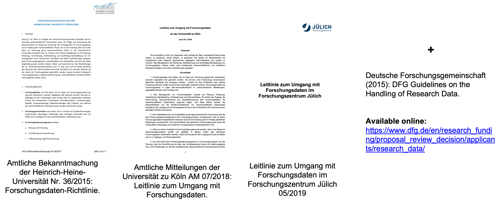
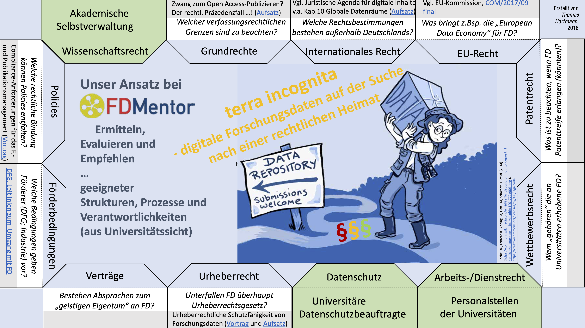

# Digital documentation

*Of **anything** from green house to digital data object*

---

# Digital documentation

Electronic lab notebook

- Lab methods
- Sample processing

(Computational) processing steps

- Data processing (excel sheets)
- Analyses (excel, code, etc.)
- Keep track of tools, versions and parameters used

---

# Electronic lab notebooks (ELNs)

  

  

---

# Electronic lab notebooks (ELNs)

### Good

- Documenting daily lab routine
- Lab methods & protocols
- Lab inventory (biologicals, chemicals, instruments)
- Local sharing & collaboration
- (P)IDs
- Backup (locally)

### Intermediate

- Version control
- Track changes / contributions
- External sharing

### Limited  

- Raw data
- Analyses
- Structured metdata

---

# Text editors and IDEs

*Please do not open markdown (.md) files in MS word*

Recommended text editors with code highlighting

- Visual Studio Code <https://code.visualstudio.com/>
- BBEdit <https://www.barebones.com/products/bbedit/>
- Sublime <https://www.sublimetext.com/>

- These highlight the structure / hierarchy of many text / code file types and make them a bit more comprehensible than pure text editors

<!-- ################# -->
<!-- Source to following slide(s) -->
<!-- ./bricks/lesson_032_reproducibility.md -->
<!-- ################# -->

---

# Code Notebooks

- <https://jupyter.org/>
- <http://rmarkdown.rstudio.com>

**Good**

- Document and comment code
- Local sharing (mostly reproducible, executable code)
- Interactive (good start for non-coders)

**Intermediate**

- Reproducibility (package / library dependencies)
- Version control (e.g. git plugin)

---

# Computational workflow languages

- Describe analysis workflows and tools
- Make them portable and scalable
- Across a variety of environments (software and hardware)

<!-- - <https://www.docker.com>
- singularity -->
<https://www.commonwl.org>
<https://www.nextflow.io>
<https://nf-co.re/>
<https://snakemake.github.io>
 
<https://galaxyproject.eu/>

<!-- ################# -->
<!-- Source to following slide(s) -->
<!-- ./bricks/exercise_017_FAIRProject_final.md -->
<!-- ################# -->

---

# Persistent Identifiers (PIDs)

---

# Spot the Persistent Identifiers (PIDs)

---

# Spot the PIDs

---

# Globally unique, stable, persistent identifiers (PIDs)

* Long-term findability
* Make data, digital objects, people, … uniquely identifiable
* Diminish “dead links”
* Cope with name changes

E.g. CEPLAS:
- https://ror.org/034waa237
- https://grid.ac/institutes/grid.503026.2

---

# Properties of a PID

- Ideally it is permanent
- Location-independent
- Globally valid
- Addressable (citable)
- Clickable (resolvable)

---

# Good URIs (Uniform Resource Identifiers)

- Globally unique
  - One URI should never refer to two different concepts at the same time
- Persistent
  - A URI should continue to resolve for the foreseeable future
- Stable
  - A URI should never be re-used [...] even if the original is deleted
- Resolvable
  - A URI should redirect to a suitable document

Adapted from https://www.ebi.ac.uk/rdf/documentation/good_practice_uri/

Note, there is a difference between __URIs__ and __[handles](http://www.handle.net/)__.

---

# Repositories
---

# Domain-specific data repositories

**Good**

- Assign PIDs / DOIs
- Long-term accessible
- Data-type specific
- Apply metadata standards
- Usually recommended / required by journals
- Mostly accepted by the community

**Intermediate**

- User-friendliness
- Different metadata schema
- Complex and versatile submission routines

---

# Choosing a data repository

Domain-specific >> Generic >> Institutional

*Find repositories at:*
<https://www.re3data.org>
<https://fairsharing.org>
<!-- ################# -->
<!-- Source to following slide(s) -->
<!-- ./bricks/exercise_007_repositories.md -->
<!-- ################# -->

<!--Most commen data types RNAseq, metabolomics and phenotyping/microscopy should be present in the group and examples for this be shown eventually.-->

<!--The last point requires more time also for collecting the experiences subsequently.-->

---

# Find a repository for your recent project

- Go to https://www.re3data.org or https://www.fairsharing.org
- Search for the type of data or experiment you work with
- Find a suitable public repository, where you could deposit your data
- At the repository (website): try to find out how to submit data

<!-- ################# -->
<!-- Source to following slide(s) -->
<!-- ./events/2022-11-10_ceplas_PhDmodule/custom_slides/exercise_007_repositories_results_CEPLAS.md -->
<!-- ################# -->

<!--Most common data types RNAseq, metabolomics and phenotyping/microscopy should be present in the group and examples for this be shown eventually.-->

<!--The last point requires more time also for collecting the experiences subsequently.-->

---

# Domain-specific data repositories

Repository | Description | Biological data domain
-- | -- | --
[EBI-ENA](<https://www.ebi.ac.uk/ena/>) | European Nucleotide Archive | genome / transcriptome sequences
[NCBI-SRA](<https://www.ncbi.nlm.nih.gov/sra/>) | Sequence Read Archive | genome / transcriptome sequences
[NCBI-GenBank](<https://www.ncbi.nlm.nih.gov/genbank/>) | Genetic Sequence Database | genome

---

# Domain-specific data repositories
Repository | Description | Biological data domain
-- | -- | --
[EBI-ArrayExpress](<https://www.ebi.ac.uk/arrayexpress/>) | Archive of Functional Genomics Data | transcriptome  
[NCBI-GEO](<https://www.ncbi.nlm.nih.gov/geo/>) | Gene Expression Omnibus | transcriptome
[e!DAL-PGP](<https://edal.ipk-gatersleben.de/index.html>) | Plant Genomics & Phenomics Research Data Repository | phenome

---

# Domain-specific data repositories
Repository | Description | Biological data domain
-- | -- | --
[EBI-MetaboLights](<https://www.ebi.ac.uk/metabolights/>) | Database of Metabolomics | metabolome
[EBI-PRIDE](<https://www.ebi.ac.uk/pride/>) | PRoteomics IDEntifications Database | proteome
[EBI-BioImage Archive](<https://www.ebi.ac.uk/bioimage-archive/>) | Stores & distributes biological images | imaging, microscopy

---

# Generic data repositories

**Good**

- Allow publication of any kind of data Assign PIDs / DOIs
- Long-term accessible
- Very simple to use

**Intermediate**

- Only generic / high-level metadata schema
- Limited reusability

---

# Research data policies

---

# Data handling guidelines and policies

<!-- ################# -->
<!-- Source to following slide(s) -->
<!-- ./events/2022-11-10_ceplas_PhDmodule/custom_slides/lesson_008_policies_CEPLAS2.md -->
<!-- ################# -->

## CEPLAS-relevant data handling guidelines & policies

<!-- TODO: update HHU to recent version -->

<!-- ################# -->
<!-- Source to following slide(s) -->
<!-- ./bricks/lesson_021_DMP.md -->
<!-- ################# -->

---

# The Data Management Plan (DMP)

---

# The Data Management Plan
<!--Zoom in the DMP questions to recognize aspects already covered by the course.-->

---

# The DMP helps you to document and plan all your data management activities

- Covers the full research data lifecycle
- Frequently updated as your project develops
- Required to different extents by funding agencies (e.g. DFG, Horizon Europe, BMBF, BMEL, ... )

---

# Provenance in science
- same as in general
- results/experiments should be reproducible
- documentation required:
    - processes (phys., comp.)
    - experiment 
    - sample
    - protocol
    - ...

---

# Open Access (OA)

OA Categories

- Gold: Published in an open-access journal that is indexed by the [DOAJ](https://doaj.org).
- Green: Toll-access on the publisher page, but there is a free copy in an OA repository.
- Hybrid: Free under an open license in a toll-access journal.
- Bronze: Free to read on the publisher page, but without a clearly identifiable license.
- Closed: All other articles, including those shared only on an Academic Social Network or in Sci-Hub.

> Source: Piwowar H et al. (2018), PeerJ https://doi.org/10.7717/peerj.4375

---

# Transition towards an open access system

[Open Access Monitor](https://open-access-monitor.de/)

[Open Access Categories](https://jugit.fz-juelich.de/synoa/oam-dokumentation/-/wikis/English%20Version/Open%20Access%20Monitor/OA%20Categories)

[Overview about open access journals](https://jugit.fz-juelich.de/synoa/oam-dokumentation/-/wikis/Quelldatenbanken/Zeitschriftenlisten) (german only)

Curated lists:
- [DOAG](https://pub.uni-bielefeld.de/record/2963331): Diamond Open Access Journals Germany
- [DOAJ](https://doaj.org/about/): Directory of Open Access Journals

---

# Open Science is more than Open Access

> Okafor et al. (2022) https://doi.org/10.3389/frma.2022.855198

---

# Licences and copyright

## Creative commons licenses

> https://creativecommons.org/about/downloads/
> https://creativecommons.org/about/cclicenses/

<!--Second link includes cc 0 and better descriptions-->

---

# Data protection

[GDPR](https://gdpr-info.eu/): General Data Protection Regulation

[DS-GVO](https://www.datenschutz-wiki.de/Datenschutz-Grundverordnung) (german): Datenschutz-Grundverordnung
- required measures: "Technische und organisatorische Maßnahmen" [(TOMs)](https://www.datenschutz-wiki.de/Technische_und_organisatorische_Ma%c3%9fnahmen)

---

# Biological material

- MTA: material transfer agreement
- [Nagoya Protocol](https://www.cbd.int/abs/about/)
- DSI: [Digital sequence information](https://www.genres.de/en/access-and-benefit-sharing/digital-sequence-information)

---

# CARE principles

https://www.gida-global.org/care

---

# CARE principles

https://datascience.codata.org/articles/10.5334/dsj-2020-043/

---

# Different laws touched by RDM

<!--TODO: Replace the placeholder  -->

- 10.5281/zenodo.2654306
- https://www.forschungsdaten.org/images/0/08/Hartmann_TerraIncognita-Forschungsdaten-RechtlicheHeimat.pdf

