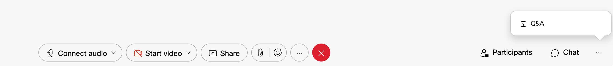
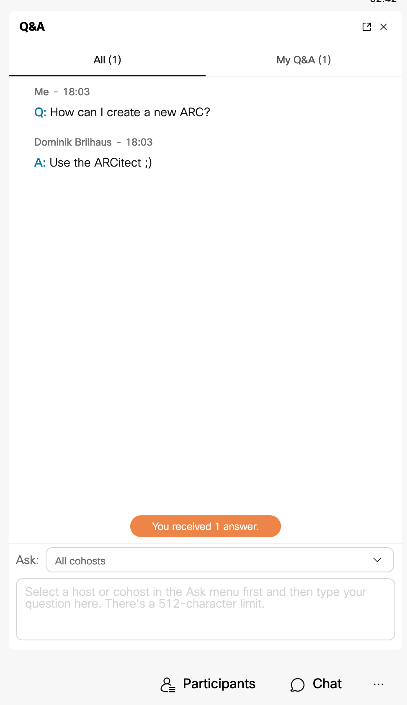

# Start your ARC Workshop

<!-- _paginate: false -->

for CSCS

October 5th, 2023

Dominik Brilhaus, [CEPLAS Data Science](https://www.ceplas.eu/en/research/data-science-and-data-management/)

---
# Block 1 &ndash; Welcome and Intro

---

# Welcome

Please introduce yourselves

- Who are you?
- Where are you?
- What was your **motivation** to join this workshop?
- Summarize your **study design**
- Name your **favorite assay** or measurement technique

---

# House-keeping

--- 

## This workshop session will be recorded

I will cut out all participant chat, video, audio, etc. or ask for permission before sharing any recordings

---
## Let's make this an interactive workshop

Please feel free to use the chat, raise hands, discuss, etc.

 

 

:bulb: Let's try to collect questions and answers in the Q&A panel =>

---

# Goal

Create ARCs to share research data

 
  
:bulb: In this workshop we focus more on **how** and less on **why**

---

# Tentative agenda

Time | Topics
-------- | --------
13:00 - 14:00 | Welcome and intro
14:00 - 14:15 | *Short break*
14:15 - 16:00 | ARC and ARCitect Hands-on
16:00 - 16:15 | *Short break*
16:15 - 17:00 | Q & A

:bulb: Please try to prepare your own ARC until the next session
