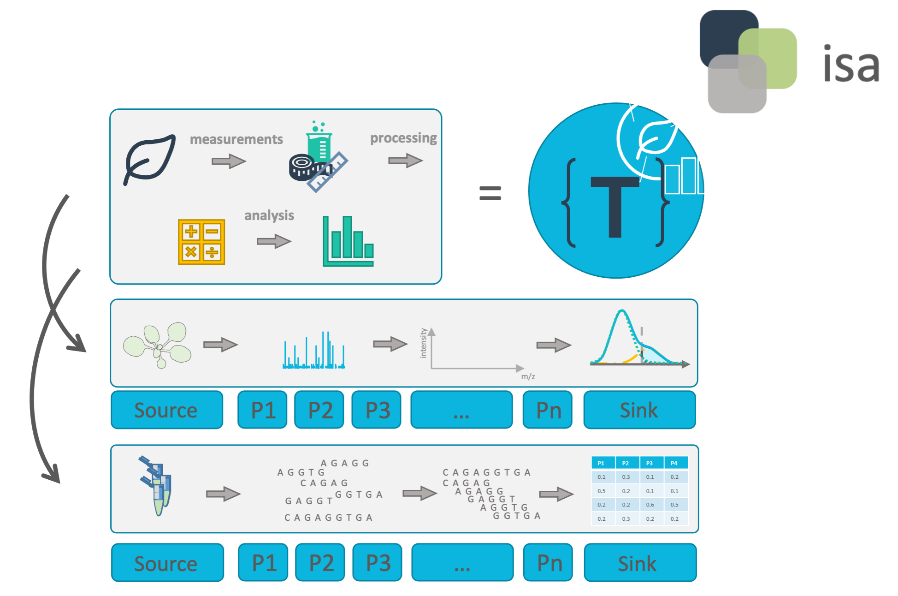

# Block 6 &ndash; Metadata and ISA

<!-- _paginate: false -->

October 11th, 2023

Dominik Brilhaus, [CEPLAS Data Science](https://www.ceplas.eu/en/research/data-science-and-data-management/)

---

# What is   **metadata**?

<!-- 
Exercise: Association map

Online: Let participants annotate (via video conference tool)
Presence: Draw map on (white) board

-->

---

# Viola's PhD Project

Exercise: Take 5 minutes to note down the metadata

Viola investigates the effect of the plant circadian clock on sugar metabolism in *W. mirabilis*. For her PhD project, which is part of an EU-funded consortium in Prof. Beetroot's lab, she acquires seeds from a South-African botanical society. Viola grows the plants under different light regimes, harvests leaves from a two-day time series experiment, extracts polar metabolites as well as RNA and submits the samples to nearby core facilities for metabolomics and transcriptomics measurements, respectively. After a few weeks of iterative consultation with the facilities' heads as well as technicians and computational biologists involved, Viola receives back a wealth of raw and processed data. From the data she produces figures and wraps everything up to publish the results in the Journal of Wonderful Plant Sciences.

---

# Metadata everywhere

`Viola` investigates the `effect of the plant circadian clock` on `sugar metabolism` in *`W. mirabilis`*. For her `PhD project`, which is part of an `EU-funded consortium` in `Prof. Beetroot's lab`, she acquires `seeds` from a `South-African botanical society`. Viola `grows the plants` under `different light regimes`, harvests `leaves` from a `two-day time series experiment`, extracts `polar metabolites` as well as `RNA` and submits the samples to nearby `core facilities for metabolomics and transcriptomics` measurements, respectively. `After a few weeks` of iterative consultation with the facilities' heads as well as `technicians` and `computational biologists` involved, Viola receives back a wealth of `raw and processed data`. From the data she `produces figures` and wraps everything up to `publish the results in the Journal of Wonderful Plant Sciences`.

---

# Project metadata

### project design

- researcher
- institute and project
- biological context
- research question
- purpose of data collection
- ...

### experimental processes

- origin and nature of the biological material
- lab protocols
- instrument model
- ...

### data-analytical processes

- algorithms
- tools
- software versions and dependencies employed
- ...

---

# Other types of metadata

### bibliographic

- Title
- Publication date and title
- Description
- Author
- Contacts
- Keywords
- ...

### legal or administrative

- data origin, ownership, rovenance,
- licensing
- ethical aspects
- ...

### technical

- expected data volume
- storage location
- file formats
- ...

---

# Metadata from a FAIR perspective

**Findable**

- metadata names the content of the data
- basis for search engines
- makes it categorizable for people and machines

**Accessible**

- information about origin
- location of storage
- access rights

**Interoperable**

- metadata identifies software and file formats
- required conversions between file formats

**Reusable**

- obtain and reuse research data according to clear rules described in licenses

---

# ARC builds on ISA

<https://isa-tools.org/format/specification.html>

---

# ARC builds on ISA

---

# isa.<>.xlsx files within ARCs

---

# Study and assay files are registered in the investigation file <!-- fit -->

---

# The output of a study or assay file can function as input for a new isa.assay.xlsx

Output building blocks:

- Sample Name
- Raw Data File
- Derived Data File

---

#

---

# Swate

---

# Annotation by flattening the knowledge graph

- Low-friction metadata annotation
- Familiar spreadsheet, row/column-based environment

---

# Annotation principle

<!--  -->

- Low-friction metadata annotation
- Familiar spreadsheet, row/column-based environment

---

# Adding new building blocks (columns)

- Swate can be used for the annotation of **isa.study.xlsx and isa.assay.xlsx** files

---

# Annotation Building Block types <!--fit-->

- Source Name (Input)
- Protocol Columns
  - Protocol Type, Protocol Ref
- Characteristic
- Parameter
- Factor
- Component
- Output Columns
  - Sample Name, Raw Data File, Derived Data File

Let's take a detour on [Annotation Principles](https://nfdi4plants.org/nfdi4plants.knowledgebase/docs/guides/isa_AnnotationPrinciples.html) | [slides](https://nfdi4plants.org/nfdi4plants.knowledgebase/docs/teaching-materials/units/AnnotationPrinciples/isa_AnnotationPrinciples-slides.html)

---

# Ontology term search

Enable **related term directed search** to directly fill cells with child terms

---

# Fill your table with ontology terms

---

# Hierarchical combination of ontologies

<!-- combination of ISA (Characteristics, Parameter, Factor) and a biological or technological ontology (e.g. temperature, strain, instrument model) gives the flexibility to display an ontology term, e.g. temperature, as a regular process parameter or as the factor your study is based on (Parameter \[temperature\] or Factor \[temperature\]). -->

---

# Swate templates

---

# Checklists and Templates

Metadata standards or repository requirements can be represented as templates

---

# Realization of lab-specific metadata templates

Facilities can define their most common workflows as templates

---

# Directly import templates via Swate

- DataPLANT curated
- Community templates

---

---

# Contributors

Slides presented here include contributions by

- name: Dominik Brilhaus
  github: https://github.com/brilator
  orcid: https://orcid.org/0000-0001-9021-3197
- name: Martin Kuhl
  github: https://github.com/Martin-Kuhl
  orcid: https://orcid.org/0000-0002-8493-1077
- name: Sabrina Zander
  orcid: https://orcid.org/0009-0000-4569-6126
  