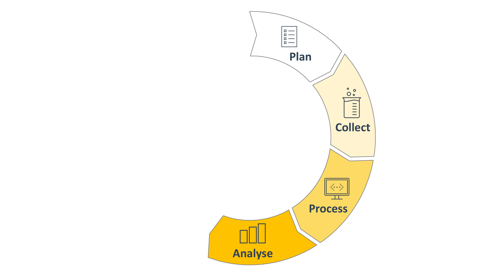
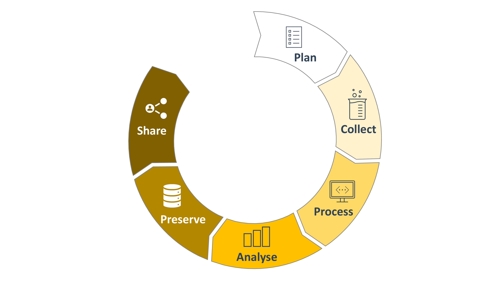
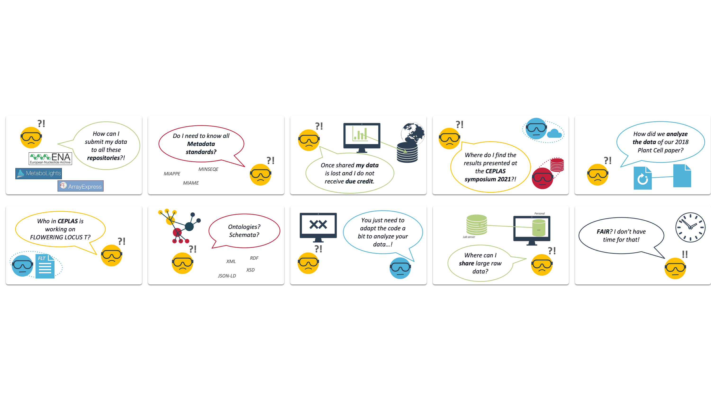

# Good Data Management Practices

<!--  _color: white; -->
<!-- _paginate: false -->

*part of M4468 &ndash; Plant developmental genetics, evolution and biostatistics in the CEPLAS research program*
 
November 8th, 2023
Dominik Brilhaus, CEPLAS Data Science

---

# Welcome

---

# House-keeping

Pad: https://pad.hhu.de/oI-NjeUtSHSMzk5huWRkJw
 
---

# Materials

Slides will be shared via DataPLANT knowledge base and the Sciebo folder

---

# Tentative agenda

## Day 1

Time | Topics
-------- | --------
09:30 - 10:45 | Intro to RDM and ARC
10:45 - 11:00 | *Short break*
11:00 - 12:00 | ARC Hands-on
12:30 - 13:30 | *Lunch*
13:00 - 15:30 | Data storage and sharing
15:30 - 16:00 | Wrap-up

## Day 2

Time | Topics
-------- | --------
09:30 - 10:30 | ARC Feedback session
10:30 - 10:45 | *Short break*
10:45 - 12:00 | ISA and Metadata
12:30 - 13:30 | *Lunch*
13:00 - 15:00 | Hands-on Swate
15:00 - 15:30 | ARC ecosystem: Additional features
15:30 - 16:00 | Wrap-up

---

# Goals

- Appreciate FAIR principles
- Tools and services for FAIR data management
- Effectively manage your own research data
- Communication and terminology

---

# Why Research Data Management (RDM)?

- Increase transparency
- Make data accessible
- Save time (writing, reusing)
- Reduce the risk of data loss
- Optimize the costs
- Facilitate future reuse and sharing
- Improve citations

---

# The Research Data Lifecycle

---

# The Research Data Lifecycle

---

# The Research Data Lifecycle

---

# The Research Data Lifecycle

---

# The Research Data Lifecycle

---

# The Research Data Lifecycle

---

# The Research Data Lifecycle

---

# The Research Data Lifecycle ***is mutable***

---

# FAIR

- **F**indable
- **A**ccessible
- **I**nteroperable
- **R**eusable

https://doi.org/10.1038/sdata.2016.18

---

# The FAIR principles

---

# Is your data FAIR?

**F**indable | **A**ccessible | **I**nteroperable | **R**eusable

- Where do you store your data?
- How do you annotate your data?
- How do you share your data?
- What tools do you use to analyse your data?
- How do you reuse other people's data?

---

## Findable

> The first step in (re)using data is to find them. Metadata and data should be easy to find for both humans and computers. Machine-readable metadata are essential for automatic discovery of datasets and services, so this is an essential component of the FAIRification process.

- F1. (Meta)data are assigned a globally unique and persistent identifier.
- F2. Data are described with rich metadata (defined by R1 below).
- F3. Metadata clearly and explicitly include the identifier of the data they describe.
- F4. (Meta)data are registered or indexed in a searchable resource.

https://www.go-fair.org/fair-principles/

---

## Accessible

> Once the user finds the required data, she/he/they need to know how they can be accessed, possibly including authentication and authorisation.

- A1. (Meta)data are retrievable by their identifier using a standardised communications protocol
  - A1.1 The protocol is open, free, and universally implementable
  - A1.2 The protocol allows for an authentication and authorisation procedure, where necessary
- A2. Metadata are accessible, even when the data are no longer available

https://www.go-fair.org/fair-principles/

---

## Interoperable

> The data usually need to be integrated with other data. In addition, the data need to interoperate with applications or workflows for analysis, storage, and processing.

- I1. (Meta)data use a formal, accessible, shared, and broadly applicable language for knowledge representation.
- I2. (Meta)data use vocabularies that follow FAIR principles.
- I3. (Meta)data include qualified references to other (meta)data.

https://www.go-fair.org/fair-principles/

---

## Reusable

> The ultimate goal of FAIR is to optimise the reuse of data. To achieve this, metadata and data should be well-described so that they can be replicated and/or combined in different settings.

- R1. (Meta)data are richly described with a plurality of accurate and relevant attributes
- R1.1. (Meta)data are released with a clear and accessible data usage license
- R1.2. (Meta)data are associated with detailed provenance
- R1.3. (Meta)data meet domain-relevant community standards

https://www.go-fair.org/fair-principles/

---

# FAIR on multiple layers

> The principles refer to three types of entities: **data** (or any digital object), **metadata** (information about that digital object), and **infrastructure**.

https://www.go-fair.org/fair-principles/

--- 

# Scattered Data Silos

---

# Scattered Data Silos

---

# FAIR Data for everyone

--- 

--- 

# Contributors

Slides presented here include contributions by

- name: Dominik Brilhaus
  github: https://github.com/brilator
  orcid: https://orcid.org/0000-0001-9021-3197