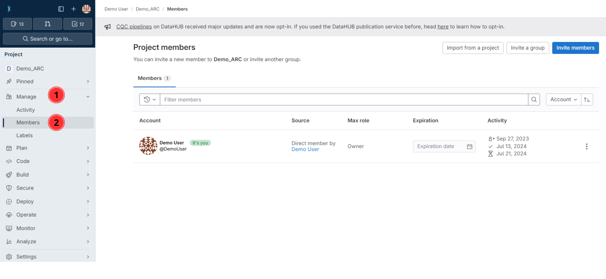

# Collaborate and share

---

# Invite collaborators

* Unless changed, your ARC is set to private by default.
* To collaborate, you can invite lab colleagues or project partners to your ARC by following the steps on the subsequent slides. 
* To get started [sign in](https://auth.nfdi4plants.org/realms/dataplant/login-actions/registration?client_id=account&tab_id=4bQkU161waI) to the DataHUB and open the ARC you want to share.

---

1. Click on **Project Information** in the left navigation panel

---

2. Click on **Members**

---

3. Click on **Invite members**

---

4. Search for potential collaborators

---

5. Select a role

---

# Choosing the proper role

<u>Guests</u>
Have the least rights. They will not be able to see the content of your ARC (only the wiki page).

<u>Reporters</u>
Have **read access** to your ARC. This is recommended for people you ask for consultancy.

<u>Developers</u>
The choice for most people you want to invite to your ARC. Developers have **read and write access**, but cannot maintain the project on the DataHUB, e.g. inviting others.

<u>Maintainers</u> 
Gives the person the same rights as you have (except of removing you from your own project). This is recommended for inviting PIs or group leaders allowing them to add their group members for data upload or analysis to the project as well.

*A detailed list of all permissions for the individual roles can be found [here](https://docs.gitlab.com/ee/user/permissions.html)*

---

# 
Congratulations!

You have just shared your ARC with a collaborator.

---

# Project Management

- Issues

---

# Version control

- Commit history