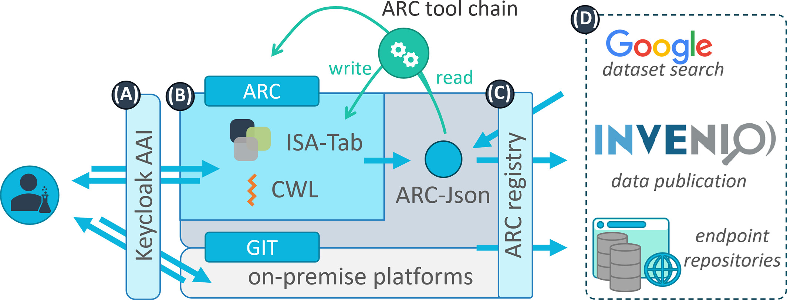

# Annotated Research Contexts (ARCs)

<!--  _color: white; -->
<!-- _paginate: false -->

### *A FAIR RDM journey along a (mutable) data life cycle*

 
Tag der Forschungsdaten in NRW 2023

November 14th, 2023
Dominik Brilhaus, CEPLAS Data Science & Data Management

---

# Data Stewardship between DataPLANT and the community  <!-- fit -->

---

# The research data life cycle

 

https://rdmkit.elixir-europe.org, [CC BY 4.0](https://creativecommons.org/licenses/by/4.0/)

---

# Annotated Research Context (ARC)

---

# What does an ARC look like?

---

# ARCs store experimental data

---

# Computations can be run inside ARCs

---

# ARCs come with comprehensive metadata

---

# ARC builds on standards

https://isa-tools.org/ | https://www.commonwl.org/
https://www.researchobject.org/ro-crate/ | https://git-scm.com

---

<!-- _paginate: false -->

---

# Collect 

<!-- 

- create study folder
  - take a picture (add more demo pictures)
- create assay folder
  - add fastq data

-->

---

# Process (e.g. annotate)  

<!-- 

- annotate plant samples
- annotate rnaseq extraction -->

---

# Analyse 

<!-- 
- run fastqc
- receive back results
-->

 Weil, H.L., Schneider, K., et al. (2023), PLANTdataHUB: a collaborative platform for continuous FAIR data sharing in plant research. Plant J. https://doi.org/10.1111/tpj.16474 

---

# Preserve  

<!--
1. Validation: CQC on each DataHUB commit
2. Publication: DOI
-->

 adapted from Weil, H.L., Schneider, K., et al. (2023), PLANTdataHUB: a collaborative platform for continuous FAIR data sharing in plant research. Plant J. https://doi.org/10.1111/tpj.16474 

---

# Preserve and publish 

<!--
1. Validation: CQC on each DataHUB commit
2. Publication: DOI
-->

 Weil, H.L., Schneider, K., et al. (2023), PLANTdataHUB: a collaborative platform for continuous FAIR data sharing in plant research. Plant J. https://doi.org/10.1111/tpj.16474 

---

# Share and collaborate 

---

# Reuse 

<!-- 
- via ARC https://arcregistry.nfdi4plants.org/arcsearch
- via ISA https://arcregistry.nfdi4plants.org/isasearch 
-->

 Weil, H.L., Schneider, K., et al. (2023), PLANTdataHUB: a collaborative platform for continuous FAIR data sharing in plant research. Plant J. https://doi.org/10.1111/tpj.16474 

---

# **Mutable** data life cycle

<!-- 

- Invite other (demo) account
- add notes from there
-->

 Weil, H.L., Schneider, K., et al. (2023), PLANTdataHUB: a collaborative platform for continuous FAIR data sharing in plant research. Plant J. https://doi.org/10.1111/tpj.16474 

---

# Plan &ndash; ARC scale 

 Weil, H.L., Schneider, K., et al. (2023), PLANTdataHUB: a collaborative platform for continuous FAIR data sharing in plant research. Plant J. https://doi.org/10.1111/tpj.16474 

<!--
 
 - **ARCitect**: Create empty ARC
   - description
   - author
     - first name
     - last name
     - email
 - **ARCitect**: Upload ARC to DataHUB
 - **DataHUB**
   - Discuss, collect meeting minutes in Wiki
   - design / plant investigation (datahub wiki, issues)

-->

---

# Plan  &ndash; proposal scale 

**Zhou *et al.* (2023)**, DataPLAN: a web-based data management plan generator for the plant sciences, bioRxiv 2023.07.07.548147; doi: https://doi.org/10.1101/2023.07.07.548147 

https://dmpg.nfdi4plants.org

---

# The ARC ecosystem

---

# The ARC ecosystem

---

# The ARC ecosystem

---

---

# Contributors

Slides presented here include contributions by

- name: Dominik Brilhaus
  github: https://github.com/brilator
  orcid: https://orcid.org/0000-0001-9021-3197
- name: Cristina Martins Rodrigues
  github: https://github.com/CMR248
  orcid: https://orcid.org/0000-0002-4849-1537
- name: Martin Kuhl
  github: https://github.com/Martin-Kuhl
  orcid: https://orcid.org/0000-0002-8493-1077
