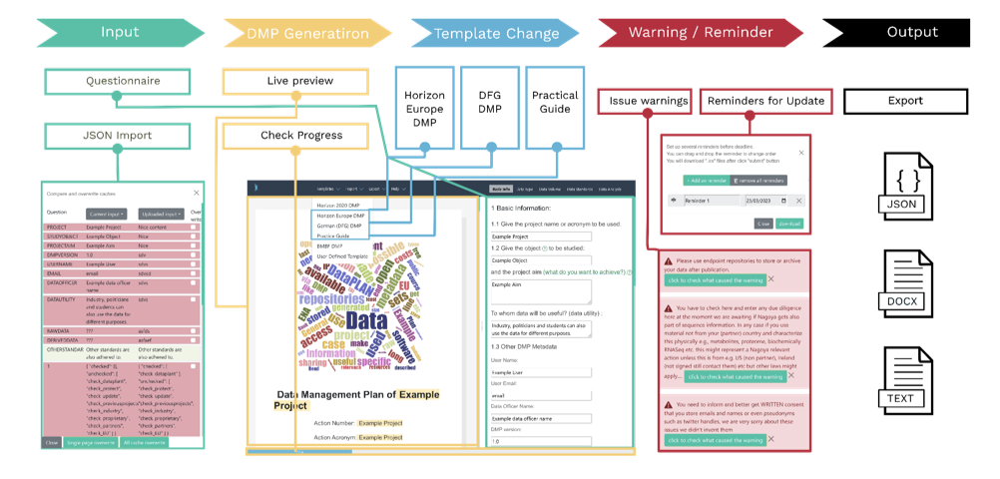
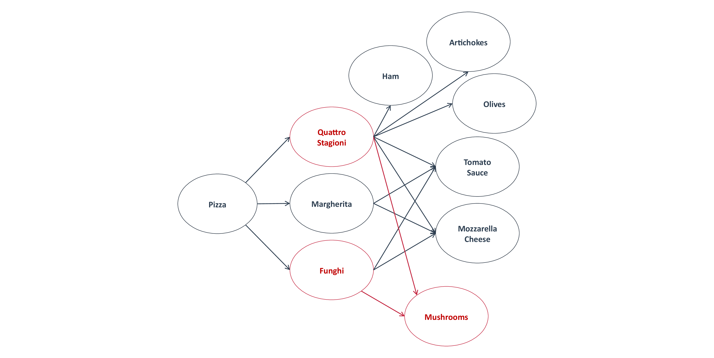
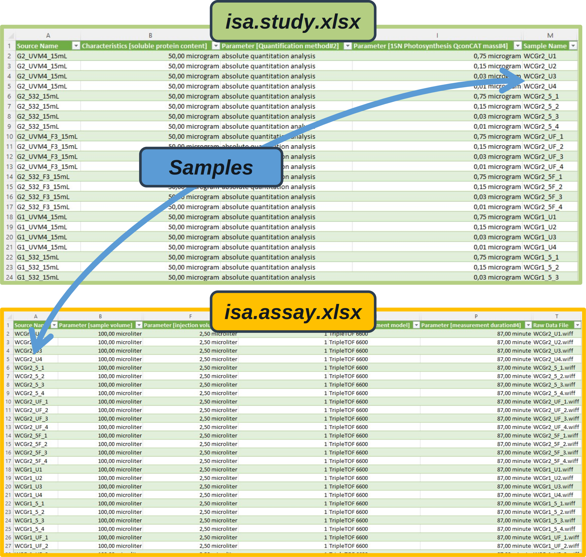
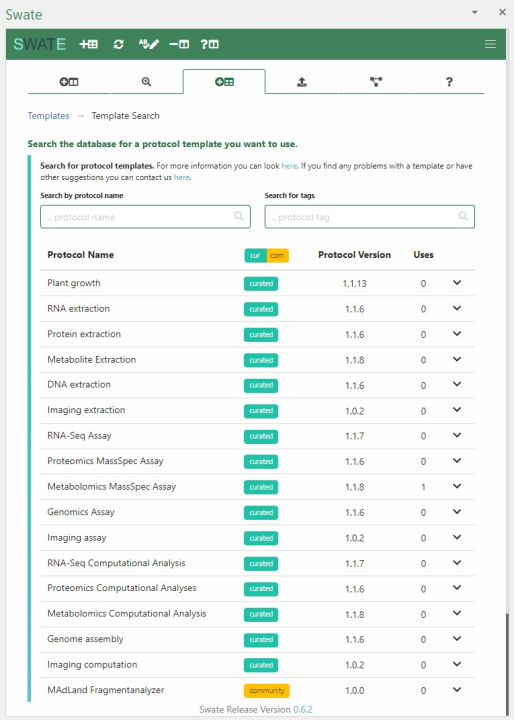
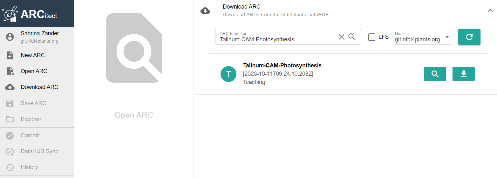
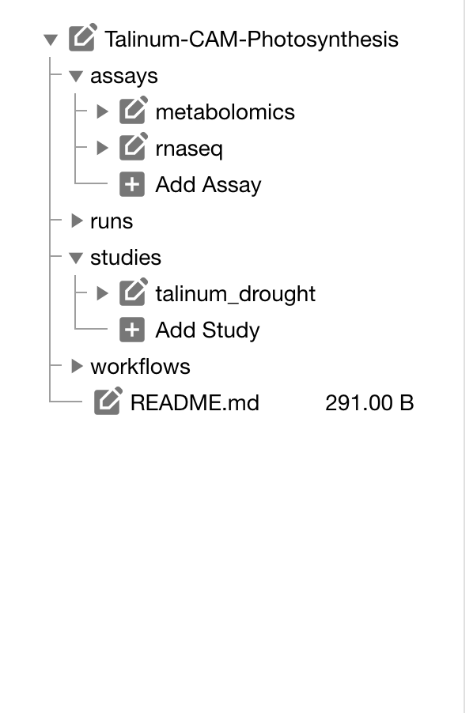
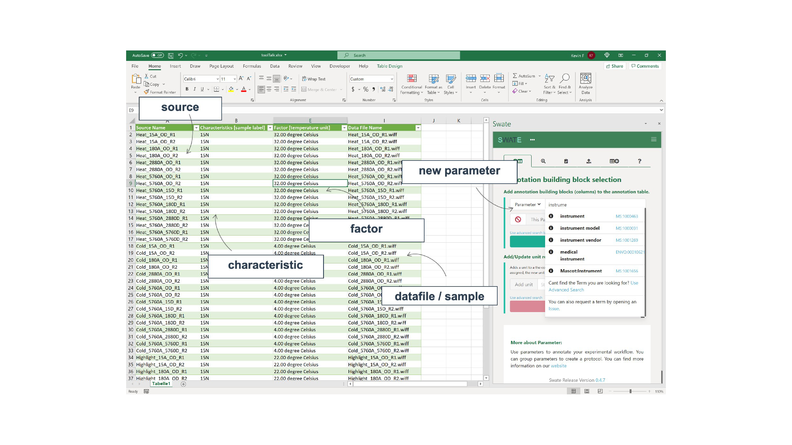

# The ARC Club

<!--  _color: white; -->
<!-- _paginate: false -->
<style scoped>section {background: none; background-color: white;}</style>

<br>

November 15<sup>th</sup>, 2023
Dominik Brilhaus, CEPLAS Data Science


---

# Get-to-know

- Lab
- CEPLAS / TRR / MibiNet / ?
- My favorite lab assay
- Used code / programming language before
- Have an ORCID
- My motivation / expectation

---

# House-keeping

Pad: https://pad.hhu.de/ZG0nGuRyRo2D0T0vHnkTpQ?view

- take notes
- ask questions
- copy / paste links, etc.
 
---

# Materials

Slides will be shared via DataPLANT knowledge base

---

# Tentative agenda

<style scoped>
.columns {
    display: grid;
    grid-template-columns: repeat(2, minmax(0, 1fr));
}
</style>

<div class="columns">
<div class="columns-left">

## Day 1

- Intro to ARC and demo
- ARCitect Hands-on
- Create your ARCs
- DataHUB Features

</div>

<div class="columns-right">

## Day 2

- ARC recap session
- ISA and Metadata
- Swate Hands-on
- Annotate data in your ARC

</div>
</div>

---

# The ARC Club  &ndash; Goals

- Move existing datasets into ARCs
- Share them via the DataHUB
- First few steps into ARCs
- You or collaborators can pick them up from there


---

# The ARC Club &ndash; Rules

1. You do not talk about **ARC Club**
2. You **do not** talk about **ARC Club**

---

# Rules: perfect is the enemy of good

- There is no perfect ARC
- There is no complete ARC
- The only bad ARCs are those that don't exist yet.

<br>

:rocket: Let's get started, the rest is easy :rocket:

---

# Let's draw a typical lab workflow from your lab :pencil: <!-- fit -->

---

# Resources

###  DataPLANT (nfdi4plants)

Website: <a href="https://nfdi4plants.org/" target="_blank">https://nfdi4plants.org/</a>
Knowledge Base: <a href="https://nfdi4plants.org/nfdi4plants.knowledgebase/" target="_blank">https://nfdi4plants.org/nfdi4plants.knowledgebase/</a>
DataHUB: <a href="https://git.nfdi4plants.org" target="_blank">https://git.nfdi4plants.org</a>


GitHub: <a href="https://github.com/nfdi4plants" target="_blank">https://github.com/nfdi4plants</a>
HelpDesk: <a href="https://helpdesk.nfdi4plants.org" target="_blank">https://helpdesk.nfdi4plants.org</a>

:bulb: You can help us by raising issues, bugs, ideas...

---

---

# Contributors

Slides presented here include contributions by

- name: Dominik Brilhaus
  github: https://github.com/brilator
  orcid: https://orcid.org/0000-0001-9021-3197

<!-- Source to slide(s) -->
<!-- ./../../../../img/10-WelcomeIntro.md -->


---

<style>

figcaption {
  font-size: 10px;
  font-style: italic;
}

.reference-bgright {
  font-size:15px;
  line-height: 1.2em;
  position: fixed;
  right: 0px;
  bottom: 0px;
  transform: translate(-50%, -50%);
  margin: 0 auto;
}

</style>

# The ARC ecosystem

<!--  _color: white; -->
<!-- _paginate: false -->

<style scoped>section {background: none; background-color: white;}</style>

### *A FAIR RDM journey along a (mutable) data life cycle*

<br>


---

# Data Stewardship between DataPLANT and the community  <!-- fit -->


---

# The research data life cycle

<br>


<span class="footer-reference">https://rdmkit.elixir-europe.org, [CC BY 4.0](https://creativecommons.org/licenses/by/4.0/)</span>

---

# Annotated Research Context (ARC)


---

# What does an ARC look like?


---

# ARCs store experimental data


---

# Computations can be run inside ARCs


---

# ARCs come with comprehensive metadata


---

# ARC builds on standards


<span class="footer-reference">https://isa-tools.org/ | https://www.commonwl.org/
https://www.researchobject.org/ro-crate/ | https://git-scm.com</span>

---

<!-- _paginate: false -->

<style scoped>section {background: none; background-color: white;}</style>

---


# Collect 


<!-- 

- create study folder
  - take a picture (add more demo pictures)
- create assay folder
  - add fastq data

-->

---

# Process (e.g. annotate)  

<style scoped>

section p img {
width: 900px;
height: 400px;
object-fit: cover;
object-position: 50% 60%;
/* display: block; */;
}
</style>


<!-- 

- annotate plant samples
- annotate rnaseq extraction -->

---

# Analyse 

<!-- 
- run fastqc
- receive back results
-->


<span class="footer-reference"> Weil, H.L., Schneider, K., et al. (2023), PLANTdataHUB: a collaborative platform for continuous FAIR data sharing in plant research. Plant J. https://doi.org/10.1111/tpj.16474 </span>

---

# Preserve  

<!--
1. Validation: CQC on each DataHUB commit
2. Publication: DOI
-->


<span class="footer-reference"> adapted from Weil, H.L., Schneider, K., et al. (2023), PLANTdataHUB: a collaborative platform for continuous FAIR data sharing in plant research. Plant J. https://doi.org/10.1111/tpj.16474 </span>

---

# Preserve and publish 

<!--
1. Validation: CQC on each DataHUB commit
2. Publication: DOI
-->


<span class="footer-reference"> Weil, H.L., Schneider, K., et al. (2023), PLANTdataHUB: a collaborative platform for continuous FAIR data sharing in plant research. Plant J. https://doi.org/10.1111/tpj.16474 </span>

---

# Share and collaborate 


---

# Reuse 


<!-- 
- via ARC https://arcregistry.nfdi4plants.org/arcsearch
- via ISA https://arcregistry.nfdi4plants.org/isasearch 
-->

<span class="footer-reference"> Weil, H.L., Schneider, K., et al. (2023), PLANTdataHUB: a collaborative platform for continuous FAIR data sharing in plant research. Plant J. https://doi.org/10.1111/tpj.16474 </span>

---

# **Mutable** data life cycle


<!-- 

- Invite other (demo) account
- add notes from there
-->

<span class="footer-reference"> Weil, H.L., Schneider, K., et al. (2023), PLANTdataHUB: a collaborative platform for continuous FAIR data sharing in plant research. Plant J. https://doi.org/10.1111/tpj.16474 </span>

---

# Plan &ndash; ARC scale 


<span class="footer-reference"> Weil, H.L., Schneider, K., et al. (2023), PLANTdataHUB: a collaborative platform for continuous FAIR data sharing in plant research. Plant J. https://doi.org/10.1111/tpj.16474 </span>

<!--
 
 - **ARCitect**: Create empty ARC
   - description
   - author
     - first name
     - last name
     - email
 - **ARCitect**: Upload ARC to DataHUB
 - **DataHUB**
   - Discuss, collect meeting minutes in Wiki
   - design / plant investigation (datahub wiki, issues)

-->

---

# Plan  &ndash; proposal scale 

<span class="footer-reference">**Zhou *et al.* (2023)**, DataPLAN: a web-based data management plan generator for the plant sciences, bioRxiv 2023.07.07.548147; doi: https://doi.org/10.1101/2023.07.07.548147 </span>

https://dmpg.nfdi4plants.org



---

# The ARC ecosystem


---

# The ARC ecosystem


---

# The ARC ecosystem


---

---

# Contributors

Slides presented here include contributions by

- name: Dominik Brilhaus
  github: https://github.com/brilator
  orcid: https://orcid.org/0000-0001-9021-3197
- name: Cristina Martins Rodrigues
  github: https://github.com/CMR248
  orcid: https://orcid.org/0000-0002-4849-1537
- name: Martin Kuhl
  github: https://github.com/Martin-Kuhl
  orcid: https://orcid.org/0000-0002-8493-1077

<!-- Source to slide(s) -->
<!-- ./../../../../img/20-ARC-ecosystem-demo.md -->


---

# ARCitect hands-on

<style scoped>section {background: none; background-color: white}</style>
<!-- _paginate: false -->

---

# ARCitect installation

Please install version **v0.0.10** of the ARCitect: https://github.com/nfdi4plants/ARCitect/releases/tag/v0.0.10

:fire: (released September 20th, 2023) :fire:

---

## Download the demo data <!-- fit -->

https://nfdi4plant.sharepoint.com/:f:/s/Teaching/Eik7k-oJiMREgZ24kto7sIYBGxHmmZlS_Kzf7psk-5w-xg?e=u0sADd


---

# Sort Demo data in an ARC


---

# Open ARCitect

1. Login to DataHUB (1)
   

---

# Initiate the ARC folder structure


1. Create a **New ARC** (2)
2. Select a location and name it **TalinumPhotosynthesis**

---

# Your ARC's name

<style scoped>section {font-size: 25px;}</style>

💡 By default, your ARC's name will be used
   - for the ARC folder on your machine
   - to create your ARC in the DataHUB at `https://git.nfdi4plants.org/<YourUserName>/<YourARC>` (see next steps)
   - as the identifier for your investigation

💡 Make sure that no ARC exists at  `https://git.nfdi4plants.org/<YourUserName>/<YourARC>`. Otherwise you will sync to that ARC.

💡Don't use spaces in ARC's name


---

# Add a description to your investigation


---

# Add a contributor


---

# Add a study

by clicking "Add Study" and entering an identifier for your study

Use **talinum_drought** as an identifier


---

# Study panel

In the study panel you can add

- general metadata,
- people, and
- publications
- data process information


---


# Add an assay

by clicking "Add Assay" and entering an identifier for your assay

Add two assays with **rnaseq** and **metabolomics** as an identifier


---

# Link your assay to a study

You can either
- link your new assay to an existing study in your ARC or
- create a new one
  
Link your assays to your **talinum_drought** study


---

# Add information about your assay

In the assay panel you can

1. link or unlink the assay to studies, and
2. define the assay's
   - measurement type
   - technology type, and
   - technology platform.
3. add data process information


---

# Add protocols

You can either
- directly write a **new protocol** within the ARCitect or
- import an existing one from your computer


---

# Add protocols and datasets

In the file tree you can
  - **add a dataset** and 
  - **protocols** associated to that dataset.

:bulb: **Add Dataset** allows to import data from any location on your computer into the ARC.

:warning: Depending on the file size, this may take a while. Test this with a small batch of files first.

<!-- Demo dataset cannot be added via add dataset. Only individual files can be added, not multiple folders -->


---

# Sort Demo Data to your ARC

💡 protocols can directly be imported via ARCitect

💡 to add multiple datasets folders, they have to be added manually via file browser

---

# Login to the DataHUB

Click **Login** (1) in the sidebar to login to the DataHUB.

:bulb: This automatically opens your browser at the DataHUB (https://git.nfdi4plants.org) and asks you to login, if you are not already logged in. 


---

# Upload your local ARC to the DataHUB

From the sidebar, navigate to **Versions** (6)


---

# Versions

The versions panel allows you to
- store the local changes to your ARC in form of "commits",
- sync the changes to the DataHUB, and
- check the history of your ARC


---

# Connection to the DataHUB

If you are logged in, the versions panel shows
- your DataHUB's *Full Name* and *eMail*
- the URL of the current ARC in the DataHUB `https://git.nfdi4plants.org/<YourUserName>/<YourARC>`


---

# Check if your ARC is successfully uploaded

1. [sign in](https://auth.nfdi4plants.org/realms/dataplant/login-actions/registration?client_id=account&tab_id=4bQkU161waI) to the DataHUB 
2. Check your projects

---

# Your ARC is ready

<style scoped>

section p br {
   display: block;
   margin-top: 20px;
   content: "";
}
</style>

👩‍💻 Initiated an ARC
<br>
📂 Structured and ...  
<br>
 ... annotated experimental data
<br>
🌐 Shared with collaborators


---

---

# Received two emails from "GitLab" about a failed pipeline? <!-- fit -->


:fire: Don't worry :smile:

---

## Pipeline Failed


- a "continuous quality control" (CQC) pipeline validates your ARC
- This fails if one of the following metadata items is missing:

    ```bash
    Investigation Identifier
    Investigation Title
    Investigation Description
    Investigation Person Last Name
    Investigation Person First Name
    Investigation Person Email
    Investigation Person Affiliation
    ```  

---

## Pipeline Failed

If the pipeline has failed once, it is disabled by default


---

## Reactivate the CQC pipeline

<style scoped>
section {font-size: 22px;}
</style>

To reactivate it and let the DataHUB validate your ARC again:
  
  1. navigate to CI/CD setting `<arc-url>/-/settings/ci_cd`
  2. expand "Auto DevOps"
  3. check box "Default to Auto DevOps pipeline"
  4. Save changes


---

---

# Contributors

Slides presented here include contributions by

- name: Dominik Brilhaus
  github: https://github.com/brilator
  orcid: https://orcid.org/0000-0001-9021-3197
- name: Cristina Martins Rodrigues
  github: https://github.com/CMR248
  orcid: https://orcid.org/0000-0002-4849-1537
- name: Sabrina Zander
  github: https://github.com/SabrinaZander
  orcid: https://orcid.org/0009-0000-4569-6126

<!-- Source to slide(s) -->
<!-- ./../../../../img/26-ARCitect-HandsOn.md -->


---

# DataPLANT DataHUB

---

# ARC builds on standards + Git


---

# The DataPLANT DataHUB &ndash; a GitLab ***Plus***


---


---


---


---


---


---


---


---

# **Mutable** data life cycle


<!-- 

- Invite other (demo) account
- add notes from there
-->

<span class="footer-reference"> Weil, H.L., Schneider, K., et al. (2023), PLANTdataHUB: a collaborative platform for continuous FAIR data sharing in plant research. Plant J. https://doi.org/10.1111/tpj.16474 </span>

---

# Project management


<span class="footer-reference"> Weil, H.L., Schneider, K., et al. (2023), PLANTdataHUB: a collaborative platform for continuous FAIR data sharing in plant research. Plant J. https://doi.org/10.1111/tpj.16474 </span>

---

---

# Contributors

Slides presented here include contributions by

- name: Dominik Brilhaus
  github: https://github.com/brilator
  orcid: https://orcid.org/0000-0001-9021-3197
- name: Cristina Martins Rodrigues
  github: https://github.com/CMR248
  orcid: https://orcid.org/0000-0002-4849-1537

<!-- Source to slide(s) -->
<!-- ./../../../../img/42-DataHUB.md -->


---

# DataHub Hands-On

---

# Navigation Bar


1. navigate directly to the [projects panel](./../../../../img/../../../../../img/../../../../../img/../DataHUB-Manual/datahub-Manual/datahub-projectsPanel.html) via the icon in the top-left (1)
2. open the [hamburger Menu](#hamburger-menu) (2)
3. use the search field (3) to find ARCs, users and groups
4. open the [avatar Menu](#avatar-menu) (4)

---

# Hamburger Menu

1. From the hamburger menu (1) you can
2. navigate to the [projects](./../../../../img/../../../../../img/DataHUB-Manual/datahub-projectsPanel.html) (2)
3. or [groups](datahub-groupsPanel.html) (3) panels


---

# Avatar Menu

1. In the avatar menu (1) you can
2. find your profile name and user name (2), 
3. navigate to the [user settings](./../../../../img/../../../../../img/DataHUB-Manual/datahub-userSettings.html) (3) 
4. or sign out (4) of the DataHUB.


---

# Projects Panel


1. Choose a tab (1) to see only your ARCs, or explore other publicly available ARCs. 
2. The main panel (2) lists all ARCs
3. Here you can also see, the visibility level (3), and 
4. your permission or role (4) for the listed ARC. 
5. You can create a **New Project** in the top-right corner (5).

---

# ARC Panel

The ARC Panel is the main working area for your ARC.


---

# ARC Panel &ndash; sidebar <!-- fit -->

<style scoped> section {font-size: 23px;} </style>


1. access the project information (1), e.g. invite members to the ARC
2. follow the progress of your ARC repository (2),
3. organize tasks in issue lists and boards (3),
4. take notes in a wiki to your ARC (4),
5. adapt the [settings (5) of the ARC](datahub-ARCSettings.html).

---

# ARC Panel &ndash; main panel <!-- fit -->

<style scoped> section {font-size: 23px;} </style>


6. see the ARC's name and visibility level (6),
7. follow the ARC's commit history (7),
8. see files contained in your ARC just like on your computer (8),
9. add new files or directories (9), and
10. download or clone your ARC (10).

---

# Collaborate and share


---

# Invite collaborators

* Unless changed, your ARC is set to private by default.
* To collaborate, you can invite lab colleagues or project partners to your ARC by following the steps on the subsequent slides. 
* To get started [sign in](https://auth.nfdi4plants.org/realms/dataplant/login-actions/registration?client_id=account&tab_id=4bQkU161waI) to the DataHUB and open the ARC you want to share.

---

1. Click on **Project Information** in the left navigation panel


---

2. Click on **Members**


---

3. Click on **Invite members**


---

4. Search for potential collaborators


---

5. Select a role


---

# Choosing the proper role

<style scoped> section{font-size: 22px;}</style>

<u>Guests</u>
Have the least rights. They will not be able to see the content of your ARC (only the wiki page).

<u>Reporters</u>
Have **read access** to your ARC. This is recommended for people you ask for consultancy.

<u>Developers</u>
The choice for most people you want to invite to your ARC. Developers have **read and write access**, but cannot maintain the project on the DataHUB, e.g. inviting others.

<u>Maintainers</u> 
Gives the person the same rights as you have (except of removing you from your own project). This is recommended for inviting PIs or group leaders allowing them to add their group members for data upload or analysis to the project as well.

*A detailed list of all permissions for the individual roles can be found [here](https://docs.gitlab.com/ee/user/permissions.html)*

---

# <div align="center">Congratulations!</div>
<div align="center">You have just shared your ARC with a collaborator.</div>

<style scoped>

section p img {
width: 1000px;
height: 300px;
object-fit: cover;
object-position: 100% 45%;
/* display: block; */;
}
</style>


---


# Version control

- Commit history

---

# Project Management

- Issues

---

# ARCs come with their own wiki space

- directly associated to your ARC
- same access rights as your ARC
- share meeting minutes or ideas with collaboration partners
- keep ARC clean of files that are not considered "research data"


---

---

# Contributors

Slides presented here include contributions by

- name: Dominik Brilhaus
  github: https://github.com/brilator
  orcid: https://orcid.org/0000-0001-9021-3197
- name: Cristina Martins Rodrigues
  github: https://github.com/CMR248
  orcid: https://orcid.org/0000-0002-4849-1537

<!-- Source to slide(s) -->
<!-- ./../../../../img/43-DataHUB-HandsOn.md -->


---

# Metadata and ISA

---

# What is <br> **metadata**?

<style scoped>
section {
  text-align: center;
  background: #F9CD69;
}
section::after {
  display: none;
}
footer {
  display: none;
}
</style>

<!-- 
Exercise: Association map

Online: Let participants annotate (via video conference tool)
Presence: Draw map on (white) board

-->

---

# Viola's PhD Project

Exercise: Take 5 minutes to note down the metadata

<style scoped>
section {
  text-align: justify;  
}
</style>

Viola investigates the effect of the plant circadian clock on sugar metabolism in *W. mirabilis*. For her PhD project, which is part of an EU-funded consortium in Prof. Beetroot's lab, she acquires seeds from a South-African botanical society. Viola grows the plants under different light regimes, harvests leaves from a two-day time series experiment, extracts polar metabolites as well as RNA and submits the samples to nearby core facilities for metabolomics and transcriptomics measurements, respectively. After a few weeks of iterative consultation with the facilities' heads as well as technicians and computational biologists involved, Viola receives back a wealth of raw and processed data. From the data she produces figures and wraps everything up to publish the results in the Journal of Wonderful Plant Sciences.

---

# Metadata everywhere

<style scoped>
section {
  text-align: justify;  
}
</style>

`Viola` investigates the `effect of the plant circadian clock` on `sugar metabolism` in *`W. mirabilis`*. For her `PhD project`, which is part of an `EU-funded consortium` in `Prof. Beetroot's lab`, she acquires `seeds` from a `South-African botanical society`. Viola `grows the plants` under `different light regimes`, harvests `leaves` from a `two-day time series experiment`, extracts `polar metabolites` as well as `RNA` and submits the samples to nearby `core facilities for metabolomics and transcriptomics` measurements, respectively. `After a few weeks` of iterative consultation with the facilities' heads as well as `technicians` and `computational biologists` involved, Viola receives back a wealth of `raw and processed data`. From the data she `produces figures` and wraps everything up to `publish the results in the Journal of Wonderful Plant Sciences`.

---

# Project metadata

<style scoped>
.columns {
    display: grid;
    grid-template-columns: repeat(3, minmax(0, 1fr));
    gap: 1rem;
}
ul {
    margin: 5; padding: 0;
}
</style>

<div class="columns">
<div class="columns-left">

### project design

- researcher
- institute and project
- biological context
- research question
- purpose of data collection
- ...

</div>
<div class="columns-right">

### experimental processes

- origin and nature of the biological material
- lab protocols
- instrument model
- ...

</div>

<div class="columns-right">

### data-analytical processes

- algorithms
- tools
- software versions and dependencies employed
- ...

</div>
</div>

---

# Other types of metadata

<style scoped>
.columns {
    display: grid;
    grid-template-columns: repeat(3, minmax(0, 1fr));
    gap: 1rem;
}
ul {
    margin: 5; padding: 0;
}
</style>

<div class="columns">
<div class="columns-left">

### bibliographic

- Title
- Publication date and title
- Description
- Author
- Contacts
- Keywords
- ...

</div>
<div class="columns-right">

### legal or administrative

- data origin, ownership, rovenance,
- licensing
- ethical aspects
- ...

</div>

<div class="columns-right">

### technical

- expected data volume
- storage location
- file formats
- ...

</div>
</div>

---

# Metadata from a FAIR perspective

<style scoped>
.columns {
    display: grid;
    grid-template-columns: repeat(2, minmax(0, 1fr));
    gap: 4rem;
}

</style>

<div class="columns">
<div class="columns-left">

**Findable**

- metadata names the content of the data
- basis for search engines
- makes it categorizable for people and machines

**Accessible**

- information about origin
- location of storage
- access rights

</div>

<div class="columns-right">

**Interoperable**

- metadata identifies software and file formats
- required conversions between file formats

**Reusable**

- obtain and reuse research data according to clear rules described in licenses

</div>
</div>

---

# Metadata "Standards"

Examples from [Minimum Information for Biological and Biomedical Investigations (MIBBI)](https://fairsharing.org/3518):

- MIAPPE | Minimum Information About a Plant Phenotyping Experiment <https://www.miappe.org>
- MIAME | Minimum Information About a Microarray Experiment <https://www.fged.org/projects/miame/>
- MIAPE | Minimum Information About a Proteomics Experiment <https://www.psidev.info/miape>
- MINSEQE | Minimum Information about a high-throughput SEQuencing Experiment <https://www.fged.org/projects/minseqe>

:bulb: Check out <https://fairsharing.org/> for more examples

---

# Metadata standards ≈ Checklists

- Determine (minimal) required information
- Usually **do not** determine the format (i.e. shape or file type)

---

# A small Interactive detour

-> favorite Movie

<!-- 

- let participant name a movie
- how do you find out the actors, director, release year, etc.? 
- => google.com
- google movie - see knowledge graph to the right
  - how does google know all that?!
- ===> schema.org

 -->

---

# How does google "know"?!


---

# Schemas and machine-readability

---

## Structured data and the internet

Schema.org

- create, maintain, and promote schemas for structured data on the Internet, on web pages, in email messages, ...
- Structured data can be used to ***mark up*** all kinds of items from products to events to recipes
- Communicate with search engines (-> SEO, search engine optimization)
- Enhance findability from search engine results
- Provide context to an ambigous webpage
- Metadata interoperability and standardization across all website using schema.org

--- 

## Structured data and the internet: Schema.org

<style scoped>
code {
    display: inline-block;
    width: 700px;
    font-size: 18px;
}
</style>

<https://schema.org/Person>

```json
<script type="application/ld+json">
{
  "@context": "https://schema.org",
  "@type": "Person",
  "address": {
    "@type": "PostalAddress",
    "addressLocality": "Seattle",
    "addressRegion": "WA",
    "postalCode": "98052",
    "streetAddress": "20341 Whitworth Institute 405 N. Whitworth"
  },
  "colleague": [
    "http://www.xyz.edu/students/alicejones.html",
    "http://www.xyz.edu/students/bobsmith.html"
  ],
  "email": "mailto:jane-doe@xyz.edu",
  "image": "janedoe.jpg",
  "jobTitle": "Professor",
  "name": "Jane Doe",
  "telephone": "(425) 123-4567",
  "url": "http://www.janedoe.com"
}
</script>
```

---

## JSON-LD

<style scoped>
code {
    display: inline-block;
    width: 700px;
}
</style>

JSON-LD = JavaScript Object Notation for Linked Data

```json
<script type="application/ld+json">
  {
    "@context": "https://schema.org",
    "@type": "SportsTeam",
    "name": "San Francisco 49ers",
    "member": {
      "@type": "OrganizationRole",
      "member": {
        "@type": "Person",
        "name": "Joe Montana"
      },
      "startDate": "1979",
      "endDate": "1992",
      "roleName": "Quarterback"
    }
  }
</script>
```

---

## RDFa

RDFa = Resource Description Framework in Attributes

```
<div vocab="http://schema.org/" typeof="SportsTeam">
  <span property="name">San Francisco 49ers</span>
  <div property="member" typeof="OrganizationRole">
    <div property="member" typeof="http://schema.org/Person">
      <span property="name">Joe Montana</span>
    </div>
    <span property="startDate">1979</span>
    <span property="endDate">1992</span>
    <span property="roleName">Quarterback</span>
  </div>
</div>
```

---

# Standards

### Dublin Core

<https://www.dublincore.org/schemas/>

### DataCite Schema

- Schema: <http://schema.datacite.org/meta/kernel-4.3/metadata.xsd>
- Full Example: <https://schema.datacite.org/meta/kernel-4.3/example/datacite-example-full-v4.xml>

---

## DataCite Schema: Simple Example

<style scoped>
code {
    /*display: inline-block;*/
    font-size: 12px;
}
</style>

```xml
...
  <identifier identifierType="DOI">10.5072/D3P26Q35R-Test</identifier>
  <creators>
    <creator>
      <creatorName nameType="Personal">Fosmire, Michael</creatorName>
      <givenName>Michael</givenName>
      <familyName>Fosmire</familyName>
    </creator>
    <creator>
      <creatorName nameType="Personal">Wertz, Ruth</creatorName>
      <givenName>Ruth</givenName>
      <familyName>Wertz</familyName>
    </creator>
    <creator>
      <creatorName nameType="Personal">Purzer, Senay</creatorName>
      <givenName>Senay</givenName>
      <familyName>Purzer</familyName>
    </creator>
  </creators>
  <titles>
    <title xml:lang="en">Critical Engineering Literacy Test (CELT)</title>
  </titles>
  <publisher xml:lang="en">Purdue University Research Repository (PURR)</publisher>
  <publicationYear>2013</publicationYear>
  <subjects>
    <subject xml:lang="en">Assessment</subject>
    <subject xml:lang="en">Information Literacy</subject>
    <subject xml:lang="en">Engineering</subject>
    <subject xml:lang="en">Undergraduate Students</subject>
    <subject xml:lang="en">CELT</subject>
    <subject xml:lang="en">Purdue University</subject>
  </subjects>
  <language>en</language>
  <resourceType resourceTypeGeneral="Dataset">Dataset</resourceType>
...
```

<https://schema.datacite.org/meta/kernel-4.3/example/datacite-example-dataset-v4.xml>

---

# Ontologies

---

# Ontology

(Sometimes also referred to "semantic model")

An ontology combines features of

- a **dictionary**,
- a **taxonomy**, and
- a **thesaurus**

---

## Dictionary

Alphabetically lists terms and their definitions
<br>

**Pizza**: *"a dish made typically of flattened bread dough spread with a savory mixture usually including tomatoes and cheese and often other toppings and baked"*

---

## Taxonomy

Hierarchy or classification


---

## Thesaurus

Dictionary of synonyms and relations
<br>

**Pizza** ≈ Lahmacun ≈ Focaccia ≈ Flammkuchen

---

# Ontology

- Structures a set of **concepts** in a particular area and the relations between them in a **graph-like manner**
- Can be used in disambiguation, defining hierarchies, a standard to define terms
- Define a common vocabulary of concepts and their relationships to **model** a particular domain while making it **machine understandable**

---

# The semantic triple


---

# Modeling a pizza menu


---

# Modeling a pizza menu


---

# Modeling a pizza menu


---

# Predicates have two directions


---

# Looking at the menu from a different perspective

An object of one triplet can be the subject to another


---

# (Towards) a knowledge graph


---

# Searching the menu

An ontology can be queried:

- *"name all pizzas with topping mushrooms"*



<!-- 
TODO: 
- This is actually not a proper ontology(!), but rather a knowledge graph (= ontology + data)

-->

---

# The Pizza Ontology

- Example from protege: <https://protege.stanford.edu/ontologies/pizza/pizza.owl>
- Visualize via WebVOWL <http://vowl.visualdataweb.org/webvowl.html>

---

# Example ontologies

### EDAM ontology

- Description: <http://edamontology.org/page>
- Browser: <https://edamontology.github.io/edam-browser>

### PECO ontology

- Human-readble: <https://www.ebi.ac.uk/ols/ontologies/peco>
- Raw (OWL): <http://purl.obolibrary.org/obo/peco.owl>

> Explore more examples
>
> - <https://www.ebi.ac.uk/ols/>
> - <https://bioportal.bioontology.org>

<!-- 
LIVE-Demo 
- Search an "interesting" term from PECO in browser (EBI OLS)
  - Example: 
    - plant exposure
       abiotic plant exposure
          physical plant exposure
            water environment exposure
              drought environment exposure
- Show the graph view (and expand it interactively)
- Mention that terms (subjects, objects) and properties (predicates) have "URIs", "PIDs"
- Show that terms can have alternative / external IDs and link to "outdated" ontologies

-->

---

# ARC builds on ISA


<https://isa-tools.org/format/specification.html>

---

# ARC builds on ISA


---

# isa.<>.xlsx files within ARCs


---

# Study and assay files are registered in the investigation file <!-- fit -->


---

# The output of a study or assay file can function as input for a new isa.assay.xlsx

Output building blocks:

- Sample Name
- Raw Data File
- Derived Data File



---

#


---

# Swate

---

# Annotation by flattening the knowledge graph


- Low-friction metadata annotation
- Familiar spreadsheet, row/column-based environment

---

# Annotation principle

<!-- <style scoped>
section p img{
  /* padding-left: 230px */
}  
</style> -->


- Low-friction metadata annotation
- Familiar spreadsheet, row/column-based environment

---

# Adding new building blocks (columns)


- Swate can be used for the annotation of **isa.study.xlsx and isa.assay.xlsx** files

---

# Annotation Building Block types <!--fit-->

<style scoped>

section{
    font-size: 25px
}

</style>


- Source Name (Input)
- Protocol Columns
  - Protocol Type, Protocol Ref
- Characteristic
- Parameter
- Factor
- Component
- Output Columns
  - Sample Name, Raw Data File, Derived Data File

Let's take a detour on [Annotation Principles](https://nfdi4plants.org/nfdi4plants.knowledgebase/docs/guides/isa_AnnotationPrinciples.html) | [slides](https://nfdi4plants.org/nfdi4plants.knowledgebase/docs/teaching-materials/units/AnnotationPrinciples/isa_AnnotationPrinciples-slides.html)

---

# Ontology term search

<style scoped>
h1{
  text-align: left
}
section {
  text-align: center;
}
</style>


Enable **related term directed search** to directly fill cells with child terms

---

# Fill your table with ontology terms


---

# Hierarchical combination of ontologies


<!-- combination of ISA (Characteristics, Parameter, Factor) and a biological or technological ontology (e.g. temperature, strain, instrument model) gives the flexibility to display an ontology term, e.g. temperature, as a regular process parameter or as the factor your study is based on (Parameter \[temperature\] or Factor \[temperature\]). -->

---

# Swate templates

---

# Checklists and Templates


Metadata standards or repository requirements can be represented as templates

<style scoped>
h1{
  text-align: left
}
section {
  text-align: center;
}
</style>

---

# Realization of lab-specific metadata templates


Facilities can define their most common workflows as templates

<style scoped>
h1{
  text-align: left
}
section {
  text-align: center;
}
</style>

---

# Directly import templates via Swate

- DataPLANT curated
- Community templates



---

---

# Contributors

Slides presented here include contributions by

- name: Dominik Brilhaus
  github: https://github.com/brilator
  orcid: https://orcid.org/0000-0001-9021-3197
- name: Martin Kuhl
  github: https://github.com/Martin-Kuhl
  orcid: https://orcid.org/0000-0002-8493-1077
  
<!-- Source to slide(s) -->
<!-- ./../../../../img/60-MetadataISA.md -->


---

# Swate hands-on

---

# Goals

- Get familiar with ISA metadata and Swate
- Annotate data in your ARC

---

## Check Swate installation

:ballot_box_with_check: Make sure [Swate is installed](./../../../../img/../../../../../img/SwateManual/Docs01-Installing-Swate.html):

1. Open Excel (online or Desktop)
2. Go to the `Insert` tab: Click the arrow next to "My Add-ins". There you should be able to select Swate.
3. Go to the `Data` tab: you should see the Swate (Core) add-in.

:bulb: Alternatively, you can use [Swate standalone](https://swate-alpha.nfdi4plants.org)  
(:warning: this is however *work in progress* and likely to change)

---

## Have a simple text editor ready

- Windows Notepad
- MacOS TextEdit

Recommended text editor with code highlighting, git support, terminal, etc: <a href="https://code.visualstudio.com/" target="_blank">Visual Studio Code</a>

---

## Download the demo data


1. Open the ARCitect
2. Login (1) to your DataHUB account
3. Navigate to **Download ARC** (4)

---

## Download the demo data

4. Search for **Talinum-CAM-Photosynthesis**
5. Click the download button, select a location and open the ARC.



:bulb: This is basically the ARC we created last session.

---

## Where we left off last time

👩‍💻 Initiated an ARC
📂 Structured and ...  
🌐 Shared with collaborators

<br>

**Today** we want to

 ... **annotate the experimental data**



---

# Swate hands-on with demo data

---

## Swate Overview



---

## Let's annotate the plant samples first

1. Navigate to the demo ARC. 
2. Open the lab notes `studies/talinum_drought/protocols/plant_material.txt` in a text editor. 
3. Open the empty `studies/talinum_drought/isa.study.xlsx` workbook in Excel.


---

## Create an annotation table

<br>

<style scoped>
.columns {
    /* grid-template-columns: repeat(2, minmax(0, 1fr)); */
    grid-template-columns: 500px 500px;
    gap: 30px;
    display: flex;
    justify-content: center;
}
</style>

<div class="columns">
<div class="columns-left">

Create a Swate annotation table via the <kbd>create annotation table</kbd> button in the yellow pop-up box *OR* click the <kbd>Create Annotation Table</kbd> quick access button.

<br>

> :bulb: Each table is by default created with one input (`Source Name`) and one output (`Sample Name`) column  

> :bulb: Only one annotation table can be added per Excel sheet

</div>

<div class="columns-right">
    
</div>

</div>

---

## Add a building block

1. Navigate to the *Building Blocks* tab via the navbar. Here you can add *Building Blocks* to the table.
2. Instead of *Parameter* select *Characteristic* from the drop-down menu (A)
3. Search for `organism` in the search bar (B). This search looks for suitable *Terms* in our *Ontology* database.
4. Select the Term with the id `OBI:0100026` and, 
5. Click <kbd>Add building block</kbd>.

> :bulb: This adds three columns to your table, one visible and **two** hidden.


---
## Insert values to annotate your data

1. Navigate to the *Terms* tab in the Navbar
2. In the annotation table, select any number of cells below `Characteristic [organism]`
3. Click into the search field in Swate.

> :bulb: You should see `organism` showing in a field in front of the search field  
> :bulb: The search will now yield results related to `organism`

4. In the search field, search for "Talinum fruticosum"
5. Select the first hit and click <kbd>Fill selected cells with this term</kbd>

---

## Add a building block with a unit

1. In the *Building Blocks* tab, select *Parameter*, search for `light intensity exposure` and select the term with id `PECO:0007224`.
2. Check the box for *This Parameter has a unit* and search for `microeinstein per square meter per second` in the adjacent search bar.
3. Select `UO:0000160`.
4. Click <kbd>Add building block</kbd>.

> :bulb: This adds four columns to your table, one visible and **three** hidden.

---

## Insert unit-values to annotate your data

In the annotation table, select any cell below `Parameter [light intensity exposure]` and add "425" as light intensity.

> :bulb: You can see the numbers being complemented with the chosen unit, e.g. `425.00 microeinstein per square meter per second`

---

## Showing ontology reference columns

Hold <kbd>Ctrl</kbd> and click the *Autoformat Table* quick access button to adjust column widths and un-hide all hidden columns.

> :bulb: You can see that your organism of choice was added with id and source Ontology in the reference (hidden) columns.  
> :warning: This feature is currently not supported on MacOS

---

## Update ontology reference columns

Click the <kbd>Update Ontology Terms</kbd> quick access buttons.

> :bulb: This updates all reference columns according to the main column. In this case the reference columns for `Parameter [light intensity exposure]` are updated with the id and source ontology of the `microeinstein per square meter per second` unit.

---

## Your ISA table is growing

At this point. Your table should look similar to this:


---

## Hiding ontology reference columns

Click the <kbd>Autoformat Table</kbd> quick access button without holding <kbd>Ctrl</kbd> to hide all reference columns.

---

## Exercise :pencil:

Try to add suitable *building blocks* for other pieces of metadata from the plant growth protocol (`studies/talinum_drought/protocols/plant_material.txt`).

---


## Let's annotate the RNA Seq data

1. Navigate to the demo ARC. 
2. Open the lab notes `assays/rnaseq/protocols/RNA_extraction.txt` in a text editor. 
3. Open the empty `assays/rnaseq/isa.assay.xlsx)` workbook in Excel.

---

## Use a template

1. Navigate to *Templates* in the Navbar and click *Browse database* in the first function block.

> :bulb: Here you can find community created workflow annotation templates

1. Search for `RNA extraction` and click <kbd>select</kbd> 
    - You will see a preview of all building blocks which are part of this template.
2. Click <kbd>Add template</kbd> to add all Building Blocks from the template to your table, which <u>do not exist yet</u>.


---

## Adding / Updating unit references

Sometimes you need to add or update the unit of an existing building block. 

1. Select any number of rows of the `Parameter [biosource amount]` building block to mark it for the next steps.
2. Open the *Building Blocks* tab
3. In the bottom panel "Add/Update unit reference to existing building block", search for the unit "milligram". Select the unit term and click <kbd>Update unit for cells</kbd>.
:bulb: If you already had values in the main column they will be updated automatically.
4. Click the *Update Ontology Terms* <a href="./../../../../img/img/Swate-Overlay-Exp.jpg" target="_blank">quick access button</a>, to update the reference columns.
   
---

## Remove building blocks

If there are any Building Blocks which do not fit your experiment you can use the <kbd>Remove Building Block</kbd> quick access button to remove it including all related (hidden) reference columns.

:warning: Due to the hidden reference columns, we recommend not to delete table columns via usual Excel functions. 

---

## New process, new worksheet

1. Add a new sheet to the `assays/rnaseq/isa.assay.xlsx)` workbook.
2. Add the template "RNASeq Assay"

---

## Exercise :pencil:

Try to fill the two sheets with the protocol details:
  - `assays/rnaseq/protocols/RNA_extraction.txt` and
  - `assays/rnaseq/protocols/Illumina_libraries.txt`

---

## Your ISA table is ready 🎉

Go ahead, adjust the Building Blocks you want to use to describe your experiment as you see fit.
Insert values using Swate Term search and add input and output.

---

## A small detour on "Excel Tables"

Swate uses Excel's "table" feature to annotate workflows. Each table represents one *process* from input (e.g. plant leaf material) to output (e.g. leaf extract).

Example workflows with three *processes* each:

- Plant growth &rarr; sampling &rarr; extraction
- Measured data files  &rarr; statistical analysis  &rarr; result files

> :bulb: Excel tables allow to group data that belongs together inside one sheet. This is not to be confused with a (work)sheet or workbook.
> ```bash
> workbook              (e.g. "isa.assay.xlsx")
>  └─── worksheet       (e.g. "plant_growth")
>           └─── table  (e.g. "annotationTable")

---

# :construction: Known issues with ARCitect and Swate (Nov 2023)

1. Annotation within ARCitect is not yet available.
2. Swate and ARCitect handle isa.study.xlsx / isa.assay.xlsx files differently.


---

---

# Contributors

Slides presented here include contributions by

- name: Dominik Brilhaus
  github: https://github.com/brilator
  orcid: https://orcid.org/0000-0001-9021-3197
- name: Kevin Frey
  github: https://github.com/Freymaurer
  orcid: https://orcid.org/0000-0002-8493-1077
- name: Martin Kuhl
  github: https://github.com/Martin-Kuhl
  orcid: https://orcid.org/0000-0002-8493-1077
- name: Sabrina Zander
  orcid: https://orcid.org/0009-0000-4569-6126

<!-- Source to slide(s) -->
<!-- ./../../../../img/70-Swate-HandsOn.md -->


---

# The ARC Club

Happy ARCing

---

## Moving from FileShare to DataHUB &ndash; *via* ARCs


---

## Assign projects


---

## Rough routine for each project

1. Identify the available data and resources
2. Create the ARC
3. Add metadata and data
4. Share via DataHUB group

---

## Low(er) hanging fruits: published projects

1. Add the authors
2. Add the publication(s)
   1. Add citation and DOI
   2. Add supplemental
   3. Convert M&M to *protocols*
3. Reference data in public repositories
4. Add large data (e.g. from file share)
5. Set ARC to **public!**

---

## More challenging ARCs

- (unpublished) left-overs of colleagues who have since moved
- unclear status

---

## Collect / derive as much info about the **investigation** as possible

**MUST** haves

```yaml
Investigation Identifier
Investigation Title
...
Investigation Publication Status
...
Investigation Person Last Name
Investigation Person First Name
```

:bulb: This and more investigation-level info can be collected in the ARC's `isa.investigation.xlsx`

---

## Create and share the ARC

```bash
arc init
arc sync -f -r https://git.nfdi4plants.org/<GroupName>/<InvestigationID>
```

---

## Copy data

1. **Copy** data to the ARC, do not **move** data from original source  
(we'll take care of that later)
2. Ideally use `rsync` rather than copying manually
3. Ideally use `md5` or `md5sum` to check for correct file transfer

:bulb: Ask the coders for help!

---

## Perspective and administration in the future

---

## Administration / Backup


<!-- Source to slide(s) -->
<!-- ./../../../../img/90-ARCing.md -->


