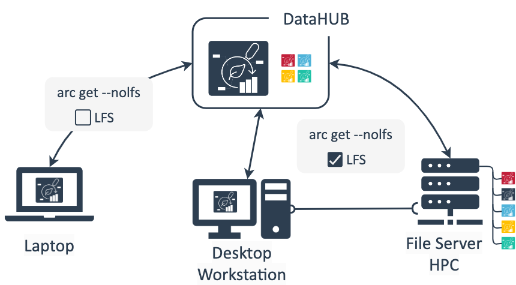

# Where do I store my ARC?

---

# ARC storage and sharing

---

# ARC storage and sharing

- DataHUB as "ground truth" / original clone
- You can sync and communicate all changes to your ARC via the DataHUB

 :bulb: ARCitect and ARC commander provide options to avoid syncing large files (LFS = Large file storage) 

---

  

  
  - Personal computer
    - work on small files
    - annotate metadata
    - add scripts
    - add protocols
  
  - Workstation / Server
    - work on large files
    - run analyses
  
  

  
  

  
  - FileShare
    - mount to local machine and arc sync
  
  - HPC
    - direct connection HPC to DataHUB (depends on security settings)
    - or mount to local machine and arc sync from there
  
  

