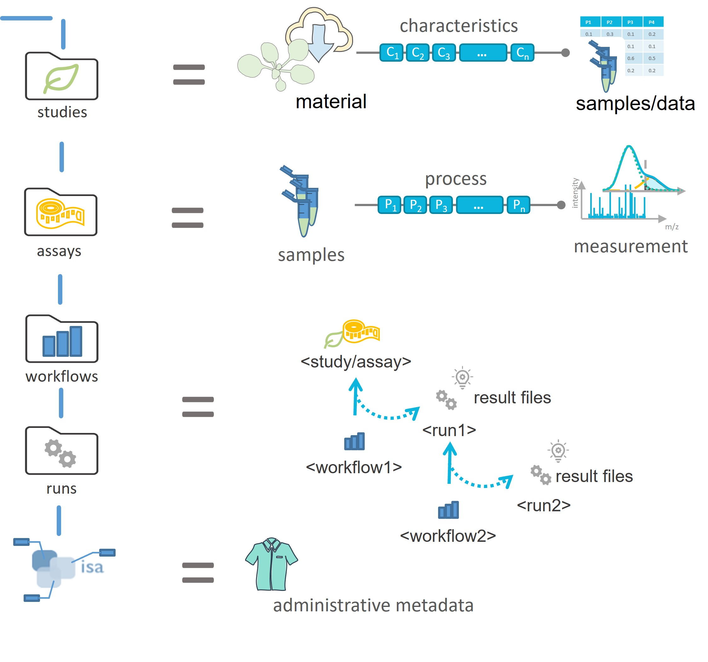

# The ARC Club

a two-day adventure to prepare your lab for the ARC universe

## Annotated Research Context (ARC)

<!--  -->

<!--  -->

## The ARC &ndash; a package for your research data

## The DataHUB &ndash; a place to share your ARCs

 <!-- <iframe src="https://git.nfdi4plants.org/explore" width="1100" height="400"></iframe> -->

## The goal

- Data ingest
- Only the first few steps into ARCs

<!--  TODO -->

Draw image: lift project over the line: below / above : with / without ARC.
Above line => Autobahn / Rocket / project liftin off (into a good future)

Starting point

## The Rules

You do not talk about **ARC Club**

## The Rules: perfect is the enemy of good

- There is no perfect ARC
- There is no complete ARC
- The only bad ARCs are those that don't exist yet.

## The Game

- More ARCs 

## The Setting

- Good internet connection
- Isolated from lab // office // daily duties
- Access to the data to be ARCified (file share, hard disks)
- Agile, communicative, collaborative, positive

## Schedule

### Day 1

Time | Content
--- | ---
Morning | - Tech-check (Installation)   - Intro ARC, ARC Commander & DataHUB   - hands-on with dummy data
Lunch | *tbd*
Afternoon | - Discuss / assign projects   - Start creating ARCs
Evening | *tbd*

### Day 2

Time | Content
--- | ---
Morning | - Present project status   - Intro Swate   - hands-on with dummy data
Lunch | *tbd*
Afternoon | - Discuss / assign projects   - Start creating ARCs
Evening | *tbd*

## Preparation

- DataHUB user accounts https://register.nfdi4plants.org/
- DataHUB user group: https://git.nfdi4plants.org/hhu-plant-biochemistry
- Installation
  - [ARC Commander](https://nfdi4plants.org/nfdi4plants.knowledgebase/docs/ArcCommanderManual/index-setup.html)
  - [Swate](https://nfdi4plants.org/nfdi4plants.knowledgebase/docs/SwateManual/Docs01-Installing-Swate.html)
- List of projects to be ARCified
  - @Nicole, @Urte, @Dominik

## "easy" catches

- published data
- why even ARC them?

## more challanging ARCs

- (unpublished) left-overs of colleagues who have since moved

## Your motivation

- You've needed data before, now is your chance to make data available
- Your contribution to the project / ARC will be visible
- Free food :pizza:
- Free drinks :beers:
- After-ARCathon Party 🥳 

## perspective

- This is just a start.
- appreciate change

## Volunteers (10 - 15)

Coders, data handlers, data users, ARC early adopters, long-term Weberlab-associated

- Sebastian
- Krzysztof
- Hanna
- Jose
- Lea

- Philipp
- Nicole
- Urte
- Franzi K.
- Dominik
- ...

## Dates

August 16/17 or August 17/18

