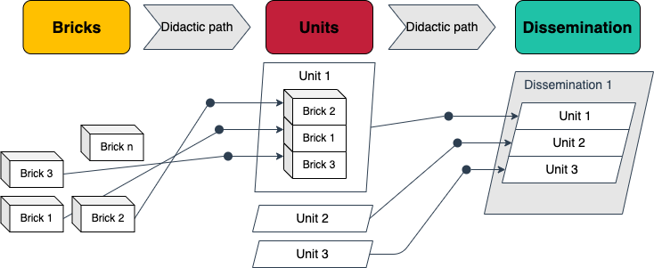
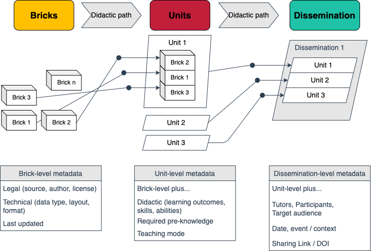
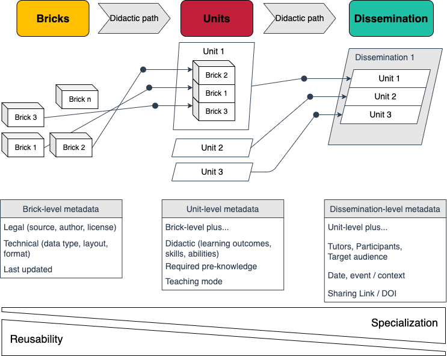
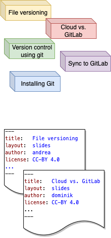
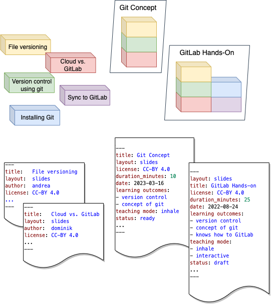
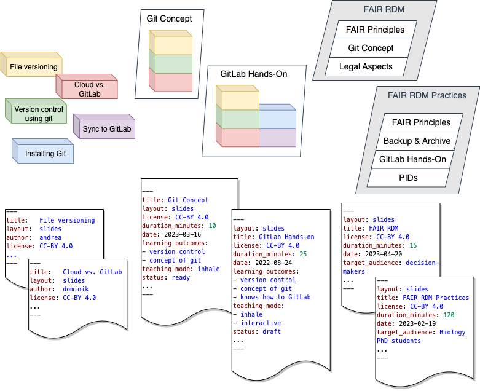
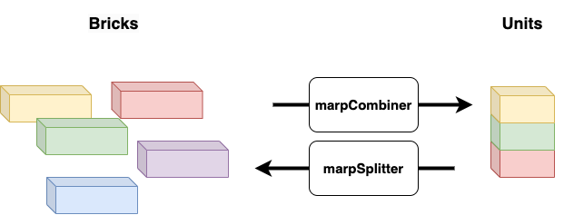
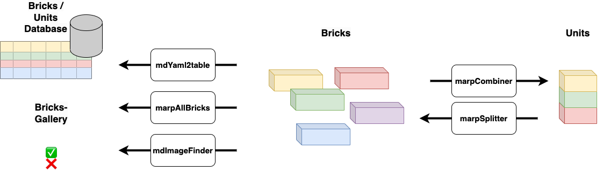

# DataPLANT Teaching Materials Concept

> Dominik Brilhaus
> DataPLANT Progress Seminar - May 9th, 2023

# From bricks to disseminations

# From Bricks to Disseminations with Metadata

# Three Levels to Balance Customization and Reuse <!-- fit -->

# Example “version control using Git”

# Example “version control using Git”

# Example “version control using Git”

# Minitools to prep slides

# Minitools for maintenance

# Links

- Teaching materials repo: https://github.com/nfdi4plants/teaching_materials
  - in part now ingested into DataPLANT knowledge base: https://github.com/nfdi4plants/nfdi4plants.knowledgebase
- Concept repo: https://github.com/nfdi4plants/teaching-materials-concept
- Tools repo: https://github.com/nfdi4plants/teaching-materials-tools

# People involved

- [Cristina Martins Rodrigues](https://orcid.org/0000-0002-4849-1537)
- [Martin Kuhl](https://orcid.org/0000-0002-8493-1077)
- [Andrea Schrader](https://orcid.org/0000-0002-3879-7057)
- [Dominik Brilhaus](https://orcid.org/0000-0001-9021-3197)
