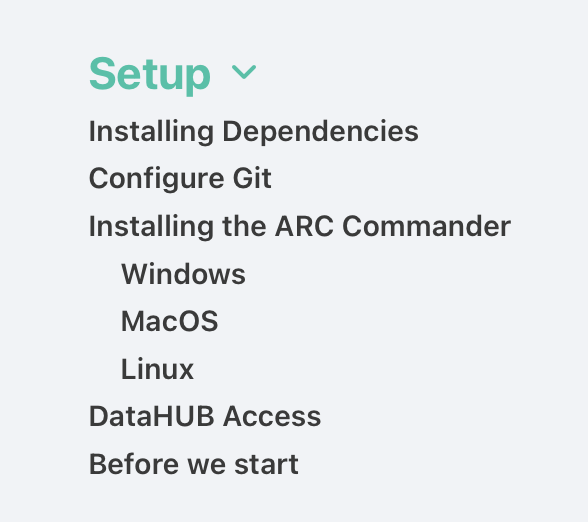

# The ARC Club

<style scoped>section {background: none; background-color: white}</style>
<!-- _paginate: false -->

Preparation
**before** August 16th, 2023

<br>

Dominik Brilhaus &ndash; CEPLAS Data Science

---

# Checklist hands-on sessions

<style scoped>

ul{
  list-style-type: none;
}
</style>

:bulb: Please prepare the following before the workshop:

Required:

- :white_check_mark: Register at DataPLANT
- :white_check_mark: Install ARCitect on your computer
- :white_check_mark: Install Swate on your computer

Recommended (for trouble-shooting):
- :white_check_mark: Find your command line
- :white_check_mark: Install ARC Commander and dependencies on your computer
- :white_check_mark: Install VS Code

---

# DataPLANT Registration

If you do not have a DataPLANT account, please register at the <a href="https://register.nfdi4plants.org" target="_blank">DataPLANT website</a>.


---

## Role and consortium

Please add your `Project/consortium` (e.g. CEPLAS, SFB, TRR) and choose the role `Guest`


---

## Join the group

Once signed-up and logged in, please join the <a href="https://git.nfdi4plants.org/hhu-plant-biochemistry" target="_blank">HHU Plant Biochemistry group</a>.


---

# ARCitect Installation

Please follow the instructions to install the latest version of ARCitect.

- <a href="https://nfdi4plants.org/nfdi4plants.knowledgebase/docs/ARCitect-Manual/arcitect_installation_macos.html" target="_blank">macOS</a>
- <a href="https://nfdi4plants.org/nfdi4plants.knowledgebase/docs/ARCitect-Manual/arcitect_installation_windows.html" target="_blank">Windows</a>

---

# Swate Installation

Please follow <a href="https://nfdi4plants.org/nfdi4plants.knowledgebase/docs/SwateManual/Docs01-Installing-Swate.html" target="_blank">these instructions</a> to install the latest version of Swate.

---

# Recommended for trouble-shooting

:bulb: We will likely not use the tools on the next few slides.  
However, as of now (early August 2023), it's probably better to have them ready for trouble-shooting and to show some inner workings of the ARC.

---

## The command line

Find the **command-line interface (CLI)** on your system.

- On Windows: Enter `powershell` into the explorer path
- On MacOS: Search `terminal` via spotlight (&#8984; + &#9251;) or navigate to `Applications` -> `Utilities` -> `Terminal`

<br>

:bulb: In our tutorials we sometimes use *terminal*, *command-line interface (CLI)* and *powershell* interchangeably.

---

# ARC Commander Installation

Please install the latest version of the ARC Commander and dependencies for your operating system according to the <a href="https://nfdi4plants.org/nfdi4plants.knowledgebase/docs/ArcCommanderManual/index.html" target="_blank">manual's setup instructions</a>.

Check if the ARC Commander is functional by displaying the ARC Commander version and help menu:

```bash
arc --version
```



---

## Have a simple text editor ready

- Windows Notepad
- MacOS TextEdit

Recommended text editor with code highlighting, git support, terminal, etc: <a href="https://code.visualstudio.com/" target="_blank">Visual Studio Code</a>

---

# Resources

###  DataPLANT (nfdi4plants)

Website: <a href="https://nfdi4plants.org/" target="_blank">https://nfdi4plants.org/</a>
Knowledge Base: <a href="https://nfdi4plants.org/nfdi4plants.knowledgebase/" target="_blank">https://nfdi4plants.org/nfdi4plants.knowledgebase/</a>
DataHUB: <a href="https://git.nfdi4plants.org" target="_blank">https://git.nfdi4plants.org</a>
GitHub: <a href="https://github.com/nfdi4plants" target="_blank">https://github.com/nfdi4plants</a>
