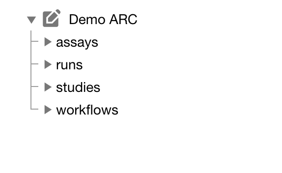
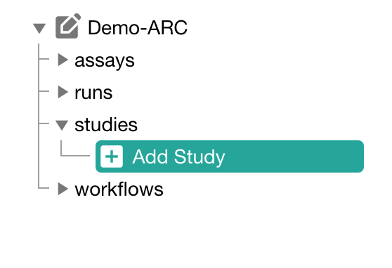
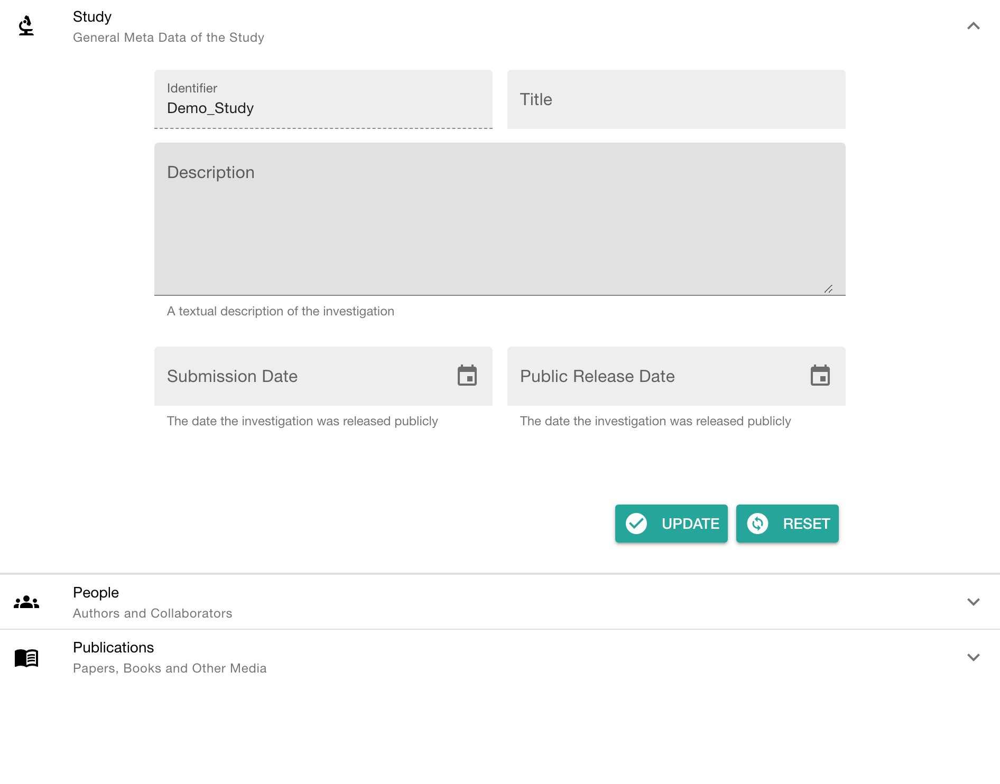
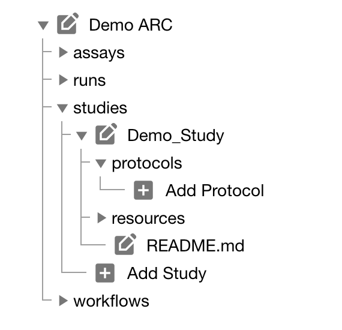
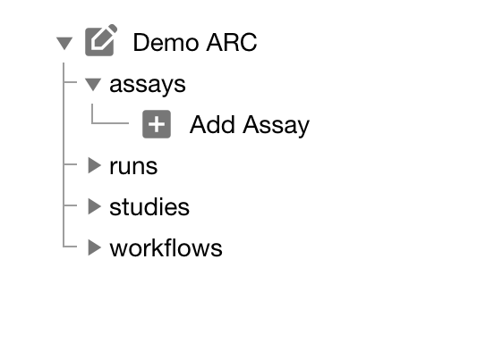
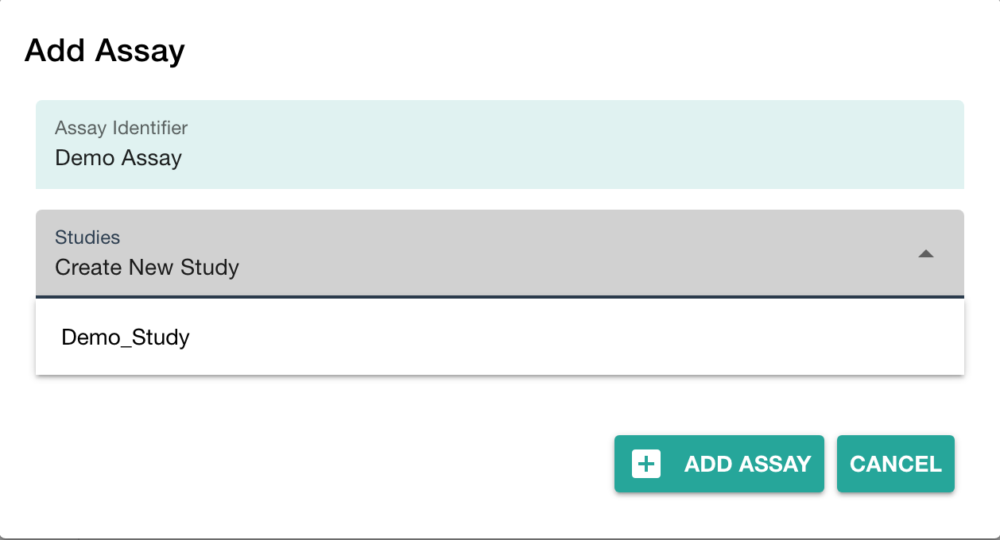
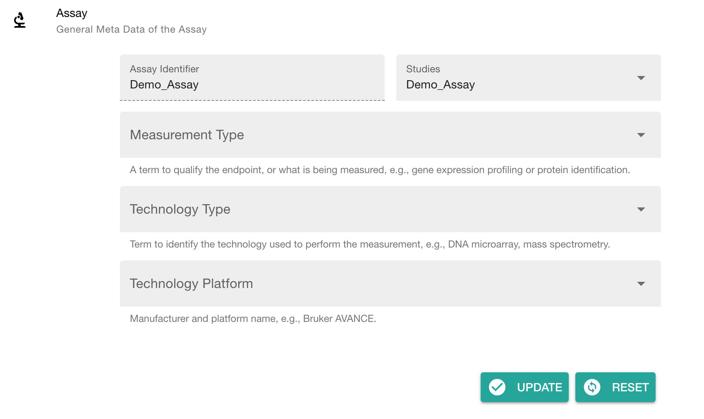

# The ARC Club

ARCitect QuickStart

Dominik Brilhaus &ndash; CEPLAS Data Science
August 16th, 2023

---

## Initiate the ARC folder structure

1. Create a **New ARC** (2)
2. Select a location and name for your ARC

---

## Your ARC's name

💡 By default, your ARC's name will be used
   - for the ARC folder on your machine
   - to create your ARC in the DataHUB at `https://git.nfdi4plants.org/<YourUserName>/<YourARC>` (see next steps)
   - as the identifier for your investigation

💡 Make sure that no ARC exists at  `https://git.nfdi4plants.org/<YourUserName>/<YourARC>`. Otherwise you will sync to that ARC.

---

## Add a study

by clicking "Add Study" and entering an identifier for your study

---

## Add information about your study

In the study panel you can add

- general metadata,
- people, and
- publications

---

## Add protocols to your study

In the file tree you can **add protocols**

---

## Add protocols

You can either
- directly write a **new protocol** within the ARCitect or
- import an existing one from your computer

---

## Add an assay

by clicking "Add Assay" and entering an identifier for your assay

---

## Link your assay to a study

You can either
- link your new assay to an existing study in your ARC or
- create a new one

---

## Add information about your assay

In the assay panel you can

1. link or unlink the assay to studies, and
2. define the assay's
   - measurement type
   - technology type, and
   - technology platform.

---

## Add protocols and datasets

In the file tree you can
  - **add a dataset** and 
  - **protocols** associated to that dataset.

:bulb: **Add Dataset** allows to import data from any location on your computer into the ARC.

:warning: Depending on the file size, this may take a while. Test this with a small batch of files first.

---

## Login to the DataHUB

Click **Login** (1) in the sidebar to login to the DataHUB.

:bulb: This automatically opens your browser at the DataHUB (https://git.nfdi4plants.org) and asks you to login, if you are not already logged in. 

---

## Upload your local ARC to the DataHUB

From the sidebar, navigate to **Versions** (6)

---

## Versions

The versions panel allows you to
- store the local changes to your ARC in form of "commits",
- sync the changes to the DataHUB, and
- check the history of your ARC

---

## Connection to the DataHUB

If you are logged in, the versions panel shows
- your DataHUB's *Full Name* and *eMail*
- the URL of the current ARC in the DataHUB `https://git.nfdi4plants.org/<YourUserName>/<YourARC>`

