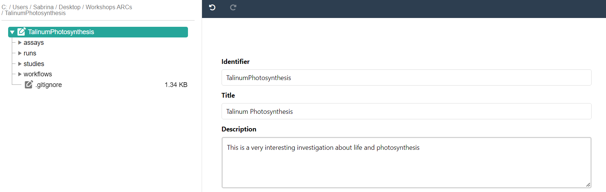
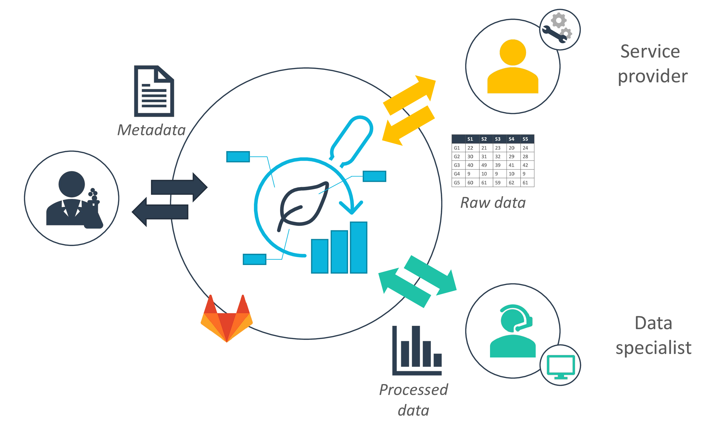
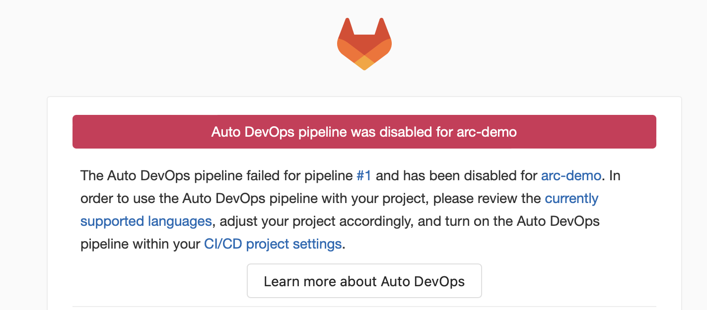
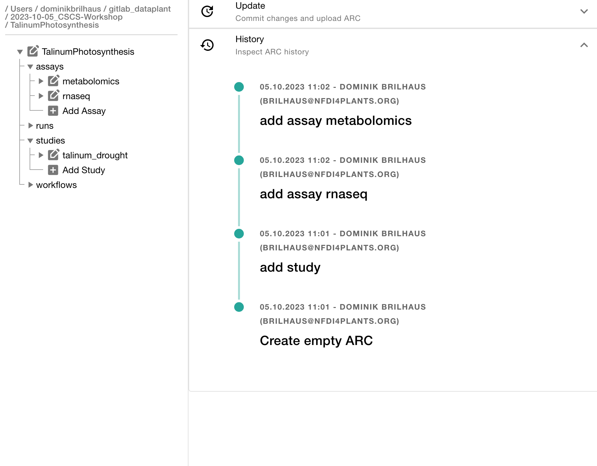
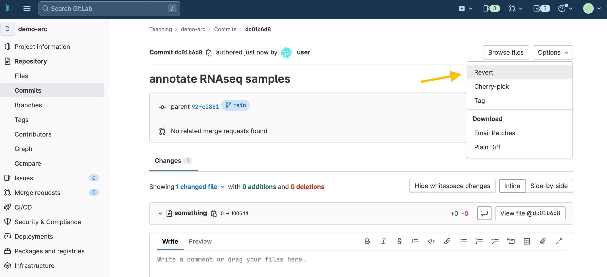

# Block 3 &ndash; ARCitect Hands-on

<style scoped>section {background: none; background-color: white}</style>
<!-- _paginate: false -->

October 5th, 2023

Dominik Brilhaus, [CEPLAS Data Science](https://www.ceplas.eu/en/research/data-science-and-data-management/)

---

# Check-in

---

## Registration

Did everyone <a href="https://register.nfdi4plants.org" target="_blank">sign-up</a> at the DataHUB?

---

## ARCitect installation

Please install the latest version of the ARCitect: https://github.com/nfdi4plants/ARCitect

:fire: (released September 20th, 2023) :fire:

---

## Download the demo data <!-- fit -->


https://nfdi4plant.sharepoint.com/:f:/s/Teaching/Eik7k-oJiMREgZ24kto7sIYBGxHmmZlS_Kzf7psk-5w-xg?e=u0sADd


---

## You just received your data


---

## Goal

- Structure,
- (Annotate, and)
- Share your experimental data.

<br>

:bulb: We'll talk about data annotation later


---

# Open the ARCitect


---

# Initiate the ARC folder structure


1. Create a **New ARC** (2)
2. Select a location and name it **TalinumPhotosynthesis**

---

# Your ARC's name

<style scoped>section {font-size: 23px;}</style>

💡 By default, your ARC's name will be used:

  1. for the ARC folder on your machine
  2. to create your ARC in the DataHUB at `https://git.nfdi4plants.org/<YourUserName>/<YourARC>` (see next steps)
  3. as the identifier for your investigation

💡 Make sure that no ARC exists at  `https://git.nfdi4plants.org/<YourUserName>/<YourARC>`. Otherwise you will sync to that ARC.

💡 Avoid spaces in your ARC's name


---

# Add a description and title to the investigation

1. Click on the ARC's name
2. Add a title (e.g. "Talinum Photosynsthesis")
3. Add a description
4. Click "Update" to save your changes



---

# Add contributors

In the section "People" click "ADD PERSON" to add at least one contributor

<br>


---

# Add contributor details


:bulb: For each person that you add, make sure to add
- First Name
- Last Name
- Email
- Affiliation

---

# Add a study

by clicking "Add Study" and entering **talinum_drought** as identifier for the study


---

# Study panel

In the study panel you can add

- general metadata,
- people, and
- publications
- data process information


---

# Add a protocol to the study


Click "Add Protocol" in the sidebar to add a protocol to the study

---

# Adding protocols

You can either

- directly write a **new protocol** within the ARCitect or
- import an existing one from your computer


---

# Transfer the protocol information

From the demo data, transfer the lab notes stored in `plant_material.txt` to the **talinum_drought** study.

---

# Add an assay to the ARC

Click "Add Assay" in the sidebar


---

# Name and link the assay

1. Enter **rnaseq** as the identifier
2. Link the assay to the study **talinum_drought**


---

# Add information about the assay

In the assay panel you can

1. link or unlink the assay to studies, and
2. define the assay's
   - measurement type
   - technology type, and
   - technology platform.
3. add data process information


---

# Add information about the assay

1. Add the following information: 
   - Measurement Type: `Gene Expression Analysis`
   - Technology type: `Next Generation Sequencing`
   - Technology platform: `Illumina HiSeq 2500`
2. Click "Update" to save your changes

---


# Add protocols and datasets

In the file tree you can
  - **add a dataset** and 
  - **protocols** associated with that dataset


---

# Import the demo dataset to the ARC

1. Cick "Add Dataset"
2. Select the *.fastq.gz files from the demo data


---

# Import the protocols

From the demo data, import the lab notes related to the `rnaseq` assay:
  
  - RNA_extraction.txt
  - Illumina_libraries.txt
  - NGS_SampleSheet.xlsx


---

# Collaborate and share



---

# Login to the DataHUB

Click **Login** (1) in the sidebar to login to the DataHUB.

:bulb: This automatically opens your browser at the DataHUB (https://git.nfdi4plants.org) and asks you to login, if you are not already logged in. 


---

# Versions: Connection to the DataHUB

To communicate with the DataHUB, navigate to **Versions** (6)


---

# Versions

The versions panel allows you to

- store the local changes to your ARC in form of "commits",
- sync the changes to the DataHUB, and
- check the history of your ARC


---

# Connection to the DataHUB

If you are logged in, the versions panel shows
- your DataHUB's *Full Name* and *eMail*
- the URL of the current ARC in the DataHUB `https://git.nfdi4plants.org/<YourUserName>/<YourARC>`


---

# Upload your ARC to the DataHUB

1. Enter a "commit message" to shortly describe the changes to your ARC
2. Click "COMMIT" to save your changes locally
3. Click "UPLOAD" to upload your ARC to the DataHUB


---

# Check whether your ARC was uploaded successfully

1. [sign in](https://git.nfdi4plants.org/) to the DataHUB
2. Check your projects

---

# Received two emails from "GitLab" about a failed pipeline? <!-- fit -->


:fire: Don't worry :smile:

--- 

## Pipeline Failed


- a "continuous quality control" (CQC) pipeline validates your ARC
- This fails if one of the following metadata items is missing:

    ```bash
    Investigation Identifier
    Investigation Title
    Investigation Description
    Investigation Person Last Name
    Investigation Person First Name
    Investigation Person Email
    Investigation Person Affiliation
    ```  

---

## Pipeline Failed

If the pipeline has failed once, it is disabled by default



---

## Reactivate the CQC pipeline

<style scoped>
section {font-size: 22px;}
</style>

To reactivate it and let the DataHUB validate your ARC again:
  
  1. navigate to CI/CD setting `<arc-url>/-/settings/ci_cd`
  2. expand "Auto DevOps"
  3. check box "Default to Auto DevOps pipeline"
  4. Save changes


---

# Collaborate and share


---

# Invite collaborators

* Unless changed, your ARC is set to private by default
* To collaborate, you can invite lab colleagues or project partners to your ARC

---

1. Click on **Project Information** in the left navigation panel


---

2. Click on **Members**


---

3. Click on **Invite members**


---

4. Search for potential collaborators


---

5. Select a role


---

# Choosing the proper role

<style scoped> section{font-size: 22px;}</style>

<u>Guests</u>
Have the least rights. They will not be able to see the content of your ARC (only the wiki page).

<u>Reporters</u>
Have **read access** to your ARC. This is recommended for people you ask for consultancy.

<u>Developers</u>
The choice for most people you want to invite to your ARC. Developers have **read and write access**, but cannot maintain the project on the DataHUB, e.g. inviting others.

<u>Maintainers</u> 
Gives the person the same rights as you have (except of removing you from your own project). This is recommended for inviting PIs or group leaders allowing them to add their group members for data upload or analysis to the project as well.

*A detailed list of all permissions for the individual roles can be found [here](https://docs.gitlab.com/ee/user/permissions.html)*

---

# <div align="center">Congratulations!</div>
<div align="center">You have just shared your ARC with a collaborator.</div>

<style scoped>

section p img {
width: 1000px;
height: 300px;
object-fit: cover;
object-position: 100% 45%;
/* display: block; */;
}
</style>


---

# Add the remaining data

1. Add another assay (`metabolomics`)
   1. Add the protocols
   2. Add the dataset
2. Go to the Versions panel
   1. Add a "commit message"
   2. Upload your changes to the DataHUB


---

# Check the progress of your ARC

1. Navigate to Versions
2. Check the History panel at the bottom



---


# Your ARC is ready

<style scoped>

section p br {
   display: block;
   margin-top: 20px;
   content: "";
}
</style>

👩‍💻 Initiated an ARC
<br>
📂 Structured and ...  
<br>
 ... annotated experimental data
<br>
🌐 Shared with collaborators


---

# DataHUB


---

## Deleting an ARC

<style scoped>section ul li{margin-left: 0px;} </style>

1. Click on *Settings* in the sidebar of your ARC
2. Navigate to the general (1) settings
3. In the advanced section (4) you can **delete** your ARC


---

## Follow your progress in the DataHUB

1. Open your ARC in the [DataHUB](https://git.nfdi4plants.org/) 
2. In the sidebar on the left, navigate to `Repository` &rarr; `Commits`
3. There you find a chronological list of syncing messages together with who synced and when


---

## Undo latest changes

4. Click on the latest (i.e. uppermost) commit.
5. In the top-right corner select `Revert` from the drop-down menu `Options`.




--- 
## Undo latest changes

6. Un-check the box "Start a new merge request with these changes".
7. Click "Revert"


---

## Update your local ARC

If your ARC has changed in the DataHUB (by yourself or collaborators), you need to update your "local" version of the ARC. 

1. Navigate to Versions
2. Click "Download"


--- 

--- 

# Contributors

Slides presented here include contributions by

- name: Dominik Brilhaus
  github: https://github.com/brilator
  orcid: https://orcid.org/0000-0001-9021-3197
- name: Cristina Martins Rodrigues
  github: https://github.com/CMR248
  orcid: https://orcid.org/0000-0002-4849-1537
- name: Sabrina Zander
  github: https://github.com/SabrinaZander
  orcid: https://orcid.org/0009-0000-4569-6126
