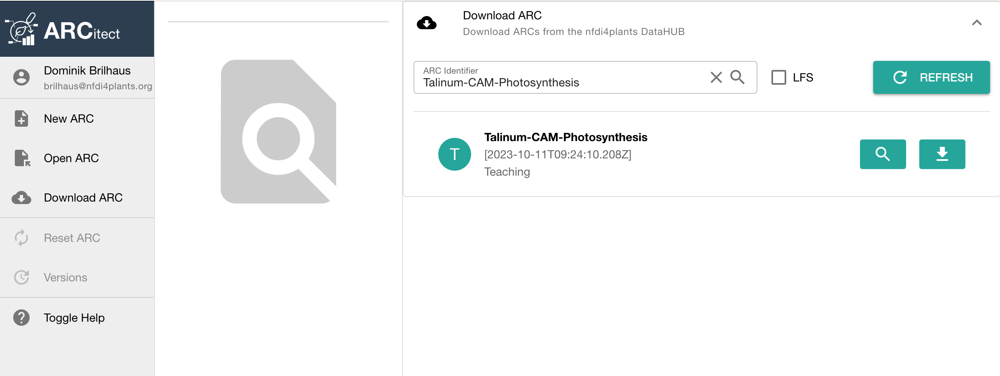
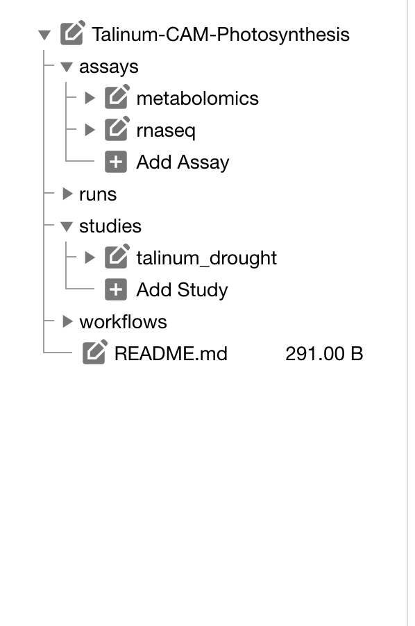
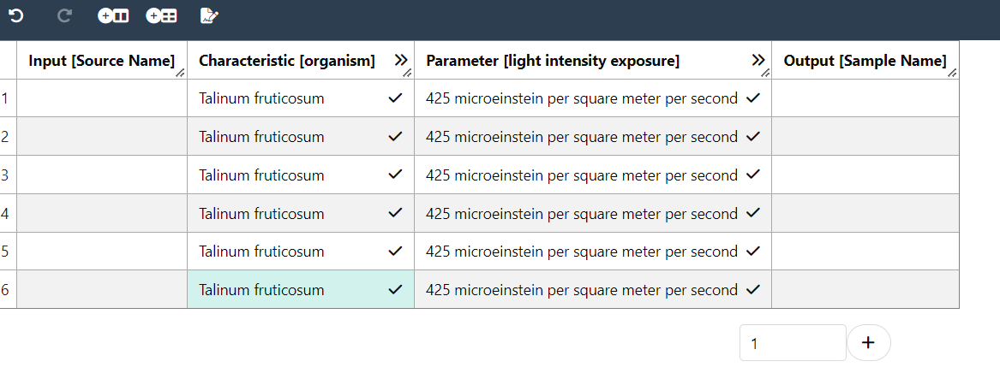

# Block 7 &ndash; Swate hands-on

<style scoped>section {background: none; background-color: white}</style>
<!-- _paginate: false -->

October 11th, 2023
 
Dominik Brilhaus, [CEPLAS Data Science](https://www.ceplas.eu/en/research/data-science-and-data-management/)

---

# Goals

- Get familiar with ISA metadata and Swate
- Annotate data in your ARC

---

## Check Swate installation

:ballot_box_with_check: Make sure [Swate is installed](./../../../SwateManual/Docs01-Installing-Swate.html):

1. Open Excel (online or Desktop)
2. Go to the `Insert` tab: Click the arrow next to "My Add-ins". There you should be able to select Swate.
3. Go to the `Data` tab: you should see the Swate (Core) add-in.

:bulb: Alternatively, you can use [Swate standalone](https://swate-alpha.nfdi4plants.org)  
(:warning: this is however *work in progress* and likely to change)

---

## Have a simple text editor ready

- Windows Notepad
- MacOS TextEdit

Recommended text editor with code highlighting, git support, terminal, etc: <a href="https://code.visualstudio.com/" target="_blank">Visual Studio Code</a>

---


## Download the demo data


1. Open the ARCitect
2. Login (1) to your DataHUB account
3. Navigate to **Download ARC** (4)

---

## Download the demo data


4. Search for **Talinum-CAM-Photosynthesis**
5. Click the download button, select a location and open the ARC.



:bulb: This is basically the ARC we created last session.

---

## Where we left off last time

👩‍💻 Initiated an ARC
📂 Structured and ...  
🌐 Shared with collaborators

<br>

**Today** we want to

 ... **annotate the experimental data**



---

# Swate hands-on with demo data

---

## Swate Overview


---

## Let's annotate the plant samples first

1. Navigate to the demo ARC. 
2. Open the lab notes `studies/talinum_drought/protocols/plant_material.txt` in a text editor. 
3. Open the empty `studies/talinum_drought/isa.study.xlsx` workbook in Excel.


---

## Create an annotation table

<br>

<style scoped>
.columns {
    /* grid-template-columns: repeat(2, minmax(0, 1fr)); */
    grid-template-columns: 500px 500px;
    gap: 30px;
    display: flex;
    justify-content: center;
}
</style>

<div class="columns">
<div class="columns-left">

Create a Swate annotation table via the <kbd>create annotation table</kbd> button in the yellow pop-up box *OR* click the <kbd>Create Annotation Table</kbd> quick access button.

<br>

> :bulb: Each table is by default created with one input (`Source Name`) and one output (`Sample Name`) column  

> :bulb: Only one annotation table can be added per Excel sheet

</div>

<div class="columns-right">
    
</div>

</div>

---

## Add a building block

1. Navigate to the *Building Blocks* tab via the navbar. Here you can add *Building Blocks* to the table.
2. Instead of *Parameter* select *Characteristic* from the drop-down menu (A)
3. Search for `organism` in the search bar (B). This search looks for suitable *Terms* in our *Ontology* database.
4. Select the Term with the id `OBI:0100026` and, 
5. Click <kbd>Add building block</kbd>.

> :bulb: This adds three columns to your table, one visible and **two** hidden.


---
## Insert values to annotate your data

1. Navigate to the *Terms* tab in the Navbar
2. In the annotation table, select any number of cells below `Characteristic [organism]`
3. Click into the search field in Swate.

> :bulb: You should see `organism` showing in a field in front of the search field  
> :bulb: The search will now yield results related to `organism`

4. In the search field, search for "Talinum fruticosum"
5. Select the first hit and click <kbd>Fill selected cells with this term</kbd>

---

## Add a building block with a unit

1. In the *Building Blocks* tab, select *Parameter*, search for `light intensity exposure` and select the term with id `PECO:0007224`.
2. Check the box for *This Parameter has a unit* and search for `microeinstein per square meter per second` in the adjacent search bar.
3. Select `UO:0000160`.
4. Click <kbd>Add building block</kbd>.

> :bulb: This adds four columns to your table, one visible and **three** hidden.

---

## Insert unit-values to annotate your data

In the annotation table, select any cell below `Parameter [light intensity exposure]` and add "425" as light intensity.

> :bulb: You can see the numbers being complemented with the chosen unit, e.g. `425.00 microeinstein per square meter per second`

---

## Showing ontology reference columns

Hold <kbd>Ctrl</kbd> and click the *Autoformat Table* quick access button to adjust column widths and un-hide all hidden columns.

> :bulb: You can see that your organism of choice was added with id and source Ontology in the reference (hidden) columns.  
> :warning: This feature is currently not supported on MacOS

---

## Update ontology reference columns

Click the <kbd>Update Ontology Terms</kbd> quick access buttons.

> :bulb: This updates all reference columns according to the main column. In this case the reference columns for `Parameter [light intensity exposure]` are updated with the id and source ontology of the `microeinstein per square meter per second` unit.

---

## Your ISA table is growing

At this point. Your table should look similar to this:



---

## Hiding ontology reference columns

Click the <kbd>Autoformat Table</kbd> quick access button without holding <kbd>Ctrl</kbd> to hide all reference columns.

---

## Exercise :pencil:

Try to add suitable *building blocks* for other pieces of metadata from the plant growth protocol (`studies/talinum_drought/protocols/plant_material.txt`).

---


## Let's annotate the RNA Seq data

1. Navigate to the demo ARC. 
2. Open the lab notes `assays/rnaseq/protocols/RNA_extraction.txt` in a text editor. 
3. Open the empty `assays/rnaseq/isa.assay.xlsx)` workbook in Excel.

---

## Use a template

1. Navigate to *Templates* in the Navbar and click *Browse database* in the first function block.

> :bulb: Here you can find community created workflow annotation templates

1. Search for `RNA extraction` and click <kbd>select</kbd> 
    - You will see a preview of all building blocks which are part of this template.
2. Click <kbd>Add template</kbd> to add all Building Blocks from the template to your table, which <u>do not exist yet</u>.


---

## Adding / Updating unit references

Sometimes you need to add or update the unit of an existing building block. 

1. Select any number of rows of the `Parameter [biosource amount]` building block to mark it for the next steps.
2. Open the *Building Blocks* tab
3. In the bottom panel "Add/Update unit reference to existing building block", search for the unit "milligram". Select the unit term and click <kbd>Update unit for cells</kbd>.
:bulb: If you already had values in the main column they will be updated automatically.
4. Click the *Update Ontology Terms* <a href="./../img/Swate-Overlay-Exp.jpg" target="_blank">quick access button</a>, to update the reference columns.
   
---

## Remove building blocks

If there are any Building Blocks which do not fit your experiment you can use the <kbd>Remove Building Block</kbd> quick access button to remove it including all related (hidden) reference columns.

:warning: Due to the hidden reference columns, we recommend not to delete table columns via usual Excel functions. 

---

## New process, new worksheet

1. Add a new sheet to the `assays/rnaseq/isa.assay.xlsx)` workbook.
2. Add the template "RNASeq Assay"

---

## Exercise :pencil:

Try to fill the two sheets with the protocol details:
  - `assays/rnaseq/protocols/RNA_extraction.txt` and
  - `assays/rnaseq/protocols/Illumina_libraries.txt`

---

## Your ISA table is ready 🎉

Go ahead, adjust the Building Blocks you want to use to describe your experiment as you see fit.
Insert values using Swate Term search and add input and output.

---

## A small detour on "Excel Tables"

Swate uses Excel's "table" feature to annotate workflows. Each table represents one *process* from input (e.g. plant leaf material) to output (e.g. leaf extract).

Example workflows with three *processes* each:

- Plant growth &rarr; sampling &rarr; extraction
- Measured data files  &rarr; statistical analysis  &rarr; result files

> :bulb: Excel tables allow to group data that belongs together inside one sheet. This is not to be confused with a (work)sheet or workbook.
> ```bash
> workbook              (e.g. "isa.assay.xlsx")
>  └─── worksheet       (e.g. "plant_growth")
>           └─── table  (e.g. "annotationTable")


---

# Annotation with ARCitect

:construction: Is not yet available.

---

---

# Contributors

Slides presented here include contributions by

- name: Dominik Brilhaus
  github: https://github.com/brilator
  orcid: https://orcid.org/0000-0001-9021-3197
- name: Kevin Frey
  github: https://github.com/Freymaurer
  orcid: https://orcid.org/0000-0002-8493-1077
- name: Martin Kuhl
  github: https://github.com/Martin-Kuhl
  orcid: https://orcid.org/0000-0002-8493-1077
- name: Sabrina Zander
  orcid: https://orcid.org/0009-0000-4569-6126
